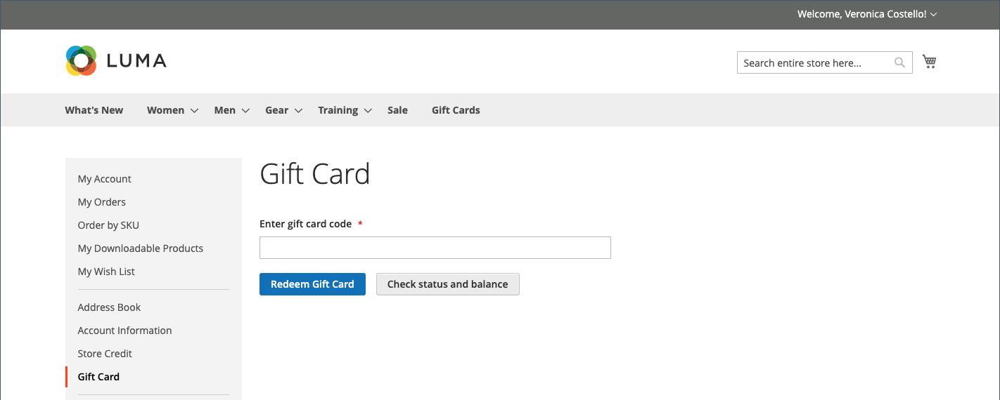

# ギフトカードの購入と引き換え

{{ee-feature}}

買い物かごでは、クーポンが注文に適用されるのと同じ方法でギフトカードが引き換えられます。 チェックアウト時に買い物客がギフトカードコードを入力し、ギフトカードから購入に金額を適用します。 顧客アカウントを持つギフトカードの所有者は、アカウントのダッシュボードからステータスと残高を確認できます。 1 枚または複数枚のギフトカードを使用して、注文の全部または一部に対する支払いを行うことができます。

適用されたギフトカードコードは、 _管理者_：必要に応じて、物理的なギフトカードに配置するコードを取得できます。 ギフトカードの注文がキャンセルまたは払い戻しされた場合は、関連するギフトカードのアカウントを手動でキャンセルする必要があります。 アカウントを完全に削除するか、アカウントを非アクティブにすることができます。

{width="700" zoomable="yes"}

例えば、デモ Luma ストアでの顧客の買い物は、仮想ギフトカードまたは物理的なギフトカードを購入できます。

**仮想ギフトカード** - Luma 仮想ギフトカードが受信者宛てのオプションのメッセージと共に電子メールで送信されます。 Luma ファミリーの Web サイトに引き換え、有効期限は無期限になります。

**物理ギフトカード** - Luma ギフトカードは、カスタムアートメーラーでパッケージ化され、無料で受信者に送信されます。 事前に独自のコードでラベル付けし、店舗、電話、または Luma ファミリーの Web サイトで引き換えることができます。 有効期限はなくなります。

**組み合わせギフトカード**  — 組み合わせギフトカードは、仮想ギフトカードと物理ギフトカードの両方の特性を持ちます。 Luma の組み合わせギフトカードが発送され、受信者に電子メールで送信されます。 ギフトカードを購入する際には、E メールアドレスと配送先住所が必要です。 有効期限はなくなります。

## ギフトカードのライフサイクル

1. **顧客がギフトカードの値を決定**.

   顧客が商品ページからギフトカードの価値を決定します。 設定に応じて、固定価格フィールド、価格オプションのリスト、またはその両方があります。 すべての金額は、ストアで使用される通貨で表示されます。

1. **顧客がギフトカード情報を入力する**.

   物理的なギフトカードの場合、顧客が **送信者名** および **受信者名**. 仮想または組み合わせのギフトカードの場合、顧客も **送信者の E メール** および **受信者の電子メール**. 顧客がログインすると、その顧客のアカウントから、「送信者名」（および該当する場合は「送信者の E メール」）が自動的に入力されます。 設定によっては、顧客が受信者にメッセージを入力することもあります。

1. **顧客がチェックアウトを完了する**.

   ギフトカードは、カート内の行項目として表示され、該当する場合は、送信者、受信者およびメッセージの名前を示す詳細が表示されます。 ギフトカードに関連付けられた金額は、買い物かごに追加されると、店舗のベース通貨に変換されます。

1. **顧客が注文の確認を受け取る**.

   ギフトカードの購入者は、確認のリンクをクリックして、自分のアカウントダッシュボードから注文をトラッキングできます。

1. **受信者がギフトカードを受け取ります**.

   仮想または組み合わせのギフトカードの場合、受信者はギフトカードコード、送信者の名前、メッセージ（該当する場合）を含む E メールを受け取ります。 複数のギフトカードを 1 回の注文で購入し、タイプが仮想または組み合わせの場合、対応するすべてのギフトカードコードが 1 通の E メールで受信者に送信されます。 実際のギフトカードは、受信者に直接送ることも、顧客に送ることもできます。その顧客は、受信者にギフトカードを個人的に配信できます。

1. **受信者がギフトカードを購入に適用します**.

   受信者はストアで品目を購入し、チェックアウト時にギフトカードコードを適用します。 チェックアウト中にギフトカードが適用されるたびに、その金額が「注文合計」ブロックに表示され、総計から差し引かれます。 買い物かごの合計から各ギフトカードの全残高が差し引かれます。 複数のギフトカードを購入に使用する場合は、すべてが適用されるか総計がゼロになるまで、残りが最も小さいカードから昇順で適用されます。 総計がゼロに達すると、買い物かごに適用された最後のギフトカードのアカウントに部分的な控除が適用されます。 買い物かごに適用されていないカードには、残高控除は適用されません。 金額は、注文後にギフトカードの口座から差し引かれます。

## ストアフロントエクスペリエンス

ストアフロントでのギフトカードの仕組み：

- ギフトカードコードは、買い物かごやチェックアウト時に適用し、注文の合計金額をカバーできます。

- カタログでは、ギフトカードが別のタイプの製品として表示されます。

- ギフトカードコードは、注文の請求後に有効化されます。 注文が支払われていない場合、受け取った顧客はギフトカードを使用できません。

- 特定の割引券の残高を追跡するために、ギフトコードのアカウントが作成されます。 店舗管理者は、手動で残高を調整できます。

受け取り先の顧客は、 _[!UICONTROL Gift Card]_口座ダッシュボードのセクションで残高を確認する [ギフトカードアカウント](product-gift-card-accounts.md) ～にギフトカードを交換する [店舗クレジット](../customers/store-credit-using.md).

{width="700" zoomable="yes"}

### ギフトカードのステータスと残高を確認します

1. ストアフロントから、顧客がログインして、顧客アカウントのページを開きます。

1. 顧客が **[!UICONTROL Gift Card]** ページに移動してギフトカードコードを入力します。

1. 顧客がクリックする **[!UICONTROL Check status and balance]**.

{width="700" zoomable="yes"}

ギフトカードの残高が表示されます。

### ギフトカードの有効化

1. 次の日： _[!UICONTROL Gift Card]_ページに入力すると、顧客がギフトカードコードを入力します。

1. 顧客がクリックする **[!UICONTROL Redeem Gift Card]**.

{width="700" zoomable="yes"}

ギフトカードの金額が有効化され、合計店舗クレジット残高に追加されます。

{width="700" zoomable="yes"}

ギフトカード残高のすべての操作は、 _[!UICONTROL Store Credit]_ページに貼り付けます。

### チェックアウト時にギフトカードを適用

ギフトカードが払い戻しできない場合、顧客はチェックアウト時にギフトカードコードを適用できます。

1. 期間 _レビューと支払い_ ステップ、お客様がクリックする **[!UICONTROL Apply Gift Card]**.

1. ギフトカードコードを入力し、「 」をクリックします **[!UICONTROL Apply]**.

   割引は、 _[!UICONTROL Order Summary]_.

1. クリック数 **[!UICONTROL Place Order]** をクリックして注文を完了します。
