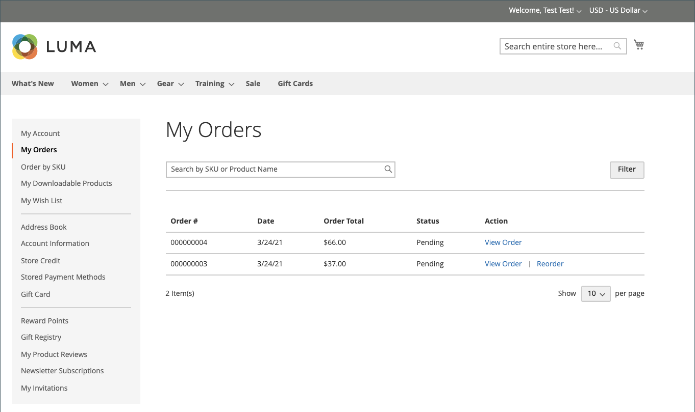

# 並べ替えを許可

有効にすると、顧客アカウントから直接注文することも、_管理者_ 内の元の注文から注文することもできます。 並べ替えは、デフォルトで有効になっています。

{width="700" zoomable="yes"}

## 注文で並べ替えを有効にする基準

- 「_並べ替えを許可_ 設定オプションを有効にする必要があります。

- 注文が `Hold` または `Payment Review` ステータスの場合、並べ替えオプションは無効になります。

- 注文した項目のいずれかが利用不可、在庫切れ、無効になっている場合、ストアフロントの並べ替えオプションは無効になります。

- _管理者_ は、いずれかの項目が在庫切れまたは無効になっている場合でも、並べ替えることができます。

## 顧客の並べ替えを許可するようにを設定

1. _管理者_ サイドバーで、**[!UICONTROL Stores]**/_[!UICONTROL Settings]_/**[!UICONTROL Configuration]**&#x200B;に移動します。

1. 左側のパネルで「**[!UICONTROL Sales]**」を展開し、その下の「**[!UICONTROL Sales]**」を選択します。

1. 「」を展開し、「**[!UICONTROL Reorder]**」セクションを展開します。

   {width="600" zoomable="yes"}

1. **[!UICONTROL Allow Reorder]** を `Yes` に設定します。

   この設定により、管理者のストアフロントまたは注文リストの顧客アカウントから機能を並べ替えることができます。

1. 「**[!UICONTROL Save Config]**」をクリックします。

## ストアフロントから並べ替え

顧客は、次の 2 つのページから特定の注文の並べ替え機能を開始できます。

- _マイオーダー_ ページ

- _並べ替え順_ ページ

### マイ注文

_並べ替え_ ボタンは、（注文のすべての製品を並べ替えに使用できない場合でも）常に注文件数でリストに表示されます。

{width="700" zoomable="yes"}

**ケース 1。** 注文のすべての製品は再注文に対して **利用可能** です

ユーザーは買い物かごにリダイレクトされ、すべての製品が買い物かごに追加されます

{width="700" zoomable="yes"}

**ケース 2。** 注文の一部/すべての製品が再注文で **利用できません**

>[!NOTE]
>
>製品の並べ替えは可能 `Not Visible Individually` す。

_並べ替え_ ボタンが _マイ注文_ ページと _表示注文_ ページに表示されません。

{width="700" zoomable="yes"}

### 注文ビューページ

**ケース 1。** 注文のすべての製品は再注文できます

ユーザーは買い物かごにリダイレクトされ、すべての製品が買い物かごに追加されます

**ケース 2。** 注文の一部/すべての製品が再注文で **利用できません**

>[!NOTE]
>
>製品の並べ替えは可能 `Not Visible Individually` す。

_並べ替え_ ボタンが _マイ注文_ ページと _表示注文_ ページに表示されません。

{width="700" zoomable="yes"}

### 買い物かごが空ではありません

買い物かごが空でなく、ユーザーが（_マイ注文_ または _注文表示_ ページから） **[!UICONTROL Reorder]** をクリックした場合、既存の製品は、追加された並べ替え製品で買い物かごに残ります。

{width="700" zoomable="yes"}

## 管理者から並べ替え

1. _管理者_ サイドバーで、**[!UICONTROL Sales]**/**[!UICONTROL Orders]** に移動します。

1. 注文を見つけて、**[!UICONTROL View]** モードで開きます。

1. 上部 **[!UICONTROL Reorder]** ボタンバーに表示されているボタンをクリックします。

   {width="600" zoomable="yes"}

   **[!UICONTROL Reorder]** をクリックすると、_新しい注文を作成_ ページが開き、商品が並べ替えられます。

   {width="600" zoomable="yes"}

1. 必要に応じて、すべての必須フィールドに入力します。

1. 注文を送信するには、「**[!UICONTROL Submit Order]**」をクリックします。
