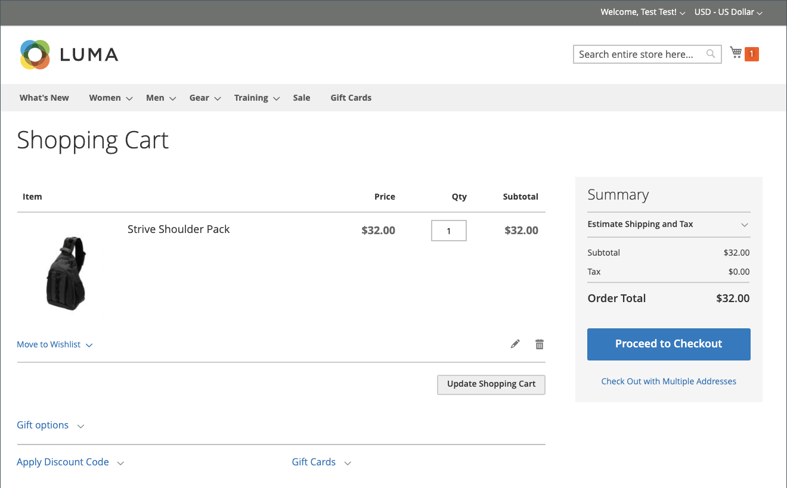

# 再注文を許可

有効にすると、顧客アカウントまたは&#x200B;_管理者_&#x200B;の元の注文から直接再注文できます。 再発注はデフォルトで有効になっています。

管理者](./assets/customer-reorder.png){width="700" zoomable="yes"}の![お客様の再注文リンク

## 注文に対して有効にする再発注の条件

- _再注文を許可_&#x200B;設定オプションを有効にする必要があります。

- 注文が`Hold`または`Payment Review` ステータスの場合、並べ替えオプションは無効になります。

- 注文のいずれかの商品が利用できない、在庫切れ、または無効になっている場合、ストアフロントで再発注オプションが無効になります。

- _管理者_&#x200B;は、いずれかの商品が在庫切れになったり、無効になったりした場合でも、再注文できます。

## 顧客の再注文を許可するように設定

1. _管理者_ サイドバーで、**[!UICONTROL Stores]** > _[!UICONTROL Settings]_>**[!UICONTROL Configuration]**に移動します。

1. 左側のパネルで「**[!UICONTROL Sales]**」を展開し、下の「**[!UICONTROL Sales]**」を選択します。

1. **[!UICONTROL Reorder]** セクションのを展開します。

   {width="600" zoomable="yes"}

1. **[!UICONTROL Allow Reorder]**&#x200B;を`Yes`に設定します。

   この設定を使用すると、ストアフロントまたは管理画面の注文リストの顧客アカウントから機能を並べ替えることができます。

1. **[!UICONTROL Save Config]**&#x200B;をクリックします。

## ストアフロントからの再発注

お客様は、次の2つのページから特定の注文の再発注機能を開始できます。

- _マイオーダー_ ページ

- _注文表示_ ページ

### マイオーダー

_並べ替え_ ボタンは、常に注文と共にリストに表示されます（注文のすべての商品が並べ替え可能でない場合でも）。

{width="700" zoomable="yes"}

**ケース 1.** 注文のすべての商品は、再注文で&#x200B;**使用可能**&#x200B;です

ユーザーはカートにリダイレクトされ、すべての製品がカートに追加されます

{width="700" zoomable="yes"}

**ケース 2.** 注文のすべての商品の一部または一部が&#x200B;**再注文で利用できません**

>[!NOTE]
>
>`Not Visible Individually`個の商品を再注文できます。

_並べ替え_ ボタンは、_マイオーダー_&#x200B;および&#x200B;_表示オーダー_ ページには表示されません。

{width="700" zoomable="yes"}

### 注文表示ページ

**ケース 1.** 注文のすべての商品は再発注できます

ユーザーはカートにリダイレクトされ、すべての製品がカートに追加されます

**ケース 2.** 注文のすべての商品の一部または一部が&#x200B;**再注文で利用できません**

>[!NOTE]
>
>`Not Visible Individually`個の商品を再注文できます。

_並べ替え_ ボタンは、_マイオーダー_&#x200B;および&#x200B;_表示オーダー_ ページには表示されません。

{width="700" zoomable="yes"}

### 買い物かごが空ではありません

買い物かごが空ではなく、ユーザーが「**[!UICONTROL Reorder]**」（_マイオーダー_&#x200B;または&#x200B;_オーダービュー_ ページ）をクリックした場合、既存の製品は追加された再発注製品とともに買い物かごに残ります。

{width="700" zoomable="yes"}

## 管理者からの並べ替え

1. _管理者_ サイドバーで、**[!UICONTROL Sales]** > **[!UICONTROL Orders]**&#x200B;に移動します。

1. 注文を探し、**[!UICONTROL View]** モードで開きます。

1. 上部のボタンバーに表示されている&#x200B;**[!UICONTROL Reorder]**&#x200B;をクリックします。

   {width="600" zoomable="yes"}での注文の詳細

   **[!UICONTROL Reorder]**&#x200B;をクリックすると、_新規注文の作成_ ページが開き、製品を再注文できます。

   {width="600" zoomable="yes"}

1. 必要に応じて、すべての必須フィールドに入力します。

1. 注文を送信するには、**[!UICONTROL Submit Order]**&#x200B;をクリックします。
