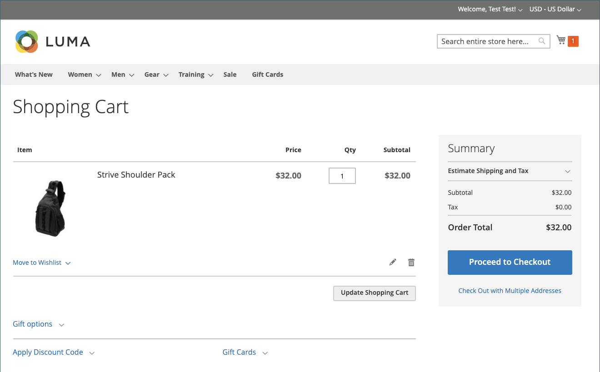

# 並べ替えを許可

有効にすると、顧客アカウントから直接、または内の元の注文から注文を行うことができます _Admin_. 並べ替えは、デフォルトで有効になっています。

{width="700" zoomable="yes"}

## 注文で並べ替えを有効にする基準

- この _並べ替えを許可_ 設定オプションを有効にする必要があります。

- 順序が次の中にある場合： `Hold` または `Payment Review` ステータスで、「並べ替え」オプションが無効になっている。

- 注文した項目のいずれかが利用不可、在庫切れ、無効になっている場合、ストアフロントの並べ替えオプションは無効になります。

- An _Admin_ いずれかの項目が在庫切れまたは無効な場合でも、並べ替えることができます。

## 顧客の並べ替えを許可するようにを設定

1. 日 _Admin_ サイドバー、に移動 **[!UICONTROL Stores]** > _[!UICONTROL Settings]_>**[!UICONTROL Configuration]**.

1. 左側のパネルで、を展開します **[!UICONTROL Sales]** を選択します **[!UICONTROL Sales]** その下に。

1. を展開  この **[!UICONTROL Reorder]** セクション。

   {width="600" zoomable="yes"}

1. を設定 **[!UICONTROL Allow Reorder]** 対象： `Yes`.

   この設定により、管理者のストアフロントまたは注文リストの顧客アカウントから機能を並べ替えることができます。

1. クリック **[!UICONTROL Save Config]**.

## ストアフロントから並べ替え

顧客は、次の 2 つのページから特定の注文の並べ替え機能を開始できます。

- _マイ注文_ ページ

- _Order View_ ページ

### マイ注文

この _並べ替え_ ボタンは、常に注文と共にリストに表示されます（注文のすべての製品を並べ替えに使用できない場合も含む）。

{width="700" zoomable="yes"}

**ケース 1.** 注文に含まれるすべての製品は次のとおりです **available** 並べ替え用

ユーザーは買い物かごにリダイレクトされ、すべての製品が買い物かごに追加されます

{width="700" zoomable="yes"}

**ケース 2.** 注文の一部/すべての商品は次のとおりです **利用できません** 並べ替え用

>[!NOTE]
>
>並べ替えは可能です `Not Visible Individually` 製品。

この _並べ替え_ ボタンがに表示されない _マイ注文_ および _注文を表示_ ページ。

{width="700" zoomable="yes"}

### 注文ビューページ

**ケース 1.** 注文のすべての製品は再注文できます

ユーザーは買い物かごにリダイレクトされ、すべての製品が買い物かごに追加されます

**ケース 2.** 注文の一部/すべての商品は次のとおりです **利用できません** 並べ替え用

>[!NOTE]
>
>並べ替えは可能です `Not Visible Individually` 製品。

この _並べ替え_ ボタンがに表示されない _マイ注文_ および _注文を表示_ ページ。

{width="700" zoomable="yes"}

### 買い物かごが空ではありません

買い物かごが空でなく、ユーザーがクリックした場合 **[!UICONTROL Reorder]** （から _マイ注文_  または _Order View_ （ページ）、既存の製品は、追加された並べ替え製品を使用して買い物かごに残ります。

{width="700" zoomable="yes"}

## 管理者から並べ替え

1. 日 _Admin_ サイドバー、に移動 **[!UICONTROL Sales]** > **[!UICONTROL Orders]**.

1. 注文を見つけて、で開きます。 **[!UICONTROL View]** モード。

1. クリック **[!UICONTROL Reorder]** 上部のボタンバーに表示されます。

   {width="600" zoomable="yes"}

   クリックした後 **[!UICONTROL Reorder]**, _新しい注文を作成_ 製品を並べ替えるとページが開きます。

   {width="600" zoomable="yes"}

1. 必要に応じて、すべての必須フィールドに入力します。

1. 注文を送信するには、 **[!UICONTROL Submit Order]**.
