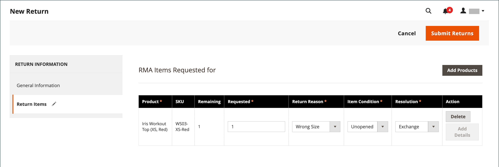

# 返品

返品された商品認証&#x200B;_（RMA）は、交換または返金のために商品の返品をリクエストするお客様に付与できます。_&#x200B;通常、顧客は加盟店に連絡して返金を要求します。 承認された場合は、返品された製品を識別するために、一意のRMA番号が割り当てられます。 設定では、すべての製品に対してRMAを有効にするか、特定の製品に対してのみRMAを許可することができます。 _[!UICONTROL Returns]_&#x200B;グリッドには、現在の返品要求（RMA）が一覧表示され、新しい返品要求の入力に使用されます。

{width="600" zoomable="yes"}

RMAは、シンプル、グループ化、設定可能、バンドルの各タイプに対して発行できます。 ただし、RMAは、バーチャル商品、ダウンロード可能な商品、ギフトカードでは利用できません。

## 列の説明

| 列 | 説明 |
|--- |--- |
| [!UICONTROL Select] | 返品処理の対象となる返品のチェックボックスを選択するか、列ヘッダーの選択コントロールを使用します。 オプション：`Select All` / `Deselect All` / `Select Visible` / `Unselect Visible` |
| [!UICONTROL RMA] | 各リターンに割り当てられる一意の数値識別子 |
| [!UICONTROL Requested] | 返品が行われた日時 |
| [!UICONTROL Order] | 元の注文の一意の番号 |
| [!UICONTROL Ordered] | 注文が行われた日時 |
| [!UICONTROL Customer] | 注文した顧客または購入者の名前 |
| [!UICONTROL Status] | 返品状況： オプション：`Pending` / `Authorized` / `Partially Authorized` / `Approved` / `Rejected` / `Processed and Closed` / `Closed` |
| [!UICONTROL Action] | **[!UICONTROL View]**&#x200B;さんがリターンを編集モードで開きます。 |

{style="table-layout:auto"}

## RMAと返品ワークフロー

1. **リクエストを受け取る** - ストアフロントで[が有効になっている](rma-configure.md#enable-rmas-for-your-store)場合、登録されたお客様とゲストの両方がRMAをリクエストできます。 管理者[&#128279;](#create-a-return-request-in-the-admin)でRMA リクエストを送信することもできます。

2. **RMAが発行されました** - リクエストを検討した後、リクエストを部分的に承認、完全に承認、またはキャンセルできます。 返品を承認し、返品送料の支払いに同意した場合は、サポートされている配送業者を使用して管理者から発送注文を作成できます。

3. **商品を受け取り、返品処理を完了しました** – 次のフローチャートは、返品処理を完了するための運用上の順序を示しています。

   {width="500"}

## RMA ステータス

返品商品認証（RMA）のライフサイクル中に、多くのステータス（保留中または承認済みなど）が割り当てられる可能性があります。 RMA ステータスは、ユーザーまたは加盟店が発行したRMA要求の進捗状況を示します。

| ステータス | 説明 |
|--- |--- |
| [!UICONTROL Pending] | ストアフロントのユーザーまたは管理画面のマーチャントによってRMA リクエストが発生したときに、RMA リクエストに割り当てられた初期ステータス。 |
| [!UICONTROL Authorized] | このステータスは、管理画面で返品を求められたすべての品目が販売者によって承認されたときに、RMAに割り当てられます。 |
| [!UICONTROL Partially Authorized] | リクエストされたアイテムのいずれかが拒否され、他の製品が承認された場合、このステータスはRMAに割り当てられます。 |
| [!UICONTROL Denied] | このステータスは、要求されたすべてのアイテムが管理者によって返品のために拒否された場合、RMAに割り当てられます。 |
| [!UICONTROL Return Received] | このステータスは、要求されたアイテムがユーザーから受信されたときに、マーチャントによってRMAに割り当てられます。 |
| [!UICONTROL Return Partially Received] | このステータスは、要求されたアイテムが部分的に返され、一部のアイテムが処理が拒否された場合、マーチャントによってRMAに割り当てられます。 |
| [!UICONTROL Approved] | このステータスは、要求されたアイテムがさらに処理するために承認されたときに、マーチャントによってRMAに割り当てられます。 |
| [!UICONTROL Rejected] | このステータスは、要求されたアイテムがさらに処理するために拒否されたときに、マーチャントによってRMAに割り当てられます。 |
| [!UICONTROL Processed and Closed] | このステータスは、すべてのリクエストされたアイテムがさらに処理するために承認されたときに、マーチャントによってRMAに割り当てられます。 |
| [!UICONTROL Closed] | このステータスは、要求されたアイテムが返品処理を拒否された場合、マーチャントがRMAに割り当てます。 |

{style="table-layout:auto"}

## 管理者で返品リクエストを作成する

管理者から、顧客の代理として返品リクエストを作成できます。 お客様は、Adobe Commerce ストアのストアフロントで[返品リクエスト &#x200B;](rma-customer-experience.md)を作成できます。

1. _管理者_ サイドバーで、**[!UICONTROL Sales]** > **[!UICONTROL Returns]**&#x200B;に移動します。

1. **[!UICONTROL New Return Request]**&#x200B;をクリックします。

1. 返品リクエストを作成するには、ステータスが`Complete`の注文をクリックします。

1. 「_[!UICONTROL Return Information]_」セクションで、「**[!UICONTROL Return Items]**」タブを選択します。

1. 返品するアイテムを追加するには、**[!UICONTROL Add Items]**&#x200B;をクリックします。

1. 必要な製品のチェックボックスを選択し、**[!UICONTROL Add Selected Product to returns]**&#x200B;をクリックします。

1. **[!UICONTROL Requested]**&#x200B;に、返されるアイテムの数を入力します。

1. **[!UICONTROL Return Reason]**&#x200B;を次のいずれかに設定します：

   - `Wrong Color`
   - `Wrong Size`
   - `Out of Service`
   - `Other`

   返品理由がリストされた選択肢と異なる場合は、`Other` オプションを選択すると、独自の選択肢を入力できます。

1. **[!UICONTROL Item Condition]**&#x200B;を次のいずれかに設定します：

   - `Unopened`
   - `Opened`
   - `Damaged`

1. **[!UICONTROL Resolution]**&#x200B;を次のいずれかに設定します：

   - `Exchange`
   - `Refund`
   - `Store Credit`

1. 返品を作成するには、**[!UICONTROL Submit Returns]**&#x200B;をクリックします。

   {width="600" zoomable="yes"}

   新しく送信されたRMA リクエストは、`Pending` ステータスの&#x200B;**[!UICONTROL Returns]** ページに表示されます。
