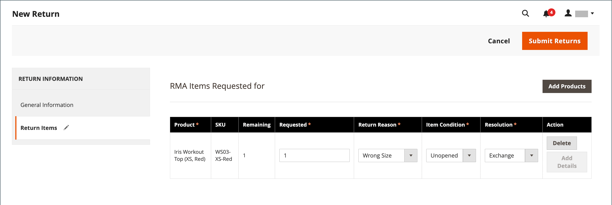

# 戻り値

A _返品された商品承認_ （RMA）は、交換または払い戻しのために商品の返品をリクエストするお客様に付与できます。 通常、顧客はマーチャントに連絡して払い戻しをリクエストします。 承認されると、返される製品を識別する一意の RMA 番号が割り当てられます。 この設定では、すべての製品に対して RMA を有効にするか、特定の製品にのみ RMA を許可するかを指定できます。 この _[!UICONTROL Returns]_グリッドは、現在の返品された商品要求（RMA）をリストし、新しい返品要求を入力するために使用されます。

{width="600" zoomable="yes"}

RMA は、シンプル、グループ化、設定可能、バンドル製品タイプに対して発行できます。 ただし、仮想製品、ダウンロード可能な製品、ギフトカードでは RMA を使用できません。

## 列の説明

| 列 | 説明 |
|--- |--- |
| [!UICONTROL Select] | アクションの対象となる返品のチェックボックスを選択するか、列ヘッダーの選択コントロールを使用します。 オプション： `Select All` / `Deselect All` / `Select Visible` / `Unselect Visible` |
| [!UICONTROL RMA] | 各返品に割り当てられる一意の数値識別子 |
| [!UICONTROL Requested] | 返品された日時 |
| [!UICONTROL Order] | 元の注文の一意の番号 |
| [!UICONTROL Ordered] | 注文された日時 |
| [!UICONTROL Customer] | 注文した顧客または購入者の名前 |
| [!UICONTROL Status] | ステータスを返します。 オプション： `Pending` / `Authorized` / `Partially Authorized` / `Approved` / `Rejected` / `Processed and Closed` / `Closed` |
| [!UICONTROL Action] | **[!UICONTROL View]** リターンを編集モードで開きます。 |

{style="table-layout:auto"}

## RMA と再来訪ワークフロー

1. **リクエストを受信**  – 次の場合 [enabled](rma-configure.md#enable-rmas-for-your-store) ストアフロントの場合、登録ユーザーとゲストの両方が RMA をリクエストできます。 以下の手順でも可能です [管理者に RMA リクエストを送信](#create-a-return-request-in-the-admin).

2. **RMA 発行** - リクエストを検討した後、リクエストの一部、完全またはキャンセルを承認できます。 返品を承認し、返品出荷の支払いに同意した場合は、サポートされている通信事業者で管理者から出荷注文を作成できます。

3. **商品の受け取りと返品処理**  – 次のフロー・チャートは、返品プロセスを完了するための操作オーダーを示しています。

   {width="500"}

## RMA ステータス

返品承認（RMA）には、ライフサイクル中に多数のステータス（保留や承認済みなど）が割り当てられている場合があります。 RMA ステータスは、ユーザーまたはマーチャントから発行された RMA リクエストの進行状況を示します。

| ステータス | 説明 |
|--- |--- |
| [!UICONTROL Pending] | ストアフロントのユーザーまたは管理者のマーチャントによって RMA リクエストが発生した場合に、そのリクエストに割り当てられる最初のステータス。 |
| [!UICONTROL Authorized] | このステータスは、リクエストされたすべての項目が返品について管理者のマーチャントによって承認された場合に RMA に割り当てられます。 |
| [!UICONTROL Partially Authorized] | リクエストされた項目のいずれかが拒否され、他の製品が承認された場合、このステータスが RMA に割り当てられます。 |
| [!UICONTROL Denied] | 要求されたすべての品目が返品に対して管理担当者によって拒否された場合、このステータスが RMA に割り当てられます。 |
| [!UICONTROL Return Received] | このステータスは、要求された品目がユーザーから受け取られると、マーチャントによって RMA に割り当てられます。 |
| [!UICONTROL Return Partially Received] | このステータスは、要求された品目が部分的に返品され、一部の品目が処理を拒否されると、マーチャントによって RMA に割り当てられます。 |
| [!UICONTROL Approved] | このステータスは、要求された品目が承認され、さらに処理されると、マーチャントによって RMA に割り当てられます。 |
| [!UICONTROL Rejected] | このステータスは、要求された品目がさらに処理するために拒否されると、マーチャントによって RMA に割り当てられます。 |
| [!UICONTROL Processed and Closed] | このステータスは、要求されたすべての品目が承認され、さらに処理されると、マーチャントによって RMA に割り当てられます。 |
| [!UICONTROL Closed] | このステータスは、要求された品目が返品の処理を拒否されたときに、マーチャントによって RMA に割り当てられます。 |

{style="table-layout:auto"}

## 管理者での再来訪リクエストの作成

マーチャントは、顧客に代わって管理者から返品リクエストを作成できます。 顧客は次のことができます [再来訪リクエストの作成](rma-customer-experience.md) Adobe Commerceストアのストアフロントで。

1. 日 _Admin_ サイドバー、に移動 **[!UICONTROL Sales]** > **[!UICONTROL Returns]**.

1. クリック **[!UICONTROL New Return Request]**.

1. 返品リクエストを作成するには、注文をクリックします `Complete` ステータス。

1. の下 _[!UICONTROL Return Information]_セクションで、**[!UICONTROL Return Items]**タブ。

1. 戻る項目を追加するには、次をクリックします： **[!UICONTROL Add Items]**.

1. 必要な製品のチェックボックスをオンにして、 **[!UICONTROL Add Selected Product to returns]**.

1. の場合 **[!UICONTROL Requested]**&#x200B;は、返される項目の数を入力します。

1. を設定 **[!UICONTROL Return Reason]** を次のいずれかに変更します。

   - `Wrong Color`
   - `Wrong Size`
   - `Out of Service`
   - `Other`

   返品の理由がリストされた選択肢と異なる場合は、 `Other` オプション。

1. を設定 **[!UICONTROL Item Condition]** を次のいずれかに変更します。

   - `Unopened`
   - `Opened`
   - `Damaged`

1. を設定 **[!UICONTROL Resolution]** を次のいずれかに変更します。

   - `Exchange`
   - `Refund`
   - `Store Credit`

1. 返品を作成するには、次をクリックします。 **[!UICONTROL Submit Returns]**.

   {width="600" zoomable="yes"}

   新しく送信された RMA リクエストがに表示されます **[!UICONTROL Returns]** を含むページ `Pending` ステータス。
