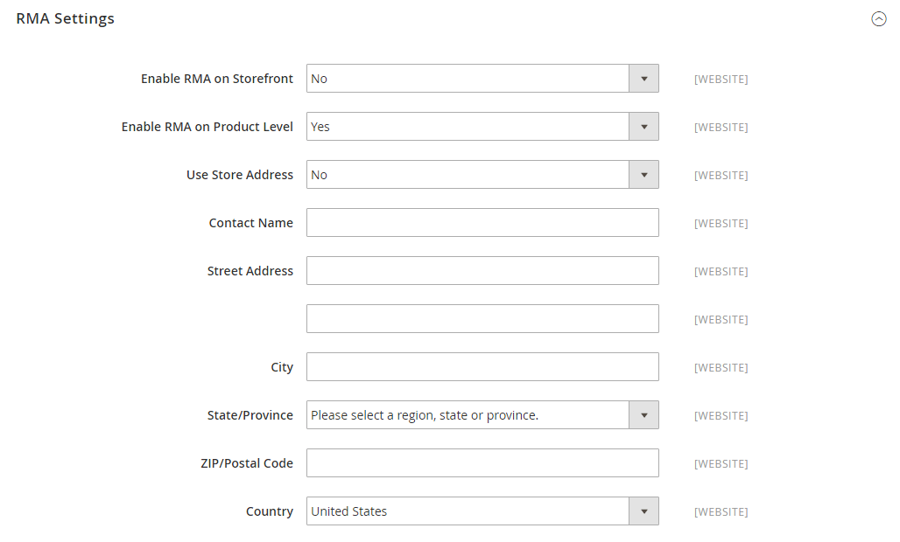

# 返品の設定

{{ee-feature}}

有効にすると、ストアフロントから顧客がRMA リクエストを送信できるようになります。 RMAは、返品可能な注文の品目がある場合にのみ生成できます。 個々のアイテムを返すリクエストは、各製品レコードの&#x200B;_Enable RMA_&#x200B;属性によって管理されます。 デフォルトでは、構成設定が製品に適用されます（_[!UICONTROL Use Config Settings]_&#x200B;が選択されています）。_[!UICONTROL Enable RMA]_&#x200B;が`No`に設定されている場合、返品可能な商品のリストに商品が表示されません。 _RMA_&#x200B;を有効にする設定を変更すると、新規注文と既存注文の両方に適用されます。

## ストアのRMAの有効化

1. _管理者_ サイドバーで、**[!UICONTROL Stores]** > _[!UICONTROL Settings]_>**[!UICONTROL Configuration]**&#x200B;に移動します。

1. 左側のパネルで「**[!UICONTROL Sales]**」を展開し、下の「**[!UICONTROL Sales]**」を選択します。

1. **[!UICONTROL RMA Settings]** セクションのを展開します。

   {width="600" zoomable="yes"}

1. **[!UICONTROL Enable RMA on Storefront]**&#x200B;を`Yes`に設定します。

   この設定は、顧客がストアフロントからRMA リクエストを作成および表示できるかどうかを決定します。 RMAは、新規注文と既存注文の両方に適用できます。

1. **[!UICONTROL Enable RMA on Product Level]**&#x200B;を`Yes`に設定します。

   この設定は、ストアフロントの個々の製品に対する&#x200B;_Enable RMA_&#x200B;属性の動作を決定します。

   - [!UICONTROL Enable RMA on Product Level]が`Yes`に設定されている場合、ストアフロントの顧客はすべての個々の製品を返すことができます。 これには、_[!UICONTROL Enable RMA]_= `Yes`と&#x200B;_[!UICONTROL Enable RMA]_ = `No`の製品属性値の両方が含まれます。
   - [!UICONTROL Enable RMA on Product Level]が`No`に設定されている場合、ストアフロントの顧客は、_[!UICONTROL Enable RMA]_= `Yes`個の製品属性値を持つ製品のみを返すことができます。

1. **[!UICONTROL Use Store Address]**&#x200B;を次のいずれかの値に設定します：

   - `Yes` – 返品商品を店舗の住所に送信します。
   - `No` – 返品用の代替住所を入力します。

   {width="600" zoomable="yes"}

1. **[!UICONTROL Save Config]**&#x200B;をクリックします。

## 返品の配送方法の設定

1. _管理者_ サイドバーで、**[!UICONTROL Stores]** > _[!UICONTROL Settings]_>**[!UICONTROL Configuration]**&#x200B;に移動します。

1. 左側のパネルで、**[!UICONTROL Sales]**&#x200B;を展開し、**[!UICONTROL Delivery Methods]**&#x200B;を選択します。

1. 返品サービスに使用する通信事業者（**[!UICONTROL UPS]**&#x200B;など）のセクションを展開します。

   {width="600" zoomable="yes"}

1. **[!UICONTROL Enabled for RMA]**&#x200B;を`Yes`に設定します。

1. **[!UICONTROL Save Config]**&#x200B;をクリックします。

## 許可されているRMAを製品レベルで変更する

ストアのRMAを有効にし、カタログに返品を許可しない商品が含まれている場合は、商品レベルで設定を変更できます。

1. 製品を編集モードで開きます。

1. 下にスクロールして、**[!UICONTROL Autosettings]** セクションのを展開します。

1. 必要に応じて、**[!UICONTROL Use Config Setting]** チェックボックスをオフにします。

1. **[!UICONTROL Enable RMA]**&#x200B;設定を`No`に切り替えます。

   {width="600" zoomable="yes"}

1. **[!UICONTROL Save]**&#x200B;をクリックします。
