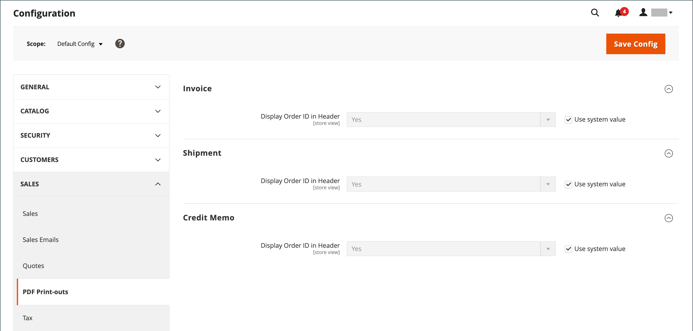
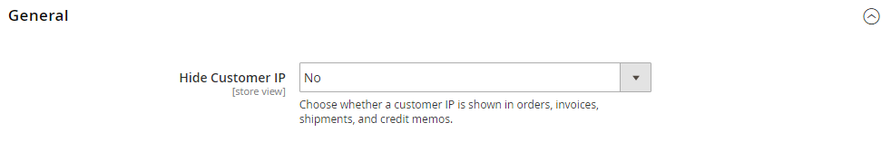

# 販売ドキュメント

注文ワークフローをサポートし、送信された注文に関する文書を顧客に提供するには、ストアブランドを反映し、参照情報を含めるように関連する販売ドキュメントを設定します。

## 請求書と梱包明細の設定

ストアフロントページで使用されるロゴ画像とは異なり、PDFの請求書やその他の営業文書のロゴは、高解像度の300 dpiの画像にすることができます。 ロゴのサイズを変更する際は、縦横比を維持するように注意してください。 高さに合うようにロゴのサイズを変更し、未使用のスペースを右に移動させないようにします。

{width="200"}

必要なサイズに合わせてロゴのサイズを変更する方法の1つは、正しいサイズの新しい空白の画像を作成することです。 次に、ロゴ画像を貼り付け、高さに合わせてサイズを変更します。 ほとんどの画像編集プログラムでは、縦横比を保持するためにパーセンテージで拡大・縮小するか、Shift キーを押しながら画像のサイズを手動で変更できます。

**_ロゴを更新するには:_**

1. _管理者_ サイドバーで、**[!UICONTROL Stores]** > _[!UICONTROL Settings]_>**[!UICONTROL Configuration]**&#x200B;に移動します。

1. 左側のパネルで「**[!UICONTROL Sales]**」を展開し、下の「**[!UICONTROL Sales]**」を選択します。

1. **[!UICONTROL Invoice and Packing Slip Design]** セクションのを展開し、次の操作を行います。

   {width="600" zoomable="yes"}

   - **[!UICONTROL Logo for PDF Print-outs]**&#x200B;をアップロードするには、**[!UICONTROL Choose File]**&#x200B;をクリックし、準備したロゴを見つけて、**[!UICONTROL Open]**&#x200B;をクリックします。

   - **[!UICONTROL Logo for HTML Print View]**&#x200B;をアップロードするには、**[!UICONTROL Choose File]**&#x200B;をクリックし、準備したロゴを見つけて、**[!UICONTROL Open]**&#x200B;をクリックします。

   - 請求書や梱包明細に記載する住所を入力します。

1. 完了したら、**[!UICONTROL Save Config]**&#x200B;をクリックします。

   参照用として、アップロードされた画像のサムネールが各フィールドの前に表示されます。 サムネールが歪んで表示される場合は心配しないでください。 請求書に記載されているロゴの割合は正しいものです。

### 画像の置き換え

1. **[!UICONTROL Choose File]**&#x200B;をクリックし、別のロゴファイルを選択します。

1. 置き換える画像の&#x200B;**[!UICONTROL Delete Image]** チェックボックスを選択します。

1. **[!UICONTROL Save Config]**&#x200B;をクリックします。

### 画像フォーマット

| 書式設定 | 要件定義 |
|--- |------------------------------------------|
| **_PDF_** |  |
| ファイル形式 | JPG（JPEG）、PNG、TIF （TIFF） |
| 画像サイズ | 最大1080 ピクセル（幅） x 270 ピクセル（高） |
| 解決策 | 300 DPI推奨 |
| **_HTML_** |  |
| ファイル形式 | JPG（JPEG）、PNG、GIF |
| 画像サイズ | テーマによって決まります。 |
| 解決策 | 72または96 DPI |

{style="table-layout:auto"}

## 参照IDの追加

注文IDと顧客IP アドレスは、注文に伴う販売文書のヘッダーに含めることができます。 デフォルトでは、注文IDと顧客IP アドレスの両方が、請求書、出荷梱包明細、およびクレジットメモのヘッダーに表示されます。

{width="600" zoomable="yes"}

**_注文ID設定を変更するには:_**

1. _管理者_ サイドバーで、**[!UICONTROL Stores]** > _[!UICONTROL Settings]_>**[!UICONTROL Configuration]**&#x200B;に移動します。

1. 左側のパネルで、**[!UICONTROL Sales]**&#x200B;を展開し、**[!UICONTROL PDF Print-outs]**&#x200B;を選択します。

1. **請求書** セクションのを展開します。

1. 好みに応じて&#x200B;**[!UICONTROL Display Order ID in Header]**&#x200B;を設定します。

1. **[!UICONTROL Shipment]**&#x200B;と&#x200B;**[!UICONTROL Credit Memo]**&#x200B;のセクションに対して繰り返します。

1. 完了したら、**[!UICONTROL Save Config]**&#x200B;をクリックします。

**_顧客IP アドレス設定を変更するには:_**

1. _管理者_ サイドバーで、**[!UICONTROL Stores]** > _[!UICONTROL Settings]_>**[!UICONTROL Configuration]**&#x200B;に移動します。

1. 左側のパネルで「**[!UICONTROL Sales]**」を展開し、下の「**[!UICONTROL Sales]**」を選択します。

1. **[!UICONTROL General]** セクションのを展開します。

   {width="600" zoomable="yes"}

1. **[!UICONTROL Hide Customer IP]**&#x200B;を好みに合わせて設定します。

1. 完了したら、**[!UICONTROL Save Config]**&#x200B;をクリックします。
