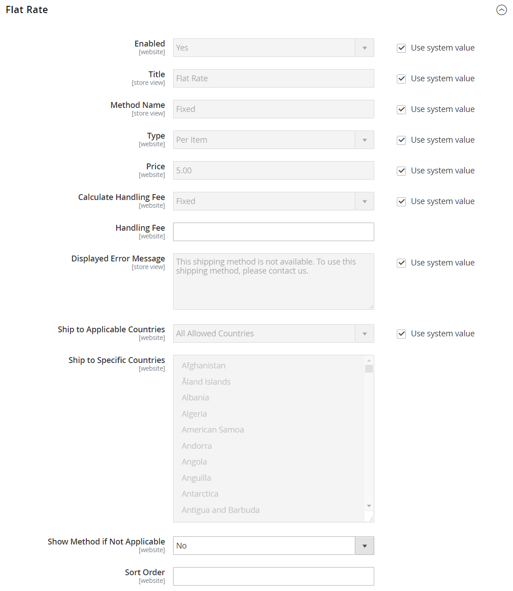

# 定額配送

_定額料金_ は、品目ごと、または出荷ごとに適用できる、固定の事前定義済みの手数料です。 定額料金は、簡単な出荷ソリューションです。特に、一部のキャリアから入手できる定額料金パッケージと組み合わせて使用する場合に使用します。 有効にした場合、 _定額料金_ は、チェックアウト時にオプションとして表示されます。 特定の通信事業者が指定されていないので、選択した通信事業者を使用できます。

## 定額料金の配送を設定します

1. 次の日： _管理者_ サイドバー、移動 **[!UICONTROL Stores]** > _[!UICONTROL Settings]_>**[!UICONTROL Configuration]**.

1. 左側のパネルで、を展開します。 **[!UICONTROL Sales]** を選択します。 **[!UICONTROL Delivery Methods]**.

1. 展開  の **定額料金** 」セクションに入力します。

   {width="600" zoomable="yes"}

   これらの各設定について詳しくは、 [定額料金](../configuration-reference/sales/delivery-methods.md#flat-rate) （内） _設定リファレンスガイド_.

1. 設定 **[!UICONTROL Enabled]** から `Yes`.

   定額レートは、買い物かごの「送料および税金の見積」セクションおよびチェックアウト時の「出荷」セクションにオプションとして表示されます。

1. 説明的な **[!UICONTROL Title]** を使用します。

1. を入力します。 **メソッド名** をクリックします。

   デフォルトのメソッド名はです。 `Fixed`. 手数料を請求する場合、このテキストを `Plus Handling`、または別の適切なものを使用します。

1. 定額配送の使用方法を説明するには、 **タイプ** を次のいずれかに変更します。

   - `None`  — 支払タイプを無効にします。 「定額」オプションは買い物かごに表示されますが、レートは 0 で、送料無料と同じです。
   - `Per Order`  — 注文全体に対して 1 回の定額料金を請求します。
   - `Per Item`  — 各品目に対して 1 回の定額料金を請求します。 同じ品目が複数あるか異なる品目があるかに関係なく、レートには買い物かご内の品目数が乗算されます。

1. 次を入力します。 **価格** 定額料金で請求する

1. 必要に応じて、取り扱い料金オプションを設定します。

   手数料はオプションで、送料に追加される追加料金として表示されます。 手数料を含める場合は、次の手順を実行します。

   - の場合 **処理費の計算**、処理費の計算に使用する方法を選択します。

      - `Fixed`
      - `Percent`

   - の場合 **手数料**」に、金額の計算に選択した方法に基づいて、請求する金額を入力します。

     例えば、料金が固定料金に基づく場合は、金額を小数で入力します。例： `4.90`. ただし、手数料が配送費のパーセンテージに基づいている場合は、金額をパーセンテージで入力します。 例えば、送料の 6%を請求する場合は、値を「 」と入力します。 `6`.

1. 必要に応じて、 **表示されたエラーメッセージ**.

   このテキストボックスにはデフォルトのメッセージがあらかじめ設定されていますが、定額配送が利用できなくなった場合に表示する別のメッセージを入力できます。

1. 設定 **該当国への出荷**:

   - `All Allowed Countries`  — すべてのお客様から [国](../getting-started/store-details.md#country-options) ストア設定で指定された場合、この配信方法を使用できます。
   - `Specific Countries`  — このオプションを選択すると、 _特定の国に出荷_ リストが表示されます。 この配信方法を使用できる国をリストから選択します。

1. 設定 **該当しない場合はメソッドを表示**:

   - `Yes`  — 該当しない場合でも、常に定額法を表示します。
   - `No`  — 該当する場合にのみ、定額法を表示します。

1. の場合 **[!UICONTROL Sort Order]**、数値を入力して、チェックアウト時に他の配信方法と共に「定額配送」が表示される順序を決定します。

   `0` =最初 `1` =秒 `2` = 3 番目、など。

1. クリック **[!UICONTROL Save Config]**.
