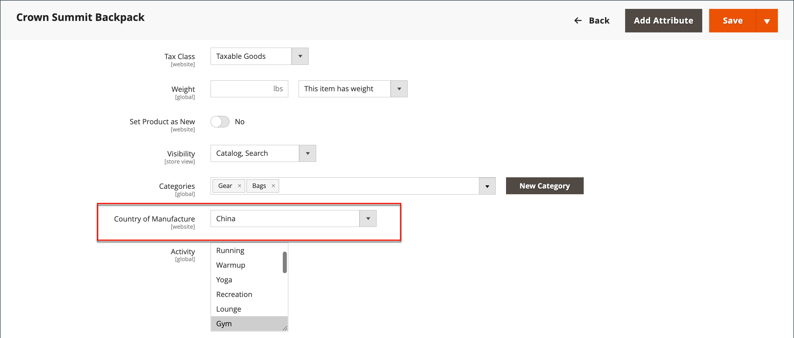
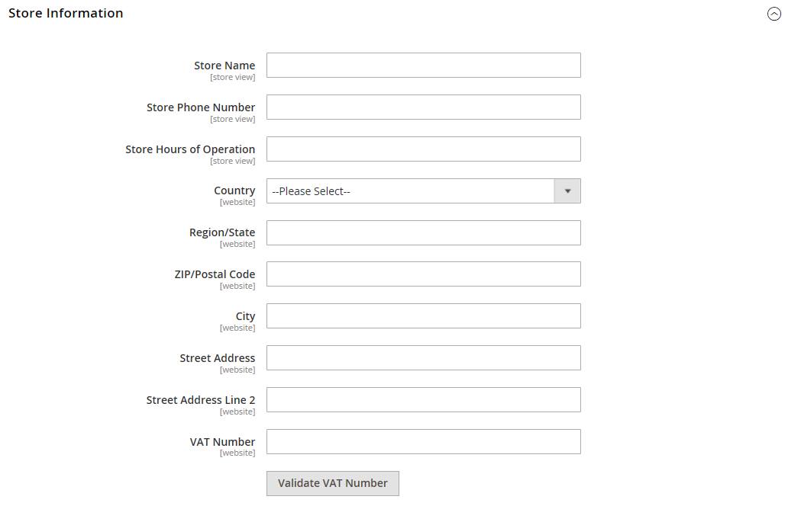

# 配送ラベルを設定

次の設定は、製品レベルで、およびラベルの印刷に使用される各キャリアの設定で行う必要があります。 ラベルを印刷するには、すべてのキャリアでアカウントを開く必要があります。 次に、使用する各キャリアのストアで設定を完了します。

## 通信事業者の要件

| [!UICONTROL Carrier] | 要件定義 |
|-------|--------|
| [USPS](usps.md) | 配送ラベルの郵送用にUSPS アカウントが必要です。 |
| [UPS](ups.md) | UPS アカウントが必要です。 配送ラベルは、米国外の店舗に対して必要な米国固有の資格情報に基づく配送にのみ使用できます。 |
| [FedEx](fedex.md) | FedEx アカウントが必要です。 米国以外の店舗の場合、配送ラベルは国際配送でのみサポートされています。 FedExは、米国外からの国内配送を許可していません |
| [DHL](dhl.md) | DHL アカウントが必要です。 配送ラベルは、米国発送の配送に対してのみサポートされます。 |

{style="table-layout:auto"}

## ステップ 1：製造国を確認する

製造国は、USPSとFedExによって国際的に出荷されているすべての製品に必要です。 更新する製品が多数ある場合は、更新を[&#x200B; インポート &#x200B;](../systems/data-import.md)するか、在庫グリッドを使用して複数のレコードを更新できます。

1. _管理者_ サイドバーで、**[!UICONTROL Catalog]** > **[!UICONTROL Products]**&#x200B;に移動します。

1. 次のいずれかの方法を使用して、出荷ラベルレコードを更新します。

### 方法1：単一のレコードを更新する

1. グリッドで、更新する製品を見つけ、編集モードで開きます。

1. 必要に応じて、**製造国**&#x200B;を更新します。

   {width="700" zoomable="yes"}

1. **[!UICONTROL Save]**&#x200B;をクリックします。

### 方法2：複数のレコードを更新する

1. グリッドで、更新する各製品のチェックボックスを選択します。

   例えば、中国で製造されているすべての製品。

1. **[!UICONTROL Actions]** コントロールを`Update Attributes`に設定し、**[!UICONTROL Submit]**&#x200B;をクリックします。

1. _属性を更新_ フォームで、**製造国** フィールドを見つけ、**変更** チェックボックスを選択します。

1. 国を選ぶ。

1. **[!UICONTROL Save]**&#x200B;をクリックします。

## ステップ 2 ストア情報を確認する

1. _管理者_ サイドバーで、**[!UICONTROL Stores]** > _[!UICONTROL Settings]_>**[!UICONTROL Configuration]**&#x200B;に移動します。

1. 左側のパネルで、**[!UICONTROL Sales]**&#x200B;を展開し、**[!UICONTROL Shipping Settings]**&#x200B;を選択します。

1. **[!UICONTROL Origin]** セクションのを展開し、次のフィールドが完了していることを確認します。

   - **[!UICONTROL Street Address]** – 配送の送信元となる場所の住所。 例えば、会社や倉庫の場所などです。 このフィールドは、配送ラベルに必須です。
   - **[!UICONTROL Street Address Line 2]** – 床や入り口などの追加のアドレス情報。 このフィールドを使用することをお勧めします。

   {width="600" zoomable="yes"}

1. 左側のパネルの&#x200B;_Sales_ セクションで、**[!UICONTROL Delivery Methods]**&#x200B;を選択します。

1. **[!UICONTROL USPS]** セクションのを展開し、次のフィールドが完了していることを確認します。

   - **[!UICONTROL Secure Gateway URL]** - システムはゲートウェイ URLを自動的に入力します。
   - **[!UICONTROL Password]** - パスワードはUSPSによって提供され、Web サービスを通じてシステムにアクセスできるようになります。
   - **Length, Width, Height, Girth** - パッケージのデフォルトディメンション。 これらのフィールドを表示するには、**[!UICONTROL Size]**&#x200B;を`Large`に設定します。

1. **FedEx** セクションのを展開し、次のフィールドが完了していることを確認します。

   - メーター番号
   - キー
   - パスワード

   この情報は通信事業者によって提供され、Web サービスを通じてシステムにアクセスするために必要です。

1. 左側のパネルで「**[!UICONTROL General]**」を展開し、下の「**[!UICONTROL General]**」を選択します。

1. **[!UICONTROL Store Information]** セクションのを展開し、次のフィールドが完了していることを確認します。

   - **[!UICONTROL Store Name]** - ストアビューまたはストアビューの名前。
   - **[!UICONTROL Store Contact Telephone]** - ストアまたはストア ビューのプライマリ連絡先の電話番号。
   - **[!UICONTROL Country]** - ストアの拠点となる国。
   - **[!UICONTROL VAT Number]** – 該当する場合、ストアの付加価値税番号。 （米国に拠点を置く店舗には不要）
   - **[!UICONTROL Store Contact Address]** - ストアまたはストアビューのプライマリ連絡先の住所。

1. 複数のストアがあり、連絡先情報がデフォルトと異なる場合は、それぞれに&#x200B;**[!UICONTROL Store View]**&#x200B;を設定し、情報が完了していることを確認します。

   情報が見つからない場合は、ラベルを印刷しようとするとエラーが表示されます。

   {width="600" zoomable="yes"}

1. **[!UICONTROL Save Config]**&#x200B;をクリックします。
