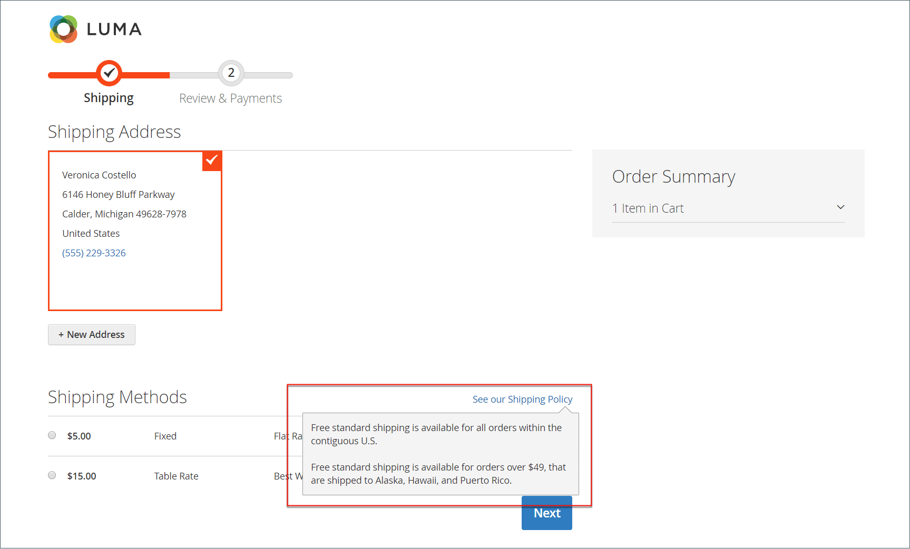

# 発送設定

配送設定では、すべての配送の起点、配送ポリシー、複数の住所への配送の処理が確立されます。

## 原点

POSは、店舗または倉庫からの出荷の料金を計算するために使用され、販売された製品の税率も決定します。 [EU税](international-tax-guidelines.md#eu-tax-configuration)を計算する際は、各ストアビューの[&#x200B; デフォルトの税宛先計算](../configuration-reference/sales/tax.md)が出荷設定の原点に対応していることを確認してください。

{width="600" zoomable="yes"}

1. _管理者_ サイドバーで、**[!UICONTROL Stores]** > _[!UICONTROL Settings]_>**[!UICONTROL Configuration]**&#x200B;に移動します。

1. 左側のパネルで、**[!UICONTROL Sales]**&#x200B;を展開し、**[!UICONTROL Shipping Settings]**&#x200B;を選択します。

1. **[!UICONTROL Origin]** セクションのを展開し、次の操作を完了します。

   - [!UICONTROL Country]
   - [!UICONTROL Region / State]
   - [!UICONTROL ZIP / Postal Code]
   - [!UICONTROL City]
   - [!UICONTROL Street Address] （および必要に応じて2行目）

1. **[!UICONTROL Save Config]**&#x200B;をクリックします。

## 配送ポリシー

配送ポリシーでは、自社のビジネスルールと配送ガイドラインを説明する必要があります。 例えば、送料無料をトリガーとする価格規則がある場合は、送料ポリシーの条件を説明できます。

{width="700" zoomable="yes"}

チェックアウト時に配送ポリシーを表示するには、設定の配送ポリシーパラメーターを完了します。 チェックアウト中に顧客が&#x200B;_配送ポリシー_&#x200B;を参照すると、テキストが表示されます。

1. _管理者_ サイドバーで、**[!UICONTROL Stores]** > _[!UICONTROL Settings]_>**[!UICONTROL Configuration]**&#x200B;に移動します。

1. 左側のパネルで、**[!UICONTROL Sales]**&#x200B;を展開し、**[!UICONTROL Shipping Settings]**&#x200B;を選択します。

1. **[!UICONTROL Shipping Policy Parameters]** セクションのを展開します。

1. **[!UICONTROL Apply Custom Shipping Policy]**&#x200B;を`Yes`に設定します。

1. **[!UICONTROL Shipping Policy]**&#x200B;を貼り付けるか、テキストボックスに入力してください。

   >[!NOTE]
   >
   >ワードプロセッサーを使用してテキストを構成する場合は、必ず.txt ファイルとしてドキュメントを保存し、テキストから制御文字を削除します。 次に、「配送ポリシー」テキストボックスにテキストをコピー&amp;ペーストします。

   {width="600" zoomable="yes"}

1. **[!UICONTROL Save Config]**&#x200B;をクリックします。

## 複数のアドレス

複数のアドレス配送オプションを使用すると、チェックアウト時に複数のアドレスに注文を配送し、注文を発送できるアドレスの最大数を決定できます。

1. _管理者_ サイドバーで、**[!UICONTROL Stores]** > _[!UICONTROL Settings]_>**[!UICONTROL Configuration]**&#x200B;に移動します。

1. 左側のパネルで、**[!UICONTROL Sales]**&#x200B;を展開し、**[!UICONTROL Multishipping Settings]**&#x200B;を選択します。

1. **[!UICONTROL Options]** セクションのを展開します。

   {width="600" zoomable="yes"}

1. **[!UICONTROL Allow Shipping to Multiple Addresses]**&#x200B;を`Yes`に設定します。

1. **[!UICONTROL Maximum Qty Allowed for Shipping to Multiple Addresses]**&#x200B;を入力します。

1. **[!UICONTROL Save Config]**&#x200B;をクリックします。

>[!NOTE]
>
> （Adobe Commerce B2B）複数の配送先住所を持つ注文の場合、[&#x200B; アカウントでのお支払い](../b2b/enable-basic-features.md#configure-payment-on-account)は、有効になっている場合でも、チェックアウト時に利用できません。

## 電子メールの出荷追跡URL

[!BADGE SaaSのみ]{type=Positive url="https://experienceleague.adobe.com/en/docs/commerce/user-guides/product-solutions" tooltip="Adobe Commerce as a Cloud Service プロジェクト（Adobeで管理されるSaaS インフラストラクチャ）にのみ適用されます。"}

デフォルトでは、買い物客のメールで送信される出荷追跡番号はプレーンテキストです。 カスタムトラッキング URL機能を有効にすることで、これらのトラッキング番号をクリック可能なリンクに変換できます。 この機能を使用すると、様々な配送業者のURLを追跡するためのテンプレートを定義できます。 各テンプレートには、トラッキングサイトへの完全なURLと、トラッキング番号のプレースホルダーが含まれています。 Commerceは、メール内のプレースホルダーを実際のトラッキング番号に置き換えます。

以下の配送業者がサポートされています。

- 米国郵政公社
- United Parcel Service （UPS）
- Federal Express （FedEx）
- DHL Express （DHL）

カスタム トラッキング URLを有効または編集するには：

1. _管理者_ サイドバーで、**[!UICONTROL Stores]** > _[!UICONTROL Settings]_>**[!UICONTROL Configuration]**&#x200B;に移動します。

1. 左側のパネルで、**[!UICONTROL Sales]**&#x200B;を展開し、**[!UICONTROL Shipping Settings]**&#x200B;を選択します。

1. **[!UICONTROL Shipment Tracking URLs]** セクションのを展開します。

1. **[!UICONTROL Enable Custom Tracking URLs]**&#x200B;を`Yes`に設定します。

1. デフォルトのURL テンプレートは、サポートされている各キャリアに提供されます。 これらの値のいずれかを変更する必要がある場合は、対応するフィールドに新しいURL テンプレートを入力します。 実際のトラッキング番号のプレースホルダーとして`{{tracking_number}}`を使用します。 例えば、UPSがURLを`https://www.ups.com/newtracker?tracknumber`に変更した場合、新しいトラッキング URL テンプレートは次のようになります。

   ```text
   https://www.ups.com/newtracker?tracknumber={{tracking_number}}
   ```

1. **[!UICONTROL Save Config]**&#x200B;をクリックします。
