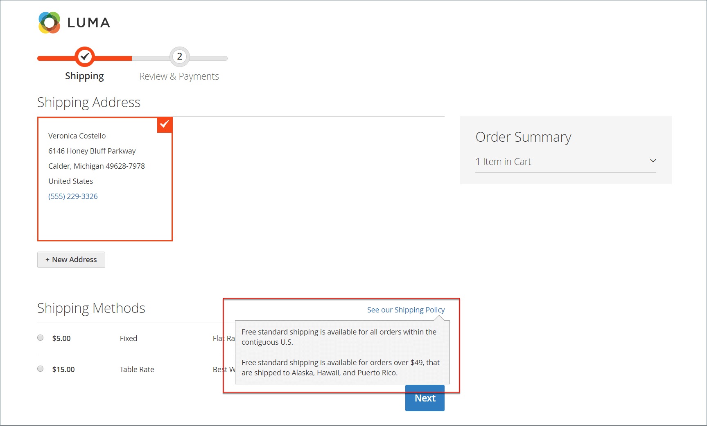

# 発送設定

出荷構成では、すべての出荷の原産地点、出荷方針、および複数の所在地への出荷処理が設定されます。

## 原点

出荷元は、店舗または倉庫から行われた出荷の請求を計算するために使用され、また販売された製品の税率を決定します。 計算時 [EU 税](international-tax-guidelines.md#eu-tax-configuration)。次のことを確認します [デフォルト税金宛先計算](../configuration-reference/sales/tax.md) ストアの各表示は、発送設定の接触チャネルに対応しています。

{width="600" zoomable="yes"}

1. 日 _Admin_ サイドバー、に移動 **[!UICONTROL Stores]** > _[!UICONTROL Settings]_>**[!UICONTROL Configuration]**.

1. 左側のパネルで、を展開します **[!UICONTROL Sales]** を選択します **[!UICONTROL Shipping Settings]**.

1. を展開  この **[!UICONTROL Origin]** セクションを選択し、次の内容を完了します。

   - [!UICONTROL Country]
   - [!UICONTROL Region / State]
   - [!UICONTROL ZIP / Postal Code]
   - [!UICONTROL City]
   - [!UICONTROL Street Address] （必要に応じて 2 行目）

1. クリック **[!UICONTROL Save Config]**.

## 配送ポリシー

配送ポリシーでは、会社の配送に関するビジネスルールとガイドラインを説明する必要があります。 例えば、送料無料をトリガーとする価格ルールがある場合、送料ポリシーの条件を説明できます。

{width="700" zoomable="yes"}

チェックアウト時に配送ポリシーを表示するには、設定の配送ポリシーパラメーターを入力します。 顧客がクリックすると、このテキストが表示されます _配送ポリシーをご覧ください_ チェックアウト中。

1. 日 _Admin_ サイドバー、に移動 **[!UICONTROL Stores]** > _[!UICONTROL Settings]_>**[!UICONTROL Configuration]**.

1. 左側のパネルで、を展開します **[!UICONTROL Sales]** を選択します **[!UICONTROL Shipping Settings]**.

1. を展開  この **[!UICONTROL Shipping Policy Parameters]** セクション。

1. を設定 **[!UICONTROL Apply Custom Shipping Policy]** 対象： `Yes`.

1. 貼り付けるか、を入力してください **[!UICONTROL Shipping Policy]** テキストボックスに入力します。

   >[!NOTE]
   >
   >ワードプロセッサーを使用してテキストを作成する場合は、ドキュメントを.txt ファイルとして保存して、テキストから制御文字を削除してください。 次に、テキストをコピーして「出荷ポリシー」テキストボックスに貼り付けます。

   {width="600" zoomable="yes"}

1. クリック **[!UICONTROL Save Config]**.

## 複数のアドレス

複数の住所配送オプションを使用すると、お客様はチェックアウト時に注文を複数の住所に発送し、注文を発送できる最大住所数を決定できます。

1. 日 _Admin_ サイドバー、に移動 **[!UICONTROL Stores]** > _[!UICONTROL Settings]_>**[!UICONTROL Configuration]**.

1. 左側のパネルで、を展開します **[!UICONTROL Sales]** を選択します **[!UICONTROL Multishipping Settings]**.

1. を展開  この **[!UICONTROL Options]** セクション。

   {width="600" zoomable="yes"}

1. を設定 **[!UICONTROL Allow Shipping to Multiple Addresses]** 対象： `Yes`.

1. を入力 **[!UICONTROL Maximum Qty Allowed for Shipping to Multiple Addresses]**.

1. クリック **[!UICONTROL Save Config]**.

>[!NOTE]
>
> （Adobe Commerce B2B）複数の配送先住所を持つ注文の場合、 [分割払い](../b2b/enable-basic-features.md#configure-payment-on-account) 有効になっている場合でも、支払い方法はチェックアウト時には使用できません。
