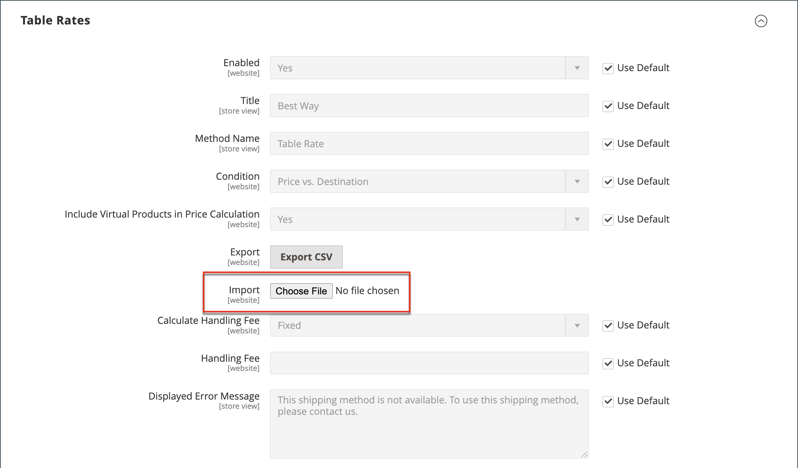

# テーブル レート配送

_テーブル率_ 配送方法は、データのテーブルを参照して、次のような条件の組み合わせに基づいて配送料を計算します。

- 重み付けと宛先
- 価格 v.目的地
- 項目の数 v.宛先

例えば、倉庫がロサンゼルスにある場合、バーモントよりもサンディエゴに発送する方が費用は安くなります。 定額料金による配送を使用して、節約分をお客様に渡すことができます。

テーブル レートの計算に使用されるデータは、スプレッドシートで準備され、ストアにインポートされます。 顧客が見積を要求すると、結果は買い物かごの「出荷見積」セクションに表示されます。

>[!NOTE]
>
>一度にアクティブにできるテーブル・レート・データのセットは 1 つだけです。

{width="700" zoomable="yes"}

## 手順 1：デフォルト設定の完了

最初の手順は、テーブルのレートのデフォルト設定を完了することです。 この手順は、設定の範囲を変更せずに完了できます。

1. _管理者_ サイドバーで、**[!UICONTROL Stores]**/_[!UICONTROL Settings]_/**[!UICONTROL Configuration]**に移動します。

1. 左パネルの「_[!UICONTROL Sales]_」セクションで、「**[!UICONTROL Delivery Methods]**」を選択します。

1. 「」を展開し、「**[!UICONTROL Table Rates]**」セクションを展開します。

   >[!NOTE]
   >
   >必要に応じて、最初に「**[!UICONTROL Use system value]**」チェックボックスをオフにして、説明に従って次の設定を変更します。

   {width="600" zoomable="yes"}

1. **[!UICONTROL Enabled]** を `Yes` に設定します。

1. チェックアウト時に表の料率セクションに表示する **[!UICONTROL Title]** を入力します。

   デフォルトのタイトルは `Best Way` です。

1. 買い物かご内の計算された料金の横にラベルとして表示する **[!UICONTROL Method Name]** を入力します。

1. **[!UICONTROL Condition]** を次のいずれかの計算方法に設定します。

   - `Weight v. Destination`
   - `Price v. Destination`
   - `Number of Items v. Destination`

1. 仮想商品を含む注文の場合、仮想商品を計算に含めることができるようにするには、**[!UICONTROL Include Virtual Products in Price Calculation]** を `Yes` に設定します。

   >[!NOTE]
   >
   >サービスなどの仮想製品には重み付けがないため、重み付け v.宛先条件に基づく計算結果は変更できません。 ただし、仮想製品は、「価格 v.宛先」または「品目数 vs 宛先条件」のいずれかに基づく計算の結果を変更できます。

1. 要件に応じて手数料オプションを設定します。

   手数料は任意で、送料に加算される追加料金として表示されます。 手数料を含める場合は、次の操作を行います。

   - Set **[!UICONTROL Calculate Handling Fee]**:

      - `Fixed`
      - `Percent`

   - 手数料の計算に使用する方法に従って **[!UICONTROL Handling Fee]** 料率を入力します。

     例えば、料金が固定料金に基づいている場合は、`4.90` のように小数で金額を入力します。 ただし、手数料が注文のパーセンテージに基づいている場合は、パーセンテージで金額を入力します。 例えば、注文の 6% を請求する場合は、値を `.06` のように入力します。

1. 必要に応じて、**[!UICONTROL Displayed Error Message]** を変更します。

   このテキストボックスにはデフォルトのメッセージが事前に設定されていますが、この配信方法が使用できなくなった場合に表示する別のメッセージを入力できます。

1. Set **[!UICONTROL Ship to Applicable Countries]**:

   - `All Allowed Countries` - ストア設定で指定されたすべての [ 国 ](../getting-started/store-details.md#country-options) の顧客がこの配信方法を使用できます。
   - `Specific Countries` – このオプションを選択すると、_[!UICONTROL Ship to Specific Countries]_リストが表示されます。 リストで、この配信方法を使用できる国を選択します。

1. テーブルの料金を常に表示する場合は、**[!UICONTROL Show Method if Not Applicable]** を `Yes` に設定します

1. **[!UICONTROL Sort Order]** しくは、番号を入力して、チェックアウト時に他の配信方法と共にリストされたときに表の料金で出荷されるときの表示順序を決定します。

   `0` = 1 番目、`1` = 2 番目、`2` = 3 番目など。

1. 「**[!UICONTROL Save Config]**」をクリックします。

## 手順 2：テーブルレートデータを準備

1. 左上隅で、**[!UICONTROL Store View]** を `Main Website` または設定が適用されるその他の web サイトに設定します。

   >[!NOTE]
   >
   >必要に応じて、まず「**[!UICONTROL Use system value]**」チェックボックスの選択を解除し、説明に従って次の設定を変更します。

1. 必要に応じて **[!UICONTROL Condition]** を変更します。

1. 「**[!UICONTROL Export CSV]**」をクリックします。

   {width="700" zoomable="yes"}

1. `tablerates.csv` ファイルをシステムに保存します。

1. ファイルをスプレッドシートアプリケーションで開きます。

1. 出荷計算条件の適切な値を使用して、表を完成させます。

   - ワイルドカードとしてアスタリスク （*）を使用し、任意のカテゴリの使用可能なすべての値を表します。
   - _[!UICONTROL Country]_列には、各行に [ 有効な 3 文字のコード ](https://en.wikipedia.org/wiki/ISO_3166-1_alpha-3) を含める必要があります。
   - 特定の場所がリストの上部に、ワイルドカードの場所が下部に表示されるように、データを _[!UICONTROL Region/State]_で並べ替えます。 このメソッドを使用すると、最初に絶対値でルールが処理され、後でワイルドカード値でルールが処理されます。
   - 郵便番号の範囲はサポートされていません。 アスタリスク（*）を使用すると、リージョン/ステート内のすべてのコードが許可されます。また、_[!UICONTROL Zip/Postal Code]_列で特定の場所に対して 1 つのコードを指定することもできます。
   - _[!UICONTROL Weight (and above)]_列の値には、小数点以下 4 桁まで（`2.5075` など）を指定できます。 データで小数点以下の桁数を増やすと、読み込みが失敗します。

   {width="500"}

1. `tablerates.csv` ファイルを保存します。

## 手順 3：テーブルレートデータのインポート

1. ストア設定の「**[!UICONTROL Table Rates]**」セクションに戻ります。

1. 左上隅で、このメソッドが使用される Web サイトの **[!UICONTROL Store View]** を設定します。

1. **[!UICONTROL Import]** の場合は、「**[!UICONTROL Choose File]**」をクリックし、完成した `tablerates.csv` ファイルを選択してレートをインポートします。

   {width="600" zoomable="yes"}

1. 「**[!UICONTROL Save Config]**」をクリックします。

## 手順 4：レートの検証

テーブルレートデータが正しいことを確認するには、いくつかの異なるアドレスで支払いプロセスを実行して、送料と手数料が正しく計算されていることを確認します。

### 例 1：価格と目的地

この例では、「価格 v.宛先」条件を使用して、米国本土、アラスカおよびハワイの注文の小計の金額に基づいて、3 つの異なる配送料のセットを作成します。 アスタリスク（*）は、すべての値を表すワイルドカードです。

| 国 | 地域/州 | 郵便番号 | 注文の小計（と以上） | 送料 |
|--- |--- |--- |--- |--- |
| 米国 | こんにちは | * | 100 | 10 |
| 米国 | こんにちは | * | 50 | 15 |
| 米国 | こんにちは | * | 0 | 20 |
| 米国 | AK | * | 100 | 10 |
| 米国 | AK | * | 50 | 15 |
| 米国 | AK | * | 0 | 20 |
| 米国 | * | * | 100 | 5 |
| 米国 | * | * | 50 | 10 |
| 米国 | * | * | 0 | 15 |

{style="table-layout:auto"}

### 例 2：重み付けと宛先

この例では、重み付け v.宛先条件を使用して、注文の重み付けに基づいて異なる配送料を作成しています。

| 国 | 地域/州 | 郵便番号 | 重み付け（以上） | 送料 |
|--- |--- |--- |--- |--- |
| AUS | NT | * | 9 | 39.95 |
| AUS | NT | * | 0 | 19.95 |
| AUS | VIC | * | 9 | 19.95 |
| AUS | VIC | * | 0 | 5.95 |
| AUS | ワ | * | 9 | 39.95 |
| AUS | ワ | * | 0 | 19.95 |
| AUS | * | * | 9 | 29.95 |
| AUS | * | * | 0 | 9.95 |

{style="table-layout:auto"}

### 例 3：米国本土への送料無料の制限

1. 送料無料を提供する意思のあるすべての州の宛先を含む `tablerates.csv` ファイルを作成します。

1. テーブル レートの設定を次の設定で行います。

   | 設定 | 値 |
   |----------|-------|
   | [!UICONTROL Condition] | `Price v. Destination` |
   | [!UICONTROL Method Name] | `Free Shipping` |
   | [!UICONTROL Ship to Applicable Countries] | `Specific Countries` |
   | [!UICONTROL Ship to Specific Countries] | `Select only United States` |
   | [!UICONTROL Show method if not applicable] | `No` |

   {style="table-layout:auto"}

1. 左上隅で、**[!UICONTROL Store View]** を `Main Website` または設定が適用されるその他の web サイトに設定します。

1. **[!UICONTROL Import]** の場合は、「**[!UICONTROL Choose File]**」をクリックし、完成した `tablerates.csv` ファイルを選択してレートをインポートします。
