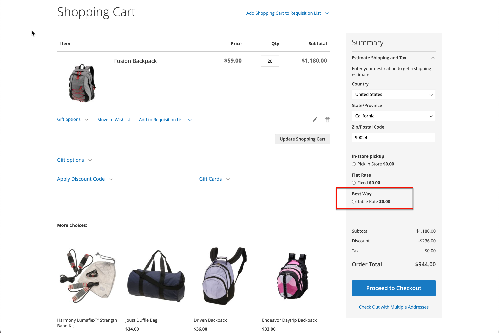

# テーブルの送料率

_表レート_&#x200B;の配送方法は、データの表を参照して、次のような条件の組み合わせに基づいて配送料を計算します。

- 重みv. 宛先
- 価格v. 宛先
- 項目数v. 宛先

例えば、ロサンゼルスに倉庫がある場合、サンディエゴへの配送はバーモント州への配送よりも低コストです。 定額制の送料を利用すれば、割引クーポンを顧客に引き継ぐことができます。

テーブルのレートの計算に使用されるデータは、スプレッドシートで作成され、ストアに読み込まれます。 顧客が見積もりをリクエストすると、ショッピングカートの「配送見積もり」セクションに結果が表示されます。

>[!NOTE]
>
>一度にアクティブにできるテーブル レート データのセットは1つだけです。

{width="700" zoomable="yes"}

## 手順1: デフォルト設定の完了

最初の手順は、表レートのデフォルト設定を完了することです。 設定の範囲を変更しなくても、この手順を完了できます。

1. _管理者_ サイドバーで、**[!UICONTROL Stores]** > _[!UICONTROL Settings]_>**[!UICONTROL Configuration]**に移動します。

1. 左側のパネルの&#x200B;_[!UICONTROL Sales]_セクションで、**[!UICONTROL Delivery Methods]**を選択します。

1. **[!UICONTROL Table Rates]** セクションのを展開します。

   >[!NOTE]
   >
   >必要に応じて、まず&#x200B;**[!UICONTROL Use system value]** チェックボックスをオフにして、説明に従って次の設定を変更します。

   {width="600" zoomable="yes"}

1. **[!UICONTROL Enabled]**&#x200B;を`Yes`に設定します。

1. チェックアウト時に表レート セクションに表示する&#x200B;**[!UICONTROL Title]**&#x200B;を入力します。

   既定のタイトルは`Best Way`です。

1. ショッピングカートの計算レートの横にラベルとして表示する&#x200B;**[!UICONTROL Method Name]**&#x200B;を入力します。

1. **[!UICONTROL Condition]**&#x200B;を次のいずれかの計算方法に設定します。

   - `Weight v. Destination`
   - `Price v. Destination`
   - `Number of Items v. Destination`

1. バーチャル製品を含む注文の場合、計算にバーチャル製品を含めたい場合は、**[!UICONTROL Include Virtual Products in Price Calculation]**&#x200B;を`Yes`に設定します。

   >[!NOTE]
   >
   >サービスなどのバーチャル製品には重みがないので、重みvに基づく計算の結果を変更できません。 配信先の条件： ただし、バーチャル製品は、価格vに基づく計算の結果を変更できます。 宛先または項目数と宛先条件の比較。

1. 要件に応じて処理手数料オプションを設定します。

   処理手数料はオプションで、送料に追加される追加料金として表示されます。 処理手数料を含める場合は、次の操作を行います。

   - **[!UICONTROL Calculate Handling Fee]**&#x200B;を設定：

      - `Fixed`
      - `Percent`

   - 手数料の計算に使用した方法に従って、**[!UICONTROL Handling Fee]** レートを入力します。

     例えば、料金が固定料金に基づいている場合は、金額を小数（`4.90`）で入力します。 ただし、手数料が注文の割合に基づいている場合は、金額を割合で入力します。 例えば、注文の6%を請求する場合は、値を`.06`と入力します。

1. 必要に応じて、**[!UICONTROL Displayed Error Message]**&#x200B;を変更します。

   このテキストボックスにはデフォルトのメッセージがプリセットされていますが、この配信方法が使用できなくなった場合に表示する別のメッセージを入力できます。

1. **[!UICONTROL Ship to Applicable Countries]**&#x200B;を設定：

   - `All Allowed Countries` - ストア設定で指定されたすべての[国](../getting-started/store-details.md#country-options)のお客様は、この配信方法を使用できます。
   - `Specific Countries` – このオプションを選択すると、_[!UICONTROL Ship to Specific Countries]_リストが表示されます。 この配信方法を使用できるリストの各国を選択します。

1. テーブルのレートを常に表示する場合は、**[!UICONTROL Show Method if Not Applicable]**&#x200B;を`Yes`に設定します

1. **[!UICONTROL Sort Order]**&#x200B;に数値を入力して、チェックアウト時に他の配送方法と共にリストされる場合に表レート出荷が表示される順序を決定します。

   `0` = first、`1` = second、`2` = thirdなど。

1. **[!UICONTROL Save Config]**&#x200B;をクリックします。

## 手順2：表レート・データの準備

1. 左上隅で、**[!UICONTROL Store View]**&#x200B;を`Main Website`に設定するか、設定が適用されるその他のweb サイトに設定します。

   >[!NOTE]
   >
   >必要に応じて、最初に&#x200B;**[!UICONTROL Use system value]** チェックボックスの選択を解除し、説明に従って次の設定を変更します。

1. 必要に応じて&#x200B;**[!UICONTROL Condition]**&#x200B;を変更します。

1. **[!UICONTROL Export CSV]**&#x200B;をクリックします。

   {width="700" zoomable="yes"}

1. `tablerates.csv` ファイルをシステムに保存します。

1. スプレッドシート アプリケーションでファイルを開きます。

1. 出荷計算条件に適した値でテーブルを完成させます。

   - アスタリスク（*）は、任意のカテゴリのすべての可能な値を表すワイルドカードとして使用します。
   - _[!UICONTROL Country]_列には、各行に[有効な3文字のコード ](https://en.wikipedia.org/wiki/ISO_3166-1_alpha-3)が含まれている必要があります。
   - 特定の場所がリストの上部、ワイルドカードの場所が下部になるように、データを&#x200B;_[!UICONTROL Region/State]_で並べ替えます。 このメソッドを使用すると、まず絶対値を持つルールが処理され、後でワイルドカード値が処理されます。
   - 郵便番号の範囲はサポートされていません。 アスタリスク （*）を使用して、地域/状態内のすべてのコードを許可するか、_[!UICONTROL Zip/Postal Code]_列の特定の場所に単一のコードを指定します。
   - _[!UICONTROL Weight (and above)]_列の値には、最大4つの小数点以下桁（`2.5075`など）を指定できます。 データ内で小数点以下桁を使用すると、読み込みが失敗します。

   {width="500"}

1. `tablerates.csv` ファイルを保存します。

## 手順3：表レート データのインポート

1. ストア設定の&#x200B;**[!UICONTROL Table Rates]** セクションに戻ります。

1. 左上隅で、この方法を使用するweb サイトに&#x200B;**[!UICONTROL Store View]**&#x200B;を設定します。

1. **[!UICONTROL Import]**&#x200B;の場合、**[!UICONTROL Choose File]**&#x200B;をクリックし、完了済みの`tablerates.csv` ファイルを選択して、料金を読み込みます。

   {width="600" zoomable="yes"}

1. **[!UICONTROL Save Config]**&#x200B;をクリックします。

## 手順4：料金の確認

表の料金データが正しいことを確認するには、複数の異なる住所で支払いプロセスを進め、送料と手数料が正しく計算されていることを確認します。

### 例1：価格と目的地

この例では、価格vを使用しています。 宛先の条件は、米国大陸、アラスカ、ハワイの注文小計の金額に基づいて、3つの異なる配送料のセットを作成します。 アスタリスク（*）は、すべての値を表すワイルドカードです。

| 国 | 地域/州 | 郵便番号 | ORDER SUBTOTAL （以降） | 送料 |
|--- |--- |--- |--- |--- |
| USA | こんにちは | * | 100 | 10 |
| USA | こんにちは | * | 50 | 15 |
| USA | こんにちは | * | 0 | 20 |
| USA | AK | * | 100 | 10 |
| USA | AK | * | 50 | 15 |
| USA | AK | * | 0 | 20 |
| USA | * | * | 100 | 5 |
| USA | * | * | 50 | 10 |
| USA | * | * | 0 | 15 |

{style="table-layout:auto"}

### 例2：重みと目的地

この例では、Weight vを使用しています。 宛先条件：注文の重さに基づいて異なる配送料を作成します。

| 国 | 地域/州 | 郵便番号 | 重み付け（および上） | 送料 |
|--- |--- |--- |--- |--- |
| AUS | NT | * | 9 | 39.95 |
| AUS | NT | * | 0 | 19.95 |
| AUS | VIC | * | 9 | 19.95 |
| AUS | VIC | * | 0 | 5.95 |
| AUS | WA | * | 9 | 39.95 |
| AUS | WA | * | 0 | 19.95 |
| AUS | * | * | 9 | 29.95 |
| AUS | * | * | 0 | 9.95 |

{style="table-layout:auto"}

### 例3：米国本土への送料無料を制限する

1. 送料無料を提供する状態のすべての宛先を含む`tablerates.csv` ファイルを作成します。

1. 以下の設定で表レート設定を完了します。

   | 設定 | 値 |
   |----------|-------|
   | [!UICONTROL Condition] | `Price v. Destination` |
   | [!UICONTROL Method Name] | `Free Shipping` |
   | [!UICONTROL Ship to Applicable Countries] | `Specific Countries` |
   | [!UICONTROL Ship to Specific Countries] | `Select only United States` |
   | [!UICONTROL Show method if not applicable] | `No` |

   {style="table-layout:auto"}

1. 左上隅で、**[!UICONTROL Store View]**&#x200B;を`Main Website`に設定するか、設定が適用されるその他のweb サイトに設定します。

1. **[!UICONTROL Import]**&#x200B;の場合、**[!UICONTROL Choose File]**&#x200B;をクリックし、完了済みの`tablerates.csv` ファイルを選択して、料金を読み込みます。
