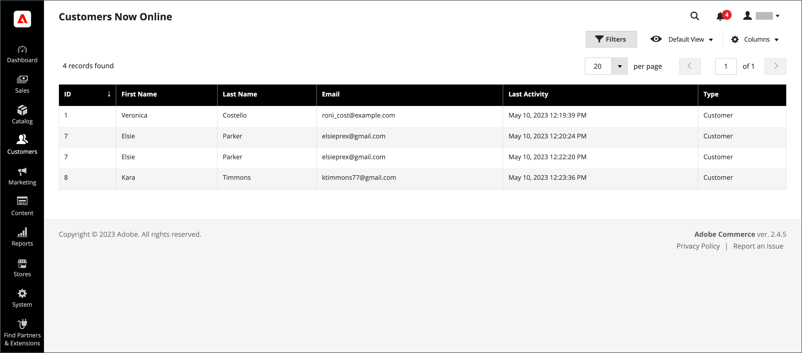
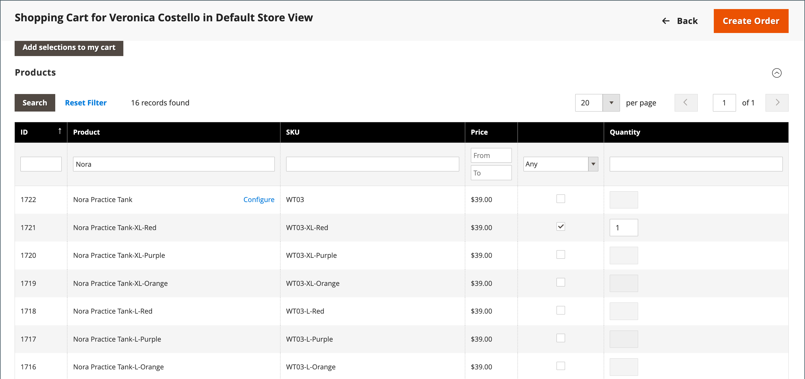
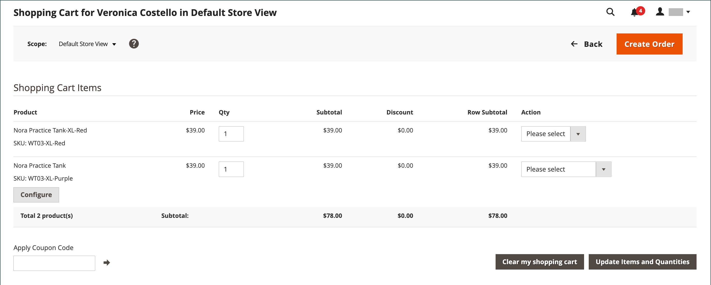
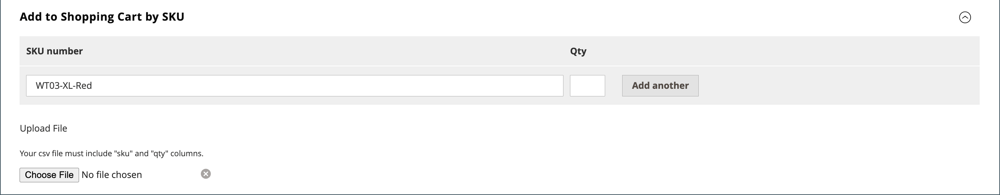
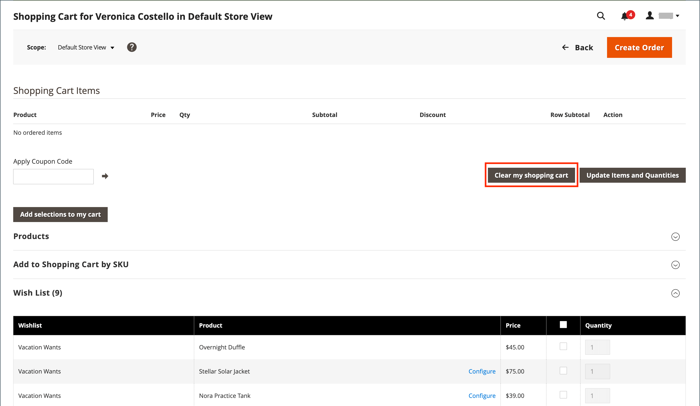

# ショッピングカートの管理

{{ee-feature}}

支援ショッピングセッションを開始するには、顧客がストアフロントからアカウントにログインして情報を利用可能にする必要があります。 お客様がアカウントを持っていない場合は、[ アカウントを作成できます](../customers/account-create.md)。

{width="600" zoomable="yes"}

## アクション制御

| オプション | 説明 |
|--- |--- |
| [!UICONTROL Remove] | 現在のショッピングカートからアイテムを削除します |
| [!UICONTROL Move to Wish List] | 項目を選択した顧客ウィッシュリストに移動 |

{style="table-layout:auto"}

## コントロールボタン

| ボタン | 説明 |
|--- |--- |
| [!UICONTROL Clear my shopping cart] | 買い物かごからすべての項目を削除します。 |
| [!UICONTROL Update Items and Quantities|]必要な数量を&#x200B;**[!UICONTROL Qty]** フィールドに入力し、カート内の項目数を更新します。 |
| [!UICONTROL Add selections to my cart] | すべてのセクションの商品をカートに追加します。 |

{style="table-layout:auto"}

## お客様がログインしていることを確認します

1. _管理者_ サイドバーで、**[!UICONTROL Customers]** > **[!UICONTROL Now Online]**&#x200B;に移動します。

   ストアへの訪問者とログインした顧客はすべてリストに表示されます。

   {width="700" zoomable="yes"}

## ショッピング支援

1. _管理者_ サイドバーで、**[!UICONTROL Customers]** > **[!UICONTROL All Customers]**&#x200B;に移動します。

1. リストで、顧客レコードを編集モードで開きます。

   >[!TIP]
   >
   >急いで顧客レコードを検索するには、[ フィルター](../getting-started/admin-grid-controls.md) コントロールを使用します。

   _[!UICONTROL Personal Information]_の下の顧客プロファイルで、_[!UICONTROL Last Logged In]_&#x200B;の日時は、顧客がオンラインであることを示します。

   {width="600" zoomable="yes"}

1. アシスト ショッピング モードに入るには、上部のボタン バーで&#x200B;**[!UICONTROL Manage Shopping Cart]**&#x200B;をクリックします。

   {width="600" zoomable="yes"}

## 商品を属性ごとにカートに追加

1. **[!UICONTROL Products]** セクションのを展開します。

1. 各列の上部にあるフィルターを使用して、製品を検索します。

1. **[!UICONTROL Search]**&#x200B;をクリックします。

1. 製品タイプに応じて、次のいずれかの一連の手順を実行します。

### シンプルな商品を追加

1. 注文したい商品をクリックします。

   このアクションは、レコードを選択し、**[!UICONTROL Quantity]**&#x200B;を既定値`1`に設定します。

1. 必要に応じて、注文数量を更新します。

1. グリッドの上の左側で、**[!UICONTROL Add selections to my cart]**&#x200B;をクリックします。

   {width="600" zoomable="yes"}

   ページの上部にあるショッピングカートに行項目が追加されます。

   {width="600" zoomable="yes"}

### 設定を使用した製品の追加

買い物かごに追加する前に設定する必要がある製品には、`Bundle Product`、`Configurable Product`、`Grouped Product`の3つのタイプがあります。

1. グリッドで、製品名の横にある&#x200B;**[!UICONTROL Configure]**&#x200B;をクリックします。

   {width="600" zoomable="yes"}

1. _関連製品_ ダイアログで、注文する品目を説明する各製品オプションを選択し、**[!UICONTROL Quantity]**&#x200B;を入力して、**[!UICONTROL OK]**&#x200B;をクリックします。

   商品がチェックマークで選択され、注文数量がグリッドに表示されます。

1. 商品をカートに追加するには、**[!UICONTROL Add selections to my cart]**&#x200B;をクリックします。

   {width="600" zoomable="yes"}

1. 必要に応じて、カート内の商品オプションを更新します。

   - **[!UICONTROL Configure]**&#x200B;をクリックします。

   - オプションを更新し、**[!UICONTROL OK]**&#x200B;をクリックします。

## SKUで製品を追加

1. **[!UICONTROL Add to Shopping Cart by SKU]** セクションのを展開します。

1. **[!UICONTROL SKU]**&#x200B;ごとに製品を個別に追加するか、CSV ファイルをアップロードして製品を追加します。

### SKUごとに項目を個別に追加

1. 注文するアイテムの&#x200B;**[!UICONTROL SKU]**&#x200B;と&#x200B;**[!UICONTROL Qty]**&#x200B;を入力します。

1. 別の商品を注文するには、**[!UICONTROL Add another]**&#x200B;をクリックします。

   {width="600" zoomable="yes"}による製品の追加

1. **[!UICONTROL Add selections to my cart]**&#x200B;をクリックします。

1. 項目が設定可能な製品の場合は、プロンプトが表示されたら製品オプションを選択し、**[!UICONTROL Add to Shopping Cart]**&#x200B;をクリックします。

### CSV ファイルをアップロードして製品を追加する

1. [csv ファイル ](../systems/data-csv.md)を、買い物かごに追加するアイテムと共に準備します。

   ファイルには、ヘッダーに`sku`と`qty`を含む2つの列のみを含める必要があります。

1. 準備したファイルをアップロードします。

   - **[!UICONTROL Choose File]**&#x200B;をクリックします。

   - ディレクトリからアップロードするファイルを選択します。

## 項目の転送

顧客のウィッシュリストから商品をカートに転送し、最近閲覧した商品、比較した商品、注文した商品を関連付けることができます。 各セクションの項目数は、セクションのヘッダーの後ろに括弧内に表示されます。

1. 次のいずれかのセクションでを展開します。

   - [!UICONTROL Wish List]
   - [!UICONTROL Products in the Comparison List]
   - [!UICONTROL Recently Compared Products]
   - [!UICONTROL Recently Viewed Products]
   - [!UICONTROL Last Ordered Items]

1. グリッドで、注文する各商品を選択し、**[!UICONTROL Quantity]**&#x200B;を入力します。

1. 設定可能な製品のオプションを入力するには、**[!UICONTROL Configure]**&#x200B;をクリックし、必要に応じて製品オプションを設定します。

1. **[!UICONTROL Add selections to my cart]**&#x200B;をクリックします。

1. 利用可能な場合は、1つ以上のクーポンコードを適用します。

   - **[!UICONTROL Apply Coupon Code]**&#x200B;の場合、有効なクーポンコードを入力してください。

   - _適用_ （）矢印をクリックします。

1. 必要に応じて注文数量を調整します。

   - 調整する製品の&#x200B;**[!UICONTROL Qty]**&#x200B;列に、正しい金額を入力します。

   - **[!UICONTROL Update Items and Quantities]**&#x200B;をクリックします。

## 注文の作成

1. **[!UICONTROL Create Order]**&#x200B;をクリックします。

   _[!UICONTROL Create New Order]_ページには、買い物かごの商品が表示され、その後に配送情報と支払い情報が表示されます。

1. 発送と支払いに関する情報を入力します。

1. **[!UICONTROL Submit Order]**&#x200B;をクリックします。

詳細については、[注文の作成](customer-account-create-order.md)を参照してください。

## 買い物かごからすべてのアイテムを削除

顧客が買い物かごから商品をすべて削除する支援ショッピングモードは、顧客がやり直したい場合、誤った商品を追加した場合、または新しい注文を行う前にカートをクリアする必要がある場合に役立ちます。 これにより、顧客が実際に購入したい商品のみがカートに入るようにできます。

1. _管理者_ サイドバーで、**[!UICONTROL Customers]** > **[!UICONTROL All Customers]**&#x200B;に移動します。

1. リストで、顧客レコードを編集モードで開きます。

1. 上部のボタンバーで「**[!UICONTROL Manage Shopping Cart]**」をクリックします。

1. **[!UICONTROL Clear my shopping cart]**&#x200B;をクリックします。

   {width="600" zoomable="yes"}

1. アクションの確認を求めるメッセージが表示されたら、**[!UICONTROL OK]**&#x200B;をクリックします。
