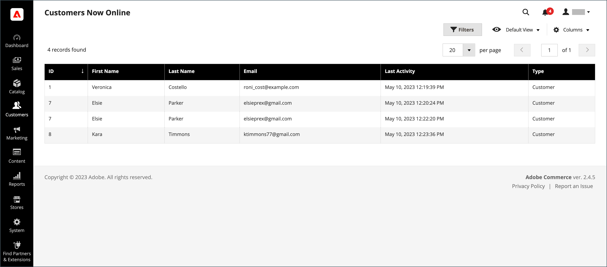

# 買い物かごの管理

{{ee-feature}}

アシステッドショッピングセッションを開始するには、顧客が情報を利用できるように、ストアフロントから自分のアカウントにログインする必要があります。 顧客がアカウントを持っていない場合は、 [1 つを作成](../customers/account-create.md).

{width="600" zoomable="yes"}

## アクションコントロール

| オプション | 説明 |
|--- |--- |
| [!UICONTROL Remove] | 現在の買い物かごから品目を削除 |
| [!UICONTROL Move to Wish List] | 選択した顧客ウィッシュリストに項目を移動します |

{style="table-layout:auto"}

## コントロールボタン

| ボタン | 説明 |
|--- |--- |
| [!UICONTROL Clear my shopping cart] | すべての製品から現在の買い物かごをクリアします。 |
| [!UICONTROL Update Items and Quantities|]必要な数量を **[!UICONTROL Qty]** 」フィールドに入力し、買い物かご内の項目数を更新します。 |
| [!UICONTROL Add selections to my cart] | すべてのセクションから買い物かごに製品を追加します。 |

{style="table-layout:auto"}

## 顧客がログインしていることを確認します。

1. 次の日： _管理者_ サイドバー、移動 **[!UICONTROL Customers]** > **[!UICONTROL Now Online]**.

   ストアおよびログイン済みの顧客へのすべての訪問者がリストに表示されます。

   {width="700" zoomable="yes"}

## 買い物支援を提供する

1. 次の日： _管理者_ サイドバー、移動 **[!UICONTROL Customers]** > **[!UICONTROL All Customers]**.

1. リストで、顧客レコードを編集モードで開きます。

   >[!TIP]
   >
   >顧客レコードを急いで見つけるには、 [フィルター](../getting-started/admin-grid-controls.md) コントロール。

   の顧客プロファイルで、 _[!UICONTROL Personal Information]_、_[!UICONTROL Last Logged In]_ 日時は、顧客がオンラインであることを示します。

   {width="600" zoomable="yes"}

1. アシステッドショッピングモードに入るには、 **[!UICONTROL Manage Shopping Cart]** をクリックします。

   {width="600" zoomable="yes"}

## 製品を属性別に買い物かごに追加

1. 展開  の **[!UICONTROL Products]** 」セクションに入力します。

1. 各列の上部にある任意のフィルターを使用して、製品を検索します。

1. クリック **[!UICONTROL Search]**.

1. 製品タイプに応じて、次の一連の手順のいずれかを使用します。

### シンプルな製品を追加

1. 注文する製品をクリックします。

   この操作により、レコードとセットが選択されます **[!UICONTROL Quantity]** のデフォルト値に `1`.

1. 必要に応じて、注文された数量を更新します。

1. グリッドの上の左側で、 **[!UICONTROL Add selections to my cart]**.

   {width="600" zoomable="yes"}

   行項目がページの上部にある買い物かごに追加されます。

   {width="600" zoomable="yes"}

### 設定を使用して製品を追加

買い物かごに追加する前に設定する必要がある製品には、次の 3 種類があります。 `Bundle Product`, `Configurable Product`、および `Grouped Product`.

1. グリッドで、 **[!UICONTROL Configure]** 製品名の横に表示されます。

   {width="600" zoomable="yes"}

1. Adobe Analytics の _関連製品_ ダイアログで、注文する品目を説明する各製品オプションを選択し、 **[!UICONTROL Quantity]**&#x200B;をクリックし、 **[!UICONTROL OK]**.

   商品がチェックマーク付きで選択され、注文された数量がグリッドに表示されます。

1. 製品を買い物かごに追加するには、 **[!UICONTROL Add selections to my cart]**.

   {width="600" zoomable="yes"}

1. 必要に応じて、買い物かご内の製品オプションを更新します。

   - クリック **[!UICONTROL Configure]**.

   - オプションを更新し、「 **[!UICONTROL OK]**.

## SKU 別に製品を追加

1. 展開  の **[!UICONTROL Add to Shopping Cart by SKU]** 」セクションに入力します。

1. 次の項目別に製品を個別に追加 **[!UICONTROL SKU]** または、CSV ファイルをアップロードして製品を追加します。

### 品目を SKU 別に個別に追加

1. 次を入力します。 **[!UICONTROL SKU]** および **[!UICONTROL Qty]** の値を指定します。

1. 別の製品を注文するには、 **[!UICONTROL Add another]**.

   {width="600" zoomable="yes"}

1. クリック **[!UICONTROL Add selections to my cart]**.

1. 項目が設定可能な製品の場合は、要求に応じて製品オプションを選択し、「 **[!UICONTROL Add to Shopping Cart]**.

### CSV ファイルのアップロードによる製品の追加

1. の準備 [csv ファイル](../systems/data-csv.md) と、買い物かごに追加される項目が含まれます。

   ファイルには 2 つの列のみを含める必要があり、 `sku` および `qty` 」と入力します。

1. 準備済みファイルをアップロードします。

   - クリック **[!UICONTROL Choose File]**.

   - アップロードするファイルをディレクトリから選択します。

## 項目の転送

顧客のウィッシュリストから買い物かごに品目を転送したり、最近表示、比較または注文された品目を転送したりできます。 各セクションの項目数は、セクションヘッダーの後の括弧内に表示されます。

1. 展開  次のセクションの 1 つ。

   - [!UICONTROL Wish List]
   - [!UICONTROL Products in the Comparison List]
   - [!UICONTROL Recently Compared Products]
   - [!UICONTROL Recently Viewed Products]
   - [!UICONTROL Last Ordered Items]

1. グリッドで、オーダーする各製品を選択し、 **[!UICONTROL Quantity]**.

1. 設定可能な製品のオプションを入力するには、 **[!UICONTROL Configure]** 必要に応じて、製品オプションを設定します。

1. クリック **[!UICONTROL Add selections to my cart]**.

1. クーポンコードを適用できる場合は、次の手順に従います。

   - の場合 **[!UICONTROL Apply Coupon Code]**、有効なクーポンコードを入力します。

   - 次をクリック： _適用_ (  ) 矢印をクリックします。

1. 必要に応じて、オーダーされた数量を調整します。

   - Adobe Analytics の **[!UICONTROL Qty]** 調整する製品の列に、正しい金額を入力します。

   - クリック **[!UICONTROL Update Items and Quantities]**.

## オーダーを作成

1. クリック **[!UICONTROL Create Order]**.

   The _[!UICONTROL Create New Order]_ページには、買い物かご内の品目が表示され、その後に配送先および支払い先の情報が表示されます。

1. 送料と支払い情報を入力します。

1. クリック **[!UICONTROL Submit Order]**.

詳しくは、 [オーダーの作成](customer-account-create-order.md).
