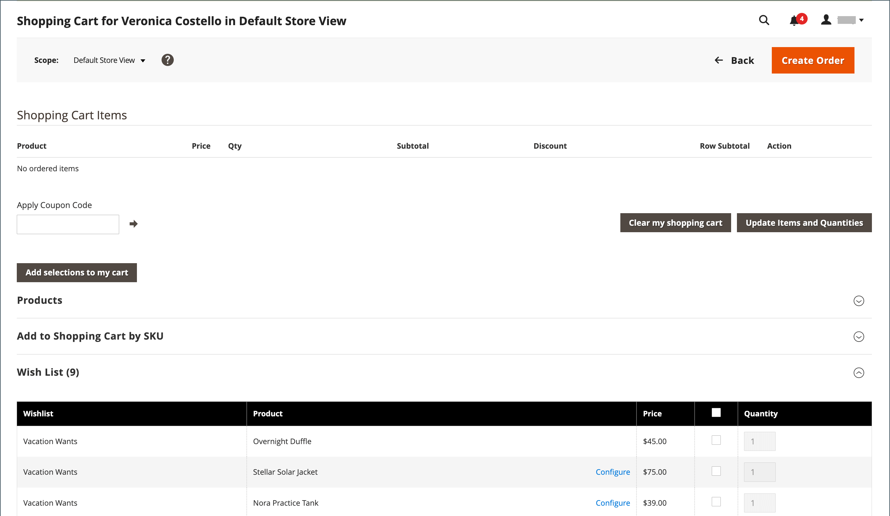

# 買い物かごの管理

{{ee-feature}}

アシストショッピングセッションを開始するには、顧客がストアフロントからアカウントにログインして、情報を利用できるようにする必要があります。 顧客がアカウントを持っていない場合は、[ アカウントを作成 ](../customers/account-create.md) できます。

{width="600" zoomable="yes"}

## アクション制御

| オプション | 説明 |
|--- |--- |
| [!UICONTROL Remove] | 現在の買い物かごからアイテムを削除します |
| [!UICONTROL Move to Wish List] | 選択された顧客ウィッシュリストに項目を移動 |

{style="table-layout:auto"}

## コントロールボタン

| ボタン | 説明 |
|--- |--- |
| [!UICONTROL Clear my shopping cart] | 現在の買い物かごをすべての商品からクリアします。 |
| [!UICONTROL Update Items and Quantities|] 「**[!UICONTROL Qty]**」フィールドに必要数量を入力し、カート内の品目数を更新します。 |
| [!UICONTROL Add selections to my cart] | すべてのセクションから買い物かごに商品を追加します。 |

{style="table-layout:auto"}

## ユーザーがログインしていることを確認

1. _管理者_ サイドバーで、**[!UICONTROL Customers]**/**[!UICONTROL Now Online]** に移動します。

   ストアに訪問し、ログインした顧客のすべての訪問者がリストに表示されます。

   {width="700" zoomable="yes"}

## オファー支援ショッピング

1. _管理者_ サイドバーで、**[!UICONTROL Customers]**/**[!UICONTROL All Customers]** に移動します。

1. リストで、顧客レコードを編集モードで開きます。

   >[!TIP]
   >
   >顧客レコードを急いで見つけるには、[ フィルター ](../getting-started/admin-grid-controls.md) コントロールを使用します。

   _[!UICONTROL Personal Information]_の顧客プロファイルでは、_[!UICONTROL Last Logged In]_ の日時は顧客がオンラインであることを示します。

   {width="600" zoomable="yes"}

1. アシストショッピングモードに入るには、上部のボタンバーの **[!UICONTROL Manage Shopping Cart]** をクリックします。

   {width="600" zoomable="yes"}

## 製品を属性別に買い物かごに追加

1. 「」を展開し、「**[!UICONTROL Products]**」セクションを展開します。

1. 各列の上部にあるフィルターのいずれかを使用して、製品を検索します。

1. 「**[!UICONTROL Search]**」をクリックします。

1. 製品タイプに応じて、次の一連の手順のいずれかを使用します。

### シンプルな製品を追加

1. 注文する商品をクリックします。

   レコードを選択し、**[!UICONTROL Quantity]** を既定値の `1` に設定します。

1. 必要に応じて、注文数量を更新します。

1. グリッドの上の左側にある [**[!UICONTROL Add selections to my cart]**] をクリックします。

   {width="600" zoomable="yes"}

   行項目がページ上部の買い物かごに追加されます。

   {width="600" zoomable="yes"}

### 設定を使用した製品の追加

買い物かごに追加する前に設定する必要がある製品は、`Bundle Product`、`Configurable Product`、`Grouped Product` の 3 種類です。

1. グリッドで、製品名の横にある「**[!UICONTROL Configure]**」をクリックします。

   {width="600" zoomable="yes"}

1. _関連製品_ ダイアログで、注文する品目を説明する各製品オプションを選択し、**[!UICONTROL Quantity]** を入力して、「**[!UICONTROL OK]**」をクリックします。

   商品がチェックマークと共に選択され、注文数量がグリッドに表示されます。

1. 商品を買い物かごに追加するには、「**[!UICONTROL Add selections to my cart]**」をクリックします。

   {width="600" zoomable="yes"}

1. 必要に応じて、買い物かごの製品オプションを更新します。

   - 「**[!UICONTROL Configure]**」をクリックします。

   - オプションを更新し、「**[!UICONTROL OK]**」をクリックします。

## SKU で製品を追加

1. 「」を展開し、「**[!UICONTROL Add to Shopping Cart by SKU]**」セクションを展開します。

1. **[!UICONTROL SKU]** で製品を個別に追加するか、CSV ファイルをアップロードして製品を追加します。

### SKU 別に個別に項目を追加

1. 注文する品目の **[!UICONTROL SKU]** と **[!UICONTROL Qty]** を入力します。

1. 別の製品を注文するには、[**[!UICONTROL Add another]**] をクリックします。

   {width="600" zoomable="yes"}

1. 「**[!UICONTROL Add selections to my cart]**」をクリックします。

1. 設定可能な製品の場合は、プロンプトが表示されたら製品オプションを選択し、[**[!UICONTROL Add to Shopping Cart]**] をクリックします。

### CSV ファイルをアップロードして製品を追加

1. 買い物かごに追加する項目を含む [csv ファイル ](../systems/data-csv.md) を準備します。

   ファイルには、ヘッダーに `sku` と `qty` を含む 2 列のみを含める必要があります。

1. 準備したファイルをアップロードします。

   - 「**[!UICONTROL Choose File]**」をクリックします。

   - アップロードするファイルをディレクトリから選択します。

## 項目を転送

顧客のウィッシュリストから買い物かごに項目を転送したり、最近表示した項目や比較した項目、注文した項目を転送したりできます。 各セクション内の項目数は、セクション ヘッダーの後の括弧内に表示されます。

1. 次のいずれかのセクションで  を展開します。

   - [!UICONTROL Wish List]
   - [!UICONTROL Products in the Comparison List]
   - [!UICONTROL Recently Compared Products]
   - [!UICONTROL Recently Viewed Products]
   - [!UICONTROL Last Ordered Items]

1. グリッドで、注文する各製品を選択し、**[!UICONTROL Quantity]** を入力します。

1. 設定可能な製品のオプションを入力するには、「**[!UICONTROL Configure]**」をクリックし、必要に応じて製品オプションを設定します。

1. 「**[!UICONTROL Add selections to my cart]**」をクリックします。

1. 利用可能な場合は、1 つ以上のクーポンコードを適用します。

   - **[!UICONTROL Apply Coupon Code]** の場合は、有効なクーポンコードを入力します。

   - _適用_ （）矢印をクリックします。

1. 必要に応じて注文数量を調整します。

   - 調整する製品の「**[!UICONTROL Qty]**」列に、正しい金額を入力します。

   - 「**[!UICONTROL Update Items and Quantities]**」をクリックします。

## オーダーの作成

1. 「**[!UICONTROL Create Order]**」をクリックします。

   _[!UICONTROL Create New Order]_のページには、カート内の商品が表示され、その後に発送情報と支払い情報が表示されます。

1. 配送および支払い情報を入力します。

1. 「**[!UICONTROL Submit Order]**」をクリックします。

詳しくは、[ 注文の作成 ](customer-account-create-order.md) を参照してください。
