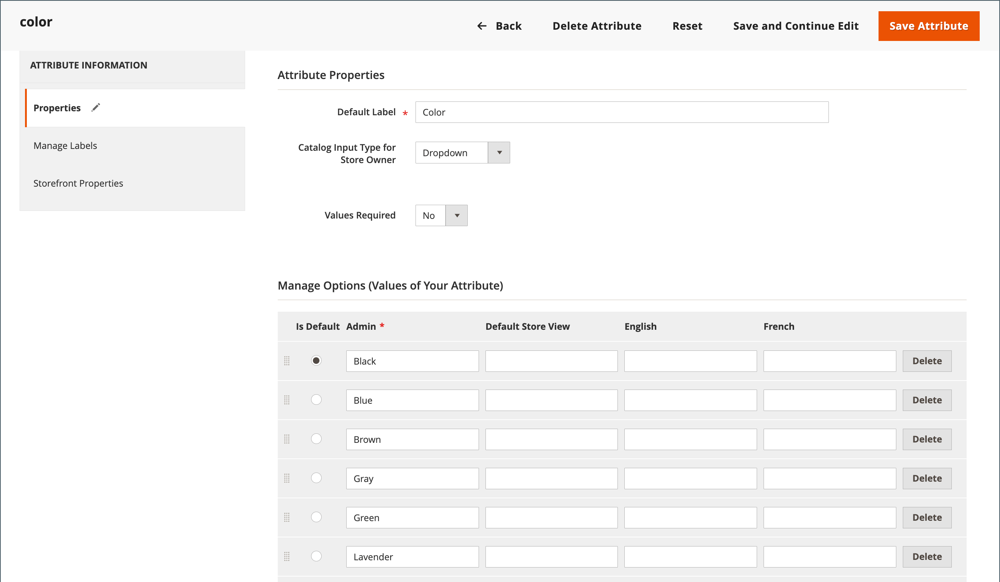

# 店舗のローカライズ

ストア全体のページでハードコーディングされているように見えるテキストのほとんどは、ビューのロケールを変更することで、即座に別の言語に変更できます。 ロケールを変更しても、実際にはテキストが単語単位で翻訳されるわけではありませんが、ストア全体で使用されるインターフェイス テキストを提供する別の翻訳テーブルを参照するだけです。 変更できるテキストには、_マイカート_&#x200B;や&#x200B;_マイアカウント_&#x200B;などのナビゲーションタイトル、ラベル、ボタン、リンクが含まれます。 [&#x200B; インライン翻訳](../configuration-reference/advanced/developer.md) ツールを使用して、インターフェイス内のテキストを修正することもできます。

言語パックは、Commerce Marketplaceの[翻訳とローカライズ &#x200B;](https://marketplace.magento.com/extensions/content-customizations/translations-localization.html){:target="_blank"}にあります。 新しい拡張機能が継続的にマーケットプレイスに追加されるため、頻繁に確認してください。

## 手順1：言語パックのインストール

言語パック拡張機能のインストールに関する標準的な手順に従います。 拡張機能のインストールについて詳しくは、_拡張機能ガイド_&#x200B;の[一般的なCLI インストール &#x200B;](https://experienceleague.adobe.com/docs/commerce-operations/installation-guide/tutorials/extensions.html)を参照してください。

## 手順2：言語のストアビューを作成する

1. _管理者_ サイドバーで、**[!UICONTROL Stores]** > _[!UICONTROL Settings]_>**[!UICONTROL All Stores]**&#x200B;に移動します。

1. **[!UICONTROL Create Store View]**&#x200B;をクリックします。

1. 新しいストアビューのオプションを設定します。

   - **[!UICONTROL Store]** — ビューの親であるストアを選択します。

   - **[!UICONTROL Name]** — ストアビューの名前を入力します。 例：ポルトガル語。

     ストアのヘッダーに、名前が&#x200B;_言語選択_&#x200B;に表示されます。

   - **[!UICONTROL Code]** — ビューを識別するには、小文字のコードを入力します。 例：`portuguese`。

   - **[!UICONTROL Status]** — ビューをアクティブ化するには、`Enabled`に設定します。

   - **[!UICONTROL Sort Order]** — （オプション）数値を入力して、このビューが他のビューと共にリストされるシーケンスを決定します。

1. 完了したら、**[!UICONTROL Save Store View]**&#x200B;をクリックします。

## 手順3：ストアビューのロケールの変更

1. _管理者_ サイドバーで、**[!UICONTROL Stores]** > _[!UICONTROL Settings]_>**[!UICONTROL Configuration]**&#x200B;に移動します。

1. **[!UICONTROL Scope]** ドロップダウンで、設定するストアビューを選択し、プロンプトが表示されたら「**[!UICONTROL OK]**」をクリックします。

1. *[!UICONTROL General]*&#x200B;設定ページで、**[!UICONTROL Locale Options]** セクションのを展開します。

1. 「**[!UICONTROL Use Website]**」チェックボックスをオフにして、**[!UICONTROL Locale]**&#x200B;をビューに割り当てる言語に設定します。

   言語のバリエーションが複数ある場合は、特定の地域または方言に対応する言語を選択してください。

1. 完了したら、**[!UICONTROL Save Config]**&#x200B;をクリックします。

   ロケールの言語を変更した後、商品名、説明、カテゴリ、[CMS](../content-design/page-translate.md) ページ、ブロックなど、作成した残りのコンテンツは、ストアビューごとに個別に翻訳する必要があります。

## 製品のローカライズ

ストアが異なる言語で複数のビューを持つ場合、各ストアビューで同じ商品を利用できます。 言語に関係なく、SKU、価格、在庫レベルなど、同じ基本製品情報を使用できます。 次に、各言語で必要に応じて、製品名、説明フィールド、メタデータのみを翻訳します。

### ステップ 1：商品フィールドの翻訳

1. _管理者_ サイドバーで、**[!UICONTROL Catalog]** > **[!UICONTROL Products]**&#x200B;に移動します。

1. グリッドで、翻訳する製品を見つけて、編集モードで開きます。

1. 左上隅で、**[!UICONTROL Store View]**&#x200B;を翻訳用のビューに設定し、確認を求められたら&#x200B;**[!UICONTROL OK]**&#x200B;をクリックします。

1. 編集する各フィールドについて、次の操作を行います。

   - フィールドの右側にある「**[!UICONTROL Use Default Value]**」チェックボックスの選択を解除します。

   - 翻訳したテキストをフィールドに貼り付けるか、入力します。

   [画像](../catalog/catalog-images-video.md) ラベルと代替テキスト、[検索エンジン最適化](../catalog/product-search-engine-optimization.md) フィールドと[&#x200B; カスタムオプション &#x200B;](../catalog/settings-advanced-custom-options.md)情報を含む、すべてのテキストフィールドを翻訳してください。

1. 完了したら、**[!UICONTROL Save]**&#x200B;をクリックします。

### 手順2：フィールドラベルの翻訳

1. _管理者_ サイドバーで、**[!UICONTROL Stores]** > _[!UICONTROL Attributes]_>**[!UICONTROL Product]**&#x200B;に移動します。

1. リストで、翻訳する属性を見つけ、編集モードで開きます。

1. 左側のパネルで、**[!UICONTROL Manage Labels]**&#x200B;を選択します。

1. 「_[!UICONTROL Manage Titles]_」セクションで、各ストアビューの翻訳済みラベルを入力します。

   {width="600" zoomable="yes"}

1. 完了したら、**[!UICONTROL Save Attribute]**&#x200B;をクリックします。

### ステップ 3：すべてのカテゴリを翻訳する

1. _管理者_ サイドバーで、**[!UICONTROL Catalog]** > **カテゴリー**&#x200B;に移動します。

1. 左上隅で、**[!UICONTROL Store View]**&#x200B;を翻訳用のビューに設定し、確認を求められたら&#x200B;**[!UICONTROL OK]**&#x200B;をクリックします。

1. ツリーで、翻訳するカテゴリを見つけ、編集モードで開きます。

1. _基本情報_&#x200B;については、**[!UICONTROL Category Name]**&#x200B;を翻訳してください。

1. _[!UICONTROL Content]_&#x200B;セクションのを展開し、**[!UICONTROL Description]**&#x200B;を翻訳します。

1. **[!UICONTROL Search Engine Optimization Settings]** セクションのを展開し、次のフィールドを翻訳します。

   - **[!UICONTROL Meta Title]**
   - **[!UICONTROL Meta Keywords]**
   - **[!UICONTROL Meta Description]**

1. _[!UICONTROL Search Engine Optimization Settings]_&#x200B;セクションで、次の操作を行って&#x200B;**[!UICONTROL URL Key]**&#x200B;を翻訳します。

   - フィールドの右側にある&#x200B;**[!UICONTROL Use Default Value]** チェックボックスをオフにします。

   - 翻訳したテキストを入力します。

   - 「**[!UICONTROL Create Permanent Redirect for old URL]**」チェックボックスが選択されていることを確認します。

   

1. 完了したら、**[!UICONTROL Save Category]**&#x200B;をクリックします。

1. ストアで使用されているすべてのカテゴリに対して、このプロセスを繰り返します。

### ステップ 4：製品属性と属性のオプションを翻訳する

1. _管理者_ サイドバーで、**[!UICONTROL Stores]** > _[!UICONTROL Attributes]_>**[!UICONTROL Product]**&#x200B;に移動します。

1. 翻訳する属性を選択します。

1. 左側の&#x200B;**[!UICONTROL Manage Labels]**&#x200B;を選択し、**[!UICONTROL Managed Titles]** オプションを設定して、属性タイトルの翻訳を定義します。

1. 左側の&#x200B;**[!UICONTROL Properties]**&#x200B;を選択し、**[!UICONTROL Manage Options]** セクションに翻訳済み属性オプションを入力します。

   {width="600" zoomable="yes"}

1. 完了したら、**[!UICONTROL Save Attribute]**&#x200B;をクリックします。
