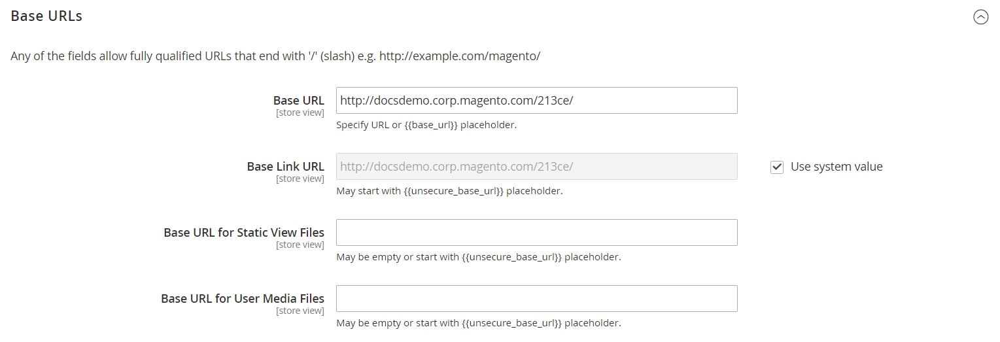
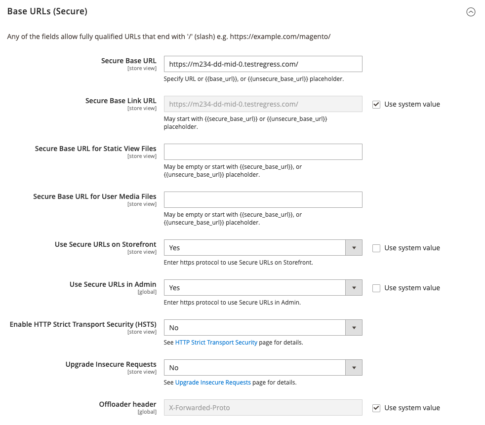
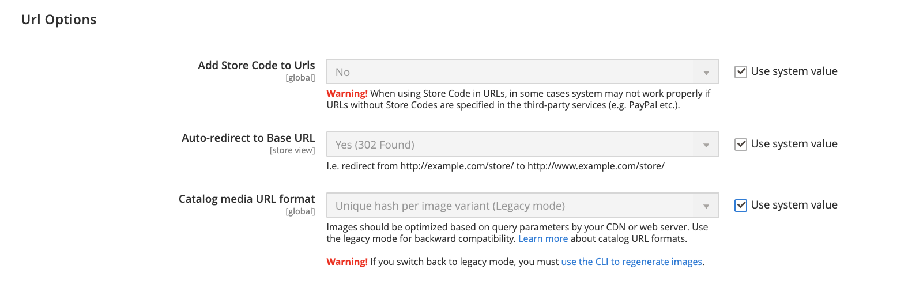
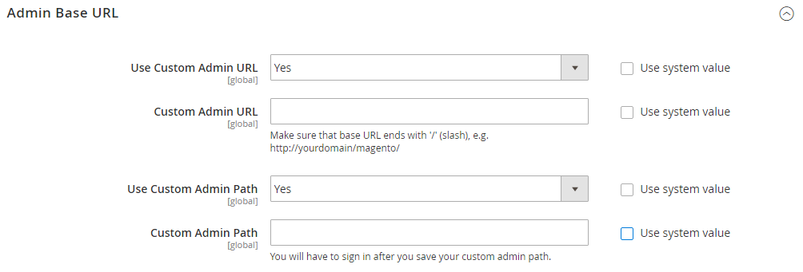

# URLの保存

Adobe CommerceまたはMagento Open Source インストールの各web サイトには、ストアフロントに割り当てられたベース URLと、管理者に割り当てられた別のURLがあります。 Adobeでは、変数を使用してベース URLに関連する内部リンクを定義します。これにより、リンクを更新することなく、ストア全体を1つの場所から別の場所に移動できます。 標準ベース URLは`http`で始まり、セキュアベース URLは`https`で始まります。

- **ベース URL** — `http://www.yourdomain.com/magento/`
- **セキュアベース URL** — `https://www.yourdomain.com/magento/`
- **IP アドレスを持つURL** — `http://###.###.###.###/magento/`または`https://###.###.###.###/magento/`

>[!IMPORTANT]
>
>デフォルトのベース URL設定から管理者URLを変更しないでください。 管理者URLまたはパスを変更するには、[&#x200B; カスタム管理者URLの使用](#use-a-custom-admin-url)を参照してください。

## 安全なプロトコルの使用

ストアのベース URLは、最初にAdobe Commerceのインストール中に設定されました。 セキュリティ証明書が利用可能だった場合は、ストア、管理者、またはその両方に使用する`HTTPS`個のURLを指定できます。 Adobe Commerceのインストールに複数のストアが含まれている場合、または後でさらにストアを追加する場合は、URLにストアコードを含めることができます。 すべてのAdobeのリソースとオペレーションは、セキュアプロトコルで使用できます。

インストール時にドメインのセキュリティ証明書が使用できない場合は、ストアを起動する前に必ず設定を更新してください。 ドメインのセキュリティ証明書を確立した後、暗号化されたSecure Sockets Layer （SSL）および[Transport Layer Security](https://en.wikipedia.org/wiki/Transport_Layer_Security) （TLS） プロトコルで動作するように、ベース URLの一方または両方を設定できます。

>[!IMPORTANT]
>
>Adobeでは、コンテンツや商品を含む実稼動サイトのすべてのページを、安全なプロトコルを使用して転送することを強くお勧めします。

Adobe CommerceとMagento Open Sourceは、デフォルトで`HTTPS`を超えるすべてのページを配信するように設定できます。 ストアが標準プロトコルで動作している場合は、[HTTP Strict Transport Security](https://en.wikipedia.org/wiki/HTTP_Strict_Transport_Security) （HSTS）を有効にし、安全でないページリクエストをアップグレードすることで、セキュリティを向上させることができます。 HSTSは、指定されたドメインの安全でないプロトコルで送信される標準`HTTP` ページのレンダリングをブラウザーが防ぐオプトインプロトコルです。 検索エンジンは、ストアの各ページに標準の`HTTP`URLを既にインデックス付けしている可能性があるので、Commerceを設定して、セキュリティで保護されていないページリクエストを自動的に`HTTPS`にアップグレードできます。これにより、トラフィックが失われることはありません。 Commerceがストアフロントと管理者の両方に安全なURLを使用するように設定されている場合、`HSTS`を有効にするための2つの追加フィールドが表示されます。

## ベース URLの設定

1. _管理者_ サイドバーで、**[!UICONTROL Stores]** > _[!UICONTROL Settings]_>**[!UICONTROL Configuration]**&#x200B;に移動します。

1. 左側のパネルの&#x200B;_一般_&#x200B;で、**[!UICONTROL Web]**&#x200B;を選択します。

1. **[!UICONTROL Base URL]** セクションのを展開します。

   - **[!UICONTROL Base URL]** — ストアの完全修飾ベース URLを入力します。 URLの末尾にはスラッシュを付けて、ストアのURL キーを追加して拡張できるようにします。 例：`http://yourdomain.com/`

     >[!NOTE]
     >
     >_[!UICONTROL Base Link URL]_&#x200B;フィールドのプレースホルダーは変更しないでください。 これは、ベース URLへの相対リンクを作成するために使用されるプレースホルダーです。

   - **[!UICONTROL Base URL for Static View Files]** — （オプション）次のプレースホルダーで始まるパスを入力して、静的ビューファイルのベース URLの代替の場所を指定します。

     \{\{unsecure_base_url\}\}

   - **[!UICONTROL Base URL for User Media Files]** — （オプション）次のプレースホルダーで始まるパスを入力して、ユーザーメディアファイルのベース URLの代替の場所を指定します。

     \{\{unsecure_base_url\}\}

     通常のインストールでは、静的ビューファイルまたはメディアファイルのパスはベース URLに関連しているため、更新する必要はありません。

   {width="600" zoomable="yes"}

   >[!NOTE]
   >
   >二重括弧で囲まれたプレースホルダーは、変数のマークアップタグです。

1. 完了したら、**[!UICONTROL Save Config]**&#x200B;をクリックします。

## セキュアベース URLの設定

ドメインに有効なセキュリティ証明書がある場合は、ストアフロントと管理者の両方のURLを設定して、セキュア（https）チャネル経由でデータを送信できます。 有効なセキュリティ証明書がなければ、ストアはセキュア（SSL/TLS）プロトコルで動作できません。

1. _[!UICONTROL Base URLs (Secure]）_ セクションのを展開し、次の操作を行います。

   {width="600" zoomable="yes"}

   - **[!UICONTROL Secure Base URL]** – 完全なセキュアベース URLの後にフォワードスラッシュを入力します。 例：`https://yourdomain.com/`

   - **[!UICONTROL Secure Base Link URL]** — セキュアベースリンク URL フィールドのプレースホルダーを変更しないでください。 これは、セキュアなベース URLへの相対リンクを作成するために使用されます。

   - **[!UICONTROL Secure Base URL for Static View Files]** — （オプション）次のプレースホルダーで始まるパスを入力して、静的ビューファイルのセキュアベース URLの代替場所を指定します。

     \{\{secure_base_url\}\}

   - **[!UICONTROL Secure Base URL for User Media Files]** — （オプション）次のプレースホルダーで始まるパスを入力して、ユーザーメディアファイルのセキュアベース URLの代替場所を指定します。

     \{\{secure_base_url\}\}

1. セキュリティを強化するには、次の両方のオプションを`Yes`に設定します。

   - **[!UICONTROL Use Secure URLs on Storefront]**
   - **[!UICONTROL Use Secure URLs in Admin]**

1. _[!UICONTROL Enhanced Security Settings]_&#x200B;に対して、次の操作を行います。

   - **[!UICONTROL Enable HTTP Strict Transport Security (HSTS)]** — ストアでセキュアなHTTPS ページリクエストのみを表示する場合は、`Yes`に設定します。

   - **[!UICONTROL Upgrade Insecure Requests]** – 標準の保護されていないHTTP ページの要求をアップグレードしてHTTPSを保護するには、`Yes`に設定します。

1. サーバーの&#x200B;**[!UICONTROL Offloader Header]**&#x200B;を設定します。

   ほとんどのCommerce インストールでは、デフォルトの`X-Forward-Proto`を使用して、プロトコルを`HTTP`または`HTTPS`として識別します。 サーバー設定で別のoffloader_headerを使用している場合は、ここに入力します。

1. 完了したら、**[!UICONTROL Save Config]**&#x200B;をクリックします。

## URLにストアコードを含める

>[!NOTE]
>
>「_ストアコードをURLに追加_」オプションが`Yes`に設定されている場合は、ストアコードをブラウザーのURLに含める必要があります。 この設定により、URLの書き換えが正しくマッピングされ、すべてのページが正常に開かれ、_&quot;404 Page Not Found&quot;_ エラーが発生しないようにします。

1. _管理者_ サイドバーで、**[!UICONTROL Stores]** > _[!UICONTROL Settings]_>**[!UICONTROL Configuration]**&#x200B;に移動します。

1. 左側のパネルの&#x200B;_[!UICONTROL General]_&#x200B;で、**[!UICONTROL Web]**&#x200B;を選択します。

1. **[!UICONTROL URL Options]** セクションのを展開します。

1. **[!UICONTROL Add Store Code]**&#x200B;を環境設定に設定：

   - **[!UICONTROL URL with Store Code]**: `http://www.yourdomain.com/magento/[store-code]/index.php/url-identifier`
   - **[!UICONTROL URL without Store Code]**: `http://www.yourdomain.com/magento/index.php/url-identifier`

   {width="600" zoomable="yes"}

1. 完了したら、**[!UICONTROL Save Config]**&#x200B;をクリックします。

1. ワークスペースの上部にあるメッセージの&#x200B;**[!UICONTROL Cache Management]** リンクをクリックします。 次に、指示に従ってキャッシュを更新します。

   

## URL トラブルシューティング

設定手順に従った後も、一部のページが安全でないURL （`http://`）で引き続き提供される場合は、次の操作を行います。

- （セキュアでない）ベース URLをセキュア HTTPS URLに変更します。
- サーバーで、`.htaccess` ファイル （またはロードバランサー）を編集して、安全でないURLを安全なURLにリダイレクトします。

## カスタム管理者URLの使用

[&#x200B; セキュリティのベストプラクティス &#x200B;](https://experienceleague.adobe.com/docs/commerce-operations/implementation-playbook/best-practices/launch/security-best-practices.html)として、Adobeでは、デフォルトの&#x200B;_管理者_&#x200B;や&#x200B;_バックエンド_&#x200B;などの一般的な用語の代わりに、一意の管理者URLを使用することをお勧めします。 特定の不正なアクターからサイトを直接保護するわけではありませんが、不正アクセスを試みるスクリプトへの暴露を減らすことができます。

>[!NOTE]
>
>カスタム管理者URLを実装する前に、ホスティングプロバイダーを確認してください。 一部のホスティングプロバイダーでは、ファイアウォール保護ルールを満たすために標準的なURLが必要です。

通常のインストールでは、管理者URLとパスは直ちにベース URLに従います。 管理者パスは、ルートの下の1つのディレクトリです。

- **既定のベース URL**: `http://yourdomain.com/magento/`
- **既定の管理者パス**: `admin`
- **既定の管理者URLとパス**: `http://yourdomain.com/magento/admin`

管理者のURLとパスを別の場所に変更することは可能ですが、誤りがあると管理者へのアクセスが削除され、サーバーから修正する必要があります。

>[!NOTE]
>
>予防策として、サーバー上の設定ファイルの編集方法を把握していない限り、自分で管理者URLを変更しないでください。 クラウドインフラストラクチャにデプロイされたAdobe Commerce プロジェクトの場合は、*Adobe Commerce Cloud Infrastructure ガイド*&#x200B;の[手順](https://experienceleague.adobe.com/docs/commerce-cloud-service/user-guide/configure/env/stage/variables-admin.html#admin-url)に従って、管理者URLを変更します。

### 方法1：管理者からの変更

1. _管理者_ サイドバーで、**[!UICONTROL Stores]** > _[!UICONTROL Settings]_>**[!UICONTROL Configuration]**&#x200B;に移動します。

1. 左側のパネルで、**[!UICONTROL Advanced]**&#x200B;を展開し、**[!UICONTROL Admin]**&#x200B;を選択します。

1. **[!UICONTROL Admin Base URL]** セクションのを展開します。

1. カスタム URLの設定オプションを設定します。

   {width="600" zoomable="yes"}

   必要に応じて、**[!UICONTROL Use system value]** チェックボックスをオフにして、設定を変更します。

   - **[!UICONTROL Use Custom Admin URL]**&#x200B;を`Yes`に設定します。

   - **[!UICONTROL Custom Admin URL]**&#x200B;を入力：`http://yourdomain.com/magento/`

     >[!NOTE]
     >
     >管理者URLは、同じCommerce インストール内に存在し、ストアフロントと同じドキュメントルートを持つ必要があります。

   - **[!UICONTROL Custom Admin Path]**&#x200B;を`Yes`に設定します。

   - **[!UICONTROL Custom Admin Path]**&#x200B;に、カスタム管理フォルダー名として使用するパスを入力します。

     例：`sample_custom_admin`

1. 完了したら、**[!UICONTROL Save Config]**&#x200B;をクリックします。

1. 変更が保存されたら、管理者からログアウトし、新しい管理者URLとパスを使用して再度ログインします。

### 方法2：サーバーのコマンドラインから管理者パスを変更する

1. テキストエディターで`app/etc/env.php` ファイルを開き、`backend` セクションの`frontName` パラメーターの値を変更します。 次に、ファイルを保存します。

   必ず小文字のみを使用してください。

   >[!NOTE]
   >
   >   この方法では、管理者パスを変更できますが、管理者URLは変更できません。

   >[!TIP]
   >
   >Adobe Commerce on cloud infrastructureの場合は、Cloud UIの`ADMIN_URL`変数を使用してカスタム管理パスを設定できます。 _Commerce on Cloud Infrastructure ガイド_&#x200B;の[管理者変数のトピック &#x200B;](https://experienceleague.adobe.com/docs/commerce-cloud-service/user-guide/configure/env/stage/variables-admin.html)を参照してください。

   - **既定の管理者パス**

     ```php?start_inline=1
     'backend' => [
      'frontName' => 'admin'
     ],
     ```

   - **新しい管理者パス**

     ```php?start_inline=1
     'backend' => [
         'frontName' => 'backend'
     ],
     ```

1. キャッシュをクリアするには、次のいずれかの方法を使用します。

   - _管理者_ サイドバーで、**[!UICONTROL System]** > _[!UICONTROL Tools]_>**[!UICONTROL Cache Management]**&#x200B;に移動します。 次に、**[!UICONTROL Flush Magento Cache]**&#x200B;をクリックします。
   - サーバーで、次のコマンドを実行します。

     ```bash
     php bin/magento cache:flush
     ```

   >[!NOTE]
   >
   >メソッド 1を使用して行われた変更は、`app/etc/env.php` ファイルで行われた変更よりも優先されます。

### 方法3:Commerce CLIを使用して管理者パスを変更する

CLI `setup:config:set` コマンドを使用して、管理パスを変更できます。 次の例では、`--backend-frontname` オプションを使用して、Commerce ルートから新しい管理者パスにパスを変更します。

```bash
bin/magento setup:config:set --backend-frontname="backend_front_name"
```

このコマンドは、`app/etc/env.php` ファイルの`backend` > `frontName`設定オプションを更新します。

## デフォルトの管理者URLと管理者パスを復元する

無効な管理者URLまたは管理者パスを設定し、バックエンドへのアクセス権を失った場合は、コマンドラインから修正する方法があります。

1. デフォルトの管理者URLに戻すには、次のコマンドを実行します。

   ```bash
   php bin/magento config:set admin/url/use_custom 0
   ```

1. デフォルトの管理パス（`app/etc/env.php`で設定されている方法2で説明されているように）に戻すには、次のコマンドを実行します。

   ```bash
   php bin/magento config:set admin/url/use_custom_path 0
   ```

1. キャッシュをクリアするには、次のいずれかの方法を使用します。

   - _管理者_ サイドバーで、**[!UICONTROL System]** > _[!UICONTROL Tools]_>**[!UICONTROL Cache Management]**&#x200B;に移動します。 次に、**[!UICONTROL Flush Magento Cache]**&#x200B;をクリックします。
   - サーバーで、次のコマンドを実行します。

     ```bash
     php bin/magento cache:flush
     ```
