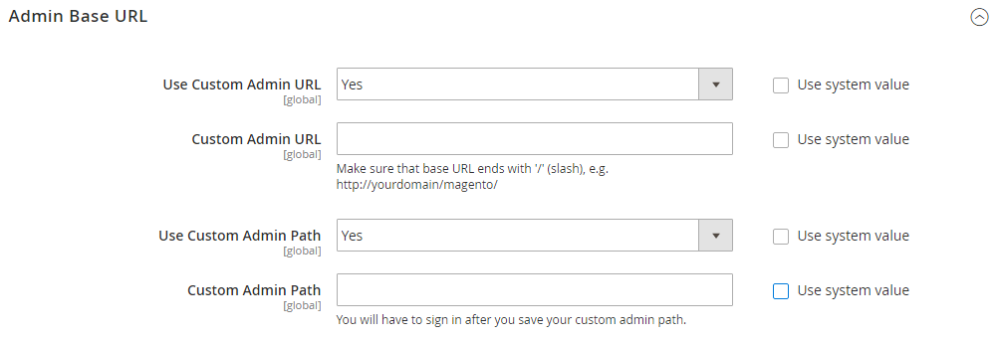

# URL を格納

Adobe CommerceまたはMagento Open Sourceのインストール内の各 web サイトには、ストアフロントに割り当てられたベース URL と、管理者に割り当てられた別の URL があります。 Adobeでは、変数を使用してベース URL に対する内部リンクを定義します。これにより、リンクを更新することなく、ストア全体をある場所から別の場所に移動させることができます。 標準ベース URL はで始まります `http`で始まるセキュアなベース URL `https`.

- **ベース URL** — `http://www.yourdomain.com/magento/`
- **セキュアなベース URL** — `https://www.yourdomain.com/magento/`
- **IP アドレスを含む URL** — `http://###.###.###.###/magento/` または `https://###.###.###.###/magento/`

>[!IMPORTANT]
>
>デフォルトのベース URL 設定から管理者 URL を変更しないでください。 管理者 URL またはパスを変更するには、を参照してください。 [カスタム管理 URL を使用](#use-a-custom-admin-url).

## セキュアなプロトコルを使用

ストアのベース URL は、最初にAdobe Commerceのインストール時に設定されたものです。 その時点でセキュリティ証明書が使用可能であった場合は、次を指定できます `HTTPS` ストア、管理者、またはその両方に使用する URL。 Adobe Commerceのインストールに複数のストアが含まれている場合、または後でストアを追加する予定の場合は、URL にストアコードを含めることができます。 すべてのAdobeリソースとオペレーションは、安全なプロトコルで使用できます。

インストール時にドメインのセキュリティ証明書が使用できなかった場合は、ストアを起動する前に必ず設定を更新してください。 ドメインのセキュリティ証明書を確立したら、暗号化された Secure Sockets Layer （SSL）で動作するようにベース URL を設定することも、ベース URL を両方とも設定することもできます。 [トランスポート層のセキュリティ][1] （TLS）プロトコル。

>[!IMPORTANT]
>
>Adobeでは、コンテンツページや製品ページを含む、実稼動サイトのすべてのページを、安全なプロトコルを使用して送信することを強くお勧めします。

Adobe CommerceとMagento Open Sourceは、すべてのページをまたいで配信するように設定できます `HTTPS` デフォルトでは。 ストアで標準プロトコルを使用している場合は、次を有効にすることでセキュリティを向上できます [HTTP 完全転送セキュリティ][2] （HSTS）を使用し、セキュアでないページリクエストをアップグレードします。 HSTS は、ブラウザーが標準をレンダリングできないようにするオプトインプロトコルです `HTTP` 指定したドメインの保護されていないプロトコルで送信されるページ。 検索エンジンが、ストアの各ページに標準で既にインデックスを作成している可能性があるからです `HTTP` URL を指定する場合は、保護されていないページリクエストを次の場所にアップグレードするようにCommerceを設定できます `HTTPS` は自動的に実行されるので、トラフィックが失われることはありません。 Commerceがストアフロントと管理者の両方にセキュアな URL を使用するように設定されている場合、2 つのフィールドがさらに表示され、有効にすることができます `HSTS`.

## ベース URL の設定

1. 日 _Admin_ サイドバー、に移動 **[!UICONTROL Stores]** > _[!UICONTROL Settings]_>**[!UICONTROL Configuration]**.

1. 次の下 _一般_ 左パネルで、を選択します。 **[!UICONTROL Web]**.

1. を展開  この **[!UICONTROL Base URL]** セクション。

   - **[!UICONTROL Base URL]** — ストアの完全修飾ベース URL を入力します。 ストアから追加の URL キーで拡張できるように、URL の末尾には必ずスラッシュを付けてください。 例： `http://yourdomain.com/`

     >[!NOTE]
     >
     >内のプレースホルダーを変更しないでください _[!UICONTROL Base Link URL]_フィールド。 これは、ベース URL への相対リンクの作成に使用されるプレースホルダーです。

   - **[!UICONTROL Base URL for Static View Files]** — （オプション）次のプレースホルダーで始まるパスを入力して、静的ビューファイルのベース URL の別の場所を指定します。

     \{\{unsecure_base_url}}

   - **[!UICONTROL Base URL for User Media Files]** — （オプション）次のプレースホルダーで始まるパスを入力して、ユーザーメディアファイルのベース URL の代替の場所を指定します。

     \{\{unsecure_base_url}}

     通常のインストールでは、静的ビューファイルやメディアファイルのパスはベース URL に対する相対パスなので、更新する必要はありません。

   {width="600" zoomable="yes"}

   >[!NOTE]
   >
   >二重中括弧で囲まれたプレースホルダーは、変数のマークアップタグです。

1. 完了したら、 **[!UICONTROL Save Config]**.

## セキュアなベース URL の設定

ドメインに有効なセキュリティ証明書がある場合、ストアフロントと管理者の両方の URL を設定して、安全な（https）チャネルでデータを送信できます。 有効なセキュリティ証明書がないと、ストアはセキュアな（SSL/TLS）プロトコルで動作できません。

1. を展開  この _[!UICONTROL Base URLs (Secure]）_ を選択し、次の操作を実行します。

   {width="600" zoomable="yes"}

   - **[!UICONTROL Secure Base URL]**  – 完全なセキュア ベース URL を入力し、その後にスラッシュを入力します。 例： `https://yourdomain.com/`

   - **[!UICONTROL Secure Base Link URL]** — 「セキュアベースリンク URL」フィールドのプレースホルダーを変更しないでください。 安全なベース URL への相対リンクを作成するために使用されます。

   - **[!UICONTROL Secure Base URL for Static View Files]** — （オプション）次のプレースホルダーで始まるパスを入力して、静的ビューファイルのセキュアなベース URL の別の場所を指定します。

     \{\{secure_base_url}}

   - **[!UICONTROL Secure Base URL for User Media Files]** — （オプション）次のプレースホルダーで始まるパスを入力して、ユーザーメディアファイルのセキュアなベース URL の代替の場所を指定します。

     \{\{secure_base_url}}

1. セキュリティを強化するには、次の両方のオプションをに設定します `Yes`.

   - **[!UICONTROL Use Secure URLs on Storefront]**
   - **[!UICONTROL Use Secure URLs in Admin]**

1. の場合 _[!UICONTROL Enhanced Security Settings]_、次の手順を実行します。

   - **[!UICONTROL Enable HTTP Strict Transport Security (HSTS)]** — ストアにセキュアな HTTPS ページリクエストのみを表示する場合は、をに設定します。 `Yes`.

   - **[!UICONTROL Upgrade Insecure Requests]**  – 標準の保護されていない HTTP ページのリクエストを保護された HTTPS にアップグレードするには、をに設定します `Yes`.

1. を **[!UICONTROL Offloader Header]** サーバーの場合。

   ほとんどのCommerce インストールでは、デフォルトが使用されます `X-Forward-Proto` プロトコルを次のいずれかとして識別します `HTTP` または `HTTPS`. サーバー設定で別の offloader_header を使用している場合は、ここに入力します。

1. 完了したら、 **[!UICONTROL Save Config]**.

## URL にストアコードを含める

>[!NOTE]
>
>いつ _URL へのストアコードの追加_ オプションの設定 `Yes`を設定する場合は、ブラウザーの URL にストアコードを含める必要があります。 この設定により、URL の書き換えが正しくマッピングされ、すべてのページが以下なしで正常に開かれます _「404 ページが見つかりません」_ エラー。

1. 日 _Admin_ サイドバー、に移動 **[!UICONTROL Stores]** > _[!UICONTROL Settings]_>**[!UICONTROL Configuration]**.

1. 次の下 _[!UICONTROL General]_左パネルで、を選択します。**[!UICONTROL Web]**.

1. を展開  この **[!UICONTROL URL Options]** セクション。

1. を設定 **[!UICONTROL Add Store Code]** 好みに応じて：

   - **[!UICONTROL URL with Store Code]**: `http://www.yourdomain.com/magento/[store-code]/index.php/url-identifier`
   - **[!UICONTROL URL without Store Code]**: `http://www.yourdomain.com/magento/index.php/url-identifier`

   {width="600" zoomable="yes"}

1. 完了したら、 **[!UICONTROL Save Config]**.

1. 「」をクリックします **[!UICONTROL Cache Management]** ワークスペースの上部にあるメッセージのリンク。 次に、指示に従ってキャッシュを更新します。

   

## URL のトラブルシューティング

設定手順に従った後も、一部のページは引き続き保護されていない URL （`http://`）、次の手順を実行します。

- （セキュアでない）ベース URL をセキュアな HTTPS URL に変更します。
- サーバーで、を編集します `.htaccess` 安全でない URL が安全な URL にリダイレクトされるように、ファイル（またはロードバランサー）を設定します。

## カスタム管理 URL を使用

As a [セキュリティのベストプラクティス](https://experienceleague.adobe.com/docs/commerce-operations/implementation-playbook/best-practices/launch/security-best-practices.html)の場合、Adobeではデフォルトの代わりに一意の管理者 URL を使用することをお勧めします _admin_ または、次のような一般的な用語 _バックエンド_. 判定された不正アクターからサイトを直接保護することはありませんが、不正アクセスを試みるスクリプトへの露出を減らすことができます。

>[!NOTE]
>
>カスタムの管理 URL を実装する前に、ホスティングプロバイダーに確認してください。 一部のホスティングプロバイダーは、ファイアウォール保護ルールを満たすために標準 URL を必要とします。

通常のインストールでは、管理者 URL とパスはベース URL の直後に続きます。 管理者パスはルートの 1 つ下のディレクトリです。

- **デフォルトのベース URL**: `http://yourdomain.com/magento/`
- **デフォルトの管理パス**: `admin`
- **デフォルトの管理者 URL とパス**: `http://yourdomain.com/magento/admin`

管理者 URL とパスを別の場所に変更することは可能ですが、誤った場合は管理者へのアクセスができなくなるので、サーバーから修正する必要があります。

>[!NOTE]
>
>予防措置として、サーバー上の設定ファイルの編集方法がわからない場合は、管理者 URL を自分で変更しないでください。 クラウドインフラストラクチャにデプロイされたAdobe Commerce プロジェクトの場合は、次のように管理 URL を変更します [指示](https://experienceleague.adobe.com/docs/commerce-cloud-service/user-guide/configure/env/stage/variables-admin.html?lang=en#admin-url) が含まれる *クラウドインフラストラクチャー上のAdobe Commerce ガイド*.

### 方法 1：管理者から変更する

1. 日 _Admin_ サイドバー、に移動 **[!UICONTROL Stores]** > _[!UICONTROL Settings]_>**[!UICONTROL Configuration]**.

1. 左側のパネルで、を展開します **[!UICONTROL Advanced]** を選択します **[!UICONTROL Admin]**.

1. を展開  この **[!UICONTROL Admin Base URL]** セクション。

1. カスタム URL の設定オプションを設定します。

   {width="600" zoomable="yes"}

   必要に応じて、 **[!UICONTROL Use system value]** チェックボックスをオンにして、設定を変更します。

   - を設定 **[!UICONTROL Use Custom Admin URL]** 対象： `Yes`.

   - を入力 **[!UICONTROL Custom Admin URL]**: `http://yourdomain.com/magento/`

     >[!NOTE]
     >
     >管理者 URL は、同じCommerce インストール内にあり、ストアフロントと同じドキュメントルートを持つ必要があります。

   - を設定 **[!UICONTROL Custom Admin Path]** 対象： `Yes`.

   - の場合 **[!UICONTROL Custom Admin Path]**&#x200B;に加え、カスタム管理フォルダー名として使用するパスを入力します。

     例： `sample_custom_admin`

1. 完了したら、 **[!UICONTROL Save Config]**.

1. 変更を保存したら、管理者からログアウトし、新しい管理者 URL とパスを使用してログインし直します。

### 方法 2：サーバーコマンドラインからの管理パスの変更

1. を開きます `app/etc/env.php` ファイルをテキストエディターで開き、 `frontName` のパラメーター `backend` セクション。 次に、ファイルを保存します。

   必ず小文字のみを使用してください。

   >[!NOTE]
   >
   >   この方法を使用すると、管理パスを変更できますが、管理 URL は変更できません。

   >[!TIP]
   >
   >クラウドインフラストラクチャー上のAdobe Commerceの場合、を使用してカスタム管理パスを設定できます `ADMIN_URL` クラウド UI の変数。 を参照してください。 [管理変数に関するトピック](https://experienceleague.adobe.com/docs/commerce-cloud-service/user-guide/configure/env/stage/variables-admin.html) が含まれる _クラウドインフラストラクチャー上のCommerce ガイド_.

   - **デフォルトの管理パス**

     ```php?start_inline=1
     'backend' => [
      'frontName' => 'admin'
     ],
     ```

   - **新しい管理パス**

     ```php?start_inline=1
     'backend' => [
         'frontName' => 'backend'
     ],
     ```

1. キャッシュをクリアするには、次のいずれかの方法を使用します。

   - 日 _Admin_ サイドバー、に移動 **[!UICONTROL System]** > _[!UICONTROL Tools]_>**[!UICONTROL Cache Management]**. 次に、**[!UICONTROL Flush Magento Cache]**.
   - サーバーで、次の操作を実行します。

     ```terminal
     php bin/magento cache:flush
     ```

   >[!NOTE]
   >
   >メソッド 1 を使用して行った変更は、 `app/etc/env.php` ファイル。

### 方法 3:Commerce CLI を使用して管理パスを変更する

CLI を使用できます `setup:config:set` 管理パスを変更するコマンド。 次の例では、 `--backend-frontname` パスをCommerce ルートから新しい管理パスに変更するオプション：

```terminal
bin/magento setup:config:set --backend-frontname="backend_front_name"
```

このコマンドは、 `backend` > `frontName` の設定オプション `app/etc/env.php` ファイル。

## デフォルトの管理者 URL と管理パスを復元

無効な管理者 URL または管理パスを設定していて、バックエンドへのアクセス権を失った場合、コマンドラインから修正する方法があります。

1. デフォルトの管理者 URL に戻すには、次のコマンドを実行します。

   ```terminal
   php bin/magento config:set admin/url/use_custom 0
   ```

1. デフォルトの管理者パス（ `app/etc/env.php` メソッド 2）で説明されているように、次のコマンドを実行します。

   ```terminal
   php bin/magento config:set admin/url/use_custom_path 0
   ```

1. キャッシュをクリアするには、次のいずれかの方法を使用します。

   - 日 _Admin_ サイドバー、に移動 **[!UICONTROL System]** > _[!UICONTROL Tools]_>**[!UICONTROL Cache Management]**. 次に、**[!UICONTROL Flush Magento Cache]**.
   - サーバーで、次の操作を実行します。

     ```terminal
     php bin/magento cache:flush
     ```


[1]: https://en.wikipedia.org/wiki/Transport_Layer_Security
[2]: https://en.wikipedia.org/wiki/HTTP_Strict_Transport_Security
