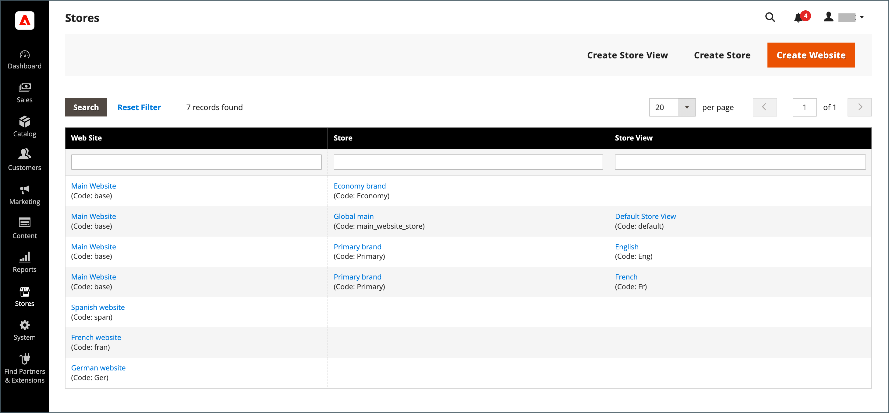
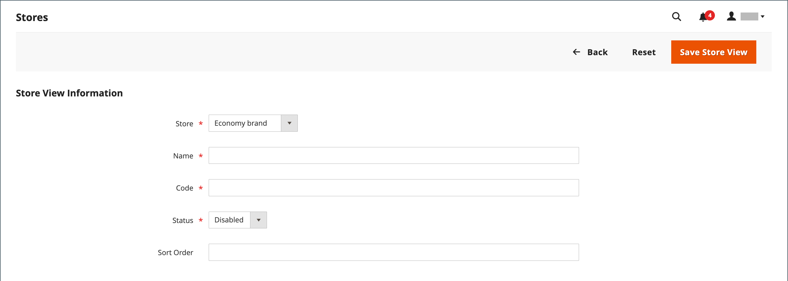

# ビューを保存

ストア表示は、通常、様々なロケールでストアを使用できるようにするために使用されます。 買い物客は、ストアのヘッダーにある言語選択を使用して、ストア表示を変更できます。

{width="550"}

## ストア表示の追加

1. _管理者_ サイドバーで、**[!UICONTROL Stores]**/_[!UICONTROL Settings]_/**[!UICONTROL All Stores]**&#x200B;に移動します。

   {width="700" zoomable="yes"}

1. 「**[!UICONTROL Create Store View]**」をクリックします。

   {width="600" zoomable="yes"}

1. **[!UICONTROL Store]** をこのビューの親ストアに設定します。

1. このストア表示の **[!UICONTROL Name]** を入力してください。

   この名前は、ストアヘッダーの言語選択に表示されます。 例：`Spanish`。

1. **[!UICONTROL Code]**：ビューを識別するコードを小文字で入力します。

   例：`spanish`。

1. ビューをアクティブにするには、**[!UICONTROL Status]** を `Enabled` に設定します。

1. （オプション） **[!UICONTROL Sort Order]** 数を入力して、このビューが他のビューと一緒にリストされる順序を決定します。

1. 「**[!UICONTROL Save Store View]**」をクリックします。

## ストア表示の編集

ビュー名は言語選択に表示されるため、最終的には既定のビューの名前をわかりやすい名前に変更する必要が生じる場合があります。 _名前_ フィールドは単なるラベルであり、簡単に変更できます。

Adobe CommerceまたはMagento Open Sourceのインストールでマルチサイトまたはマルチストアの設定を使用している場合は、`index.php` ファイルで値が参照されていないことを確認してから、「ストアコード」フィールドを変更しないでください。 ファイルを調べるサーバーにアクセスできない場合は、開発者に問い合わせてください。

| フィールド | 元の値 | 更新された値 |
| ----- | -------------- | ------------- |
| [!UICONTROL Name] | `Default Store View` | `English` |
| [!UICONTROL Code] | `default` | `english` |

{style="table-layout:auto"}

1. _管理者_ サイドバーで、**[!UICONTROL Stores]**/_[!UICONTROL Settings]_/**[!UICONTROL All Stores]**&#x200B;に移動します。

1. グリッドの _[!UICONTROL Store View]_&#x200B;列で、編集するビューの名前をクリックします。

   デフォルトのビューを編集する場合、「_[!UICONTROL Store]_」フィールドと「_[!UICONTROL Status]_」フィールドは使用できません。

   {width="600" zoomable="yes"}

1. 必要に応じて、次のフィールドを更新します。

   - **[!UICONTROL Store]** （非デフォルトビューのみ）
   - **[!UICONTROL Name]**
   - **[!UICONTROL Code]** （`index.php` で使用されていない場合のみ）
   - **[!UICONTROL Status]** （非デフォルトビューのみ）
   - **[!UICONTROL Sort Order]**

1. 「**[!UICONTROL Save Store View]**」をクリックします。
