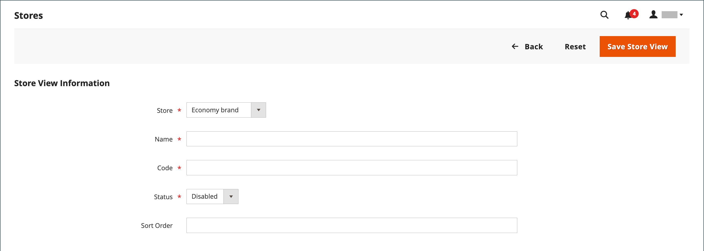

# ストアビュー

ストアビューは、通常、ストアを様々なロケールで利用できるようにするために使用されます。 買い物客は、ストアのヘッダーにある言語選択ツールを使用して、ストアビューを変更できます。

{width="550"}

## [!DNL Adobe Commerce Optimizer]同期ステータス {#optimizer-sync-status}

[!DNL Adobe Commerce Optimizer Connector]がインストールされ、web サイトまたはストアビューに対して有効になっている場合、[!UICONTROL All Stores] グリッドには同期ステータスインジケーターが表示されます。 [!DNL Adobe Commerce Optimizer Connector for B2B]がインストールされている場合は、使用可能なB2B共有カタログのデータも同期されます。 [&#x200B; カタログビューの管理](../b2b/catalog-views-manage.md)を参照してください。

| 列 | 指標 | 説明 |
| ----- | ----- | ----- |
| [!UICONTROL Web Site] | [!UICONTROL Price sync enabled for Commerce Optimizer] | このウェブサイトの価格と価格表は[!DNL Adobe Commerce Optimizer]に同期されています。 |
| [!UICONTROL Store View] | [!UICONTROL Product sync enabled for Commerce Optimizer] | このストアビューの製品と属性は[!DNL Adobe Commerce Optimizer]に同期されます。 |

{width="700" zoomable="yes"}

同期を有効または無効にするには、[web サイトを作成](stores.md#step-1-create-a-website)または[&#x200B; ストアビューを追加](#add-a-store-view)する場合、または既存のweb サイトまたはストアビューを更新する場合に&#x200B;**[!UICONTROL Adobe Commerce Optimizer exporter settings]**&#x200B;を編集します。

## ストアビューを追加

1. _管理者_ サイドバーで、**[!UICONTROL Stores]** > _[!UICONTROL Settings]_>**[!UICONTROL All Stores]**&#x200B;に移動します。

   {width="700" zoomable="yes"}

1. **[!UICONTROL Create Store View]**&#x200B;をクリックします。

   {width="600" zoomable="yes"}

1. このビューの親ストアに&#x200B;**[!UICONTROL Store]**&#x200B;を設定します。

1. このストアビューの&#x200B;**[!UICONTROL Name]**&#x200B;を入力してください。

   名前は、ストアヘッダーの言語選択に表示されます。 例：`Spanish`。

1. **[!UICONTROL Code]**&#x200B;に、ビューを識別するコード（小文字）を入力します。

   例：`spanish`。

1. ビューをアクティブにするには、**[!UICONTROL Status]**&#x200B;を`Enabled`に設定します。

1. （オプション）このビューが他のビューと共に表示されるシーケンスを決定するには、**[!UICONTROL Sort Order]**&#x200B;番号を入力します。

1. （オプション） [!DNL Adobe Commerce Optimizer Connector]がインストールされている場合は、**[!UICONTROL Adobe Commerce Optimizer exporter settings]** セクションの&#x200B;**[!UICONTROL Sync products and attributes]**&#x200B;を選択して、このストアビューの製品と属性を[!DNL Adobe Commerce Optimizer]に同期します。 [!DNL Adobe Commerce Optimizer Connector for B2B]もインストールされている場合、この設定はB2B共有カタログ データも[!DNL Adobe Commerce Optimizer]に同期します。 [&#x200B; カタログビューの管理](../b2b/catalog-views-manage.md)を参照してください。

   {width="600" zoomable="yes"}

   最初の同期の後にこの設定を変更すると、完全なインデックス再作成がトリガーされます。 *Commerce コネクタ ガイド*&#x200B;の「[Adobe Commerce Optimizer スコープ書き出し設定のカスタマイズ &#x200B;](https://experienceleague.adobe.com/en/docs/commerce/aco-optimizer-connector/get-started#customize-the-commerce-scopes-export-configuration)」を参照してください。

1. **[!UICONTROL Save Store View]**&#x200B;をクリックします。

## ストアビューの編集

ビュー名は言語選択に表示されるので、最終的にはデフォルトのビューの名前をより説明的なものに変更する必要がある場合があります。 _名前_ フィールドは単なるラベルであり、簡単に変更できます。

Adobe CommerceまたはMagento Open Sourceのインストール環境にマルチサイトまたはマルチストア設定がある場合は、`index.php` ファイルで値が参照されていないことを確認せずに、ストアコード フィールドを変更しないでください。 ファイルを調べるためにサーバーにアクセスできない場合は、開発者に助けを求めてください。

| フィールド | 元の値 | 更新された値 |
| ----- | -------------- | ------------- |
| [!UICONTROL Name] | `Default Store View` | `English` |
| [!UICONTROL Code] | `default` | `english` |

{style="table-layout:auto"}

1. _管理者_ サイドバーで、**[!UICONTROL Stores]** > _[!UICONTROL Settings]_>**[!UICONTROL All Stores]**&#x200B;に移動します。

1. グリッドの&#x200B;_[!UICONTROL Store View]_&#x200B;列で、編集するビューの名前をクリックします。

   既定のビューを編集する際、_[!UICONTROL Store]_&#x200B;および&#x200B;_[!UICONTROL Status]_ フィールドは使用できません。

   {width="600" zoomable="yes"}

1. 必要に応じて、次のフィールドを更新します。

   - **[!UICONTROL Store]** （デフォルト以外のビューのみ）
   - **[!UICONTROL Name]**
   - **[!UICONTROL Code]** （`index.php`で使用されていない場合のみ）
   - **[!UICONTROL Status]** （デフォルト以外のビューのみ）
   - **[!UICONTROL Sort Order]**
   - **[!UICONTROL Sync products and attributes]** （[!DNL Adobe Commerce Optimizer Connector]がインストールされている場合のみ）

   {width="600" zoomable="yes"}

1. **[!UICONTROL Save Store View]**&#x200B;をクリックします。
