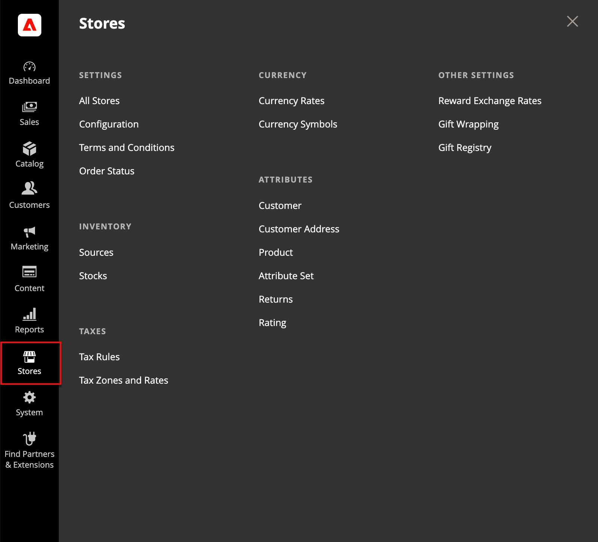

# [!UICONTROL Stores] メニュー

_[!UICONTROL Stores]_&#x200B;メニューでは、使用頻度は低いが、Adobe CommerceまたはMagento Open Sourceのインストール全体で参照される設定にアクセスできます。 これらの機能には、ストア階層、設定、売上および注文設定、税金および通貨、製品属性、製品レビュー評価、顧客グループの設定が含まれます。

>[!BEGINTABS]

>[!TAB Adobe Commerce]

[!BADGE PaaSのみ]{type=Informative url="https://experienceleague.adobe.com/ja/docs/commerce/user-guides/product-solutions" tooltip="Adobe Commerce on Cloud プロジェクト（Adobeで管理されるPaaS インフラストラクチャ）とオンプレミス プロジェクトにのみ適用されます。"}

{width="500" zoomable="yes"}

>[!TAB Adobe Commerce as a Cloud Service]

[!BADGE SaaSのみ]{type=Positive url="https://experienceleague.adobe.com/ja/docs/commerce/user-guides/product-solutions" tooltip="Adobe Commerce as a Cloud ServiceおよびAdobe Commerce Optimizer プロジェクト（Adobeが管理するSaaS インフラストラクチャ）にのみ適用されます。"}

{width="500" zoomable="yes"}

>[!ENDTABS]

## [!UICONTROL Stores] メニューの表示

_管理者_ サイドバーで、**[!UICONTROL Stores]**&#x200B;をクリックします。

## メインセクション

### [!UICONTROL Settings]

Adobe CommerceまたはMagento Open Sourceのインストール環境で[web サイト、ストア、ストアビュー](stores.md#store-and-site-structure)の階層を管理し、すべての[設定](../configuration-reference/guide-overview.md)を管理します。 さらに、販売の[利用条件](terms-and-conditions.md)を設定し、[注文状況の設定](order-status.md#custom-order-status)を管理できます。

### [!UICONTROL Inventory]

[在庫を管理および作成](../inventory-management/introduction.md)して、販売チャネルまたはweb サイトを[&#x200B; ソース &#x200B;](../inventory-management/sources-manage.md)にリンクします。 在庫は、販売可能な商品量を集計したものです。 シングルSourceのマーチャントはデフォルトストックを使用し、マルチSourceのマーチャントはそれ以外のカスタムストックを使用します。

### [!UICONTROL Taxes]

ストア全体のすべての種類の[税関数](taxes.md)を管理し、ストアの税ルールを設定し、顧客と製品の税区分を定義し、税区分と税率を管理します。 また、ストアに税率データを読み込むこともできます。

### [!UICONTROL Currency]

ストアで支払いに使用できる[通貨](currency.md)のレートを管理し、商品価格と販売文書に表示される通貨記号をカスタマイズします。

### [!UICONTROL Attributes]

[顧客](../customers/attribute-properties.md)または[製品情報](../catalog/attribute-product-create.md)、返品、および製品評価に使用される属性を管理します。 属性を作成し、既存の属性を編集し、[属性セット &#x200B;](../catalog/attribute-sets.md)を管理できます。

### [!UICONTROL Other Settings]

[&#x200B; ポイント換算レート &#x200B;](../merchandising-promotions/reward-exchange-rates.md)、[&#x200B; ギフトラッピング &#x200B;](cart-configuration.md#gift-wrap)、[&#x200B; ギフトレジストリ &#x200B;](../merchandising-promotions/gift-registries.md)の追加設定を管理します。
