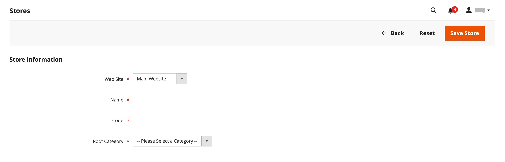
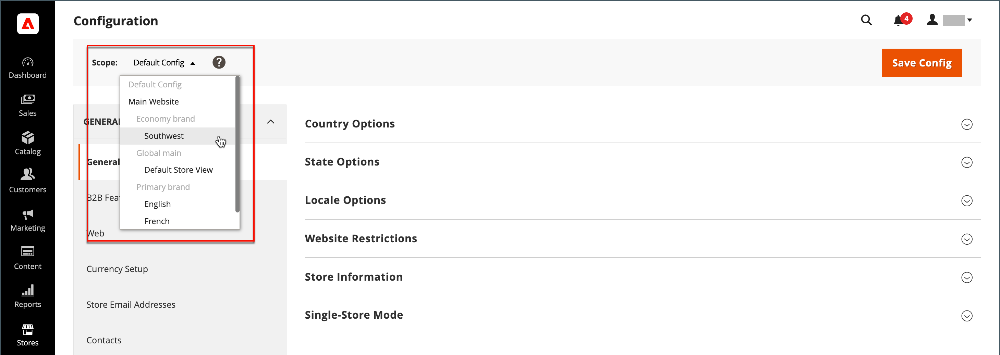

# ストアとサイト構造

Adobe CommerceまたはMagento Open Sourceがインストールされると、メインの Web サイト、ストア、ストア表示を含む階層が作成されます。 必要に応じて、追加の Web サイト、ストア、ビューを作成し、保存できます。 例えば、メインの Web サイトに加えて、異なるドメインの Web サイトを追加することができます。 各 Web サイト内には複数のストアを含め、各ストア内に個別のストアビューを含めることができます。 多くのインストールでは、1 つの Web サイトと 1 つのストアがありますが、異なる言語をサポートするために複数のストア表示があります。

開始する前に、設定全体で参照されるストアカタログ階層を事前に計画します。 各ストアには、 [ルートカテゴリ](../catalog/category-root.md)を使用すると、各ストアに対してまったく異なるメインメニューオプションのセットを設定できます。

{width="550"}

## ストアを追加

Adobe CommerceまたはMagento Open Sourceを 1 回インストールするだけで、管理者を共有する複数のストアを持つことができます。 同じ Web サイトにあるストアの IP アドレスとドメインが同じで、同じセキュリティ証明書を使用し、単一のチェックアウトプロセスを共有します。

ストアが同じコードを使用し、管理者を共有していることを理解しておく必要があります。 各ストアには個別のカタログを持つことも、ストアでカタログを共有することもできます。 各ストアには、 [ルートカテゴリ](../catalog/category-root.md)：店舗ごとに異なるメインメニューを使用できます。 ストアは、異なるブランディング、プレゼンテーション、コンテンツを持つこともできます。 ストア階層は設定全体で使用されるので、開始する前に将来の拡大を考慮して、ストア階層の計画を立てる必要があります。

{width="550"}

次に、複数のストアに対して URL を設定する方法の例を示します。

| URL | 説明 |
| --- | ----------- |
| `yourdomain.com/store1` `yourdomain.com/store2` | 各ストアには異なるパスがありますが、1 つのドメインを共有します。 |
| `store1.yourdomain.com` `store2.yourdomain.com` | 各ストアには、プライマリドメインの異なるサブドメインがあります。 |

Adobe Commerceのマルチストアインストールは、管理者とサーバーのコマンドラインから設定する必要があります。 ザAdobe Commerce [設定ガイド](https://experienceleague.adobe.com/docs/commerce-operations/configuration-guide/multi-sites/ms-overview.html) に、サーバー環境を設定する手順を示します。

### 手順 1：ストアドメインの選択

最初の手順は、ストアの配置方法を選択することです。 ストアは 1 つのドメインを共有し、それぞれがサブドメインを持つ、または明確に異なるドメインを持つ必要がありますか。 各ストアに対して、次のいずれかの操作を行います。

- ストアをプライマリドメインの 1 つ下のレベルに配置する場合は、何もする必要はありません。
- プライマリドメインのサブドメインを設定します。
- 別のプライマリドメインを設定します。

### 手順 2：ストアを作成する

1. 次の日： _管理者_ サイドバー、移動 **[!UICONTROL Stores]** > _[!UICONTROL Settings]_>**[!UICONTROL All Stores]**.

1. クリック **[!UICONTROL Create Store]** 新しいストアのオプションを設定します。

   - **[!UICONTROL Web Site]**  — 新しいストアの親となる Web サイトを選択します。 インストールに 1 つの Web サイトしかない場合は、デフォルト (`Main Website`) をクリックします。

   - **[!UICONTROL Name]**  — 新しいストアの名前を入力します。 名前は内部参照用です。

   - **[!UICONTROL Code]**  — ストアを識別するコードを小文字で入力します。 例： `mainstore`.

   - **[!UICONTROL Root Category]**  — に設定します。 [ルートカテゴリ](../catalog/category-root.md) 新しいストアのメインメニューのカテゴリ構造を定義します。 ストアの特定のルートカテゴリを既に作成している場合は、そのカテゴリを選択します。 それ以外の場合は、「 `Default Category`. 後で戻って、設定を更新できます。

   {width="600" zoomable="yes"}

1. クリック **[!UICONTROL Save Store]**.

### 手順 3：デフォルトのストア表示を作成する

1. クリック **[!UICONTROL Create Store View]** ストア表示オプションを設定します。

   - **[!UICONTROL Store]**  — 作成した新しいストアに設定します。

   - **[!UICONTROL Name]**  — ビューの名前を入力します。 例： `English`.

   - **[!UICONTROL Code]**  — ビューのコードを小文字で入力します。

   - **[!UICONTROL Status]**  — に設定します。 `Enabled`.

   - **[!UICONTROL Sort Order]**  — 他の店舗と一緒にリストされる店舗の位置を決定する数値を入力します。

1. クリック **[!UICONTROL Save Store View]**.

   ストアを編集モードで開くと、デフォルトの表示になっていることがわかります。

   {width="600" zoomable="yes"}

### 手順 4：ストアの URL の設定

1. 次の日： _管理者_ サイドバー、クリック **[!UICONTROL Stores]** > _[!UICONTROL Settings]_>**[!UICONTROL Configuration]**.

1. の下 _[!UICONTROL General]_左側の左側のパネルで、を選択します。**[!UICONTROL Web]**.

1. 左上隅で、 **[!UICONTROL Store View]** を新しいストア用に作成したビューに追加します。

1. 確認を求められた場合 [範囲](../getting-started/websites-stores-views.md#scope-settings) 切り替え、クリック **[!UICONTROL OK]**.

   {width="600" zoomable="yes"}

1. 展開  の **[!UICONTROL Base URLs]** 」セクションに移動し、ストアのベース URL を入力します。

   必要に応じて、 **[!UICONTROL Use system value]** チェックボックスを使用して設定を変更します。

   {width="600" zoomable="yes"}

1. 展開  の **[!UICONTROL Secure Base URLs]** ストアを設定する場合は、セクションをクリックし、前の手順を繰り返します。 [セキュア URL](store-urls.md).

1. クリック **[!UICONTROL Save Config]**.

### 手順 5：サーバーの設定

複数の Web サイトをサポートするようにサーバーを設定するには、 [複数の Web サイトまたはストア](https://experienceleague.adobe.com/docs/commerce-operations/configuration-guide/multi-sites/ms-overview.html) （内） _設定ガイド_.

Web サーバーの設定に関するヘルプについては、次のリソースを参照してください。

- [NGX で複数の Web サイトを設定する](https://experienceleague.adobe.com/docs/commerce-operations/configuration-guide/multi-sites/ms-nginx.html)
- [Apache で複数の Web サイトを設定](https://experienceleague.adobe.com/docs/commerce-operations/configuration-guide/multi-sites/ms-apache.html)

クラウドインフラストラクチャ上のAdobe Commerceについては、 [複数の Web サイトまたはストアを設定する](https://experienceleague.adobe.com/docs/commerce-cloud-service/user-guide/configure-store/multiple-sites.html).

## Web サイトの追加

1 つのAdobe CommerceまたはMagento Open Sourceインストールから、同じドメインまたは異なるドメインで複数の Web サイトを設定できます。 デフォルトでは、同じ Web サイトにあるストアの IP アドレスとドメインは同じで、同じセキュリティ証明書を使用し、単一のチェックアウトプロセスを共有します。 各ストアに専用のチェックアウトプロセスを独自のドメインで割り当てる場合は、各ストアに個別の IP アドレスと個別のセキュリティ証明書が必要です。

Adobe CommerceまたはMagento Open Sourceのマルチサイトインストールは、管理者から、またはサーバーのコマンドラインから構成する必要があります。 コマース [設定ガイド](https://experienceleague.adobe.com/docs/commerce-operations/configuration-guide/multi-sites/ms-overview.html) に、サーバー環境を設定する手順を示します。

{width="550"}

### 手順 1:Web サイトを作成する

1. 次の日： _管理者_ サイドバー、移動 **[!UICONTROL Stores]** > _[!UICONTROL Settings]_>**[!UICONTROL All Stores]**.

1. 右上隅で、 **[!UICONTROL Create Website]**.

1. を設定します。 **[!UICONTROL Web Site Information]** options:

   {width="600" zoomable="yes"}

   - **[!UICONTROL Name]**  — 新しい Web サイトのドメインを入力します。 例： `domain.com`.

   - **[!UICONTROL Code]**  — サーバー上でドメインを指すために使用するコードを入力します。

     コードは、小文字 (a ～ z) で始まる必要があり、文字 (a ～ z)、数字 (0 ～ 9)、アンダースコア (_) の組み合わせを含めることができます。

   - **[!UICONTROL Sort Order]** — _（オプション）_ このサイトが他のサイトと共に表示される順序を決定する番号を入力します。 このサイトをリストの一番上に表示するには、ゼロ (`0`) をクリックします。

1. クリック **[!UICONTROL Save Web Site]**.

1. 各 [保存する](#add-stores) および [ストア表示](store-views.md) これは新しい Web サイトに必要です。

   その後、Web サイトを編集モードで開いて、デフォルトのストアを設定できます。

### 手順 2：ストアの URL を設定する

次の手順で [ストア URL](store-urls.md)をクリックし、指示に従います。

### 手順 3：サーバーの設定

複数の Web サイトをサポートするようにサーバーを設定するには、 [複数の Web サイトまたはストア](https://experienceleague.adobe.com/docs/commerce-operations/configuration-guide/multi-sites/ms-overview.html) （内） _設定ガイド_.

Web サーバーの設定に関するヘルプについては、次のチュートリアルを参照してください。

- [NGX で複数の Web サイトを設定する](https://experienceleague.adobe.com/docs/commerce-operations/configuration-guide/multi-sites/ms-nginx.html)
- [Apache で複数の Web サイトを設定](https://experienceleague.adobe.com/docs/commerce-operations/configuration-guide/multi-sites/ms-apache.html)

クラウドインフラストラクチャ上のAdobe Commerceについては、 [複数の Web サイトまたはストアを設定する](https://experienceleague.adobe.com/docs/commerce-cloud-service/user-guide/configure-store/multiple-sites.html).
