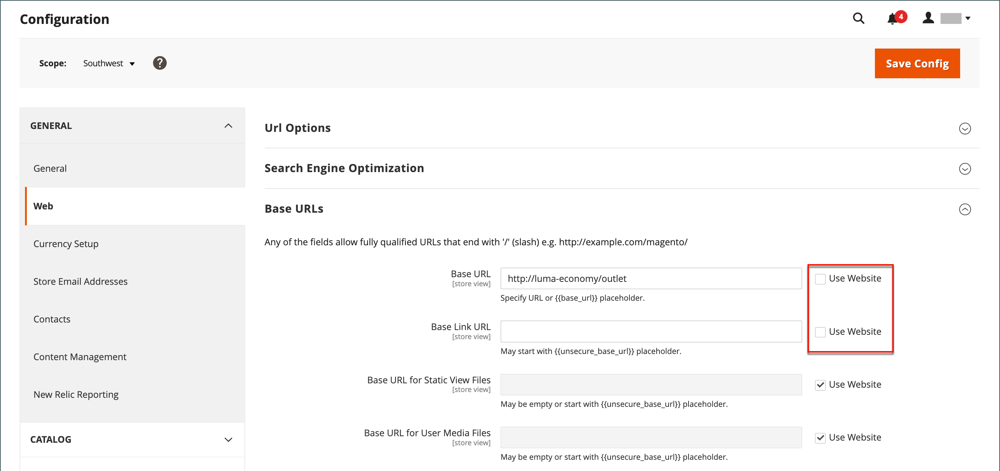
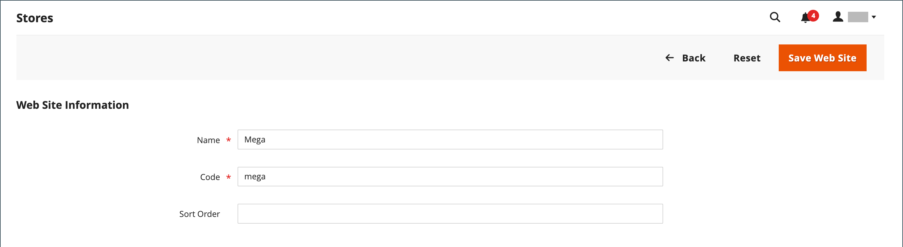

# ストア構造とサイト構造

Adobe CommerceまたはMagento Open Sourceをインストールすると、メイン web サイト、ストア、ストアビューを含む階層が作成されます。 必要に応じて、web サイト、ストア、ストアビューを追加できます。 たとえば、メインのweb サイトに加えて、別のドメインを持つ追加のweb サイトもあります。 各web サイトには複数のストアがあり、各ストアでは個別のストアビューを使用できます。 多くのインストールでは、1つのweb サイトと1つのストアがありますが、複数のストアビューで異なる言語をサポートしています。

開始する前に、ストア カタログ階層を事前に計画します。これは、設定全体で参照されるためです。 各ストアには個別の[&#x200B; ルートカテゴリ &#x200B;](../catalog/category-root.md)を設定できます。これにより、各ストアのメインメニューオプションのセットをまったく異なることが可能になります。

{width="550"}

## ストアを追加

Adobe CommerceまたはMagento Open Sourceを1回インストールすると、管理者を共有する複数のストアを持つことができます。 同じweb サイト内のストアには、同じIP アドレスとドメインがあり、同じセキュリティ証明書を使用し、単一のチェックアウトプロセスを共有します。

理解すべき重要なことは、ストアが同じコードを使用し、管理者を共有することです。 各ストアは個別のカタログを持つことも、ストアはカタログを共有することもできます。 各ストアは個別の[&#x200B; ルートカテゴリ &#x200B;](../catalog/category-root.md)を持つことができます。これにより、各ストアごとに異なるメインメニューを持つことができます。 また、ストアのブランディング、プレゼンテーション、コンテンツも異なる場合があります。 設定の全体を通じて使用されるため、開始する前に将来の成長を考慮してストア階層を計画する時間が必要です。

{width="550"}

複数のストアに対してURLを設定する方法の例を次に示します。

| URL | 説明 |
| --- | ----------- |
| `yourdomain.com/store1` `yourdomain.com/store2` | 各ストアは異なるパスを持ちますが、ドメインを共有します。 |
| `store1.yourdomain.com` `store2.yourdomain.com` | 各ストアには、プライマリドメインの異なるサブドメインがあります。 |

Adobe Commerceのマルチストアインストールは、管理者とサーバーのコマンドラインからも設定する必要があります。 Adobe Commerce [設定ガイド &#x200B;](https://experienceleague.adobe.com/docs/commerce-operations/configuration-guide/multi-sites/ms-overview.html)には、サーバー環境の設定に関する詳細な手順が記載されています。

### 手順1：ストアドメインの選択

最初のステップは、ストアの配置方法を選択することです。 ストアがドメインを共有するか、それぞれにサブドメインがあるか、または異なるドメインを持つ必要がありますか？ 各ストアについて、次のいずれかの操作を行います。

- ストアをプライマリドメインの1つ下のレベルに配置するには、何もする必要はありません。
- プライマリドメインのサブドメインを設定します。
- 別のプライマリドメインを設定します。

### 手順2：ストアの作成

1. _管理者_ サイドバーで、**[!UICONTROL Stores]** > _[!UICONTROL Settings]_>**[!UICONTROL All Stores]**&#x200B;に移動します。

1. **[!UICONTROL Create Store]**&#x200B;をクリックし、新しいストアのオプションを設定します。

   - **[!UICONTROL Web Site]** – 新しいストアの親となるweb サイトを選択します。 インストールにWeb サイトが1つしかない場合は、デフォルト （`Main Website`）を使用します。

   - **[!UICONTROL Name]** – 新しいストアの名前を入力します。 名前は内部参照用です。

   - **[!UICONTROL Code]** — ストアを識別するには、小文字のコードを入力します。 例：`mainstore`。

   - **[!UICONTROL Root Category]** – 新しいストアのメインメニューのカテゴリ構造を定義する[&#x200B; ルートカテゴリ &#x200B;](../catalog/category-root.md)に設定します。 ストアの特定のルートカテゴリを既に作成している場合は、そのカテゴリを選択します。 それ以外は、`Default Category`を選択してください。 後で戻って設定を更新できます。

   {width="600" zoomable="yes"}

1. **[!UICONTROL Save Store]**&#x200B;をクリックします。

### 手順3：デフォルトのストアビューの作成

1. **[!UICONTROL Create Store View]**&#x200B;をクリックし、ストアビューオプションを設定します。

   - **[!UICONTROL Store]** – 作成した新しいストアに設定します。

   - **[!UICONTROL Name]** — ビューの名前を入力します。 例：`English`。

   - **[!UICONTROL Code]** — ビューのコードを小文字で入力します。

   - **[!UICONTROL Status]** — `Enabled`に設定します。

   - **[!UICONTROL Sort Order]** – 他のストアと共にリストされている場合に、ストアの位置を決定する数値を入力します。

1. **[!UICONTROL Save Store View]**&#x200B;をクリックします。

   ストアを編集モードで開くと、デフォルトビューが表示されるようになりました。

   {width="600" zoomable="yes"}

### 手順4：ストア URLの設定

1. _管理者_ サイドバーで、**[!UICONTROL Stores]** > _[!UICONTROL Settings]_>**[!UICONTROL Configuration]**&#x200B;をクリックします。

1. 左側の左側のパネルの「_[!UICONTROL General]_」で、「**[!UICONTROL Web]**」を選択します。

1. 左上隅で、新しいストア用に作成したビューに&#x200B;**[!UICONTROL Store View]**&#x200B;を設定します。

1. [&#x200B; スコープ &#x200B;](../getting-started/websites-stores-views.md#scope-settings)の切り替えを確認するメッセージが表示されたら、**[!UICONTROL OK]**&#x200B;をクリックします。

   {width="600" zoomable="yes"}

1. **[!UICONTROL Base URLs]** セクションのを展開し、ストアのベース URLを入力します。

   必要に応じて、**[!UICONTROL Use system value]** チェックボックスをオフにして、設定を変更します。

   {width="600" zoomable="yes"}

1. **[!UICONTROL Secure Base URLs]** セクションのを展開し、ストア [&#x200B; セキュア URL](store-urls.md)を設定する場合は、前の手順を繰り返します。

1. **[!UICONTROL Save Config]**&#x200B;をクリックします。

### 手順5：サーバーの設定

複数のWeb サイトをサポートするようにサーバーを設定するには、_設定ガイド_&#x200B;の[複数のWeb サイトまたはストア &#x200B;](https://experienceleague.adobe.com/docs/commerce-operations/configuration-guide/multi-sites/ms-overview.html)を参照してください。

Web サーバーの設定に関するヘルプについては、次のリソースを参照してください。

- [NGNXで複数のウェブサイトを設定する](https://experienceleague.adobe.com/docs/commerce-operations/configuration-guide/multi-sites/ms-nginx.html)
- [Apacheを使用した複数のweb サイトの設定](https://experienceleague.adobe.com/docs/commerce-operations/configuration-guide/multi-sites/ms-apache.html)

クラウドインフラストラクチャ上のAdobe Commerceについては、[複数のweb サイトまたはストアの設定](https://experienceleague.adobe.com/docs/commerce-cloud-service/user-guide/configure-store/multiple-sites.html)を参照してください。

## Web サイトを追加

同じドメインまたは異なるドメインを持つ1つのAdobe CommerceまたはMagento Open Source インストールから、複数のweb サイトを設定できます。 デフォルトでは、同じweb サイトの下にあるストアは、同じIP アドレスとドメインを持ち、同じセキュリティ証明書を使用し、単一のチェックアウトプロセスを共有します。 各ストアに独自のドメインで専用のチェックアウトプロセスを持たせたい場合は、各ストアに個別のIP アドレスと個別のセキュリティ証明書が必要です。

Adobe CommerceまたはMagento Open Sourceのマルチサイトインストールは、管理者およびサーバーのコマンドラインからも設定する必要があります。 Commerce [設定ガイド &#x200B;](https://experienceleague.adobe.com/docs/commerce-operations/configuration-guide/multi-sites/ms-overview.html)には、サーバー環境の設定に関する詳細な手順が記載されています。

{width="550"}

### ステップ 1:web サイトの作成

1. _管理者_ サイドバーで、**[!UICONTROL Stores]** > _[!UICONTROL Settings]_>**[!UICONTROL All Stores]**&#x200B;に移動します。

1. 右上隅の「**[!UICONTROL Create Website]**」をクリックします。

1. **[!UICONTROL Web Site Information]** オプションを設定します。

   {width="600" zoomable="yes"}

   - **[!UICONTROL Name]** – 新しいWeb サイトのドメインを入力します。 例：`domain.com`。

   - **[!UICONTROL Code]** — ドメインを指すためにサーバーで使用されるコードを入力します。

     コードは小文字（a ～ z）で始まる必要があり、文字（a ～ z）、数字（0 ～ 9）、およびアンダースコア（_）記号の任意の組み合わせを含めることができます。

   - **[!UICONTROL Sort Order]** — _（オプション）_&#x200B;このサイトが他のサイトと共にリストされる順序を決定する番号を入力します。 このサイトをリストの先頭に表示するには、ゼロ （`0`）を入力します。

1. **[!UICONTROL Save Web Site]**&#x200B;をクリックします。

1. 新しいweb サイトに必要な各[&#x200B; ストア &#x200B;](#add-stores)と[&#x200B; ストアビュー](store-views.md)を設定します。

   その後、web サイトを編集モードで開いて、デフォルトストアを設定できます。

### 手順2：ストア URLの設定

[&#x200B; ストア URL](store-urls.md)を設定するには、指示に従います。

### 手順3：サーバーの設定

複数のWeb サイトをサポートするようにサーバーを設定するには、_設定ガイド_&#x200B;の[複数のWeb サイトまたはストア &#x200B;](https://experienceleague.adobe.com/docs/commerce-operations/configuration-guide/multi-sites/ms-overview.html)を参照してください。

Web サーバーの設定に関するヘルプについては、次のチュートリアルを参照してください。

- [NGNXで複数のウェブサイトを設定する](https://experienceleague.adobe.com/docs/commerce-operations/configuration-guide/multi-sites/ms-nginx.html)
- [Apacheを使用した複数のweb サイトの設定](https://experienceleague.adobe.com/docs/commerce-operations/configuration-guide/multi-sites/ms-apache.html)

クラウドインフラストラクチャ上のAdobe Commerceについては、[複数のweb サイトまたはストアの設定](https://experienceleague.adobe.com/docs/commerce-cloud-service/user-guide/configure-store/multiple-sites.html)を参照してください。
