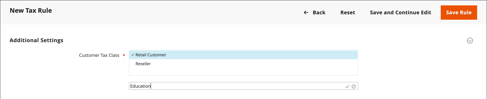

# 税区分

税区分は、顧客、製品および出荷に割り当てることができます。 Commerceでは、各顧客のショッピングカートを分析し、顧客のクラス、カート内の商品のクラス、地域に応じて適切な税金を計算します。 地域は、顧客の配送先住所、請求先住所、配送元によって決まります。 [税ルール ](tax-rules.md)が定義されている場合は、新しい税区分を作成できます。

- **顧客** – 必要な数の顧客税区分を作成し、それらを[顧客グループ ](../customers/customer-groups.md)に割り当てることができます。 例えば、一部の国や地域では、卸売取引には課税されませんが、小売取引には課税されます。 卸売顧客グループのメンバーを卸売税区分に関連付けることができます。

- **製品** – 製品クラスは、ショッピングカートに正しい税率が適用されているかどうかを計算するために使用されます。 製品を作成すると、特定の税区分に割り当てられます。 例えば、食べ物には税金がかからなかったり、別の税率で課税されたりすることもあります。

- **送料** – 店舗で送料に追加税が発生した場合は、送料に特定の商品税クラスを指定する必要があります。 次に、設定で、配送に使用する税区分として指定します。

## 税区分の設定

配送に使用される税区分、および[製品と顧客](#add-a-product-tax-class)の既定の税区分は、_[!UICONTROL Sales]_設定で設定されます。

1. _管理者_ サイドバーで、**[!UICONTROL Stores]** > _[!UICONTROL Settings]_>**[!UICONTROL Configuration]**に移動します。

1. 左側のパネルで、**[!UICONTROL Sales]**&#x200B;を展開し、**[!UICONTROL Tax]**&#x200B;を選択します。

1. **[!UICONTROL Tax Classes]** セクションのを展開します。

   {width="600" zoomable="yes"}

1. 次のそれぞれの税区分を選択します。

   - **[!UICONTROL Set Tax Class for Shipping]**
   - **[!UICONTROL Tax Class for Gift Options]**
   - **[!UICONTROL Default Tax Class for Product]**
   - **[!UICONTROL Default Tax Class for Customer]**

1. 完了したら、**[!UICONTROL Save Config]**&#x200B;をクリックします。

## 税区分の追加

顧客および製品用の税区分を簡単に追加し、個々の顧客および製品に割り当て、税務ルールで使用できます。

1. _管理者_ サイドバーで、**[!UICONTROL Stores]** > _[!UICONTROL Taxes]_>**[!UICONTROL Tax Rules]**に移動します。

1. **[!UICONTROL Add New Tax Rule]**&#x200B;をクリックします。

1. **[!UICONTROL Additional Settings]** セクションのを展開します。

   {width="600" zoomable="yes"}

1. _顧客税区分_&#x200B;で、**[!UICONTROL Add New Tax Class]**&#x200B;をクリックします。

1. 新しい税区分の&#x200B;**[!UICONTROL Name]**&#x200B;をテキストボックスに入力します。

   {width="600" zoomable="yes"}

1. 使用可能な顧客税区分のリストに新しい区分を追加するには、チェックマークをクリックします。

   {width="600" zoomable="yes"}

## 製品税区分の追加

1. _製品税区分_&#x200B;で、**[!UICONTROL Add New Tax Class]**&#x200B;をクリックします。

1. 新しい税区分の&#x200B;**[!UICONTROL Name]**&#x200B;をテキストボックスに入力します。

1. 使用可能な製品税区分のリストに新しい区分を追加するには、チェックマークをクリックします。

1. 完了したら、ボタンバーの「**[!UICONTROL Back]**」をクリックして、_税ルール_ グリッドに戻ります。

## デフォルトの税宛先

デフォルトの税先設定では、税計算の基礎として使用される国、州、郵便番号または郵便番号が決まります。

**_計算の既定の税宛先を設定するには:_**

1. _管理者_ サイドバーで、**[!UICONTROL Stores]** > _[!UICONTROL Settings]_>**[!UICONTROL Configuration]**に移動します。

1. 左側のパネルで、**[!UICONTROL Sales]**&#x200B;を展開し、**[!UICONTROL Tax]**&#x200B;を選択します。

1. **[!UICONTROL Default Tax Destination Calculation]** セクションのを展開します。

   {width="600" zoomable="yes"}

1. 税計算の基となる国に&#x200B;**[!UICONTROL Default Country]**&#x200B;を設定します。

1. 税計算の基礎として使用される州または州に&#x200B;**[!UICONTROL Default State]**&#x200B;を設定します。

1. **[!UICONTROL Default Post Code]**&#x200B;を、ローカル税計算のベースとして使用される郵便番号または郵便番号に設定します。

1. 完了したら、**[!UICONTROL Save Config]**&#x200B;をクリックします。
