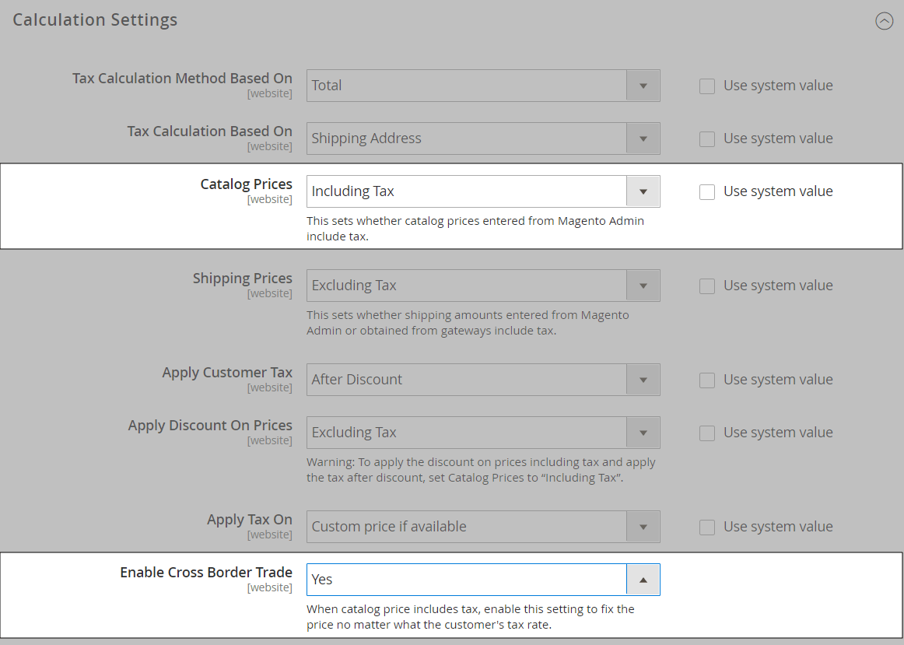

# 税金設定

次の手順では、Commerce インスタンスの基本的な税金設定について説明します。 税金を設定する前に、[&#x200B; ロケール &#x200B;](store-localize.md#step-3-change-the-locale-of-the-store-view)の税金要件を理解していることを確認してください。 次に、要件に応じて税金構成を完了します。

管理者[権限](../systems/permissions.md)は、ビジネス _が知っておく必要があるビジネス_&#x200B;に基づいて、[&#x200B; アクセス &#x200B;](../systems/permissions-user-roles.md)を税リソースに制限するように設定できます。 税設定へのアクセス権を持つ管理者ロールを作成するには、Sales/TaxとSystem/Taxの両方のリソースを選択します。 デフォルトの発送元とは異なる地域のweb サイトを設定する場合は、その役割のシステム/配送リソースへのアクセスも許可する必要があります。 出荷設定は、カタログの価格に使用されるストアの税率を決定します。

## 一般的な税金設定の設定

1. _管理者_ サイドバーで、**[!UICONTROL Stores]** > _[!UICONTROL Settings]_>**[!UICONTROL Configuration]**&#x200B;に移動します。

1. マルチサイト設定の場合は、設定のターゲットとなるweb サイトとストアに&#x200B;**[!UICONTROL Store View]**&#x200B;を設定します。

1. 左側のパネルで、**[!UICONTROL Sales]**&#x200B;を展開し、**[!UICONTROL Tax]**&#x200B;を選択します。

1. 次の設定を完了します。

   必要に応じて、グレー表示されている設定の&#x200B;**[!UICONTROL Use system value]** チェックボックスをオフにします。

### [!UICONTROL Tax Classes]

1. **[!UICONTROL Tax Classes]** セクションのを展開します。

   {width="600" zoomable="yes"}

   - **送料向け税区分** – 適切な区分に設定します。 デフォルトのクラスは`None`と`Taxable Goods`です
   - **ギフトオプションの税区分** —  （Adobe Commerceのみ）適切な区分に設定します。 デフォルトのクラスは`None`と`Taxable Goods`です
   - **製品の既定の税区分** – 適切な区分に設定します。 デフォルトのクラスは`None`と`Taxable Goods`です
   - **お客様の既定の税区分** – 適切な区分に設定します。 デフォルトのクラスは`Retail Customer`と`Wholesale Customer`です

1. 完了したら、**[!UICONTROL Save Config]**&#x200B;をクリックします。

### [!UICONTROL Calculation Settings]

1. **[!UICONTROL Calculation Settings]** セクションを展開します。

   {width="600" zoomable="yes"}

1. **[!UICONTROL Tax Calculation Method Based On]**&#x200B;を次のいずれかに設定します：

   - `Unit Price` – 各商品の価格
   - `Row Total` – 注文の行項目の合計（割引が少ない）
   - `Total` – 注文合計

1. **[!UICONTROL Tax Calculation Based On]**&#x200B;を次のいずれかに設定します：

   - `Shipping Address` – 注文を発送する住所
   - `Billing Address` – 顧客または会社の請求先住所
   - `Shipping Origin` - ストアの[原点](shipping-settings.md#point-of-origin)として指定されたアドレス

1. **[!UICONTROL Catalog Prices]**&#x200B;を`Excluding Tax`または`Including Tax`に設定します。

1. **[!UICONTROL Shipping Prices]**&#x200B;を`Excluding Tax`または`Including Tax`に設定します。

1. **[!UICONTROL Apply Customer Tax]**&#x200B;を次のいずれかに設定して、税金が元の価格に適用されるか、割引価格に適用されるかを判断します：`After Discount`または`Before Discount`

1. 割引に税金が含まれているか除外されているかを判断するには、**[!UICONTROL Apply Discount on Prices]**&#x200B;を次のいずれかに設定します：`Excluding Tax`または`Including Tax`

1. **[!UICONTROL Apply Tax On]**&#x200B;を`Custom price if available`または`Original price only`に設定します。

1. **[!UICONTROL Enable Cross-Border Trade]**&#x200B;を次のいずれかに設定します：

   - `Yes` – 異なる税率で一貫した価格を使用します。 カタログ価格に税金が含まれる場合は、この設定を選択して、顧客の税率に関係なく価格を修正します。
   - `No` – 価格を税率で変更します。

   >[!IMPORTANT]
   >
   >[&#x200B; クロスボーダー取引](#cross-border-price-consistency)が有効になっている場合、利益率は税率で変更されます。 利益は、数式（`Revenue - CustomerVAT - CostOfGoodsSold`）によって決まります。 国境を越えた貿易を可能にするには、価格を税込みに設定する必要があります。

### [!UICONTROL Default Tax Destination Calculation]

1. **[!UICONTROL Default Tax Destination Calculation]** セクションのを展開します。

   {width="600" zoomable="yes"}

1. 税計算の&#x200B;**[!UICONTROL Default Country]**&#x200B;を指定します。

1. 該当する場合は、税金計算に&#x200B;**[!UICONTROL Default State]**&#x200B;を指定します。

1. 該当する場合は、税金計算に&#x200B;**[!UICONTROL Default Post Code]**&#x200B;を指定します。

1. 完了したら、**[!UICONTROL Save Config]**&#x200B;をクリックします。

### [!UICONTROL Price Display Settings]

>[!IMPORTANT]
>
>価格の表示に関連する設定の組み合わせの中には、税金を含めたり除外したりするものもあり、お客様にとっては混乱を招く可能性があります。 警告メッセージのトリガーを回避するには、[推奨設定](taxes.md#warning-messages)を参照してください。

1. **[!UICONTROL Price Display Settings]** セクションのを展開します。

   {width="600" zoomable="yes"}

1. **[!UICONTROL Display Product Prices in Catalog]**&#x200B;を次のいずれかに設定します：

   - `Excluding Tax` - ストアフロントに表示されるカタログの価格には税金が含まれていません。
   - `Including Tax` - ストアフロントのカタログ価格に含まれる税金は、税ルールが税源と一致する場合、または顧客の住所が税ルールと一致する場合にのみ含まれます。 これは、顧客がアカウントを作成したり、ログインしたり、カート内の「税金と送料の見積もり」ツールを使用したりした後に発生する可能性があります。
   - `Including and Excluding Tax` - ストアフロントに表示されるカタログ価格は、税別および税別の両方で表示されます。

1. **[!UICONTROL Display Shipping Prices]**&#x200B;を`Excluding Tax`、`Including Tax`または`Including and Excluding Tax`に設定します。

1. 完了したら、**[!UICONTROL Save Config]**&#x200B;をクリックします。

### [!UICONTROL Shopping Cart Display Settings]

1. **[!UICONTROL Shopping Cart Display Settings]** セクションのを展開します。

   {width="600" zoomable="yes"}

1. 次の各設定について、ストアとロケールの要件に従って、税金と価格をカートに表示する方法を選択します。

   - **[!UICONTROL Display Prices]**&#x200B;を`Excluding Tax`、`Including Tax`または`Including and Excluding Tax`に設定します。

   - **[!UICONTROL Display Subtotal]**&#x200B;を`Excluding Tax`、`Including Tax`または`Including and Excluding Tax`に設定します。

   - **[!UICONTROL Display Shipping Amount]**&#x200B;を`Excluding Tax`、`Including Tax`または`Including and Excluding Tax`に設定します。

   -  （Adobe Commerceのみ） **[!UICONTROL Display Gift Wrapping Prices]**&#x200B;を`Excluding Tax`、`Including Tax`または`Including and Excluding Tax`に設定します。

   -  （Adobe Commerceのみ） **[!UICONTROL Display Printed Card Prices]**&#x200B;を`Excluding Tax`、`Including Tax`または`Including and Excluding Tax`に設定します。

1. 必要に応じて、次の表示オプションを`Yes`または`No`のいずれかに設定します。

   - **[!UICONTROL Include Tax in Order Total]**
   - **[!UICONTROL Display Full Tax Summary]**
   - **[!UICONTROL Display Zero Tax Subtotal]**

1. 完了したら、**[!UICONTROL Save Config]**&#x200B;をクリックします。

### [!UICONTROL Orders, Invoices, Credit Memos Display Settings]

1. **[!UICONTROL Orders, Invoices, Credit Memos Display Settings]** セクションのを展開します。

   {width="600" zoomable="yes"}

1. 注文、請求書、クレジットメモでの価格と税金の表示方法を指定します。

   - **[!UICONTROL Display Prices]**&#x200B;を`Excluding Tax`、`Including Tax`または`Including and Excluding Tax`に設定します。

   - **[!UICONTROL Display Subtotal]**&#x200B;を`Excluding Tax`、`Including Tax`または`Including and Excluding Tax`に設定します。

   - **[!UICONTROL Display Shipping Amount]**&#x200B;を`Excluding Tax`、`Including Tax`または`Including and Excluding Tax`に設定します。

   -  （Adobe Commerceのみ） **[!UICONTROL Display Gift Wrapping Prices]**&#x200B;を`Excluding Tax`、`Including Tax`または`Including and Excluding Tax`に設定します。

   -  （Adobe Commerceのみ） **[!UICONTROL Display Printed Card Prices]**&#x200B;を`Excluding Tax`、`Including Tax`または`Including and Excluding Tax`に設定します。

1. 必要に応じて、次の表示オプションを`Yes`または`No`のいずれかに設定します。

   - **[!UICONTROL Include Tax in Order Total]**
   - **[!UICONTROL Display Full Tax Summary]**
   - **[!UICONTROL Display Zero Tax Subtotal]**

1. 完了したら、**[!UICONTROL Save Config]**&#x200B;をクリックします。

### [!UICONTROL Fixed Product Taxes]

1. **[!UICONTROL Fixed Product Taxes]** セクションのを展開します。

   {width="600" zoomable="yes"}

1. 要件に応じて、**[!UICONTROL Enable FPT]**&#x200B;を`Yes`または`No`のいずれかに設定します。

1. FPTが有効になっている場合は、FPT表示オプションを指定します。

   - **[!UICONTROL Display Prices in Product Lists]**
   - **[!UICONTROL Display Price On Product view Page]**
   - **[!UICONTROL Display Prices in Sales Modules]**
   - **[!UICONTROL Display Prices in Emails]**

   - `Including FPT Only` – 表示価格には固定商品税が含まれています。 FPTの金額は個別に表示されません。
   - `Including FPT and FPT description` – 表示価格には固定商品税が含まれています。 FPTの金額は個別に表示されます。
   - `Excluding FPT. Including FPT description and final price` – 表示価格には固定製品税が含まれていません。 FPTの金額は個別に表示されます。
   - `Excluding FPT` – 表示価格には固定製品税が含まれていません。 FPTの金額は個別に表示されません。

1. 要件に応じて、**[!UICONTROL Apply Discounts to FPT]**&#x200B;を`Yes`または`No`に設定します。

1. **[!UICONTROL FPT Tax Configuration]**&#x200B;を設定して、FPTの計算方法を決定します。

   - `Not Taxed` – お客様の課税管轄区域がFPTに課税しない場合は、このオプションを選択します。 （例えば、カリフォルニア）
   - `Taxed` – お客様の課税管轄区域がFPTに課税している場合は、このオプションを選択します。 （例えば、カナダ）
   - `Loaded and Displayed with Tax` – 税金を適用する前にFPTが注文合計に追加されている場合は、このオプションをクリックします。 （例えば、EU諸国）。

1. 要件に応じて、**[!UICONTROL Include FPT in Subtotal]**&#x200B;を`Yes`または`No`に設定します。

1. 完了したら、**[!UICONTROL Save Config]**&#x200B;をクリックします。

## 国境を越えた価格一貫性

国境を越えた取引（価格一貫性とも呼ばれます）は、欧州連合（EU）およびその他の販売者が、税率が店舗税率と異なる顧客の一貫した価格を維持することをサポートしています。

地域や地域をまたいで営業している販売者は、商品の価格に税金を含めることで、1つの価格を表示することができます。 価格は国によって異なる税制や税率に関係なく、クリーンで整然としています。 これらの設定では、_Vertex Cloud_&#x200B;など、[Marketplace](../getting-started/commerce-marketplace.md)から税額計算拡張機能をインストールする必要があります。

>[!NOTE]
>
>クロスボーダー取引が有効になっている場合、利益率は税率によって変化します。 利益は、次の式で計算されます。 
>`Revenue - CustomerVAT - CostOfGoodsSold`

**_クロスボーダー価格の一貫性を有効にするには:_**

1. _管理者_ サイドバーで、**[!UICONTROL Stores]** > _[!UICONTROL Settings]_>**[!UICONTROL Configuration]**&#x200B;に移動します。

1. マルチサイト設定の場合は、設定のターゲットとなるweb サイトとストアに&#x200B;**[!UICONTROL Store View]**&#x200B;を設定します。

1. 左側のパネルで、**[!UICONTROL Sales]**&#x200B;を展開し、**[!UICONTROL Tax]**&#x200B;を選択します。

1. **[!UICONTROL Calculation Settings]** セクションのを展開します。

1. **[!UICONTROL Catalog Prices]**&#x200B;を`Including Tax`に設定します。

1. クロスボーダー価格の一貫性を有効にするには、**[!UICONTROL Enable Cross Border Trade]**&#x200B;を`Yes`に設定します。

   {width="600" zoomable="yes"}

1. 完了したら、**[!UICONTROL Save Config]**&#x200B;をクリックします。
