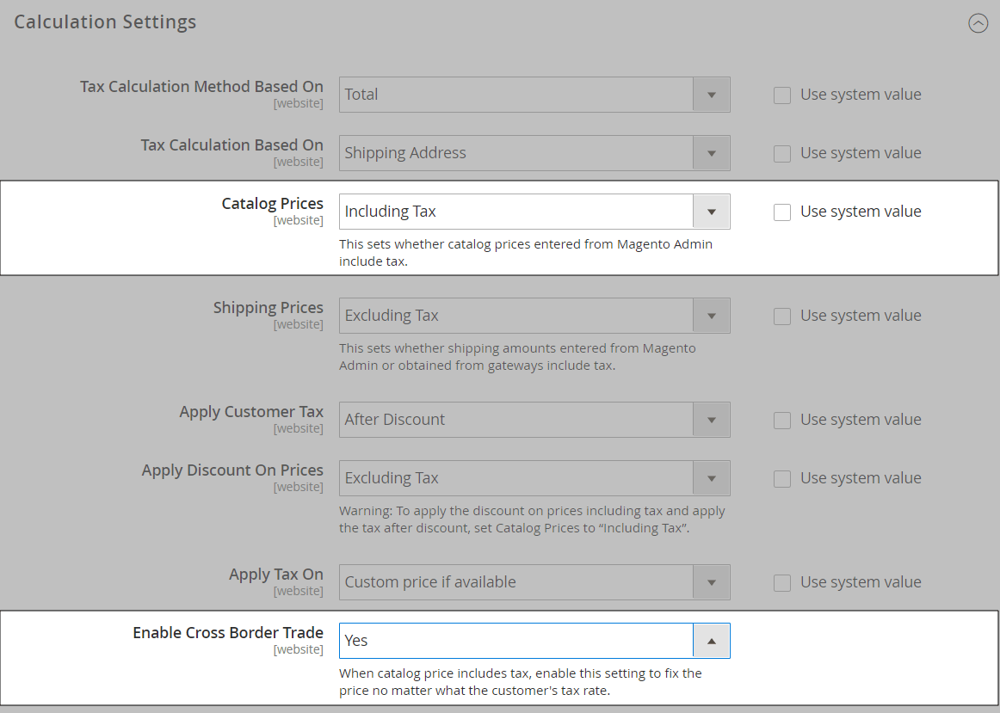

# 税の構成設定

以下の手順に従うことで、Commerce インスタンスの基本的な税金設定を行うことができます。 税金を設定する前に、の税金要件を熟知していることを確認してください [locale](store-localize.md#step-3-change-the-locale-of-the-store-view). 次に、要件に従って税金設定を完了します。

Admin [権限](../systems/permissions.md) 制限するように設定できます [アクセス](../systems/permissions-user-roles.md) 事業に基づいて資源に税金を課す _知る必要がある_. 税金設定へのアクセス権を持つ管理者ロールを作成するには、「売上/税金」および「システム/税金」リソースの両方を選択します。 デフォルトの出荷元と異なる地域に web サイトを設定する場合は、その役割のシステム/出荷資源へのアクセスも許可する必要があります。 配送設定によって、カタログ価格に使用する店舗の税率が決まります。

## 一般税金設定の構成

1. 日 _Admin_ サイドバー、に移動 **[!UICONTROL Stores]** > _[!UICONTROL Settings]_>**[!UICONTROL Configuration]**.

1. マルチサイト設定の場合、次のように設定します **[!UICONTROL Store View]** ：設定のターゲットである web サイトとストアに移動します。

1. 左側のパネルで、を展開します **[!UICONTROL Sales]** を選択します **[!UICONTROL Tax]**.

1. 次の設定を行います。

   必要に応じて、 **[!UICONTROL Use system value]** グレー表示されている設定のチェックボックス。

### [!UICONTROL Tax Classes]

1. を展開  この **[!UICONTROL Tax Classes]** セクション。

   {width="600" zoomable="yes"}

   - **配送用の税クラス**  – 適切なクラスに設定します。 デフォルトのクラスは次のとおりです。 `None` および `Taxable Goods`
   - **ギフト オプションの税クラス** —  （Adobe Commerceのみ）適切なクラスに設定します。 デフォルトのクラスは次のとおりです。 `None` および `Taxable Goods`
   - **商品の既定の税クラス**  – 適切なクラスに設定します。 デフォルトのクラスは次のとおりです。 `None` および `Taxable Goods`
   - **顧客の既定の税クラス**  – 適切なクラスに設定します。 デフォルトのクラスはです。 `Retail Customer` および `Wholesale Customer`

1. 完了したら、 **[!UICONTROL Save Config]**.

### [!UICONTROL Calculation Settings]

1. を展開します。 **[!UICONTROL Calculation Settings]** セクション。

   {width="600" zoomable="yes"}

1. を設定 **[!UICONTROL Tax Calculation Method Based On]** を次のいずれかに変更します。

   - `Unit Price` ・各商品の価格
   - `Row Total`  – 注文の品目の合計（割引を除く）
   - `Total`  – 注文合計

1. を設定 **[!UICONTROL Tax Calculation Based On]** を次のいずれかに変更します。

   - `Shipping Address`  – 注文を発送する住所
   - `Billing Address`  – 顧客または会社の請求先住所
   - `Shipping Origin`  – として指定されるアドレス [原点](shipping-settings.md#point-of-origin) ストア用

1. を設定 **[!UICONTROL Catalog Prices]** 対象： `Excluding Tax` または `Including Tax`.

1. を設定 **[!UICONTROL Shipping Prices]** 対象： `Excluding Tax` または `Including Tax`.

1. を設定 **[!UICONTROL Apply Customer Tax]** 税金が元の価格に適用されるか割引価格に適用されるかを決定するには、次のいずれかを行います。 `After Discount` または `Before Discount`

1. を設定 **[!UICONTROL Apply Discount on Prices]** 値引に税金を含めるか除外するかを決定する手順は、次のいずれかです。 `Excluding Tax` または `Including Tax`

1. を設定 **[!UICONTROL Apply Tax On]** 対象： `Custom price if available` または `Original price only`.

1. を設定 **[!UICONTROL Enable Cross-Border Trade]** を次のいずれかに変更します。

   - `Yes`  – 異なる税率に対して一貫性のある価格設定を使用します。 カタログ価格に税金が含まれる場合、顧客の税率に関係なく価格を固定するには、この設定を選択します。
   - `No`  – 税率によって価格を変えます。

   >[!IMPORTANT]
   >
   >次の場合 [国境を越えた貿易](#cross-border-price-consistency) 有効にすると、税率別に利益率が変更されます。 利益は数式（`Revenue - CustomerVAT - CostOfGoodsSold`）に設定します。 国境を越えた貿易を可能にするには、価格を税込みに設定しなければなりません。

### [!UICONTROL Default Tax Destination Calculation]

1. を展開  この **[!UICONTROL Default Tax Destination Calculation]** セクション。

   {width="600" zoomable="yes"}

1. を指定 **[!UICONTROL Default Country]** 税計算の場合。

1. 該当する場合は、 **[!UICONTROL Default State]** 税計算の場合。

1. 該当する場合は、 **[!UICONTROL Default Post Code]** 税計算の場合。

1. 完了したら、 **[!UICONTROL Save Config]**.

### [!UICONTROL Price Display Settings]

>[!IMPORTANT]
>
>税金を含む場合と税金を含まない場合の両方の価格表示に関連する設定の組み合わせが、お客様にとって混乱を招く可能性があります。 警告メッセージのトリガーを回避するには、 [推奨設定](taxes.md#warning-messages).

1. を展開  この **[!UICONTROL Price Display Settings]** セクション。

   {width="600" zoomable="yes"}

1. を設定 **[!UICONTROL Display Product Prices in Catalog]** を次のいずれかに変更します。

   - `Excluding Tax` ・店頭に掲載されているカタログ価格には、税金は含まれていません。
   - `Including Tax` - ストアフロントのカタログ価格には、税務処理基準が税源と一致する場合、または顧客の住所が税務処理基準と一致する場合にのみ、税金が含まれます。 この問題は、顧客がアカウントを作成した後、ログインした後、またはカート内の税金と送料の見積もりツールを使用した後に発生する可能性があります。
   - `Including and Excluding Tax`  – 店舗内に表示されるカタログ価格が、税ありで表示される場合と税なしの場合があります。

1. を設定 **[!UICONTROL Display Shipping Prices]** 対象： `Excluding Tax`, `Including Tax`、または `Including and Excluding Tax`.

1. 完了したら、 **[!UICONTROL Save Config]**.

### [!UICONTROL Shopping Cart Display Settings]

1. を展開  この **[!UICONTROL Shopping Cart Display Settings]** セクション。

   {width="600" zoomable="yes"}

1. 次の各設定について、店舗と地域の要件に応じて、買い物かごに税金と価格を表示する方法を選択します。

   - を設定 **[!UICONTROL Display Prices]** 対象： `Excluding Tax`, `Including Tax`、または `Including and Excluding Tax`.

   - を設定 **[!UICONTROL Display Subtotal]** 対象： `Excluding Tax`, `Including Tax`、または `Including and Excluding Tax`.

   - を設定 **[!UICONTROL Display Shipping Amount]** 対象： `Excluding Tax`, `Including Tax`、または `Including and Excluding Tax`.

   -  （Adobe Commerceのみ）設定 **[!UICONTROL Display Gift Wrapping Prices]** 対象： `Excluding Tax`, `Including Tax`、または `Including and Excluding Tax`.

   -  （Adobe Commerceのみ）設定 **[!UICONTROL Display Printed Card Prices]** 対象： `Excluding Tax`, `Including Tax`、または `Including and Excluding Tax`.

1. 次の表示オプションをのいずれかに設定します `Yes` または `No`必要に応じて、

   - **[!UICONTROL Include Tax in Order Total]**
   - **[!UICONTROL Display Full Tax Summary]**
   - **[!UICONTROL Display Zero Tax Subtotal]**

1. 完了したら、 **[!UICONTROL Save Config]**.

### [!UICONTROL Orders, Invoices, Credit Memos Display Settings]

1. を展開  この **[!UICONTROL Orders, Invoices, Credit Memos Display Settings]** セクション。

   {width="600" zoomable="yes"}

1. 注文、請求書、およびクレジット メモでの価格と税金の表示方法を指定します。

   - を設定 **[!UICONTROL Display Prices]** 対象： `Excluding Tax`, `Including Tax`、または `Including and Excluding Tax`.

   - を設定 **[!UICONTROL Display Subtotal]** 対象： `Excluding Tax`, `Including Tax`、または `Including and Excluding Tax`.

   - を設定 **[!UICONTROL Display Shipping Amount]** 対象： `Excluding Tax`, `Including Tax`、または `Including and Excluding Tax`.

   -  （Adobe Commerceのみ）設定 **[!UICONTROL Display Gift Wrapping Prices]** 対象： `Excluding Tax`, `Including Tax`、または `Including and Excluding Tax`.

   -  （Adobe Commerceのみ）設定 **[!UICONTROL Display Printed Card Prices]** 対象： `Excluding Tax`, `Including Tax`、または `Including and Excluding Tax`.

1. 次の表示オプションをに設定します。 `Yes` または `No`必要に応じて、次のようにします。

   - **[!UICONTROL Include Tax in Order Total]**
   - **[!UICONTROL Display Full Tax Summary]**
   - **[!UICONTROL Display Zero Tax Subtotal]**

1. 完了したら、 **[!UICONTROL Save Config]**.

### [!UICONTROL Fixed Product Taxes]

1. を展開  この **[!UICONTROL Fixed Product Taxes]** セクション。

   {width="600" zoomable="yes"}

1. を設定 **[!UICONTROL Enable FPT]** どちらか一方へ `Yes` または `No`必要に応じて、

1. FPT が有効な場合は、FPT 表示オプションを指定します。

   - **[!UICONTROL Display Prices in Product Lists]**
   - **[!UICONTROL Display Price On Product view Page]**
   - **[!UICONTROL Display Prices in Sales Modules]**
   - **[!UICONTROL Display Prices in Emails]**

   - `Including FPT Only`  – 表示価格には固定製品税が含まれています。 FPT 金額は個別には表示されません。
   - `Including FPT and FPT description`  – 表示価格には固定製品税が含まれています。 FPT 金額は個別に表示されます。
   - `Excluding FPT. Including FPT description and final price`  – 表示価格には固定製品税は含まれていません。 FPT 金額は個別に表示されます。
   - `Excluding FPT`  – 表示価格には固定製品税は含まれていません。 FPT 金額は個別には表示されません。

1. を設定 **[!UICONTROL Apply Discounts to FPT]** 対象： `Yes` または `No`必要に応じて、

1. を設定 **[!UICONTROL FPT Tax Configuration]** FPT の計算方法を決定します。

   - `Not Taxed`  – 課税管轄区域が FPT に課税しない場合は、このオプションを選択します。 （例：California）。
   - `Taxed`  – 課税管轄区域で FPT が税金である場合は、このオプションを選択します。 （例えば、カナダ）。
   - `Loaded and Displayed with Tax`  – 税金を適用する前に FPT が注文合計に追加された場合は、このオプションをクリックします。 （例えば、EU 諸国）。

1. を設定 **[!UICONTROL Include FPT in Subtotal]** 対象： `Yes` または `No`必要に応じて、

1. 完了したら、 **[!UICONTROL Save Config]**.

## 国境を越えた価格の一貫性

国境を越えた貿易（価格の一貫性とも呼ばれます）は、EU （欧州連合）や、店舗の税率と異なる税率を使用する顧客の価格を一貫して維持したい他のマーチャントをサポートします。

地域や地域をまたいで営業しているマーチャントは、商品の価格に税を含めることで 1 つの価格を表示できます。 国ごとに異なる税制構造や税率に関係なく、料金はクリーンで散乱がありません。 これらの設定では、から税金計算拡張機能をインストールする必要があります [Marketplace](../getting-started/commerce-marketplace.md)（例：） _頂点クラウド_.

>[!NOTE]
>
>国境を越えた取引が有効化されると、税率別に利益率が変化します。 利益は次の式によって決定されます。 
>`Revenue - CustomerVAT - CostOfGoodsSold`

**_クロスボーダーの価格の一貫性を有効にするには：_**

1. 日 _Admin_ サイドバー、に移動 **[!UICONTROL Stores]** > _[!UICONTROL Settings]_>**[!UICONTROL Configuration]**.

1. マルチサイト設定の場合、次のように設定します **[!UICONTROL Store View]** ：設定のターゲットである web サイトとストアに移動します。

1. 左側のパネルで、を展開します **[!UICONTROL Sales]** を選択します **[!UICONTROL Tax]**.

1. を展開  この **[!UICONTROL Calculation Settings]** セクション。

1. を設定 **[!UICONTROL Catalog Prices]** 対象： `Including Tax`.

1. クロスボーダー価格の一貫性を有効にするには、次のように設定します **[!UICONTROL Enable Cross Border Trade]** 対象： `Yes`.

   {width="600" zoomable="yes"}

1. 完了したら、 **[!UICONTROL Save Config]**.
