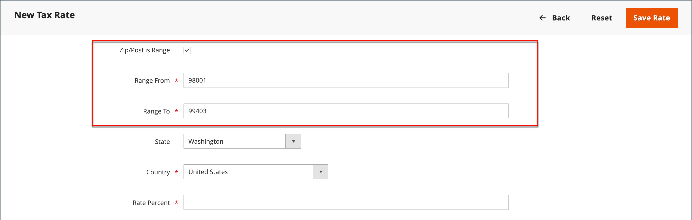

# 税区及び税率

税率は一般的に、特定の地域で行われる取引に適用されます。 「_税域と税率_」ツールを使用して、税金を徴収して送金する地域ごとに税率を指定します。 それぞれの税域と税率には一意の識別子があるため、特定の地域（食品や医薬品に課税するのではなく、他の品目に課税する場所など）に対して複数の税率を設定することができます。

店税は店舗の住所に基づいて計算されます。 注文の実際の顧客税は、顧客が注文情報を完了した後に計算されます。 次に、Commerceは、ストアの税設定に従って税金を計算します。

{width="600" zoomable="yes"}

## 新しい税率の定義

1. _管理者_ サイドバーで、**[!UICONTROL Stores]** > _[!UICONTROL Taxes]_>**[!UICONTROL Tax Zones and Rates]**&#x200B;に移動します。

1. 右上隅の「**[!UICONTROL Add New Tax Rate]**」をクリックします。

   {width="600" zoomable="yes"}

1. **[!UICONTROL Tax Identifier]**&#x200B;を入力します。

1. 1つの郵便番号に税率を適用するには、**[!UICONTROL Zip/Post Code]**&#x200B;のコードを入力します。

   アスタリスクのワイルドカード （`*`）は、コード内の最大10文字に一致させることができます。 例えば、`90*`は、90000から90999までのすべての郵便番号を表します。

1. 郵便番号または郵便番号の範囲に税率を適用するには、次の操作を行います。

   - **[!UICONTROL Zip/Post is Range]** チェックボックスを選択し、**[!UICONTROL Range From]**&#x200B;と&#x200B;**[!UICONTROL Range To]**&#x200B;の最初と最後の郵便番号または郵便番号を入力して、範囲を定義します。

     {width="600" zoomable="yes"}です

   - 税率が適用される&#x200B;**[!UICONTROL State]**&#x200B;を選択します。

   - 税率が適用される&#x200B;**[!UICONTROL Country]**&#x200B;を選択します。

   - 税率の計算に使用する&#x200B;**[!UICONTROL Rate Percent]**&#x200B;を入力します。

1. 複数のストアがある場合は、各ストアビューに&#x200B;**[!UICONTROL Tax Titles]**&#x200B;を設定できます。

   >[!NOTE]
   >
   >税識別子を使用する場合は、このフィールドを空のままにします。

1. 完了したら、**[!UICONTROL Save Rate]**&#x200B;をクリックします。

## 既存の税率の編集

1. _管理者_ サイドバーで、**[!UICONTROL Stores]** > _[!UICONTROL Taxes]_>**[!UICONTROL Tax Zones and Rates]**&#x200B;に移動します。

1. _[!UICONTROL Tax Zones and Rates]_&#x200B;グリッドで税率を検索し、レコードを編集モードで開きます。

   リストにレートが多い場合は、[&#x200B; フィルターコントロール &#x200B;](../getting-started/admin-grid-controls.md)を使用して、必要なレートを検索します。

1. **[!UICONTROL Tax Rate Information]**&#x200B;に必要な変更を加えます。

1. 必要に応じて&#x200B;**[!UICONTROL Tax Titles]**&#x200B;を更新します。

1. 完了したら、**[!UICONTROL Save Rate]**&#x200B;をクリックします。

## 税率を削除

1. _管理者_ サイドバーで、**[!UICONTROL Stores]** > _[!UICONTROL Taxes]_>**[!UICONTROL Tax Zones and Rates]**&#x200B;に移動します。

1. 削除する税率を検索し、編集モードで開きます。

1. メニューバーで、**[!UICONTROL Delete Rate]**&#x200B;をクリックします。

1. アクションを確認するには、**[!UICONTROL OK]**&#x200B;をクリックします。
