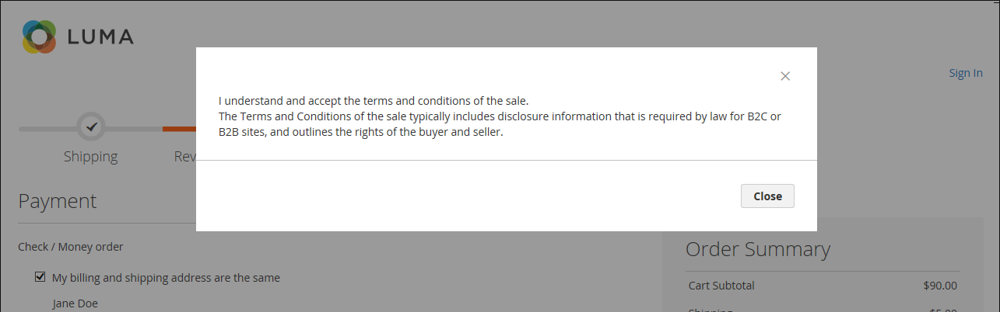
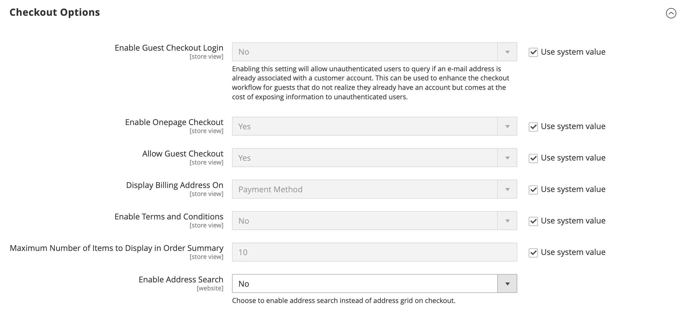
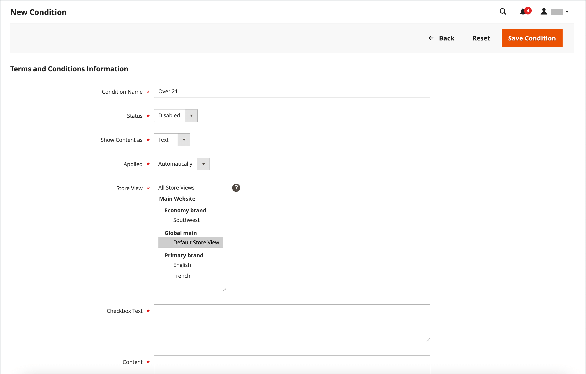

# チェックアウト条件

手動の&#x200B;_利用条件_&#x200B;機能が有効になっている場合、購入が確定する前に、お客様は販売の利用条件に同意する必要があります。 本販売条件には、通常、B2CまたはB2B サイトに関して法律で要求される可能性のある開示情報が含まれており、購入者および販売者の権利の概要が記載されています。 利用条件メッセージは、支払い情報の後、_注文を完了_ ボタンの直前に表示されます。

{width="700" zoomable="yes"}

## ステップ 1：チェックアウトの利用条件を有効にする

1. _管理者_ サイドバーで、**[!UICONTROL Stores]** > _[!UICONTROL Settings]_>**[!UICONTROL Configuration]**に移動します。

1. 左側のパネルで、**[!UICONTROL Sales]**&#x200B;を展開し、**[!UICONTROL Checkout]**&#x200B;を選択します。

1. **[!UICONTROL Checkout Options]** セクションのを展開します。

   {width="600" zoomable="yes"}

1. **[!UICONTROL Enable Onepage Checkout]**&#x200B;が`Yes`に設定されていることを確認します。

1. **[!UICONTROL Enable Terms and Conditions]**&#x200B;を`Yes`に設定します。

1. **[!UICONTROL Save Config]**&#x200B;をクリックします。

## ステップ 2：独自の契約条件の情報を追加する

1. _管理者_ サイドバーで、**[!UICONTROL Stores]** > _[!UICONTROL Settings]_>**[!UICONTROL Terms and Conditions]**に移動します。

   {width="600" zoomable="yes"}

1. 右上隅の「**[!UICONTROL Add New Condition]**」をクリックします。

1. 内部参照の&#x200B;**[!UICONTROL Condition Name]**&#x200B;を入力します。

   {width="600" zoomable="yes"}

1. **[!UICONTROL Status]**&#x200B;を`Enabled`に設定します。

1. **[!UICONTROL Applied]**&#x200B;を次のいずれかに設定します：

   - `Automatically` – 条件は、チェックアウト時に自動的に受け入れられます。
   - `Manually` – お客様は、注文を行うための条件を手動で受け入れる必要があります。

1. **[!UICONTROL Show Content as]**&#x200B;を次のいずれかに設定します：

   - `Text` – 条件コンテンツを書式のないテキストとして表示します。
   - `HTML` - コンテンツを書式設定可能なHTMLとして表示します。

1. これらの利用条件を使用する場所の各&#x200B;**[!UICONTROL Store View]**&#x200B;を選択します。

1. 下にスクロールして、表示される情報を入力します。

   - 利用条件リンクのテキストとして使用する&#x200B;**[!UICONTROL Checkbox Text]**&#x200B;を入力します。 例：`I understand and accept the terms and conditions of the sale`。

   - **[!UICONTROL Content]** ボックスに、販売条件の全文を入力します。

1. （オプション）チェックアウト時に条件ステートメントが表示されるテキストボックスの高さを決定するには、**[!UICONTROL Content Height (css)]**&#x200B;をピクセル単位で入力します。

   例えば、96 dpi ディスプレイでテキストボックスを1 インチ高くするには、`96`と入力します。 コンテンツがボックスの高さを超えると、スクロールバーが表示されます。

1. **[!UICONTROL Save Condition]**&#x200B;をクリックします。
