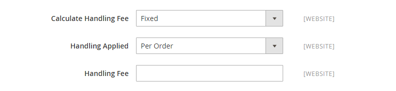

# UPS （統一宅配便）

ユナイテッドパーセルサービス（UPS）は、220 カ国以上に陸路および空路で国内外配送サービスを提供しています。

{{ups-api}}

>[!NOTE]
>
>UPS では [ ディメンション重量 ](carriers.md#dimensional-weight) を使用して、一部の配送料を算出できます。 ただし、Adobe Commerceでは、重量ベースの送料の計算のみをサポートしています。

## 手順 1: UPS 出荷アカウントのオープン

この配送方法を顧客に提供するには、最初に UPS アカウントを開設し、申請を完了して荷主アカウント番号を取得する必要があります。 [ 無料の UPS アカウントを開く ](https://www.ups.com/us/en/business-solutions/open-an-account) を参照してください。

## 手順 2:UPS OAUTH 資格情報の取得

[UPS API の概要 ](https://developer.ups.com/get-started) の手順に従って、UPS 統合を有効にするための API 資格情報（クライアント ID およびクライアント秘密鍵）を取得します。 資格情報を取得するには、UPS アプリケーションを作成する必要があります。

管理者で UPS 設定を指定する場合、`username` と `password` の資格情報の値を使用します。

## 手順 3：ストアの UPS を有効にする

1. _管理者サイドバー_ で、**[!UICONTROL Stores]**/_[!UICONTROL Settings]_/**[!UICONTROL Configuration]**&#x200B;に移動します。

1. 左側のパネルの **[!UICONTROL Sales]** の下で、「**[!UICONTROL Delivery Methods]**」を選択します。

1. 「」を展開し、「**[!UICONTROL UPS]**」セクションを展開します。

1. **[!UICONTROL Enabled for Checkout]** を `Yes` に設定します。

1. UPS REST アカウント（デフォルト）の場合、次の手順を実行します。

   - UPS 資格情報を入力します。UPS ClientID を **[!UICONTROL User ID]**、UPS Client Secret を **[!UICONTROL Password]** と入力します。

   - 安全な接続を介して UPS 出荷システムにデータを送信するには、**[!UICONTROL Mode]** を `Live` に設定します。 （開発モードでは、安全な接続を介してデータが送信されません）。

   - リクエストの送信に必要な **[!UICONTROL Gateway URL]** を確認します。 テストモードにはサンドボックス URL （`https://wwwcie.ups.com/`）を使用し、ライブリクエスト（`https://onlinetools.ups.com`）には実稼動 URL を使用します。 指定したホストでの各リクエストに対して、それぞれのエンドポイントを使用するようにしてください。

   - トラッキング情報の取得に必要な **[!UICONTROL Tracking URL]** を確認します。 テストモードにはサンドボックス URL （`https://wwwcie.ups.com/`）を使用し、ライブリクエスト（`https://onlinetools.ups.com`）には実稼動 URL を使用します。 指定したホストでの各リクエストに対して、それぞれのエンドポイントを使用するようにしてください。

   - 出荷元の地域に **[!UICONTROL Origin of the Shipment]** を設定します。

   - UPS に特別料金がある場合は、**[!UICONTROL Enable Negotiated Rates]** を `Yes` に設定し、UPS によって割り当てられた 6 桁の **[!UICONTROL Shipper Number]** を入力します。

   - **[!UICONTROL Live Account]** を次のいずれかに設定します。

      - `Yes` – 実稼動モードで UPS を実行し、顧客に出荷方法として UPS を提供します。 「ゲートウェイ URL」と「トラッキング URL」で正しいエンドポイントを使用していることを確認します。
      - `No` - テストモードで UPS を実行します。 「ゲートウェイ URL」と「トラッキング URL」で正しいエンドポイントを使用していることを確認します。

   >[!NOTE]
   >
   >標準の United Parcel Service タイプは廃止される予定です。 新しい設定の場合は、デフォルトの `United Parcel Service REST` タイプを使用します。 REST タイプは、[ 配送ラベル ](shipping-labels.md).  を生成する際にも必要です。
   >2.4.7 リリースでは、`UPS` および `UPS XML` タイプが廃止予定で、デフォルトは `UPS REST` であるため、**[!UICONTROL UPS Type]** は削除されます。 ネイティブのAdobe Commerce統合で使用される United Parcel Service （UPS） API は、現在 OAuth 2.0 セキュリティモデルをサポートしていないので、一時的に廃止されます。

   >[!IMPORTANT]
   >
   >UPS は現在のデフォルト （システム値）で使用されている HTTP のサポートを終了しています。 「**[!UICONTROL Use system value]**」チェックボックスをオフにして、HTTPS を使用するように URL を変更します。 例：`https://www.ups.com/using/services/rave/qcostcgi.cgi`

1. **[!UICONTROL Title]**：チェックアウト時に表示する配送オプションの名前を入力します。

   デフォルトでは、このフィールドは `United Parcel Service` に設定されています。

   {width="600" zoomable="yes"}

## 手順 3：コンテナの説明の完了

1. **[!UICONTROL Packages Request Type]** を次のいずれかに設定します。

   - `Use origin weight (few requests)`
   - `Divide to equal weight (one request)`

1. **[!UICONTROL Container]** しくは、出荷に使用する一般的な梱包タイプを指定します。

   - `Customer Packaging`
   - `UPS Letter Envelope`
   - `Customer Supplied Package`
   - `UPS Tube`
   - `PAK`
   - `UPS Express Box`
   - `UPS Worldwide 25 kilo`
   - `UPS Worldwide 10 kilo`
   - `Pallet`
   - `Small Express Box`
   - `Medium Express Box`
   - `Large Express Box`

1. 製品の重量の測定に使用するシステムに **[!UICONTROL Weight Unit]** を設定します。

   UPS がサポートするウェイト システムは国によって異なります。 疑問がある場合は、UPS にどの重量システムを使用する必要があるかを尋ねます。 次のようなオプションがあります。

   - `LBS`
   - `KGS`

1. **[!UICONTROL Destination Type]** を次のいずれかに設定します。

   - `Residential` – ほとんどの出荷は B2C （Business to Consumer）です。
   - `Commercial` – 出荷のほとんどは B2B です。

1. 通信事業者が許可する **[!UICONTROL Maximum Package Weight]** を入力します。

1. **[!UICONTROL Pickup Method]** を次のいずれかに設定します。

   - `Regular Daily Pickup`
   - `On Call Air`
   - `One Time Pickup`
   - `Letter Center`
   - `Customer Counter`

1. 通信事業者が許可する **[!UICONTROL Minimum Package Weight]** を入力します。

   {width="600" zoomable="yes"}

## 手順 5：手数料の設定

手数料は任意で、UPS の送料に加算される追加料金として表示されます。 手数料を含める場合は、次の操作を行います。

1. **[!UICONTROL Calculate Handling Fee]** を次のいずれかのメソッドに設定します。

   - `Fixed`
   - `Percent`

1. 手数料の適用方法を決定するには、**[!UICONTROL Handling Applied]** を次のいずれかに設定します。

   - `Per Order`
   - `Per Package`

1. 請求する **[!UICONTROL Handling Fee]** の金額を入力します。

   パーセンテージを入力するには、小数点形式を使用します。 例えば、25% の場合は `0.25` と入力します。

   {width="600" zoomable="yes"}

## 手順 6：許可される方法と適用国の指定

1. **[!UICONTROL Allowed Methods]** しくは、顧客が使用できる各 UPS 配送方法を選択します。

   チェックアウト時に UPS の下にメソッドが表示されます。 複数の方法を選択するには、Ctrl キー（PC）または Command キー（Mac）を押したまま、各オプションをクリックします。

1. UPS 経由で [ 送料無料 ](shipping-free.md) オプションを提供する場合は、送料無料オプションを設定します。

   - 送料無料に使用する方法に **[!UICONTROL Free Method]** を設定します。 UPS を通じて送料無料を提供したくない場合は、`None` を選択します。

   - UPS を使用した送料無料の注文に該当する最小注文額を要求するには、**[!UICONTROL Enable Free Shipping Threshold]** を `Enable` に設定します。 次に、**[!UICONTROL Free Shipping Amount Threshold]** に最小値を入力します。

1. 必要に応じて、**[!UICONTROL Displayed Error Message]** を変更します。

   このテキスト ボックスには既定のメッセージがあらかじめ設定されていますが、UPS が使用できなくなったときに表示する別のメッセージを入力できます。

   {width="600" zoomable="yes"}

1. **[!UICONTROL Ship to Applicable Countries]** を次のいずれかに設定します。

   - `All Allowed Countries` - ストア設定で指定されたすべての [ 国 ](../getting-started/store-details.md#country-options) の顧客がこの配信方法を使用できます。
   - `Specific Countries` – このオプションを選択すると、「_特定の国に発送_ リストが表示されます。 リストで、この配信方法を使用できる国を選択します。

1. **[!UICONTROL Show Method if Not Applicable]** を次のいずれかに設定します。

   - `Yes` - チェックアウト時に利用可能なすべての UPS 配送方法を一覧表示します。これには、配送に適用されない方法も含まれます。
   - `No` – 出荷に適用可能な UPS 出荷方法のみをリストします。

   {width="600" zoomable="yes"}

1. ストアから行われた UPS 出荷の詳細を記録したログ ファイルを作成するには、**[!UICONTROL Debug]** を `Yes` に設定します。

1. **[!UICONTROL Sort Order]**：番号を入力して、チェックアウト時に他の配信方法と一緒に表示される UPS の順序を決定します。

   `0` = 1 番目、`1` = 2 番目、`2` = 3 番目など。

1. 「**[!UICONTROL Save Config]**」をクリックします。

## 手順 7：発送元住所の設定

1. [ ストア情報 ](../getting-started/store-details.md#store-information) が完成していることを確認します。

1. _管理者_ サイドバーで、**[!UICONTROL Stores]**/_[!UICONTROL Settings]_/**[!UICONTROL Configuration]**&#x200B;に移動します。

1. 左側のパネルで「**[!UICONTROL Sales]**」を展開し、「**[!UICONTROL Shipping Settings]**」を選択します。

1. ページの  **[!UICONTROL Origin]** を展開し、発送元住所を設定します。

   {width="600" zoomable="yes"}

1. 「**[!UICONTROL Save Config]**」をクリックします。

>[!NOTE]
>
>Commerceでは、配送料を計算する際に、UPS に対する全注文価格を宣言しません。 この動作は変更できません。
