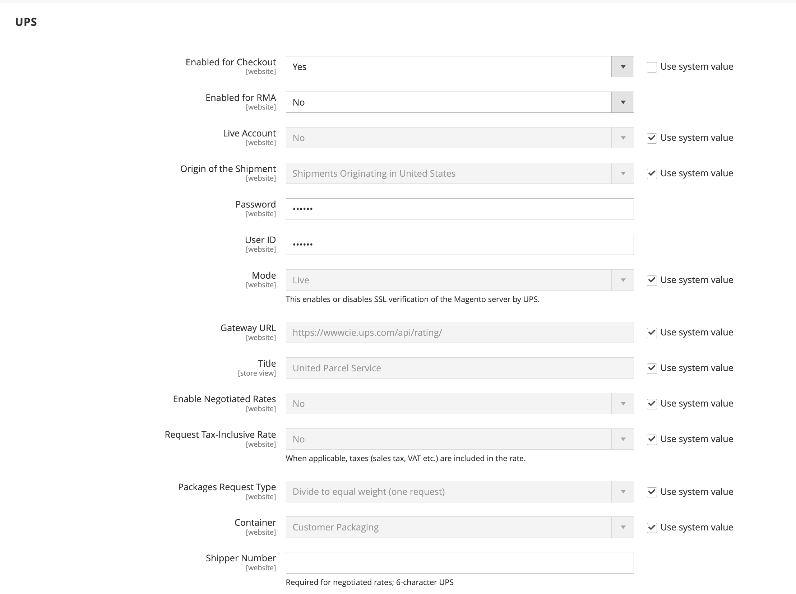
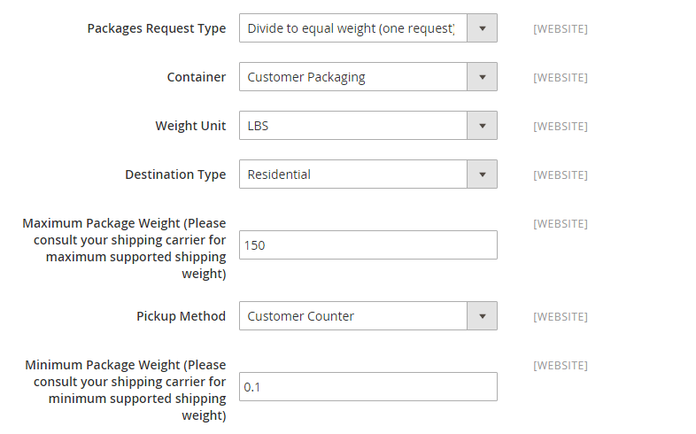
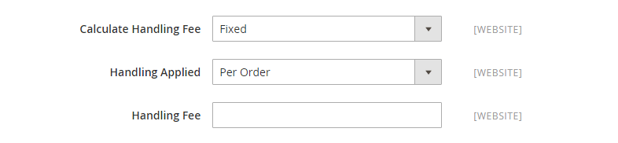
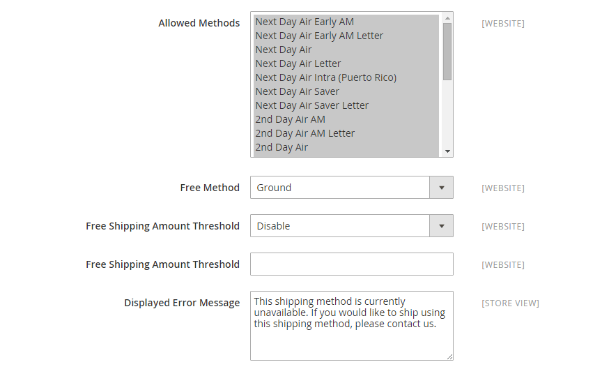
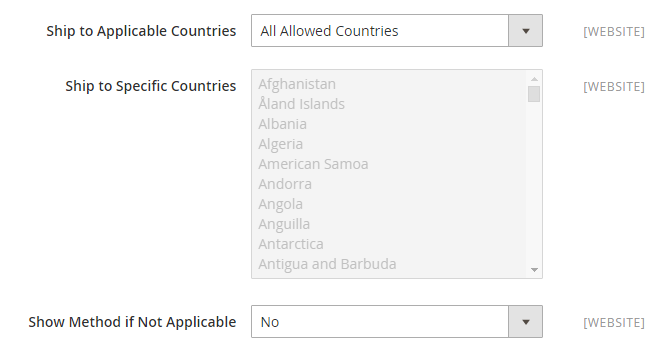
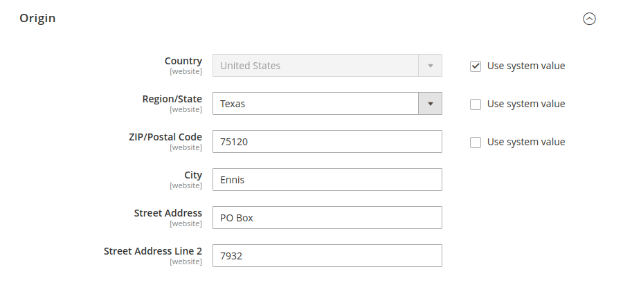

# United Parcel Service （UPS）

United Parcel Service （UPS）は、220 カ国以上に陸路と空路による国内および国際配送サービスを提供しています。

{{ups-api}}

>[!NOTE]
>
>UPSでは、[ ディメンションの重さ](carriers.md#dimensional-weight)を使用して、一部の配送料を決定できます。 ただし、Adobe Commerceでは、重量ベースの送料の計算のみがサポートされています。

## ステップ 1:UPS出荷口座を開く

この配送方法を顧客に提供するには、まずUPS アカウントを開き、シッパーのアカウント番号を取得するために申請を完了する必要があります。 [無料のUPS アカウントを開く](https://www.ups.com/us/en/business-solutions/open-an-account)を参照してください。

## 手順2:UPS OAUTH資格情報の取得

「[UPS APIの概要ガイド ](https://developer.ups.com/get-started)」の手順に従って、API資格情報（クライアント IDおよびクライアントシークレット）を取得し、UPS統合を有効にします。 認証情報を取得するには、UPS アプリケーションを作成する必要があります。

管理者でUPS設定を構成する場合は、`username`と`password`の資格情報の値を使用します。

## ステップ 3：ストアのUPSを有効にする

1. _管理者サイドバー_&#x200B;で、**[!UICONTROL Stores]** > _[!UICONTROL Settings]_>**[!UICONTROL Configuration]**に移動します。

1. 左側の&#x200B;**[!UICONTROL Sales]**&#x200B;の下にあるパネルで、**[!UICONTROL Delivery Methods]**&#x200B;を選択します。

1. **[!UICONTROL UPS]** セクションのを展開します。

1. **[!UICONTROL Enabled for Checkout]**&#x200B;を`Yes`に設定します。

1. UPS REST アカウント（デフォルト）の場合は、次の操作を行います。

   - UPS資格情報を入力します：UPS ClientIDは&#x200B;**[!UICONTROL User ID]**、UPS Client Secretは&#x200B;**[!UICONTROL Password]**&#x200B;です。

   - 安全な接続を介してUPS配送システムにデータを送信するには、**[!UICONTROL Mode]**&#x200B;を`Live`に設定します。 （開発モードでは、セキュアな接続を介してデータを送信しません）。

   - リクエストの送信に必要な&#x200B;**[!UICONTROL Gateway URL]**&#x200B;を確認します。 テストモードにはサンドボックス URL （`https://wwwcie.ups.com/api/rating/`）を、ライブリクエスト （`https://onlinetools.ups.com/api/rating/`）には実稼動URLを使用します。 特定のホストで各リクエストのそれぞれのエンドポイントを使用してください。

   - トラッキング情報の取得に必要な&#x200B;**[!UICONTROL Tracking URL]**&#x200B;を確認します。 テストモードにはサンドボックス URL （`https://wwwcie.ups.com/api/track/`）を、ライブリクエスト （`https://onlinetools.ups.com/api/track/`）には実稼動URLを使用します。 特定のホストで各リクエストのそれぞれのエンドポイントを使用してください。

   - **[!UICONTROL Origin of the Shipment]**&#x200B;を出荷元の地域に設定します。

   - UPSで特別料金を利用している場合は、**[!UICONTROL Enable Negotiated Rates]**&#x200B;を`Yes`に設定し、UPSによって割り当てられた6桁の&#x200B;**[!UICONTROL Shipper Number]**&#x200B;を入力してください。

   - **[!UICONTROL Live Account]**&#x200B;を次のいずれかに設定します：

      - `Yes` - UPSを実稼動モードで実行し、お客様にUPSを出荷方法として提供します。 ゲートウェイ URLとトラッキング URLの下に正しいエンドポイントを使用してください。
      - `No` - テスト モードでUPSを実行します。 ゲートウェイ URLとトラッキング URLの下に正しいエンドポイントを使用してください。

   >[!NOTE]
   >
   >標準のUnited Parcel Service タイプは非推奨化の予定です。新しい設定の場合は、デフォルトの`United Parcel Service REST` タイプを使用します。REST タイプは、[配送ラベル ](shipping-labels.md). を生成するためにも必要です
   >2.4.7 リリースでは、`UPS`と`UPS XML`のタイプが非推奨に予定されており、`UPS REST`がデフォルトであるため、**[!UICONTROL UPS Type]**&#x200B;が削除されます。 ネイティブのAdobe Commerce統合で使用されるUnited Parcel Service （UPS） APIは、現在OAuth 2.0 セキュリティモデルをサポートしていないため、一時的に非推奨（廃止予定）です。

   >[!IMPORTANT]
   >
   >UPSは、現在のデフォルト（システム値）で使用されているHTTPのサポートを終了します。 「**[!UICONTROL Use system value]**」チェックボックスをオフにし、HTTPSを使用するようにURLを変更します。 例：`https://www.ups.com/using/services/rave/qcostcgi.cgi`

1. **[!UICONTROL Title]**&#x200B;の場合、チェックアウト時に表示するオプションの名前を入力します。

   デフォルトでは、このフィールドは`United Parcel Service`に設定されています。

   {width="600" zoomable="yes"}

## 手順3: コンテナの説明を入力します

1. **[!UICONTROL Packages Request Type]**&#x200B;を次のいずれかに設定します：

   - `Use origin weight (few requests)`
   - `Divide to equal weight (one request)`

1. **[!UICONTROL Container]**&#x200B;の場合、出荷に使用する一般的なパッケージの種類を指定します。

   - `Customer Packaging`
   - `UPS Letter Envelope`
   - `Customer Supplied Package`
   - `UPS Tube`
   - `PAK`
   - `UPS Express Box`
   - `UPS Worldwide 25 kilo`
   - `UPS Worldwide 10 kilo`
   - `Pallet`
   - `Small Express Box`
   - `Medium Express Box`
   - `Large Express Box`

1. 製品の重みを測定するために使用するシステムに&#x200B;**[!UICONTROL Weight Unit]**&#x200B;を設定します。

   UPSがサポートする重量制度は国によって異なります。 もし疑問を感じたら、どのウエイトシステムを使用すべきかをUPSに尋ねます。 オプションは次のとおりです。

   - `LBS`
   - `KGS`

1. **[!UICONTROL Destination Type]**&#x200B;を次のいずれかに設定します：

   - `Residential` – 出荷のほとんどは企業対消費者（B2C）です。
   - `Commercial` – 出荷のほとんどは企業間取引（B2B）です。

1. 通信事業者が許可する&#x200B;**[!UICONTROL Maximum Package Weight]**&#x200B;を入力します。

1. **[!UICONTROL Pickup Method]**&#x200B;を次のいずれかに設定します：

   - `Regular Daily Pickup`
   - `On Call Air`
   - `One Time Pickup`
   - `Letter Center`
   - `Customer Counter`

1. 通信事業者が許可する&#x200B;**[!UICONTROL Minimum Package Weight]**&#x200B;を入力します。

   {width="600" zoomable="yes"}

## 手順5：処理手数料の設定

処理手数料はオプションで、UPSの送料に追加される追加料金として表示されます。 処理手数料を含める場合は、次の操作を行います。

1. **[!UICONTROL Calculate Handling Fee]**&#x200B;を次のいずれかのメソッドに設定します。

   - `Fixed`
   - `Percent`

1. 処理手数料の適用方法を決定するには、**[!UICONTROL Handling Applied]**&#x200B;を次のいずれかに設定します。

   - `Per Order`
   - `Per Package`

1. 請求する&#x200B;**[!UICONTROL Handling Fee]**&#x200B;の金額を入力してください。

   割合を入力するには、小数点以下桁を使用します。 例えば、25%に「`0.25`」と入力します。

   {width="600" zoomable="yes"}の処理

## 手順6：許可される方法と適用可能な国の指定

1. **[!UICONTROL Allowed Methods]**&#x200B;の場合、お客様が利用できる各UPS配送方法を選択します。

   チェックアウト時にUPSの下にメソッドが表示されます。 複数の方法を選択するには、Ctrl キー（PC）またはCommand キー（Mac）を押しながら、各オプションをクリックします。

1. UPSを通じて[送料無料](shipping-free.md) オプションを提供する場合は、送料無料オプションを設定します。

   - **[!UICONTROL Free Method]**&#x200B;を送料無料に使用する方法に設定します。 UPSを通じて送料無料を提供しない場合は、`None`を選択します。

   - UPSでの送料無料の注文に該当する最低注文金額を要求するには、**[!UICONTROL Enable Free Shipping Threshold]**&#x200B;を`Enable`に設定します。 次に、最小値を&#x200B;**[!UICONTROL Free Shipping Amount Threshold]**&#x200B;に入力します。

1. 必要に応じて、**[!UICONTROL Displayed Error Message]**&#x200B;を変更します。

   このテキストボックスにはデフォルトのメッセージがプリセットされていますが、UPSが使用できなくなった場合に表示する別のメッセージを入力できます。

   {width="600" zoomable="yes"}

1. **[!UICONTROL Ship to Applicable Countries]**&#x200B;を次のいずれかに設定します：

   - `All Allowed Countries` - ストア設定で指定されたすべての[国](../getting-started/store-details.md#country-options)のお客様は、この配信方法を使用できます。
   - `Specific Countries` – このオプションを選択すると、_特定国への配送_ リストが表示されます。 この配信方法を使用できるリストの各国を選択します。

1. **[!UICONTROL Show Method if Not Applicable]**&#x200B;を次のいずれかに設定します：

   - `Yes` - チェックアウト時に使用可能なすべてのUPSの出荷方法を一覧表示します。これには、配送に適用されない方法も含まれます。
   - `No` – 配送に適用されるUPS配送方法のみを一覧表示します。

   {width="600" zoomable="yes"}

1. ストアから行われたUPS出荷の詳細を含むログファイルを作成するには、**[!UICONTROL Debug]**&#x200B;を`Yes`に設定します。

1. **[!UICONTROL Sort Order]**&#x200B;に番号を入力して、チェックアウト時に他の配信方法と一緒に表示されるUPSが表示される順序を決定します。

   `0` = first、`1` = second、`2` = thirdなど。

1. **[!UICONTROL Save Config]**&#x200B;をクリックします。

## ステップ 7：配送元の住所を設定する

1. [ ストア情報](../getting-started/store-details.md#store-information)が完了していることを確認してください。

1. _管理者_ サイドバーで、**[!UICONTROL Stores]** > _[!UICONTROL Settings]_>**[!UICONTROL Configuration]**に移動します。

1. 左側のパネルで、**[!UICONTROL Sales]**&#x200B;を展開し、**[!UICONTROL Shipping Settings]**&#x200B;を選択します。

1. ページの **[!UICONTROL Origin]**&#x200B;を展開し、発送元の住所を設定します。

   {width="600" zoomable="yes"}

1. **[!UICONTROL Save Config]**&#x200B;をクリックします。

>[!NOTE]
>
>Commerceは、送料を計算する際に、注文金額をUPSに申告しません。 この動作は変更できません。
