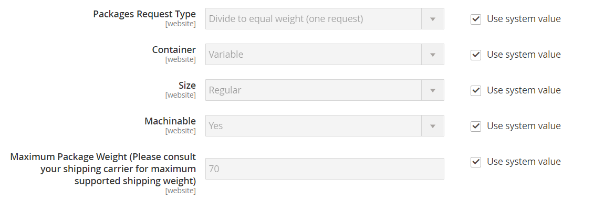

# 米国郵政公社

アメリカ合衆国郵便局はアメリカ合衆国政府の独立した郵便サービスであり、陸路と空路による国内及び国際配送サービスを提供する。

## ステップ 1:USPSの送料アカウントを開く

[USPS Developer Portal](https://developers.usps.com/) アカウントを開きます。 登録プロセスが完了すると、ユーザーIDとUSPS テストサーバーへのURLが届きます。 USPS APIについて詳しくは、[技術ドキュメント ](https://developers.usps.com/getting-started)を参照してください。

## ステップ 2：ストアでUSPSを有効にする

{{$include /help/_includes/usps-api-type-configuration-note.md}}

1. _管理者_ サイドバーで、**[!UICONTROL Stores]** > _[!UICONTROL Settings]_>**[!UICONTROL Configuration]**に移動します。

1. 左側のパネルで、**[!UICONTROL Sales]**&#x200B;を展開し、**[!UICONTROL Delivery Methods]**&#x200B;を選択します。

1. **[!UICONTROL USPS]** セクションのを展開します。

   >[!NOTE]
   >
   >必要に応じて、最初に&#x200B;**[!UICONTROL Use system value]** チェックボックスの選択を解除し、説明に従って次の設定を変更します。

1. **[!UICONTROL Enabled for Checkout]**&#x200B;を`Yes`に設定します。

1. **[!UICONTROL USPS Type]**&#x200B;を`USPS REST API`に設定します。

   >[!NOTE]
   >
   >USPSでは、USPS Web Tools APIがサポートされなくなりました。

1. 必要に応じて、**[!UICONTROL Gateway URL]**&#x200B;を入力してUSPSの送料にアクセスします。

   フィールドはデフォルトでプリセットされており、通常は変更する必要はありません。

1. チェックアウト時に表示されるこの配送方法の&#x200B;**[!UICONTROL Title]**&#x200B;を入力してください。

1. USPSが提供する資格情報を使用して、次のフィールドに入力します。

   USPS Rest APIを使用している場合は、次の資格情報を指定します。

   - **[!UICONTROL Consumer Key]**
   - **[!UICONTROL Consumer Secret]**
   - **[!UICONTROL Pricing Options]**

   USPS Web Tools APIを使用している場合は、次の資格情報を指定します。

   - **[!UICONTROL User ID]**
   - **[!UICONTROL Password]**

1. **[!UICONTROL Mode]**&#x200B;を次のいずれかに設定します：

   - `Development` - テスト環境でUSPSを実行します。 開発環境でUSPSを実行した後、必ず後で戻ってModeを`Live`に設定してください。
   - `Live` - ライブ実稼動環境でUSPSを実行します。

## 手順3：パッケージの説明を完了する

1. 複数のパッケージとして送信された場合の注文の管理方法を判断するには、**[!UICONTROL Packages Request Type]**&#x200B;を次のいずれかに設定します。

   - `Divide to Equal Weight` - （1回のリクエスト）複数のパッケージを同じ重みで割った場合、1回のリクエストとして複数のパッケージの出荷を送信できます。
   - `Use Origin Weight` - （複数のリクエスト）発送元の重量を出荷原価の計算の基礎として使用する場合、複数のパッケージを個別のリクエストとして送信する必要があります。

1. **[!UICONTROL Container]**&#x200B;を、お店で注文した商品の出荷に通常使用されるパッケージの種類に設定します。

1. ストアから出荷される一般的なパッケージの&#x200B;**[!UICONTROL Size]**&#x200B;を設定します。

1. **[!UICONTROL Machinable]**&#x200B;を次のいずれかに設定します：

   - `Yes` – 通常のパッケージをコンピューターで処理できる場合。
   - `No` – 一般的なパッケージを手動で処理する必要がある場合。

1. 通信事業者の要件に従って&#x200B;**[!UICONTROL Maximum Package Weight]**&#x200B;を入力します。

   {width="600" zoomable="yes"}

## 手順4：処理手数料の設定

処理手数料はオプションで、DHLの送料に追加される追加料金として表示されます。 処理手数料を含める場合は、次の操作を行います。

1. **[!UICONTROL Calculate Handling Fee]**&#x200B;を次のいずれかのメソッドに設定します。

   - `Fixed`
   - `Percent`

1. 処理手数料の適用方法を決定するには、**[!UICONTROL Handling Applied]**&#x200B;を次のいずれかに設定します。

   - `Per Order`
   - `Per Package`

1. 請求する&#x200B;**[!UICONTROL Handling Fee]**&#x200B;の金額を入力してください。

   割合を入力するには、小数点以下桁を使用します。 例えば、25%に「`25`」と入力します。

   {width="600" zoomable="yes"}

## ステップ 5：許可された方法と適用国を指定する

1. **[!UICONTROL Allowed Methods]**&#x200B;の場合、顧客が利用できる各USPS配送方法を選択します。

   チェックアウト時にUSPSの下に表示されます。 複数の方法を選択するには、Ctrl キー（PC）またはCommand キー（Mac）を押しながら、各オプションをクリックします。

1. USPSを通じて[送料無料](shipping-free.md) オプションを提供する場合は、送料無料オプションを設定します。

   - **[!UICONTROL Free Method]**&#x200B;を送料無料に使用する方法に設定します。 USPSを通じて送料無料を提供しない場合は、`None`を選択します。

   - USPSでの送料無料の注文に該当する最低注文金額を要求するには、**[!UICONTROL Enable Free Shipping Threshold]**&#x200B;を`Enable`に設定します。 次に、最小値を&#x200B;**[!UICONTROL Free Shipping Amount Threshold]**&#x200B;に入力します。

1. 必要に応じて、**[!UICONTROL Displayed Error Message]**&#x200B;を変更します。

   このテキストボックスにはデフォルトのメッセージがプリセットされていますが、USPSが使用できなくなった場合に表示する別のメッセージを入力できます。

   {width="600" zoomable="yes"}

1. **[!UICONTROL Ship to Applicable Countries]**&#x200B;を次のいずれかに設定します：

   - `All Allowed Countries` - ストア設定で指定されたすべての[国](../getting-started/store-details.md#country-options)のお客様は、この配信方法を使用できます。
   - `Specific Countries` – このオプションを選択すると、_特定国への配送_ リストが表示されます。 この配信方法を使用できるリストの各国を選択します。

   {width="600" zoomable="yes"}

1. **[!UICONTROL Show Method if Not Applicable]**&#x200B;を次のいずれかに設定します：

   - `Yes` - チェックアウト時に使用可能なすべてのUSPS配送方法を、配送に適用されない方法を含めて一覧表示します。
   - `No` – 配送に適用されるUSPS配送方法のみを一覧表示します。

1. ストアから行われたUSPSの出荷の詳細を含むログファイルを作成するには、**[!UICONTROL Debug]**&#x200B;を`Yes`に設定します。

1. **[!UICONTROL Sort Order]**&#x200B;に番号を入力して、チェックアウト時に他の配信方法と共に表示されるときにUSPSが表示されるシーケンスを決定します。

   `0` = first、`1` = second、`2` = thirdなど。

1. **[!UICONTROL Save Config]**&#x200B;をクリックします。

<!-- Last updated from includes: 2026-05-12 15:47:19 -->
