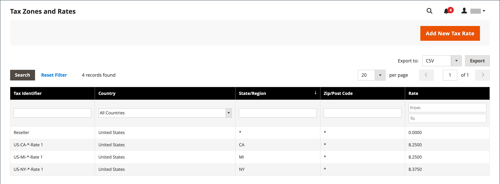
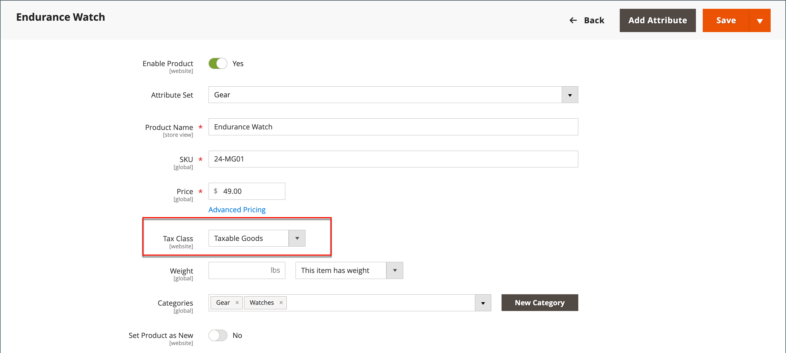
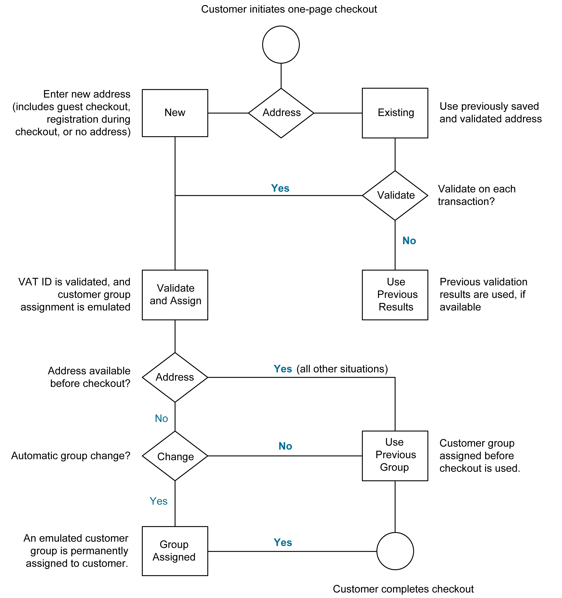

# 付加価値税（VAT）

物品やサービスに付加価値税（VAT）を課す国もあります。 VAT率は、製造や流通のプロセス、材料、サービスの段階によって異なります。 複数のVAT レートを適用して、支払い期限の税金を正しく計算できます。

Commerceでは、加盟店またはお客様の住所（両方が同じ国の場合）に基づいて付加価値税を請求するように設定できます。 VATの計算は通常、発送先ではなく、発送先に基づいて行われます。 ほとんどの場合、顧客配送先住所に基づいてVATを計算する設定設定で十分です。

## シナリオ例

- あるEU加盟国のVAT登録済みビジネスで、別のEU加盟国の個人に商品を供給する場合、VATは加盟店の所在地に基づいて「遠隔販売」として計算されます。

- イギリスの住所に配送するイギリスの店舗から購入するオランダのビジネスは、イギリスのVAT料金を支払う必要があります。

- [&#x200B; ダウンロード可能な商品](../catalog/product-create-downloadable.md)または&#x200B;_デジタル商品_&#x200B;の販売では、VAT率は加盟店の場所ではなく、配送先に基づいています。 [&#x200B; デジタル商品の供給場所](taxes.md#place-of-supply-for-digital-goods-eu)を参照してください。

>[!TIP]
>
>一部の国境を越えたB2Bの配送では、より複雑な税制が適用されます。 Commerce インストールのネイティブ機能を拡張するには、[Marketplace](https://marketplace.magento.com/extensions/accounting-finance/taxes.html)から税管理ソリューションを追加することを検討してください。

## VATの設定

次の手順には、英国で小売顧客への販売のために20%のVATを設定する手順の例が含まれています。 その他の税率や国については、一般的な手順に従いますが、国、VAT率、顧客タイプなどに対応する特定の情報を入力してください。

>[!NOTE]
>
>先に進む前に、お住まいの地域のVATに適用されるルールと規制を確認してください。

特定の企業間取引では、VATは評価されません。 Commerceでは、お客様のVAT IDを検証して、VATが適切に評価されている（または評価されていない）ことを確認できます。 [VAT ID検証](#vat-id-validation)を参照してください。

### 手順1：顧客税区分の設定

税ルールを作成するプロセスは、税率を追加することから始まります。

1. _管理者_ サイドバーで、**[!UICONTROL Stores]** > _[!UICONTROL Taxes]_>**[!UICONTROL Tax Zones and Rates]**&#x200B;に移動します。

   {width="600" zoomable="yes"}

1. VATで使用するのに適した顧客税区分があることを確認します。

   この例では、_Retail Customer_&#x200B;という名前の顧客税区分があることを確認します。 この税区分が存在しない場合は、**[!UICONTROL Add New Tax Rate]**&#x200B;をクリックします。

1. 新しい税区分の&#x200B;**[!UICONTROL Tax Identifier]**&#x200B;を入力します。

   税ルールを作成すると、すべての税率が&#x200B;_税ルール情報_&#x200B;の&#x200B;_税率_ フィールドに表示されます。

1. 郵便番号の範囲（/～）を設定するには、「**[!UICONTROL Zip/Post is Range]**」チェックボックスを選択します。

1. 税率が適用される&#x200B;**[!UICONTROL Country]**&#x200B;を選択します。

1. 購入時の税率の計算に使用する&#x200B;**[!UICONTROL Rate Percent]**&#x200B;を入力します。

1. 完了したら、**[!UICONTROL Save Rate]**&#x200B;をクリックします。

送信された税率に基づいて、その後の税ルールを作成できます。 税率がない場合、税ルールの作成は不可能になります。

### 手順2：製品税区分の設定

1. _管理者_ サイドバーで、**[!UICONTROL Stores]** > _[!UICONTROL Taxes]_>**[!UICONTROL Tax Rules]**&#x200B;に移動します。

1. **[!UICONTROL Add New Tax Rule]**&#x200B;をクリックします。

1. **[!UICONTROL Additional Settings]** セクションのを展開します。

   {width="600" zoomable="yes"}

1. _製品税区分_&#x200B;で、**[!UICONTROL Add New Tax Class]**&#x200B;をクリックします。

1. 使用可能な製品税区分のリストに新しい区分を追加し、3つの新しい区分を作成するには、新しい税区分の&#x200B;**[!UICONTROL Name]**&#x200B;を入力し、チェックマークをクリックします。

   - `VAT Standard`
   - `VAT Reduced`
   - `VAT Zero`

1. 追加した新しいクラスごとに&#x200B;**[!UICONTROL Save Class]**&#x200B;をクリックします。

1. **[!UICONTROL Save Rule]**&#x200B;をクリックします。

### 手順3：税区間と税率の設定

1. _管理者_ サイドバーで、**[!UICONTROL Stores]** > _[!UICONTROL Taxes]_>**[!UICONTROL Tax Zones and Rates]**&#x200B;に移動します。

   この例では、米国の税率を削除するか、そのまま残します。

1. **[!UICONTROL Add New Tax Rate]**&#x200B;をクリックします。

   {width="600" zoomable="yes"}

1. 新しいレートを次のように定義します。

   **VAT標準**

   - 税識別子：`VAT Standard`
   - 国と州：`United Kingdom`
   - 率の割合：`20.00`

   **VAT減税**

   - 税識別子：`VAT Reduced`
   - 国と州：`United Kingdom`
   - 率の割合：`5.00`

1. 各レートの&#x200B;**[!UICONTROL Save Rate]**&#x200B;をクリックします。

### 手順4：税ルールの設定

税ルールは、顧客税区分、製品税区分および税率の組み合わせです。

1. _管理者_ サイドバーで、**[!UICONTROL Stores]** > _[!UICONTROL Taxes]_>**[!UICONTROL Tax Rules]**&#x200B;に移動します。

1. 次のように新しい税ルールを追加します。

   **VAT標準**

   - 名前：`VAT Standard`
   - 顧客税区分：`Retail Customer`
   - 製品税区分：`VAT Standard`
   - 税率：`VAT Standard Rate`

   **減税**

   - 名前：`VAT Reduced`
   - 顧客税区分：`Retail Customer`
   - 製品税区分：`VAT Reduced`
   - 税率：`VAT Reduced Rate`

1. 各レートの&#x200B;**[!UICONTROL Save Rule]**&#x200B;をクリックします。

### 手順5：製品への税区分の適用

1. _管理者_ サイドバーで、**[!UICONTROL Catalog]** > **[!UICONTROL Manage Products]**&#x200B;に移動します。

1. カタログから商品を編集モードで開きます。

1. _一般_ ページで、**[!UICONTROL Tax Class]** オプションを見つけて、製品に適用される&#x200B;**[!UICONTROL VAT Class]**&#x200B;を選択します。

1. 完了したら、**[!UICONTROL Save]**&#x200B;をクリックします。

   {width="600" zoomable="yes"}

## フィールドの説明

### 店舗情報

Commerceでは、次の[店舗情報の設定設定](../configuration-reference/general/general.md#store-information)を使用して、マーチャント情報に基づいてVATを計算します。

**[!UICONTROL VAT Number]** - マーチャントに割り当てられている付加価値税番号。

**[!UICONTROL Validate VAT Number]** - [VAT検証](#vat-id-validation)は、VAT番号が[欧州委員会](https://ec.europa.eu/taxation_customs/vies/) データベースの対応するレコードと一致することを確認します。

### ユーザー情報

Commerceでは、次のフィールドを使用して、[お客様の情報](../customers/account-dashboard-account-information.md)）に基づいてVATを計算します。

#### アカウント情報

**[!UICONTROL Tax/VAT Number]** – 該当する場合、お客様に割り当てられている税番号または付加価値税番号。

#### 住所

**[!UICONTROL VAT Number]** – 該当する場合、お客様の特定の請求先住所または配送先住所に関連付けられている付加価値税番号。 EU内の[&#x200B; デジタル商品](taxes.md#place-of-supply-for-digital-goods-eu)）の販売の場合、VATの金額は配送先に基づきます。

### 顧客アカウント

Commerceでは、次の[お客様の設定](../customers/account-options-new.md)を使用してVATを計算します。

**[!UICONTROL Show VAT Number on Storefront]** – 顧客アカウントで利用可能なアドレス帳に顧客のVAT番号フィールドが含まれているかどうかを判断します。

**[!UICONTROL Default Value for Disable Automatic Group Changes Based on VAT ID]** - VAT IDは、VAT検証で使用される場合の顧客のVAT番号の内部識別子です。 VAT検証中、Commerceは、その番号が[欧州委員会](https://ec.europa.eu/taxation_customs/vies/) データベースと一致することを確認します。 検証結果に基づいて、4つのデフォルトの顧客グループのいずれかに顧客を自動的に割り当てることができます。

## VAT登録番号の検証

_VAT ID検証_&#x200B;は、加盟店と顧客のロケールに基づいて、欧州連合（EU）内で行われるB2B トランザクションに必要な税金を自動的に計算します。 Commerceは、[欧州委員会](https://ec.europa.eu/taxation_customs/vies/) サーバーのweb サービスを使用してVAT ID検証を実行します。

>[!NOTE]
>
>VAT関連の税制は他の税制に影響を与えず、他の税制の適用を妨げません。 一度に適用できる税ルールは1つだけです。

- 加盟店とお客様が同じEU加盟国にいる場合は、VATが請求されます。
- 加盟店とお客様が異なるEU加盟国にあり、両当事者がEU登録の事業体である場合、VATは請求されません。

ストア管理者は、アカウントの作成、アドレスの作成または更新、チェックアウト時に顧客に自動的に割り当てることができる複数のデフォルト顧客グループを作成します。 その結果、異なる税制が国内（国内）およびEU内の販売に使用されます。

>[!IMPORTANT]
>
>送料が不要なバーチャルまたはダウンロード可能な製品を販売する場合は、お客様の居住国のVAT レートを国内販売と国内販売の両方に使用する必要があります。 バーチャル製品に対応する製品税区分に対して、追加の個人税ルールを作成します。

### 顧客登録ワークフロー

VAT ID検証が有効になっている場合は、登録後、各顧客にVAT ID番号を入力するように提案されます。 ただし、このフィールドに入力できるのは、VATの顧客として登録されている買い物客のみです。

お客様がVAT番号およびその他のアドレスフィールドを指定し、保存を選択すると、システムはアドレスを保存し、VAT ID検証要求を欧州委員会サーバーに送信します。 検証の結果に従って、デフォルトのグループの1つが顧客に割り当てられます。 このグループは、顧客または管理者がデフォルトアドレスのVAT IDを変更するか、デフォルトアドレス全体を変更した場合に変更できます。 1 ページのチェックアウト中に、グループを一時的に変更できる（グループの変更がエミュレートされる）場合があります。

有効になっている場合は、_[!UICONTROL Customer Information]_&#x200B;ページのチェックボックスを選択して、個々の顧客のVAT ID検証を上書きできます。

### チェックアウトワークフロー

チェックアウト時にお客様のVAT検証が実行された場合、VAT要求識別子とVAT要求日は、注文の「コメント履歴」セクションに保存されます。

チェックアウト時のVAT ID検証と顧客グループの変更に関するシステムの動作は、「各トランザクションの検証」および「自動グループ変更を無効にする」設定の設定方法によって異なります。 この節では、フロントエンドでのチェックアウトに対するVAT ID検証機能の実装について説明します。

お客様がGoogle Express Checkout、PayPal Express Checkout、またはその他の外部チェックアウト方法を使用する場合、チェックアウトは外部支払いゲートウェイの側で完全に実行されます。 このシナリオでは、_各トランザクションで検証_&#x200B;設定を適用できず、チェックアウト中に顧客グループを変更できません。

{width="550" zoomable="yes"}

### VAT ID検証の設定

VAT ID検証を設定するには、まず必要な顧客グループを設定し、関連する税区分、レートおよびルールを作成する必要があります。 次に、ストアのVAT ID検証を有効にし、設定を完了します。

次の例は、VAT ID検証に税区分と税率がどのように使用されるかを示しています。 例を確認し、ストアに必要な税区分とルールを設定する手順に従います。

#### 例：VAT IDの検証に必要な最小限の税金ルール

| 税ルール #1 |  |
|--- |--- |
| 顧客税区分 | 顧客税区分には、次のものが含まれている必要があります。 国内顧客向けの区分。  VAT IDが正しくフォーマットされていない顧客向けのクラス。 VAT IDの検証に失敗した顧客向けのクラス。 |
| 製品税区分 | 製品税クラスには、バンドルと仮想を除くすべてのタイプの製品に対するクラスを含める必要があります。 |
| 税率 | 税率には、加盟店の国のVAT レートを含める必要があります。 |

{style="table-layout:auto"}

| 税ルール #2 |   |
|--- |--- |
| 顧客税区分 | ユニオン内顧客向けのクラスです。 |
| 製品税区分 | 仮想を除くすべてのタイプの製品のクラス。 |
| 税率 | 加盟店の国を除くすべてのEU加盟国のVAT税率。 現在、この割合は0%です。 |

{style="table-layout:auto"}

| 税ルール #3 | （仮想およびダウンロード可能な製品の場合は必須） |
|--- |--- |
| 顧客税区分 | 顧客税区分には、次のものが含まれている必要があります。 国内顧客向けのクラス  無効なVAT IDを持つお客様向けのクラス VAT IDの検証に失敗した顧客向けのクラス |
| 製品税区分 | バーチャル商品のクラス。 |
| 税率 | 加盟店の国のVAT レート。 |

{style="table-layout:auto"}

| 税ルール #4 | （仮想およびダウンロード可能な製品の場合は必須） |
|--- |--- |
| 顧客税区分 | ユニオン内顧客向けのクラスです。 |
| 製品税区分 | バーチャル商品のクラス。 |
| 税率 | 加盟店の国を除くすべてのEU加盟国のVAT税率。 現在、この割合は0%です。 |

{style="table-layout:auto"}

#### ステップ 1:VAT関連の顧客グループを作成する

VAT ID検証は、VAT ID検証結果に従って、4つのデフォルト顧客グループのうちの1つを顧客に自動的に割り当てます。

- 国内線
- EU域内
- 無効なVAT ID
- 検証エラー

VAT ID検証用の顧客グループを作成するか、ビジネスロジックに準拠している場合は既存のグループを使用できます。 VAT ID検証を設定する場合、作成した各顧客グループを、適切なVAT ID検証結果を持つ顧客のデフォルトとして割り当てる必要があります。

#### ステップ 2:VAT関連のクラス、料金、ルールの作成

各税ルールは、次の3つのエンティティで定義されます。

- 顧客税区分
- 製品税クラス
- 税率

VAT ID検証を効果的に使用するための[税ルール &#x200B;](tax-rules.md)を作成します。

- 税ルールには、税率と[税区分](tax-class.md)が含まれます。
- 税区分は[顧客グループ &#x200B;](../customers/customer-groups.md)に割り当てられます。

#### 手順3:VAT ID検証の有効化と設定

1. _管理者_ サイドバーで、**[!UICONTROL Stores]** > _[!UICONTROL Settings]_>**[!UICONTROL Configuration]**&#x200B;に移動します。

1. 必要に応じて、設定の&#x200B;**[!UICONTROL Store View]**&#x200B;を設定します。

1. 左側のパネルで、**[!UICONTROL Customers]**&#x200B;を展開し、**[!UICONTROL Customer Configuration]**&#x200B;を選択します。

1. **[!UICONTROL Create New Account Options]** セクションのを展開します。

   次の例では、VAT検証に関連しない一般的なお客様の設定は薄暗くなっています。

   {width="600" zoomable="yes"}

1. **[!UICONTROL Enable Automatic Assignment to Customer Group]**&#x200B;を`Yes`に設定し、必要に応じて次のフィールドに入力します。

   - **[!UICONTROL Default Group]**
   - **[!UICONTROL Default Value for Disable Automatic Group Changes Based on VAT ID]**
   - **[!UICONTROL Show VAT Number on Storefront]**

1. 完了したら、**[!UICONTROL Save Config]**&#x200B;をクリックします。

#### ステップ 4:VAT IDと国を設定する

1. 左側のパネルで「**[!UICONTROL General]**」を展開し、下の「**[!UICONTROL General]**」を選択します。

1. **[!UICONTROL Store Information]** セクションのを展開します。

   {width="600" zoomable="yes"}

1. **[!UICONTROL Country]**&#x200B;を選択します。

1. **[!UICONTROL VAT Number]**&#x200B;を入力し、**[!UICONTROL Validate VAT Number]**&#x200B;をクリックします。

   結果はすぐに表示されます。

1. 完了したら、**[!UICONTROL Save Config]**&#x200B;をクリックします。

#### ステップ 5:EU加盟国のリストを確認する

1. _一般_&#x200B;設定ページに進み、**[!UICONTROL Countries Options]** セクションのを展開します。

   {width="600" zoomable="yes"}

1. **[!UICONTROL European Union Countries]** リストで、EUの各メンバー国が選択されていることを確認します。

   デフォルト設定を変更するには、「**システム値を使用**」チェックボックスをオフにします。 Ctrl キー（PC）またはCommand キー（Mac）を押しながら、追加または削除する国をクリックします。

1. 完了したら、**[!UICONTROL Save Config]**&#x200B;をクリックします。
