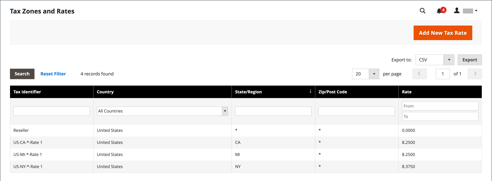

# 付加価値税（VAT）

製品やサービスに付加価値税を課す国もあります。 お客様に販売する製造または流通プロセス、材料、またはサービスの段階に応じて、異なる VAT レートが存在する場合があります。 複数の VAT レートを適用して、期限の税金を正しく計算できます。

Commerceでは、同じ国に居住している場合に、マーチャントまたはカスタマーの住所のいずれかに基づいて付加価値税を請求するように設定できます。 VAT 計算は通常、出荷元ではなく、出荷先に基づいています。 ほとんどの場合、顧客の配送先住所に基づいて VAT を計算する設定で十分です。

## サンプルシナリオ

- ある EU 諸国の VAT 登録ビジネスで、別の EU 諸国の個人に商品を供給する場合、VAT はマーチャントの場所に基づいて「遠隔販売」として計算されます。

- オランダで、英国の店舗から英国の住所に配送される商品を購入する企業は、英国の VAT 税率を支払う必要があります。

- ～の販売のために [ダウンロード可能な製品](../catalog/product-create-downloadable.md)、または _デジタル商品_&#x200B;の場合、VAT 税率は、販売者の場所ではなく出荷先に基づきます。 参照： [デジタル商品の供給地](taxes.md#place-of-supply-for-digital-goods-eu).

>[!TIP]
>
>一部のクロスボーダーおよび B2B 配送では、より複雑な税金要件があります。 Commerce インストールのネイティブ機能を拡張するには、 [Marketplace](https://marketplace.magento.com/extensions/accounting-finance/taxes.html).

## VAT の構成

以下の手順には、小売顧客への販売のために英国で 20% の VAT を設定するサンプル手順が含まれています。 その他の税率や国については、一般的な手順に従いますが、お住まいの国、VAT 率、お客様のタイプなどに対応する具体的な情報を入力してください。

>[!NOTE]
>
>続行する前に、お住まいの地域の VAT に適用される規則と規制を確認してください。

B2B 取引の中には、VAT が評価されないものもあります。 Commerceでは、お客様の VAT ID を検証することにより、VAT が適切に評価されている（または評価されていない）ことを確認できます。 参照： [VAT ID の検証](#vat-id-validation).

### 手順 1：顧客税区分の設定

税務処理基準を作成するプロセスは、税率を追加することから始まります。

1. 日 _Admin_ サイドバー、に移動 **[!UICONTROL Stores]** > _[!UICONTROL Taxes]_>**[!UICONTROL Tax Zones and Rates]**.

   {width="600" zoomable="yes"}

1. VAT で使用するのに適切な顧客税クラスがあることを確認してください。

   この例では、という名前の顧客税区分があることを確認します _小売顧客_. この税金区分が存在しない場合は、 **[!UICONTROL Add New Tax Rate]**.

1. を入力 **[!UICONTROL Tax Identifier]** 新しい税クラス用。

   すべての税率は _税率_ のフィールド _税務処理基準情報_ 税務処理基準を作成する場合

1. 郵便番号の範囲（範囲/範囲）を設定するには、 **[!UICONTROL Zip/Post is Range]** チェックボックス。

1. を選択します。 **[!UICONTROL Country]** 税率が適用されます。

1. を入力 **[!UICONTROL Rate Percent]** これは購入時の税率計算に使用されます。

1. 完了したら、 **[!UICONTROL Save Rate]**.

提出された税率に基づいて、後続の税務処理基準を作成できます。 税率がない場合、税務規則の作成は不可能になります。

### 手順 2：製品税区分の設定

1. 日 _Admin_ サイドバー、に移動 **[!UICONTROL Stores]** >  _[!UICONTROL Taxes]_>**[!UICONTROL Tax Rules]**.

1. クリック **[!UICONTROL Add New Tax Rule]**.

1. を展開  この **[!UICONTROL Additional Settings]** セクション。

   {width="600" zoomable="yes"}

1. 次の下 _製品税クラス_&#x200B;を選択し、 **[!UICONTROL Add New Tax Class]**.

1. 使用可能な製品税区分のリストに新規区分を追加し、3 つの新規区分を作成するには、 **[!UICONTROL Name]** を入力し、チェックマークをクリックします。

   - `VAT Standard`
   - `VAT Reduced`
   - `VAT Zero`

1. クリック **[!UICONTROL Save Class]** 追加した新しいクラスごとに、

1. クリック **[!UICONTROL Save Rule]**.

### 手順 3：税金ゾーンおよび税率の設定

1. 日 _Admin_ サイドバー、に移動 **[!UICONTROL Stores]** >  _[!UICONTROL Taxes]_>**[!UICONTROL Tax Zones and Rates]**.

   この例では、米国の税率を削除するか、そのままにしておくことができます。

1. クリック **[!UICONTROL Add New Tax Rate]**.

   {width="600" zoomable="yes"}

1. 次のように新規レートを定義します。

   **VAT 標準**

   - 税金識別子： `VAT Standard`
   - 国と都道府県： `United Kingdom`
   - 率： `20.00`

   **VAT 減額**

   - 税金識別子： `VAT Reduced`
   - 国と都道府県： `United Kingdom`
   - 率： `5.00`

1. クリック **[!UICONTROL Save Rate]** それぞれのレートに。

### 手順 4：税務処理基準の設定

税務処理基準は、顧客税金区分、製品税金区分および税率の組合せです。

1. 日 _Admin_ サイドバー、に移動 **[!UICONTROL Stores]** > _[!UICONTROL Taxes]_>**[!UICONTROL Tax Rules]**.

1. 次のように新規税務処理基準を追加します。

   **VAT 標準**

   - 名前： `VAT Standard`
   - 顧客税金クラス： `Retail Customer`
   - 製品税クラス： `VAT Standard`
   - 税率： `VAT Standard Rate`

   **Vat 減額**

   - 名前： `VAT Reduced`
   - 顧客税金クラス： `Retail Customer`
   - 製品税クラス： `VAT Reduced`
   - 税率： `VAT Reduced Rate`

1. クリック **[!UICONTROL Save Rule]** それぞれのレートに。

### 手順 5：製品への税金区分の適用

1. 日 _Admin_ サイドバー、に移動 **[!UICONTROL Catalog]** > **[!UICONTROL Manage Products]**.

1. カタログの製品を編集モードで開きます。

1. 日 _一般_ ページ、を検索 **[!UICONTROL Tax Class]** 「」オプションを選択し、 **[!UICONTROL VAT Class]** それは製品に適用されます。

1. 完了したら、 **[!UICONTROL Save]**.

   {width="600" zoomable="yes"}

## フィールドの説明

### ストア情報

Commerceでは次を使用します [ストア情報の設定](../configuration-reference/general/general.md#store-information) マーチャント情報に基づいて VAT を計算する。

**[!UICONTROL VAT Number]** - マーチャントに割り当てられる付加価値税番号。

**[!UICONTROL Validate VAT Number]** - [VAT 検証](#vat-id-validation) vat 番号がの対応するレコードと一致することを確認します [欧州委員会](https://ec.europa.eu/taxation_customs/vies/) データベース。

### 顧客情報

Commerceでは、次のフィールドを使用して、に基づいて VAT を計算します [顧客情報](../customers/account-dashboard-account-information.md)）に設定します。

#### アカウント情報

**[!UICONTROL Tax/VAT Number]**  – 該当する場合、顧客に割り当てられる税金番号または付加価値税番号。

#### アドレス

**[!UICONTROL VAT Number]**  – 該当する場合、顧客の特定の請求先または配送先住所に関連付けられている付加価値税番号。 ～の販売のために [デジタル商品](taxes.md#place-of-supply-for-digital-goods-eu)） EU 内では、VAT の金額は出荷先に基づいています。

### 顧客アカウント

Commerceでは次を使用します [顧客設定](../customers/account-options-new.md) vat を計算します。

**[!UICONTROL Show VAT Number on Storefront]**  – 顧客 VAT 番号フィールドが、顧客アカウントで使用可能なアドレス帳に含まれているかどうかを決定します。

**[!UICONTROL Default Value for Disable Automatic Group Changes Based on VAT ID]** - VAT ID は、VAT 検証で使用される顧客の VAT 番号の内部識別子です。 VAT の検証中、Commerceは番号がと一致することを確認します。 [欧州委員会](https://ec.europa.eu/taxation_customs/vies/) データベース。 検証結果に基づいて、顧客を 4 つのデフォルト顧客グループのいずれかに自動的に割り当てることができます。

## VAT ID の検証

_VAT ID の検証_ は、マーチャントおよび顧客のロケールに基づいて、欧州連合（EU）内で発生する B2B トランザクションに必要な税金を自動的に計算します。 Commerceは、の web サービスを使用して VAT ID 検証を実行します。 [欧州委員会][1] サーバー。

>[!NOTE]
>
>VAT に関連する税務規則は、他の税務規則に影響を与えず、他の税務規則の適用を妨げません。 一度に 1 つの税務処理基準のみを適用できます。

- 加盟店とお客様が同じ EU 加盟国にいる場合は、VAT が請求されます。
- 加盟店とお客様が異なる EU 諸国に居住し、両者が EU に登録された事業体である場合、VAT は請求されません。

店舗管理者は、アカウントの作成、住所の作成または更新、チェックアウトの際に自動的に顧客に割り当てることができる複数のデフォルトの顧客グループを作成します。 その結果、国内（国内）と EU 内の販売に異なる税務規則が使用されます。

>[!IMPORTANT]
>
>配送を必要としないバーチャルまたはダウンロード可能な商品を販売する場合は、お客様の所在国の VAT レートを EU 内販売と国内販売の両方に使用する必要があります。 仮想製品に対応する製品税区分に対して、追加の個別税務処理基準を作成します。

### 顧客登録ワークフロー

VAT ID 検証が有効化されている場合、登録後に各顧客に VAT ID 番号の入力が提案されます。 ただし、このフィールドに入力する必要があるのは、VAT 登録を受けた買い物客のみです。

顧客が VAT 番号およびその他の所在地フィールドを指定して保存を選択すると、システムは所在地を保存し、VAT ID 検証要求を欧州委員会サーバーに送信します。 検証の結果に応じて、デフォルトのグループの 1 つが顧客に割り当てられます。 このグループは、顧客または管理者が既定の住所の VAT ID を変更した場合、または既定の住所全体を変更した場合に変更できます。 1 ページのチェックアウト中に、グループを一時的に変更できる（グループの変更がエミュレートされる）場合があります。

有効化すると、のチェックボックスをオンにして、個々の顧客の VAT ID 検証を上書きできます _[!UICONTROL Customer Information]_ページ。

### チェックアウトワークフロー

チェックアウト中に顧客の VAT 検証が実行されると、VAT 要求識別子と VAT 要求日が注文の「コメント履歴」セクションに保存されます。

チェックアウト中の VAT ID 検証および顧客グループの変更に関するシステム動作は、「各取引で検証」および「自動グループ変更の無効化」の設定方法によって異なります。 ここでは、フロントエンドでのチェックアウトに対する VAT ID 検証機能の実装について説明します。

お客様がGoogle Express Checkout、PayPal Express Checkout、またはその他の外部チェックアウト方法を使用している場合、チェックアウトは外部の支払い方法の横で完全に実行されます。 このシナリオの場合、 _各トランザクションの検証_ チェックアウト中は、設定を適用できず、顧客グループも変更できません。

{width="550" zoomable="yes"}

### VAT ID 検証の構成

VAT ID 検証を構成するには、まず必要な顧客グループを設定し、関連する税クラス、税率およびルールを作成する必要があります。 次に、ストアの VAT ID 検証を有効にし、設定を完了します。

次の例は、VAT ID の検証に税金区分と税率を使用する方法を示しています。 例を確認し、店舗に必要な税区分とルールを設定する手順に従います。

#### 例：VAT ID 検証に必要な最小税務処理基準

| 税務処理基準#1 |  |
|--- |--- |
| 顧客税金クラス | 顧客税金クラスには、次を含める必要があります。  国内のお客様向けのクラス。  VAT ID の形式が正しくない顧客用のクラス。 VAT ID の検証に失敗した顧客のクラス。 |
| 製品税クラス | 製品税クラスには、バンドルとバーチャルを除くすべてのタイプの製品のクラスを含める必要があります。 |
| 税率 | 税率には、商人の国の VAT 率を含める必要があります。 |

{style="table-layout:auto"}

| 税務処理基準#2 |   |
|--- |--- |
| 顧客税金クラス | 組合内顧客のクラス。 |
| 製品税クラス | 仮想を除くすべてのタイプの製品のクラス。 |
| 税率 | 加盟国以外のすべての EU 諸国の VAT 税率。 現在このレートは 0% です。 |

{style="table-layout:auto"}

| 税務処理基準#3 | （バーチャルおよびダウンロード可能な製品に必要） |
|--- |--- |
| 顧客税金クラス | 顧客税金クラスには、次を含める必要があります。  国内客向けのクラス  VAT ID が無効な顧客の区分 VAT ID の検証に失敗した顧客の区分 |
| 製品税クラス | 仮想製品のクラス。 |
| 税率 | 販売者の国の VAT 率です。 |

{style="table-layout:auto"}

| 税務処理基準#4 | （バーチャルおよびダウンロード可能な製品に必要） |
|--- |--- |
| 顧客税金クラス | 組合内顧客のクラス。 |
| 製品税クラス | 仮想製品のクラス。 |
| 税率 | 加盟国以外のすべての EU 諸国の VAT 税率。 現在このレートは 0% です。 |

{style="table-layout:auto"}

#### 手順 1:VAT 関連顧客グループの作成

VAT ID 検証では、VAT ID 検証結果に従って、4 つのデフォルト顧客グループのいずれかが顧客に自動的に割り当てられます。

- 国内
- EU 内
- VAT ID が無効です
- 検証エラー

ビジネス・ロジックに準拠している場合は、VAT ID 検証用の顧客グループを作成するか、既存のグループを使用できます。 VAT ID 検証を設定する場合、適切な VAT ID 検証結果を持つ顧客に対して、作成された各顧客グループをデフォルトとして割り当てる必要があります。

#### 手順 2：付加価値税関連の区分、税率およびルールの作成

各税務処理基準は、次の 3 つのエンティティで定義されます。

- 顧客税金クラス
- 製品税クラス
- 税率

を作成 [税務処理基準](tax-rules.md) vat ID 検証を効果的に使用するために。

- 税務処理基準には、税率と [税クラス](tax-class.md).
- 税クラスの割り当て先 [顧客グループ](../customers/customer-groups.md).

#### 手順 3:VAT ID 検証の有効化と設定

1. 日 _Admin_ サイドバー、に移動 **[!UICONTROL Stores]** > _[!UICONTROL Settings]_>**[!UICONTROL Configuration]**.

1. 必要に応じて、 **[!UICONTROL Store View]** を設定に使用します。

1. 左側のパネルで、を展開します **[!UICONTROL Customers]** を選択します **[!UICONTROL Customer Configuration]**.

1. を展開  この **[!UICONTROL Create New Account Options]** セクション。

   次の例では、VAT 検証に関連しない一般的な顧客設定はグレー表示になっています。

   {width="600" zoomable="yes"}

1. を設定 **[!UICONTROL Enable Automatic Assignment to Customer Group]** 対象： `Yes` 必要に応じて、次のフィールドに入力します。

   - **[!UICONTROL Default Group]**
   - **[!UICONTROL Default Value for Disable Automatic Group Changes Based on VAT ID]**
   - **[!UICONTROL Show VAT Number on Storefront]**

1. 完了したら、 **[!UICONTROL Save Config]**.

#### 手順 4:VAT ID と所在国の設定

1. 左側のパネルで、を展開します **[!UICONTROL General]** を選択します **[!UICONTROL General]** その下に。

1. を展開  この **[!UICONTROL Store Information]** セクション。

   {width="600" zoomable="yes"}

1. を選択 **[!UICONTROL Country]**.

1. を入力 **[!UICONTROL VAT Number]** をクリックして、 **[!UICONTROL Validate VAT Number]**.

   結果がすぐに表示されます。

1. 完了したら、 **[!UICONTROL Save Config]**.

#### ステップ 5:EU 加盟国リストの検証

1. 継続#セツゾク# _一般_ 設定ページ、展開  この **[!UICONTROL Countries Options]** セクション。

   {width="600" zoomable="yes"}

1. が含まれる **[!UICONTROL European Union Countries]** リストで、EU の各メンバー国が選択されていることを確認します。

   デフォルトの設定を変更するには、 **システム値を使用** チェックボックス。 Ctrl キー（PC）または Command キー（Mac）を押しながら、追加または削除する国をそれぞれクリックします。

1. 完了したら、 **[!UICONTROL Save Config]**.

[1]: https://ec.europa.eu/taxation_customs/vies/
