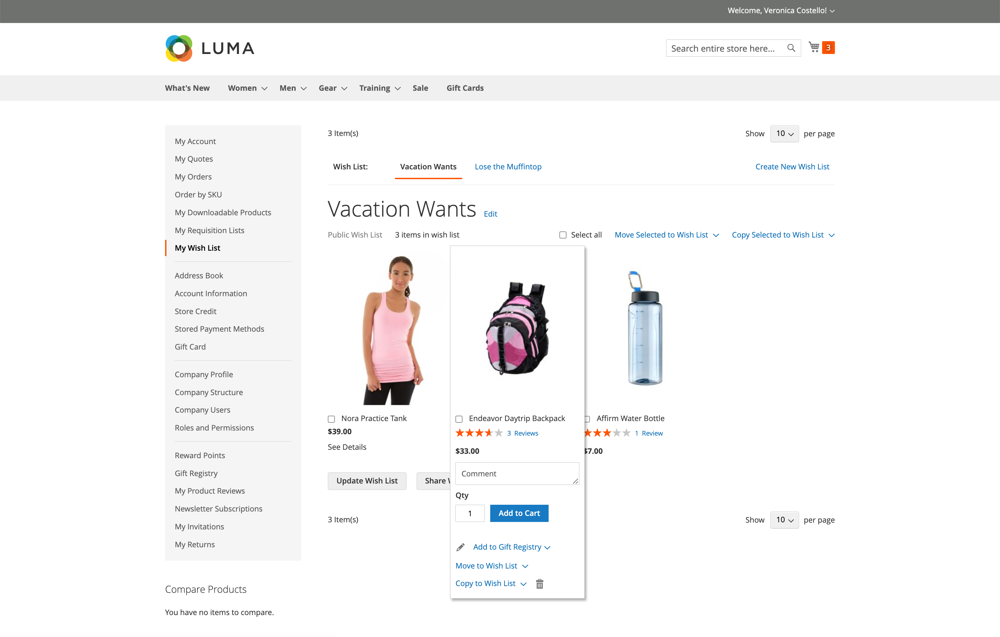
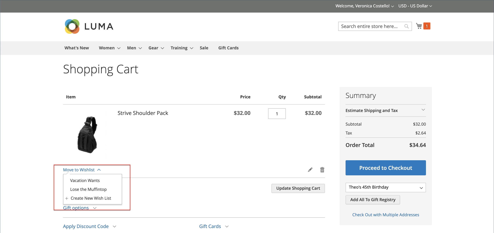
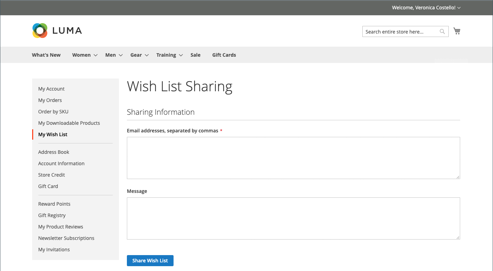

# ウィッシュリストストアフロントエクスペリエンス

ウィッシュリストは、顧客が好きな商品を思い出すのに便利な方法ですが、購入する準備はできていません。 ウィッシュリストの項目は、他のユーザーと共有したり、買い物かごに追加したりできます。 顧客に複数のウィッシュリストがある場合は、現在のウィッシュリストの名前がページの上部に表示されます。 顧客は、自分のアカウントダッシュボードからウィッシュリストを管理できます。 ストア管理者は、顧客が管理者からウィッシュリストを管理するのを支援することもできます。

{width="700" zoomable="yes"}

 Adobe Commerceでは、顧客アカウントごとに複数のウィッシュリストを使用できます。

 Magento Open Sourceコードベースでは、顧客アカウントごとに 1 つのウィッシュリストを使用できます。

## ウィッシュリストの作成

 (Adobe Commerceのみ )

ストアフロントでは、顧客はアカウントダッシュボード、製品ページ、カタログページ、買い物かごからウィッシュリストを作成できます。

### 方法 1：顧客アカウントから

1. アカウントダッシュボードのサイドバーで、顧客が選択します。 **[!UICONTROL My Wish List]**.

1. 右上隅で、 **[!UICONTROL Create New Wish List]**.

1. ウィッシュリスト名を入力します。

1. 他のユーザーにウィッシュリストの表示を許可するには、 **[!UICONTROL Public Wish List]** チェックボックス。

   >[!NOTE]
   >
   >主な違いは `Public` および `Private` ウィッシュリストはプライベートウィッシュリストが [検索可能な](wishlist-configuration.md#add-wish-list-search) ウィッシュリストを使用

1. 完了したら、「 **[!UICONTROL Save]**.

   {width="700" zoomable="yes"}

### 方法 2：カタログページから

1. 顧客はストアフロントから、ウィッシュリストに追加する商品を含むカタログページに移動します。

1. 製品にカーソルを合わせます。

1. 顧客が横の矢印をクリックする _ウィッシュリストに追加_ アイコンと選択 **[!UICONTROL Create New Wish List]**.

1. ウィッシュリスト名を入力します。

1. 他のユーザーにウィッシュリストの表示を許可するには、 **[!UICONTROL Public Wish List]** チェックボックス。

1. 完了したら、「 」をクリックします **[!UICONTROL Save]**.

### 方法 3：製品の詳細ページから

1. 顧客はストアフロントから、ウィッシュリストに追加する製品の詳細ページに移動します。

1. の横の矢印をクリックします。 **[!UICONTROL Add to Wish List]** および選択 **[!UICONTROL Create New Wish List]**.

1. 次に入る **[!UICONTROL Wish List Name]**.

1. 他のユーザーにウィッシュリストの表示を許可するには、 **[!UICONTROL Public Wish List]** チェックボックス。

1. 完了したら、「 」をクリックします **[!UICONTROL Save]**.

   {width="700" zoomable="yes"}

### 方法 4：買い物かごから

1. 顧客が **[!UICONTROL Shopping Cart]** ページに貼り付けます。

1. 項目の下で、の横にある矢印をクリックします。 **[!UICONTROL Move to Wishlist]** および選択 **[!UICONTROL Create New Wish List]**.

1. 次に入る **[!UICONTROL Wish List Name]**.

1. 他のユーザーにウィッシュリストの表示を許可するには、 **[!UICONTROL Public Wish List]** チェックボックス。

1. 完了したら、「 」をクリックします **[!UICONTROL Save]**.

{width="700" zoomable="yes"}

## 製品リストを更新

1. 顧客はウィッシュリストから製品を指し、オプションを表示します。

1. を追加するには、以下を実行します。 **[!UICONTROL Comment]** 製品について、が価格の下のボックスにテキストを入力します。

   {width="700" zoomable="yes"}

1. 製品オプションの選択を変更するには、「 」をクリックします。 **[!UICONTROL Edit]** は次の操作を実行します。

   - 製品の詳細ページのオプションを更新します。
   - クリック数 **[!UICONTROL Update Wish List]**.

## 買い物かごへのウィッシュリスト商品の追加

1. ウィッシュリストでは、顧客は追加する製品を指します。

1. を更新します。 **[!UICONTROL Qty]** 必要に応じて、その他のオプションを編集します。

1. クリック数 **[!UICONTROL Add to Cart]**.

## ウィッシュリストを共有

1. 顧客がクリックする **[!UICONTROL Share Wishlist]**.

1. ウィッシュリストを受け取る各人の電子メールアドレスをコンマで区切って入力します。

1. を追加します。 **[!UICONTROL Message]** 電子メールに含める必要があります。

1. クリック数 **[!UICONTROL Share Wish List]**.

   {width="700" zoomable="yes"}

   メッセージはプライマリから送信されます [ストア連絡先](../getting-started/store-details.md#store-email-addresses) には、各製品のサムネール画像と、ストアへのリンクが含まれています。

   {width="500" zoomable="yes"}

## ウィッシュリストを編集

顧客は、自分のアカウントダッシュボードから複数の方法でウィッシュリストを変更できます。

### 項目を別のリストに移動

 (Adobe Commerceのみ )

1. 顧客が移動する各項目のチェックボックスを選択します。

1. クリック数 **[!UICONTROL Move Selected to Wish List]** では、次のいずれかの操作を実行します。

   - 既存のウィッシュリストを選択します。
   - クリック数 **[!UICONTROL Create New Wish List]**.

### 項目を別のリストにコピーする

 (Adobe Commerceのみ )

1. 移動する各項目のチェックボックスを選択します。

1. クリック数 **[!UICONTROL Copy Selected to Wish List]** では、次のいずれかの操作を実行します。

   - 既存のウィッシュリストを選択します。
   - クリック数 **[!UICONTROL Create New Wish List]**.

## ウィッシュリストの削除

 (Adobe Commerceのみ )

1. 削除するウィッシュリストを顧客が開きます。

1. クリック数 **[!UICONTROL Delete Wish List]**.

1. 確認を求められたら、「 」をクリックします **[!UICONTROL OK]**.

>[!IMPORTANT]
>
>この操作は元に戻せません。

## ウィッシュリスト項目を買い物かごに転送

すべてのウィッシュリスト項目を買い物かごに転送するには、顧客がクリックします **[!UICONTROL Add All to Cart]**.

1 つの品目を追加する場合、顧客は次の操作を実行します。

1. 項目の上にマウスポインターを置いて、 **[!UICONTROL Qty]** を買い物かごに追加する必要があります。

1. クリック数 **[!UICONTROL Add to Cart]**.

## 顧客ウィッシュリストの検索

次の場合、 [ウィッシュリスト検索ウィジェット](wishlist-configuration.md#add-wish-list-search) ストアページに含まれるでは、顧客はウィッシュリストの所有者の名前または電子メールアドレスで検索できます。

1. 顧客はウィッシュリスト検索ウィジェットから検索オプションを選択します。

1. ウィッシュリストの所有者の名前または電子メールアドレスを入力してクリック **[!UICONTROL Search]**.

   The _ウィッシュリスト検索_ ページが開き、一致するウィッシュリストが「検索結果」セクションに表示されます。

   >[!NOTE]
   >
   >検索結果には、公開ウィッシュリストのみが表示されます。顧客の非公開ウィッシュリストは、一般に表示できません。

1. ウィッシュリスト項目のリストを表示するには、 **[!UICONTROL View]**.

   各ウィッシュリストに対して、所有者名と最終更新日が表示されます。

1. 製品を買い物かごに追加するには、顧客が製品の下のチェックボックスを選択し、「 」をクリックします **[!UICONTROL Add to Cart]**.

   また、別の顧客のウィッシュリストから、好きな項目を独自の項目に追加することもできます。
