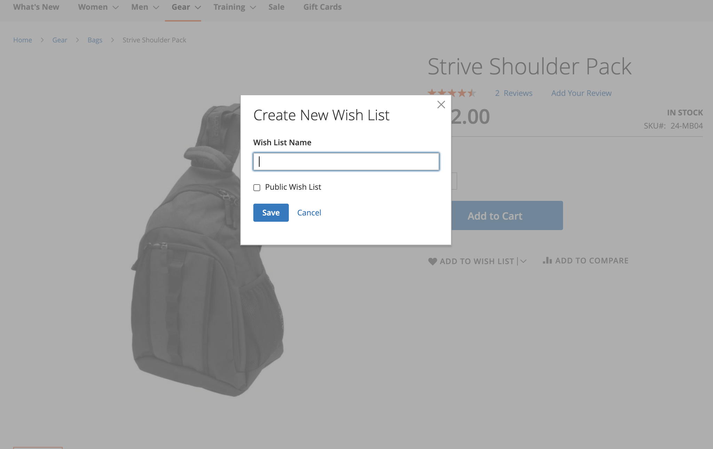
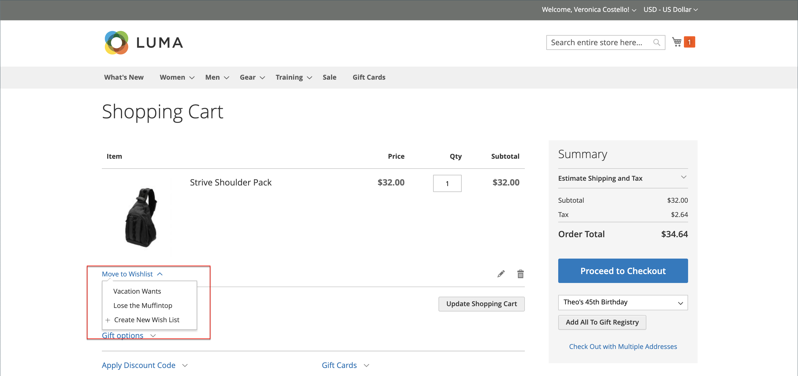

# ストアフロント体験を求める

ウィッシュリストは、顧客が気に入った商品を思い出すのに便利な方法ですが、購入する準備ができていません。 ウィッシュリストのアイテムは、他のユーザーと共有したり、ショッピングカートに追加したりできます。 お客様が複数のウィッシュリストを持っている場合、現在のウィッシュリストの名前がページの上部に表示されます。 顧客は、アカウントダッシュボードでウィッシュリストを管理できます。 ストア管理者は、お客様が管理者からウィッシュリストを管理するのにも役立ちます。

{width="700" zoomable="yes"}

 Adobe Commerceでは、お客様のアカウントごとに複数のウィッシュリストを使用できます。

 Magento Open Source コードベースでは、お客様アカウントごとに1つのウィッシュリストを使用できます。

## ウィッシュリストの作成

 （Adobe Commerceのみ）

顧客はストアフロントで、アカウントダッシュボード、商品ページ、カタログページ、ショッピングカートからウィッシュリストを作成できます。

### 方法1：顧客アカウントから

1. アカウント ダッシュボードのサイドバーで、お客様は&#x200B;**[!UICONTROL My Wish List]**&#x200B;を選択します。

1. 右上隅で、**[!UICONTROL Create New Wish List]**&#x200B;をクリックします。

1. ウィッシュリスト名を入力します。

1. 他のユーザーにウィッシュリストを表示させるには、「**[!UICONTROL Public Wish List]**」チェックボックスをオンにします。

   >[!NOTE]
   >
   >`Public`と`Private`のウィッシュリストの主な違いは、プライベートウィッシュリストが[検索可能](wishlist-configuration.md#add-wish-list-search)ではないことです。

1. 完了したら、**[!UICONTROL Save]**&#x200B;をクリックします。

   {width="700" zoomable="yes"}

### 方法2：カタログページから

1. ストアフロントから、顧客は欲しいものリストに追加したい商品が含まれているカタログページに移動します。

1. 製品の上にカーソルを合わせます。

1. お客様は、_ウィッシュリストに追加_ アイコンの横にある矢印をクリックし、**[!UICONTROL Create New Wish List]**&#x200B;を選択します。

1. ウィッシュリスト名を入力します。

1. 他のユーザーにウィッシュリストを表示させるには、「**[!UICONTROL Public Wish List]**」チェックボックスをオンにします。

1. 完了したら、**[!UICONTROL Save]**&#x200B;をクリックします。

### 方法3：商品詳細ページから

1. 顧客は、ストアフロントから、追加する商品の詳細ページに移動します。

1. **[!UICONTROL Add to Wish List]**&#x200B;の横にある矢印をクリックし、**[!UICONTROL Create New Wish List]**&#x200B;を選択します。

1. **[!UICONTROL Wish List Name]**&#x200B;を入力します。

1. 他のユーザーにウィッシュリストを表示させるには、「**[!UICONTROL Public Wish List]**」チェックボックスをオンにします。

1. 完了したら、**[!UICONTROL Save]**&#x200B;をクリックします。

   {width="700" zoomable="yes"}

### 方法4：ショッピングカートから

1. お客様が&#x200B;**[!UICONTROL Shopping Cart]** ページを開きます。

1. 項目の下で、**[!UICONTROL Move to Wishlist]**&#x200B;の横にある矢印をクリックし、**[!UICONTROL Create New Wish List]**&#x200B;を選択します。

1. **[!UICONTROL Wish List Name]**&#x200B;を入力します。

1. 他のユーザーにウィッシュリストを表示させるには、「**[!UICONTROL Public Wish List]**」チェックボックスをオンにします。

1. 完了したら、**[!UICONTROL Save]**&#x200B;をクリックします。

{width="700" zoomable="yes"}

## 製品リストの更新

1. 顧客は、ウィッシュリストから商品をポイントし、オプションを表示します。

1. 商品に関する&#x200B;**[!UICONTROL Comment]**&#x200B;を追加するには、価格の下のボックスにテキストを入力します。

   {width="700" zoomable="yes"}

1. 製品オプションの選択を変更するには、**[!UICONTROL Edit]**&#x200B;をクリックし、次の操作を行います。

   - 商品詳細ページのオプションを更新します。
   - **[!UICONTROL Update Wish List]**&#x200B;をクリックします。

## 欲しいものリスト商品をカートに追加

1. ウィッシュリストでは、顧客は追加する製品を指します。

1. **[!UICONTROL Qty]**&#x200B;を更新し、必要に応じてその他のオプションを編集します。

1. **[!UICONTROL Add to Cart]**&#x200B;をクリックします。

## 欲しいものリストを共有

1. お客様は&#x200B;**[!UICONTROL Share Wishlist]**&#x200B;をクリックします。

1. ウィッシュリストを受け取る各ユーザーのメールアドレスをコンマで区切って入力します。

1. メールに含める&#x200B;**[!UICONTROL Message]**&#x200B;を追加します。

1. **[!UICONTROL Share Wish List]**&#x200B;をクリックします。

   {width="700" zoomable="yes"}

   メッセージは、プライマリ [ ストアの連絡先](../getting-started/store-details.md#store-email-addresses)から送信され、各製品のサムネイル画像とストアへのリンクが含まれます。

   {width="500" zoomable="yes"}

## ウィッシュリストを編集

顧客は、アカウントダッシュボードから複数の方法でウィッシュリストを変更できます。

### 項目を別のリストに移動

 （Adobe Commerceのみ）

1. お客様は、移動する各アイテムのチェックボックスを選択します。

1. **[!UICONTROL Move Selected to Wish List]**&#x200B;をクリックし、次のいずれかの操作を行います。

   - 既存のウィッシュリストを選択します。
   - **[!UICONTROL Create New Wish List]**&#x200B;をクリックします。

### 項目を別のリストにコピー

 （Adobe Commerceのみ）

1. 移動する各アイテムのチェックボックスを選択します。

1. **[!UICONTROL Copy Selected to Wish List]**&#x200B;をクリックし、次のいずれかの操作を行います。

   - 既存のウィッシュリストを選択します。
   - **[!UICONTROL Create New Wish List]**&#x200B;をクリックします。

## 欲しいものリストの削除

 （Adobe Commerceのみ）

1. お客様は、削除するウィッシュリストを開きます。

1. **[!UICONTROL Delete Wish List]**&#x200B;をクリックします。

1. 確認を求められたら、**[!UICONTROL OK]**&#x200B;をクリックします。

>[!IMPORTANT]
>
>この操作は元に戻せません。

## ウィッシュリスト項目をカートに転送する

すべての欲しいものリスト項目をカートに転送するには、顧客が&#x200B;**[!UICONTROL Add All to Cart]**&#x200B;をクリックします。

1つの項目を追加するには、お客様は次の操作を行います。

1. アイテムにカーソルを合わせ、カートに追加する&#x200B;**[!UICONTROL Qty]**&#x200B;を入力します。

1. **[!UICONTROL Add to Cart]**&#x200B;をクリックします。

## 欲しいものリストを探す

ストアページに[ ウィッシュリスト検索ウィジェット ](wishlist-configuration.md#add-wish-list-search)が含まれている場合、お客様はウィッシュリスト所有者の名前またはメールアドレスで検索できます。

1. ウィッシュリスト検索ウィジェットから、顧客は検索オプションを選択します。

1. ウィッシュリストの所有者の名前またはメールアドレスを入力し、**[!UICONTROL Search]**&#x200B;をクリックします。

   「_ウィッシュリスト検索_」ページが開き、一致するウィッシュリストが検索結果セクションに表示されます。

   >[!NOTE]
   >
   >公開ウィッシュリストのみが検索結果に表示されます。顧客のプライベートウィッシュリストは公開されません。

1. ウィッシュリスト項目のリストを表示するには、**[!UICONTROL View]**&#x200B;をクリックします。

   各ウィッシュリストには、所有者の名前と最終更新日が表示されます。

1. 商品をカートに追加するには、お客様は商品の下のチェックボックスを選択し、**[!UICONTROL Add to Cart]**&#x200B;をクリックします。

   また、他のお客様のウィッシュリストから気に入ったアイテムを自分のウィッシュリストに追加することもできます。
