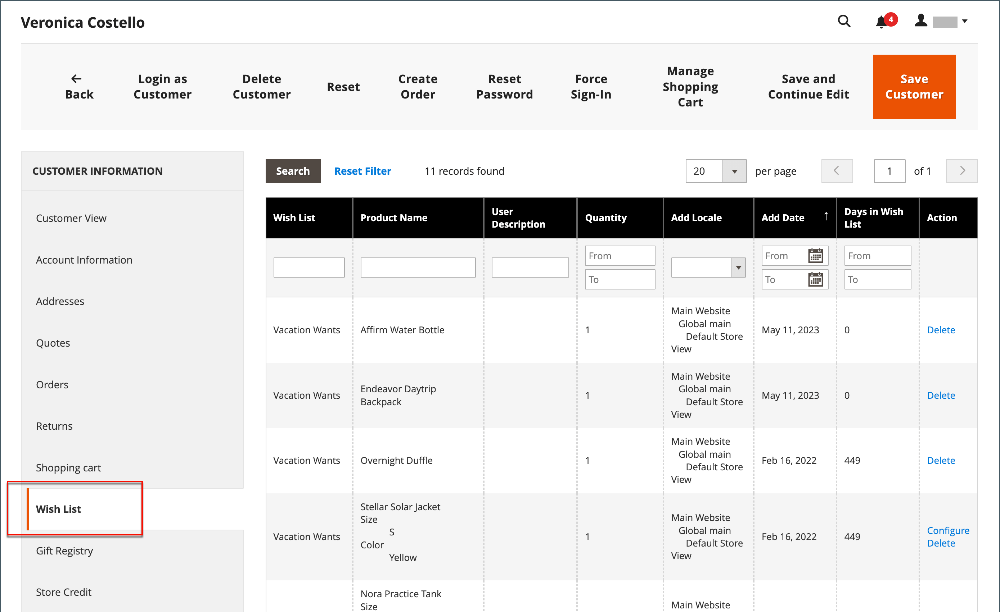

# ウィッシュリスト

ウィッシュリストとは、登録した顧客が友人と共有したり、後でカートに転送するために保存できる商品のリストです。 ウィッシュリストを有効にすると、ストア内の各商品のカテゴリと商品ページに「ウィッシュリストに追加」リンクが表示されます。 テーマによって、テキストリンクやグラフィック画像が異なります。

 Adobe Commerceでは、お客様のアカウントごとに複数のウィッシュリストを使用できます。

 Magento Open Sourceでは、お客様のアカウントごとに1つのウィッシュリストを使用できます。

共有ウィッシュリストは、店舗のメールアドレスから送信されますが、メッセージ本文には顧客からのパーソナライズされたメモが含まれます。 ウィッシュリストを共有する際に使用するメールテンプレートをカスタマイズし、送信者として表示されるストア連絡先を選択できます。

ウィッシュリストは、[顧客アカウント ](../customers/account-dashboard.md)のダッシュボードから更新できます。 商品は、お客様またはストア管理者がウィッシュリストとカートの間で追加または転送できます。

{width="700" zoomable="yes"}

複数のオプションを持つ商品をウィッシュリストに追加すると、お客様が選択したオプションがウィッシュリストのアイテム説明に含まれます。 例えば、顧客が同じ靴を3色で追加した場合、それぞれの靴は個別のウィッシュリスト項目として表示されます。 ただし、お客様が同じ商品をウィッシュリストに複数回追加した場合、商品は1回だけ表示され、商品ページから数量が選択されます。

## 管理者のウィッシュリスト支援

お客様は、ストアフロントのアカウントにログインして、ウィッシュリスト ](wishlist-storefront.md)を[管理できます。 ストア管理者は、管理者から顧客ウィッシュリストを管理することもできます。

**_管理者:_**&#x200B;からウィッシュリスト項目を更新するには

1. _管理者_ サイドバーで、**[!UICONTROL Customers]** > **[!UICONTROL All Customers]**&#x200B;に移動します。

1. リストで顧客を検索し、_[!UICONTROL Action]_列の&#x200B;**[!UICONTROL Edit]**をクリックします。

1. 左側のパネルで、**[!UICONTROL Wish List]**&#x200B;を選択し、リストで編集する項目を見つけます。

   製品に対して選択されたオプションは、製品名の下に表示されます。

   {width="600" zoomable="yes"}

1. 製品オプションを編集するには、次の操作を行います。

   - **[!UICONTROL Action]**&#x200B;列で、**[!UICONTROL Configure]**&#x200B;をクリックします。

   - 製品ページで、必要に応じてオプションと&#x200B;**[!UICONTROL Quantity]**&#x200B;を更新します。

   - **[!UICONTROL OK]**&#x200B;をクリックします。

1. 完了したら、**[!UICONTROL Save Customer]**&#x200B;または&#x200B;**[!UICONTROL Save and Continue Edit]**&#x200B;をクリックします。
