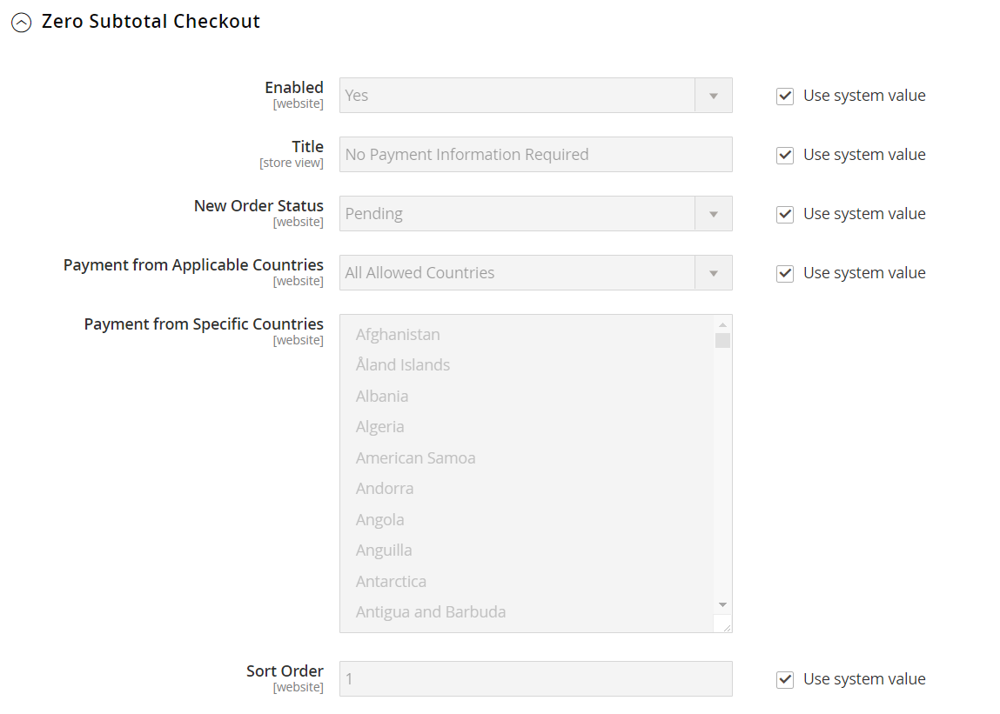

# 小計チェックアウトをゼロにする

_小計チェックアウトをゼロにする_&#x200B;は、割引が適用された後に課税される小計がゼロの注文に使用できます。 例えば、次の状況では、小計チェックアウトを0個使用することができます。

- 割引は、購入金額をカバーし、送料は発生しません。

- お客様は[ ダウンロード可能](../catalog/product-create-downloadable.md)または[仮想](../catalog/product-create-virtual.md)の商品をショッピングカートに追加し、価格はゼロに等しくなります。

- [simple](../catalog/product-create-simple.md)商品の価格はゼロで、[送料無料](shipping-free.md)の方法を利用できます。

- [ クーポンコード ](../merchandising-promotions/price-rules-cart-coupon.md)は、商品と配送の全価格をカバーします。

時間を節約するために、小計ゼロの注文を自動請求書に設定できます。

**_小計チェックアウトをゼロに設定するには:_**

1. _管理者_ サイドバーで、**[!UICONTROL Stores]** > _[!UICONTROL Settings]_>**[!UICONTROL Configuration]**に移動します。

1. 左側のパネルで、**[!UICONTROL Sales]**&#x200B;を展開し、**[!UICONTROL Payment Methods]**&#x200B;を選択します。

1. _[!UICONTROL Other Payment Methods]_で、**[!UICONTROL Zero Subtotal Checkout]**セクションのを展開します。

   {width="600" zoomable="yes"}

   >[!NOTE]
   >
   >必要に応じて、まず&#x200B;**[!UICONTROL Use system value]** チェックボックスをオフにして、これらの設定を変更します。

1. 小計チェックアウトをゼロに設定するには、**[!UICONTROL Enabled]**&#x200B;を`Yes`に設定します。

1. **[!UICONTROL Title]**&#x200B;に、チェックアウト時の小計ゼロ方式を識別するタイトルを入力します。

1. 通常、注文が承認を待っている場合は、注文が承認されるまで、デフォルトの&#x200B;**[!UICONTROL New Order Status]**&#x200B;を`Pending"`として受け入れます。

   ご希望の場合は、この支払い方法で`Processing`または`Suspected Fraud`のステータスを新しい注文に使用できます。

1. 残高がゼロのすべての項目に自動的に請求書を発行する場合は、**[!UICONTROL Automatically Invoice All Items]**&#x200B;を`Yes`に設定します。

   このオプションは、**[!UICONTROL New Order Status]** オプションが`Processing`に設定されている場合にのみ使用できます。

   >[!NOTE]
   >
   >_[!UICONTROL New Order Status]_が`Processing`に設定され、_[!UICONTROL Automatically Invoice All Items]_&#x200B;が`No`に設定されている場合は、[注文ステータス ](order-status.md#custom-order-status) ページの&#x200B;**[!UICONTROL Order State]** = `Pending`および&#x200B;**[!UICONTROL Default Status]** = `No` マッピングに&#x200B;**[!UICONTROL Order Status]** = `Processing`も割り当てる必要があります。

1. **[!UICONTROL Payment from Applicable Countries]**&#x200B;を次のいずれかに設定します：

   - `All Allowed Countries` - ストア設定で指定されたすべての[国](../getting-started/store-details.md#country-options)のお客様は、この支払い方法を使用できます。
   - `Specific Countries` – このオプションを選択すると、_[!UICONTROL Payment from Specific Countries]_リストが表示されます。 複数の国を選択するには、Ctrl キー（PC）またはCommand キー（Mac）を押しながら、各オプションをクリックします。

1. **[!UICONTROL Sort Order]**&#x200B;の場合、チェックアウト時に表示される支払い方法のリストに、この項目の位置を決定する数値を入力します。

   この数字は他の支払い方法に関連しています。 （`0` = first, `1` = second, `2` = thirdなど）

1. 完了したら、**[!UICONTROL Save Config]**&#x200B;をクリックします。
