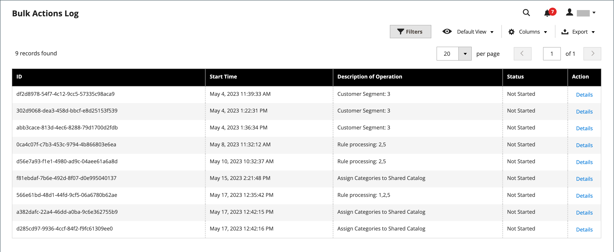
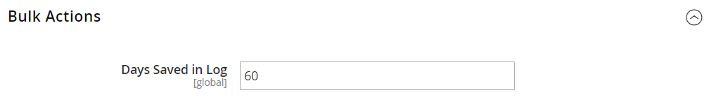

# 一括アクション

{{ee-feature}}

一括操作ログには、バックグラウンドで実行される非同期の一括操作の詳細が記録されます。例えば、[共有カタログ ](../b2b/catalog-shared.md)の複数の製品に[ カスタム価格](../b2b/catalog-shared-manage.md#update-custom-pricing)を割り当てたり、インポート/エクスポートしたりします。

{width="600" zoomable="yes"}

## 一括アクションの設定

1. _管理者_ サイドバーで、**[!UICONTROL Stores]** > _[!UICONTROL Settings]_>**[!UICONTROL Configuration]**に移動します。

1. 左側のパネルで、**[!UICONTROL Advanced]**&#x200B;を展開し、**[!UICONTROL System]**&#x200B;を選択します。

1. **[!UICONTROL Bulk Actions]** セクションのを展開し、ログ保存オプションを設定します。

   **[!UICONTROL Days Saved in Log]** – 一括アクションがログに保存される日数を入力します。

   {width="600" zoomable="yes"}

   構成設定の詳細なリストについては、_構成リファレンス_&#x200B;の&#x200B;[_一括アクション_](../configuration-reference/advanced/system.md)&#x200B;を参照してください。

1. 完了したら、**[!UICONTROL Save Config]**&#x200B;をクリックします。

## 一括アクションの表示

1. _管理者_ サイドバーで、**[!UICONTROL System]** > _[!UICONTROL Actions Logs]_>**[!UICONTROL Bulk Actions]**に移動します。

1. ログで目的のアクションを見つけます。

1. _[!UICONTROL Action]_列で、**[!UICONTROL Details]**をクリックします。
