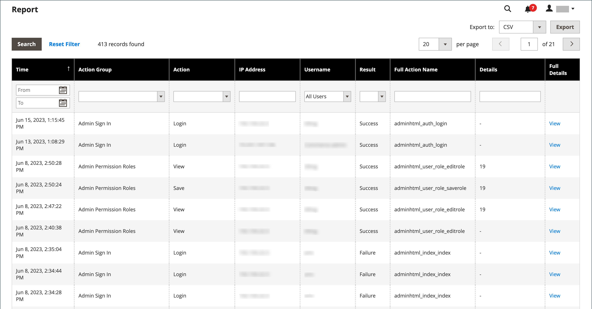

# アクションログレポート

{{ee-feature}}

_アクションログ_ レポートには、ログ記録が有効になっているすべての管理者アクションの詳細な記録が表示されます。 各レコードにはタイムスタンプが付き、ユーザーの IP アドレスと名前が記録されます。 ログの詳細には、管理者ユーザーデータと、アクション中に行われた関連する変更が含まれます。

レポートに表示するアクションは、ストア設定の [ 管理アクションのログ ](action-log.md) 画面で有効にする必要があります。 アクションタイプがオン（有効）の場合、これらのタイプの管理アクションはアクションログレポートに表示されます。

レポートは、各列のオプションを使用してフィルタリングできます。 1 つのフィルターオプションを設定するか、複数の列にフィルターオプションを設定して、特定のアクションをリストするようにレポートを絞り込むことができます。 また、レポートデータを CSV 形式または Excel XML 形式で書き出すこともできます。

アクションログレポートには、次の情報が含まれます。

- **[!UICONTROL Time]** - アクションが発生した日時
- **[!UICONTROL Action Group]** - ストア設定の _管理アクションログ_ 画面で有効になっているアクションに関連する、アクションタイプを表示します
- **[!UICONTROL Action]** – 記録されたアクションを表示します
- **[!UICONTROL IP Address]** - アクションが実行されたコンピューターの IP アドレスを表示します
- **[!UICONTROL Username]** - アクションを実行したユーザーのログイン ID を表示します
- **[!UICONTROL Result]** - ユーザーのアクションの成否を表示します
- **[!UICONTROL Full Action Name]** - バックエンドアクション名を表示します
- **[!UICONTROL Details]** - バックエンドアクションカテゴリを表示します
- **[!UICONTROL Full Details]** – 管理者アクションのログ記録されたすべての詳細を表示します

## アクションログレポートの表示

1. _管理者_ サイドバーで、**[!UICONTROL System]**/_[!UICONTROL Actions Logs]_/**[!UICONTROL Report]**に移動します。

   {width="600" zoomable="yes"}

1. リストに表示された管理者アクションの詳細を表示するには、「**[!UICONTROL View]**」をクリックします。

   {width="600" zoomable="yes"}

## アクションログレポートのフィルタリング

フィルターオプションのフィールドを定義し、**[!UICONTROL Search]** をクリックして、表示されるアクションを絞り込むことができます。

フィルターオプションをクリアして完全なレポートに戻るには、「**[!UICONTROL Reset Filter]**」をクリックします。

{width="600" zoomable="yes"}

| フィールド | 説明 |
|--- |--- |
| [!UICONTROL Time] | **[!UICONTROL From]** で、動的カレンダーから日付をクリックして選択し、フィルターの開始日を定義します。 **[!UICONTROL To]** で、日付をクリックして選択し、フィルターの終了日を定義します。 |
| [!UICONTROL Action Group] | アクショングループを選択します。 |
| [!UICONTROL Action] | アクションを選択します。 |
| [!UICONTROL IP Address] | アクションに使用するマシンの IP アドレスを入力します。 |
| [!UICONTROL Username] | ユーザー名を選択します。 デフォルトは `All Users` です。 |
| [!UICONTROL Result] | 「成功」または「失敗」を選択します。 |
| [!UICONTROL Full Action Name] | 検索に一致するテキストを「」フィールドに入力します。 |
| [!UICONTROL Details] | 検索に一致するテキストを「」フィールドに入力します。 |

{style="table-layout:auto"}

## アクションログレポートのエクスポート

1. **[!UICONTROL Export to]** の場合は、書き出し形式を選択します。

   - `CSV` - プレーンテキストデータを含む、コンマ区切りの値ファイル
   - `Excel XML` - XML ベースのスプレッドシートデータ形式

1. 「**[!UICONTROL Export]**」をクリックします。

   生成されたファイルは、指定したフォルダーに自動的に保存されてダウンロードされます。

   {width="200"}
