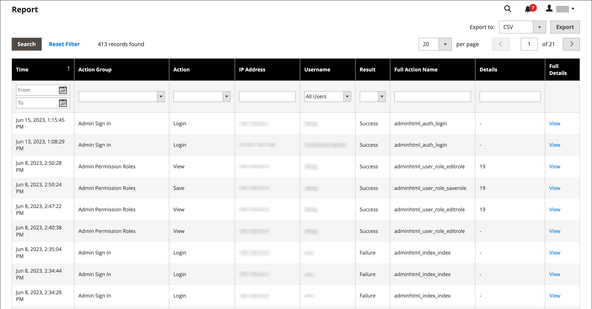
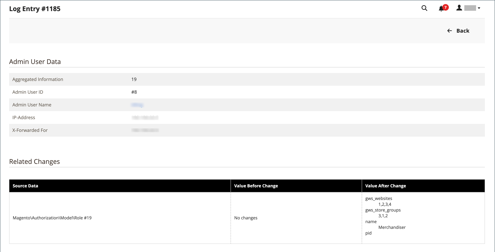
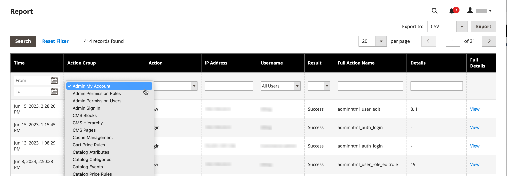

# アクションログレポート

{{ee-feature}}

_アクションログ_ レポートには、ログ記録が有効になっているすべての管理者アクションの詳細レコードが表示されます。 各レコードにはタイムスタンプが付けられ、ユーザーのIP アドレスと名前が記録されます。 ログの詳細には、管理者ユーザーデータと、アクション中に行われた関連する変更が含まれます。

レポートに表示するアクションは、ストア設定の[管理者アクションのログ &#x200B;](action-log.md)画面で有効にする必要があります。 アクションタイプがオン（有効）の場合、これらのタイプの管理者アクションはアクションログレポートに表示されます。

レポートは、各列のオプションを使用してフィルタリングできます。 1つのフィルターオプションを設定するか、複数の列のフィルターオプションを設定して、レポートを絞り込んで特定のアクションを一覧表示できます。 また、レポートデータをCSVまたはExcel XML形式で書き出すこともできます。

アクションログレポートには、次の情報が含まれます。

- **[!UICONTROL Time]** - アクションが発生した日時
- **[!UICONTROL Action Group]** - アクションの種類を表示します。アクションの種類は、_管理者アクションのログ記録_&#x200B;画面で有効になっているアクションと関連付けられます。ストア設定
- **[!UICONTROL Action]** – 記録されたアクションを表示します
- **[!UICONTROL IP Address]** - アクションが実行されたコンピューターのIP アドレスを表示します
- **[!UICONTROL Username]** - アクションを実行したユーザーのログイン IDを表示します
- **[!UICONTROL Result]** - ユーザーのアクションの成功または失敗を表示します
- **[!UICONTROL Full Action Name]** - バックエンド アクション名を表示します
- **[!UICONTROL Details]** - バックエンド アクション カテゴリを表示します
- **[!UICONTROL Full Details]** – 管理者アクションのログに記録されたすべての詳細を表示

## アクションログレポートの表示

1. _管理者_ サイドバーで、**[!UICONTROL System]** > _[!UICONTROL Actions Logs]_>**[!UICONTROL Report]**&#x200B;に移動します。

   {width="600" zoomable="yes"}

1. リストされた管理者アクションの詳細を表示するには、**[!UICONTROL View]**&#x200B;をクリックします。

   {width="600" zoomable="yes"}

## アクションログレポートのフィルタリング

フィルターオプションフィールドを定義し、**[!UICONTROL Search]**&#x200B;をクリックして、表示されるアクションを絞り込むことができます。

フィルターオプションをクリアしてレポート全体に戻るには、**[!UICONTROL Reset Filter]**&#x200B;をクリックします。

{width="600" zoomable="yes"}

| フィールド | description |
|--- |--- |
| [!UICONTROL Time] | **[!UICONTROL From]**&#x200B;で、クリックして動的なカレンダーから日付を選択し、フィルターの開始日を定義します。 **[!UICONTROL To]**&#x200B;で、クリックして日付を選択し、フィルターの終了日を定義します。 |
| [!UICONTROL Action Group] | アクショングループを選択します。 |
| [!UICONTROL Action] | アクションの選択： |
| [!UICONTROL IP Address] | アクションに使用するマシンのIP アドレスを入力します。 |
| [!UICONTROL Username] | ユーザー名を選択します。 デフォルトは`All Users`です。 |
| [!UICONTROL Result] | 成功か失敗を選ぶ。 |
| [!UICONTROL Full Action Name] | フィールドに一致する検索のテキストを入力します。 |
| [!UICONTROL Details] | フィールドに一致する検索のテキストを入力します。 |

{style="table-layout:auto"}

## アクションログレポートのエクスポート

1. **[!UICONTROL Export to]**&#x200B;の場合、書き出し形式を選択します。

   - `CSV` – プレーンテキストデータを含むコンマ区切りの値ファイル
   - `Excel XML` - XML ベースのスプレッドシート データ形式

1. **[!UICONTROL Export]**&#x200B;をクリックします。

   生成されたファイルは、指定したフォルダーに自動的に保存され、ダウンロードされます。

   {width="200"}
