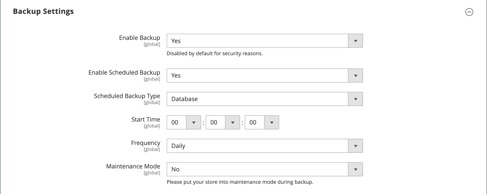

# システムバックアップ

Adobe CommerceとMagento Open Sourceでは、ファイルシステム、データベース、メディアファイルなど、システムのさまざまな部分をバックアップし、自動的にロールバックできます。 各バックアップのレコードが&#x200B;_バックアップ_ ページのグリッドに表示されます。 リストからレコードを削除すると、アーカイブされたファイルも削除されます。 データベースバックアップファイルは、GZ形式を使用して圧縮されます。 システム・バックアップとデータベース・バックアップおよびメディア・バックアップには、TGZ形式が使用されます。 ベストプラクティスとして、拡張機能とアップデートをインストールする前に、バックアップツールへのアクセスを制限し、バックアップする必要があります。

- **バックアップ ツールへのアクセスを制限します。** バックアップおよびロールバック管理ツールへのアクセスは、バックアップおよびロールバック リソース用に[&#x200B; ユーザーの役割](permissions-user-roles.md)を設定することで制限できます。 アクセスを制限するには、対応するチェックボックスを選択しないままにします。 リソースをロールバックするためのアクセス権を付与するには、バックアップリソースへのアクセス権も付与する必要があります。

- **拡張機能とアップデートをインストールする前にバックアップします。** 拡張機能またはアップデートをインストールする前に、必ずバックアップを実行してください。

{{$include /help/_includes/backups-note.md}}

## バックアップの有効化とスケジュール

1. _管理者_ サイドバーで、**[!UICONTROL Stores]** > _[!UICONTROL Settings]_>**[!UICONTROL Configuration]**&#x200B;に移動します。

1. 左側のパネルで、**[!UICONTROL Advanced]**&#x200B;を展開し、**[!UICONTROL System]**&#x200B;を選択します。

1. **[!UICONTROL Backup Settings]**&#x200B;のを展開します。

1. **[!UICONTROL Enabled Schedule Backup]**&#x200B;を`Yes`に設定します。

1. 自動ベックアップをスケジュールするには、スケジューリングオプションを設定します。

   - **[!UICONTROL Enabled Schedule Backup]**&#x200B;を`Yes`に設定します。
   - スケジュールされた間隔で実行するバックアップのタイプに&#x200B;**[!UICONTROL Scheduled Backup Type]**&#x200B;を設定します。
   - バックアップ操作を実行する時刻に&#x200B;**[!UICONTROL Start Time]**&#x200B;を設定します。
   - **[!UICONTROL Frequency]**&#x200B;を`Daily`、`Weekly`または`Monthly`に設定します。
   - **[!UICONTROL Maintenance Mode]**&#x200B;を`Yes`に設定します。

   {width="600" zoomable="yes"}

1. 完了したら、**[!UICONTROL Save Config]**&#x200B;をクリックします。

## バックアップの作成

1. _管理者_ サイドバーで、**[!UICONTROL System]** > _[!UICONTROL Tools]_>**[!UICONTROL Backups]**&#x200B;に移動します。

1. 右上隅で、作成するバックアップの種類をクリックします。

   - **[!UICONTROL System Backup]** - データベースとファイルシステムの完全バックアップを作成します。 プロセス中に、メディアフォルダーをバックアップに含めるように選択できます。

   - **[!UICONTROL Database and Media Backup]** - データベースとメディア フォルダーのバックアップを作成します。

   - **[!UICONTROL Database Backup]** - データベースのバックアップを作成します。

   {width="600" zoomable="yes"}

1. バックアップ中にストアをメンテナンスモードにするには、チェックボックスをオンにします。

   バックアップが完了すると、メンテナンスモードが自動的にオフになります。

1. システムバックアップの場合は、**[!UICONTROL Include Media folder to System Backup]** チェックボックスを選択して、メディアフォルダーを含めます。

1. プロンプトが表示されたら、アクションを確認します。

<!-- Last updated from includes: 2023-02-22 09:59:54 -->
