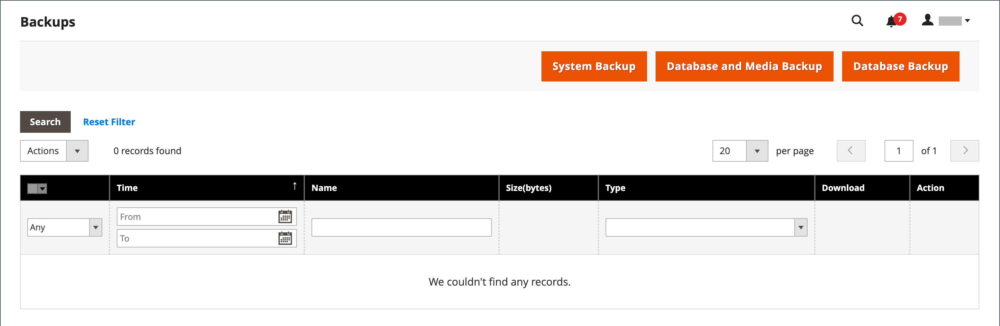

# システムバックアップ

Adobe CommerceとMagento Open Sourceを使用すると、ファイルシステム、データベース、メディアファイルなど、システムの様々な部分をバックアップしたり、自動的にロールバックしたりできます。 各バックアップのレコードは、 _バックアップ_ ページ。 リストからレコードを削除すると、アーカイブされたファイルも削除されます。 データベース バックアップ ファイルは、GZ 形式で圧縮されます。 システムバックアップとデータベースおよびメディアバックアップには、TGZ 形式が使用されます。 ベストプラクティスとして、拡張機能と更新をインストールする前に、バックアップツールへのアクセスを制限し、バックアップする必要があります。

- **バックアップツールへのアクセスを制限します。** バックアップおよびロールバック管理ツールへのアクセスは、以下を設定することによって制限できます。 [ユーザーロール](permissions-user-roles.md) （バックアップおよびロールバック用リソース）。 アクセスを制限するには、対応するチェックボックスをオフのままにします。 リソースのロールバックへのアクセス権を付与するには、バックアップ リソースへのアクセス権も付与する必要があります。

- **拡張機能とアップデートをインストールする前にバックアップを作成します。** 拡張機能または更新をインストールする前に、必ずバックアップを実行してください。

{{$include /help/_includes/backups-note.md}}

## バックアップの有効化とスケジュール設定

1. 日 _Admin_ サイドバー、に移動 **[!UICONTROL Stores]** > _[!UICONTROL Settings]_>**[!UICONTROL Configuration]**.

1. 左側のパネルで、を展開します **[!UICONTROL Advanced]** を選択します **[!UICONTROL System]**.

1. を展開  この **[!UICONTROL Backup Settings]**.

1. を設定 **[!UICONTROL Enabled Schedule Backup]** 対象： `Yes`.

1. 自動バックアップをスケジュールするには、次のようにスケジュール・オプションを設定します。

   - を設定 **[!UICONTROL Enabled Schedule Backup]** 対象： `Yes`.
   - を設定 **[!UICONTROL Scheduled Backup Type]** を、スケジュールされた間隔で実行するバックアップの種類に変更します。
   - を設定 **[!UICONTROL Start Time]** バックアップ オペレーションを実行する時刻です。
   - を設定 **[!UICONTROL Frequency]** 対象： `Daily`, `Weekly`、または `Monthly`.
   - を設定 **[!UICONTROL Maintenance Mode]** 対象： `Yes`.

   {width="600" zoomable="yes"}

1. 完了したら、 **[!UICONTROL Save Config]**.

## バックアップの作成

1. 日 _Admin_ サイドバー、に移動 **[!UICONTROL System]** > _[!UICONTROL Tools]_>**[!UICONTROL Backups]**.

1. 右上隅で、作成するバックアップの種類をクリックします。

   - **[!UICONTROL System Backup]** - データベースとファイル・システムの完全なバックアップを作成します。 この処理の間に、バックアップにメディア フォルダを含めることを選択できます。

   - **[!UICONTROL Database and Media Backup]** - データベースとメディア フォルダのバックアップを作成します。

   - **[!UICONTROL Database Backup]** - データベースのバックアップを作成します。

   {width="600" zoomable="yes"}

1. バックアップ中にストアをメンテナンスモードにするには、このチェックボックスを選択します。

   バックアップが完了すると、メンテナンスモードが自動的にオフになります。

1. システムバックアップの場合は、 **[!UICONTROL Include Media folder to System Backup]** チェックボックスをオンにして、メディア フォルダを含めます。

1. プロンプトが表示されたら、アクションを確認します。

