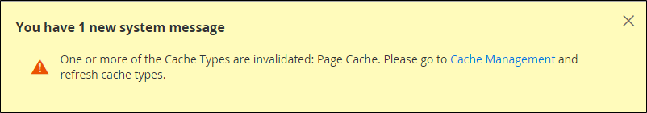
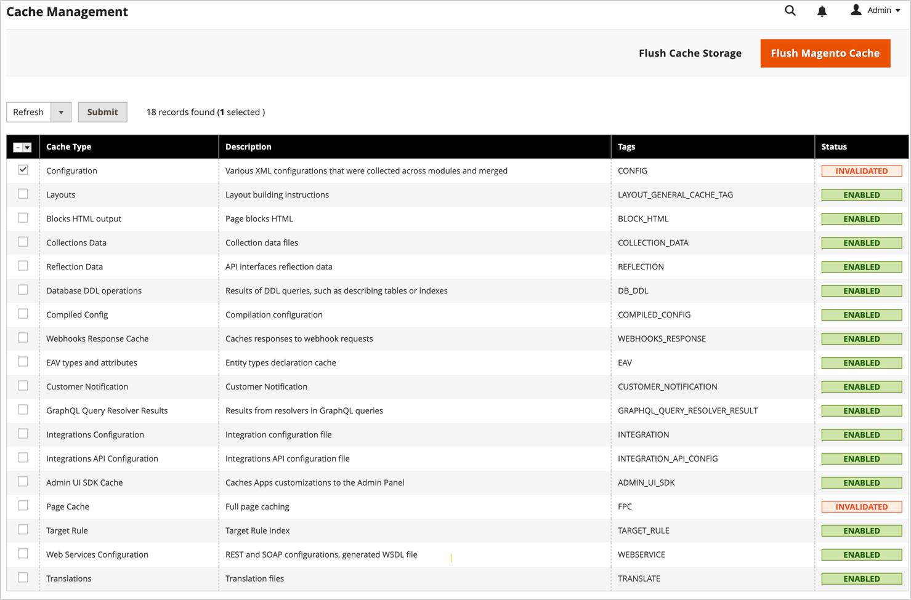
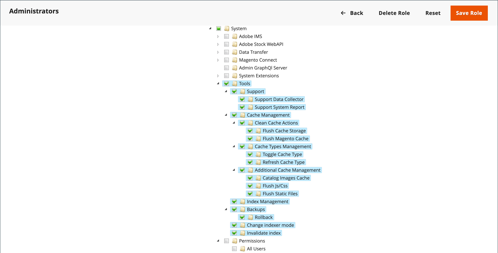
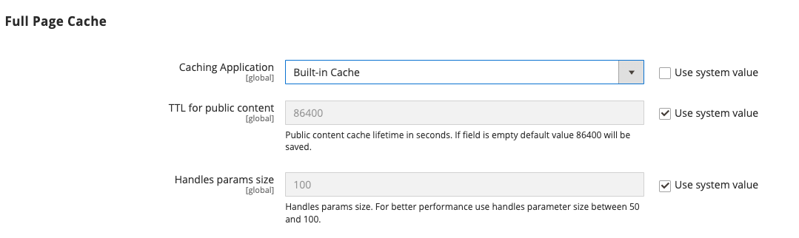
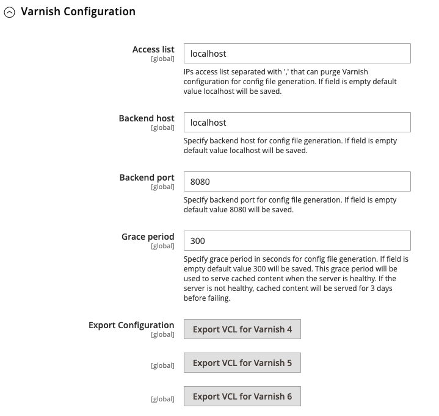

# キャッシュ管理

Adobe CommerceとMagento Open Sourceのキャッシュ管理システムは、サイトのパフォーマンスを向上させる簡単な方法を提供します。 キャッシュの更新が必要な場合は、常に通知が表示され、更新を完了するための[!UICONTROL Cache Management] ページへのリンクが表示されます。

{width="500"}

_[!UICONTROL Cache Management]_ページには、各プライマリキャッシュとその関連タグのステータスが表示されます。 右上隅の大きなボタンを使用して、キャッシュをフラッシュするか、オールインクルーシブなキャッシュストレージをフラッシュできます。 ページの下部にある追加のボタンを使用すると、カタログ商品画像のキャッシュとJavaScript/CSSのキャッシュをフラッシュできます。

>[!IMPORTANT]
>
>カタログエンティティが変更されると、他のページに影響を与え、複数のキャッシュを同時に無効にすることができます。 キャッシュ管理ページを確認すると、_**直接編集されていない**_&#x200B;時点で更新が必要な無効な項目が表示される可能性があります。 例えば、この無効化は、任意のカテゴリに割り当てられているカタログ内の製品を編集する場合や、関連する製品ルールを変更する場合に発生します。

キャッシュをクリアした後は、常にブラウザーを更新して、最新のファイルが表示されるようにします。 Commerce キャッシュをクリアしても、web ブラウザーのキャッシュはクリアされません。 更新されたコンテンツを確認するには、ブラウザーのキャッシュをクリアする必要がある場合があります。

Adobe Commerce キャッシュに関するその他の技術情報については、_Commerce フロントエンド開発ガイド_&#x200B;の[Cache overview](https://developer.adobe.com/commerce/frontend-core/guide/caching/){:target="_blank"}を参照してください。

次のいずれかの操作を行って、_[!UICONTROL Cache Management]_ページにアクセスします。

- ワークスペースの上にあるメッセージの&#x200B;**[!UICONTROL Cache Management]** リンクをクリックします。
- _管理者_ サイドバーで、**[!UICONTROL System]** > _[!UICONTROL Tools]_>**[!UICONTROL Cache Management]**に移動します。

{width="700" zoomable="yes"}

## キャッシュのベストプラクティス

Commerceでは、インデックス再作成とキャッシュの目的が異なります。 [ インデックス ](index-management.md)は、検索パフォーマンスの向上、ストアフロントのデータ検索の高速化などのデータベース情報を追跡します。 キャッシュは、読み込まれたデータ、画像、フォーマットなどを保存して、パフォーマンスの読み込みやストアフロントへのアクセスを向上させます。

- 拡張機能やモジュールをインストールした後は、必ずキャッシュをフラッシュしてください。 1つ以上の拡張機能をインストールしてから、キャッシュをフラッシュできます。
- Commerceのインストール後にキャッシュをフラッシュします。 新規インストールの場合は、インデックスを再作成する必要があります。
- Open SourceまたはCommerceのバージョンから別のバージョンにアップグレードした後、キャッシュをフラッシュします。
- キャッシュをフラッシュする場合は、キャッシュのタイプと非ピーク時のフラッシュのスケジュールを考慮してください。 例えば、深夜や早朝など、サイトを利用する顧客が少ない時間を選択します。 ピーク時にキャッシュタイプをクリアすると、管理者の負荷が増加し、操作が完了するまでサイトがダウンする可能性があります。
- [ インデックス再作成](index-management.md)の場合、キャッシュをフラッシュする必要はありません。

## キャッシュ管理の役割リソース

キャッシュの表示、切り替え、フラッシュのオプションなど、役割ごとに特定のキャッシュメンテナンスアクションへのアクセスをユーザーに割り当てることができます。 Adobeでは、管理者レベルのユーザーに対してのみフラッシュアクションを有効にすることをお勧めします。 すべてのキャッシュ管理機能にアクセスできるようにすると、ストアフロントのパフォーマンスに影響を与える可能性があります。

{width="600" zoomable="yes"}

管理者ユーザーアカウントへのアクセス権を付与するためのリソースの割り当てについて詳しくは、[役割リソース ](permissions-user-roles.md#role-resources)を参照してください。 次のリソースは、キャッシュ管理ツールへのアクセスを制御します。

- [!UICONTROL Clean Cache Actions]

   - [!UICONTROL Flush Cache Storage]
   - [!UICONTROL Flush Magento Cache]

- [!UICONTROL Cache Type Management]

   - [!UICONTROL Toggle Cache Type]
   - [!UICONTROL Refresh Cache Type]

- [!UICONTROL Additional Cache Management]

   - [!UICONTROL Catalog Images Cache]
   - [!UICONTROL Flush Js/Css]
   - [!UICONTROL Flush Static Files]

## 特定のキャッシュを更新

1. 更新する各キャッシュについて、行の先頭にあるチェックボックスを選択します。

1. **[!UICONTROL Actions]**&#x200B;を`Refresh`に設定し、**[!UICONTROL Submit]**&#x200B;をクリックします。

## マスアクションの更新を実行

1. キャッシュのグループを選択するには、**[!UICONTROL Mass Actions]**&#x200B;を次のいずれかに設定します。

   - `Select All`
   - `Select Visible`

1. 更新する各キャッシュのチェックボックスをオンにします。

1. **[!UICONTROL Actions]**&#x200B;を`Refresh`に設定し、**[!UICONTROL Submit]**&#x200B;をクリックします。

## 製品画像キャッシュをフラッシュする

1. _[!UICONTROL Additional Cache Management]_で「**[!UICONTROL Flush Catalog Images Cache]**」をクリックして、事前生成された製品画像ファイルを消去します。

   `Image cache was cleaned` メッセージがワークスペースの上部に表示されます。

1. ブラウザーのキャッシュを消去します。

## JavaScript/CSS キャッシュのフラッシュ

1. _[!UICONTROL Additional Cache Management]_で、**[!UICONTROL Flush JavaScript/CSS Cache]**をクリックして1つのファイルに結合されたJavascriptおよびCSS ファイルをクリアします。

   `The JavaScript/CSS cache has been cleaned` メッセージがワークスペースの上部に表示されます。

1. ブラウザーのキャッシュを消去します。

## コマンドラインを使用したフラッシュ

Commerce アプリケーションサーバーにアクセスできるシステム管理者および開発者は、Commerce CLIを使用して、コマンドラインからキャッシュおよびキャッシュ設定を管理することもできます。 _設定ガイド_&#x200B;の「[ キャッシュの管理](https://experienceleague.adobe.com/en/docs/commerce-operations/configuration-guide/cli/manage-cache#clean-and-flush-cache-types){:target="_blank"}」を参照してください。

## コントロール

| 制御 | 説明 |
|---------------------------|------------------------------------------------------------------------------------------------------------------------------------------------------------------------------------------------------------------------------------------------------------------------------------------------------------------------------------------------------------|
| [!UICONTROL Mass Actions] | 複数キャッシュのチェックボックスを選択します。 オプション： **[!UICONTROL Select All]**– すべてのキャッシュのチェックボックスを選択します。 **&#x200B;すべてを選択解除&#x200B;**– すべてのキャッシュのチェックボックスをクリアします。 **[!UICONTROL Select Visible]** – 表示されているすべてのキャッシュのチェックボックスを選択します。 **[!UICONTROL Unselect Visible]**– 表示されているすべてのキャッシュのチェックボックスをクリアします。 |
| [!UICONTROL Actions] | 選択したすべてのキャッシュに適用するアクションを決定します。 オプション： **[!UICONTROL Enable]**– 選択したすべてのキャッシュを有効にします。 **[!UICONTROL Disable]** – 選択したすべてのキャッシュを無効にします。 **[!UICONTROL Refresh]**– 選択したすべてのキャッシュを更新します。 |
| [!UICONTROL Submit] | 選択したすべてのキャッシュにアクションを適用します。 |

{style="table-layout:auto"}

### ボタン

| ボタン | 説明 |
|-----------------------------------------|----------------------------------------------------------------------------------------------------------------------------------------------------------------------------------------------------------------------------------------|
| [!UICONTROL Flush Magento Cache] | 関連付けられているCommerce タグに従って、デフォルトのCommerce キャッシュ （`var/cache`）内のすべての項目を削除します。 |
| [!UICONTROL Flush Cache Storage] | Commerce タグに関係なく、キャッシュからすべての項目を削除します。 システムで別のキャッシュの場所を使用している場合、他のアプリケーションで使用されているキャッシュ済みファイルはプロセスで削除されます。 |
| [!UICONTROL Flush Catalog Images Cache] | `media/catalog/product/cache`に保存されている、自動的にサイズ変更および透かしを入れたカタログ画像をすべて削除します。 最近アップロードした画像がカタログに反映されない場合は、カタログをフラッシュしてブラウザーを更新してみてください。 |
| [!UICONTROL Flush JavaScript/CSS Cache] | JavaScript ファイルとCSS ファイルの結合コピーをキャッシュから削除します。 スタイルシートまたはJavaScriptの最近の変更がストアに反映されない場合は、JavaScript/CSS キャッシュをフラッシュしてブラウザーを更新してみてください。 |
| [!UICONTROL Flush Static Files Cache] | 前処理されたビューファイルと静的ファイルを削除します。 |

{style="table-layout:auto"}

### キャッシュ

[!UICONTROL Cache Management] ページには、管理者から現在のステータスで管理できるキャッシュの種類が一覧表示されます。 この節では、Adobe Commerceでサポートされているデフォルトのキャッシュタイプについて説明します。 _Cache Tag_&#x200B;列と&#x200B;_Cache id_&#x200B;列には、Commerce アプリケーション コードで使用される値が記述されています。

- `cache_type_id`は、キャッシュ タイプの一意のIDを定義します。

- `%CACHE_TYPE_TAG%`は、キャッシュ タイプのスコープで使用する一意のタグを定義します。

開発者やシステムインテグレーターは、GraphQL APIを使用した統合開発など、Adobe Commerceとのカスタマイズや統合時に、これらの値を使用してキャッシュを設定および管理します。

[!BADGE PaaSのみ]{type=Informative url="https://experienceleague.adobe.com/en/docs/commerce/user-guides/product-solutions" tooltip="Adobe Commerce on Cloud プロジェクト（Adobeで管理されるPaaS インフラストラクチャ）とオンプレミス プロジェクトにのみ適用されます。"} `cache_type_id`は、Commerce CLIを使用してアプリケーションサーバーのコマンドラインからキャッシュ管理にも使用されます。 例えば、` bin/magento cache:status config`は設定キャッシュの現在のステータスを表示します。

>[!NOTE]
>
>開発者やシステムインテグレーターは、Commerceのキャッシュ管理システムをカスタマイズおよび拡張して、カスタムモジュールと統合をサポートできます。 詳しくは、_Adobe Commerce設定ガイド_&#x200B;の「[ キャッシュの設定](https://experienceleague.adobe.com/en/docs/commerce-operations/configuration-guide/cache/caching-overview)」を参照してください。

<!-- prettier-ignore -->

#### キャッシュリストの詳細

| キャッシュ | 説明 | キャッシュタグ | キャッシュ ID |
|-------|------------|----------|----------|
| [!UICONTROL Configuration] | Commerceは、すべてのモジュールからXML設定を収集して結合し、結合された結果をキャッシュに保存します。 **[!UICONTROL System]**- `config.xml`,`local.xml` **[!UICONTROL Module]** - `config.xml`  このキャッシュには、ファイルシステムとデータベースに保存されているストア固有の設定も含まれています。 設定ファイルを変更した後、このキャッシュタイプをクリーニングまたはフラッシュします。 | `CONFIG` | `config` |
| [!UICONTROL Layouts] | コンパイルされたページレイアウト、つまり、すべてのコンポーネントのレイアウトコンポーネントです。 レイアウトファイルを変更した後、このキャッシュタイプをクリーニングまたはフラッシュします。 | `LAYOUT_GENERAL_CACHE_TAG` | `layout` |
| [!UICONTROL Blocks HTML output] | ブロックごとのHTML ページフラグメント。 ビューレイヤーを変更した後、このキャッシュタイプをクリーニングまたはフラッシュします。 | `BLOCK_HTML` | `block_html` |
| [!UICONTROL Collections Data] | データベースクエリの結果を格納するデータファイルを収集します。 必要に応じて、Commerceはこのキャッシュを自動的にクリーンアップしますが、サードパーティの開発者はキャッシュの任意のセグメントに任意のデータを配置できます。 カスタムモジュールでロジックを使用している場合は、このキャッシュタイプをクリーニングまたはフラッシュします。その結果、Commerceでクリーニングできないキャッシュエントリが発生します。 | `COLLECTION_DATA` | `collections` |
| [!UICONTROL Reflections] | 通常、実行時に生成されるAPI インターフェイスのリフレクションデータをクリアします。 | `REFLECTION` | `reflection` |
| `Database DDL operations` | データベーススキーマ： 必要に応じて、Commerceはこのキャッシュを自動的にクリーンアップしますが、サードパーティの開発者はキャッシュの任意のセグメントに任意のデータを配置できます。 データベーススキーマにカスタム変更を加えた後、このキャッシュタイプをクリーニングまたはフラッシュします。 （つまり、これらはCommerceが自ら作成しない更新です）。 データベース スキーマを自動的に更新する方法の1つは、magento setup:db-schema:upgrade コマンドを使用することです。 | `DB_DDL` | `db_ddl` |
| [!UICONTROL Compiled Config] | コードのコンパイル結果。 | `COMPILED_CONFIG` | `compiled_config` |
| [!UICONTROL Webhooks Response Cache] | Webhook リクエストに対する応答をキャッシュします。 詳しくは、Commerce開発者向けドキュメントの[Webhook ガイド ](https://developer.adobe.com/commerce/extensibility/webhooks/release-notes/#enhancements-2)を参照してください。 | `WEBHOOKS_RESPONSE` | `webhooks_response` |
| [!UICONTROL EAV types and attributes] | エンティティ属性値（EAV）属性に関連するメタデータのエンティティタイプ宣言をキャッシュします。 属性には、ストアラベル、関連するPHP コードへのリンク、属性レンダリング、検索設定などが含まれます。 通常、このキャッシュタイプをクリーニングしたりフラッシュしたりする必要はありません。 | `EAV` | `eav` |
| [!UICONTROL Customer Notification] | ユーザーインターフェイスに表示される一時通知。 | `CUSTOMER_NOTIFICATION` | `customer_notification` |
| [!UICONTROL GraphQL Query Resolver Results] | お客様、CMS ページ、CMS ブロック、およびproduct media gallery エンティティのGraphQL クエリリゾルバの結果をキャッシュします。 GraphQLのパフォーマンスを向上させるために、このキャッシュを有効のままにします。 | `GRAPHQL_QUERY_RESOLVER_RESULT` | `graphql_query_resolver_result` |
| [!UICONTROL Integrations Configuration] | 統合設定ファイル。 統合を変更または追加した後、このキャッシュをクリーニングまたはフラッシュします。 | `INTEGRATION` | `config_integration` |
| [!UICONTROL Integrations API Configuration] | ストア統合用のコンパイル済み統合API設定。 | `INTEGRATION_API_CONFIG` | `config_integration_api` |
| [!UICONTROL Admin UI SDK Cache] | カスタマイズを管理者にキャッシュします。 _管理者UI SDK ガイド_&#x200B;の「[管理者設定とテスト ](https://developer.adobe.com/commerce/extensibility/admin-ui-sdk/configuration/)」を参照してください。 | `ADMIN_UI_SDK` | `admin_ui_sdk` |
| [!UICONTROL Page Cache] | フルページキャッシュ： | `FPC` | `full_page` |
| [!UICONTROL Target Rule] | ターゲットルールインデックス | `TARGET_RULE` | `target_rule` |
| [!UICONTROL Web Services Configuration] | Web API構造のキャッシュ。 | `WEBSERVICE` | `config_webservice` |
| [!UICONTROL Translations] | 翻訳ファイル。 | `TRANSLATE` | `translate` |

{style="table-layout:auto"}

## ページ全体のキャッシュ

Adobe CommerceとMagento Open Sourceは、サーバー上でページ全体をキャッシュし、カテゴリ、商品、CMSのページをすばやく表示します。 フルページキャッシュは、応答時間を短縮し、サーバー上の負荷を軽減します。 キャッシュがなければ、各ページでコードブロックを実行し、データベースから情報を取得する必要がある場合があります。 ただし、ページ全体のキャッシュを有効にすると、完全に生成されたページをキャッシュから直接読み取ることができます。

>[!NOTE]
>
>[Varnish Cache](https://varnish-cache.org/){:target="_blank"}は、実稼動環境でのみ使用することをお勧めします。

キャッシュされたコンテンツは、類似のタイプの訪問からのリクエストを処理するために使用できます。 その結果、カジュアルな訪問者に表示されるページと、顧客に表示されるページが異なる場合があります。 キャッシュの目的では、各訪問は3つのタイプのいずれかです。

- `Non-sessioned` – 非セッション訪問中、買い物客はページを表示しますが、ストアを操作しません。 閲覧した各ページのコンテンツをキャッシュし、セッションしていない他の買い物客に提供します。
- `Sessioned` - セッション訪問中に、ストアとやり取りする買い物客にセッション IDが割り当てられます。 インタラクションには、商品の比較やショッピングカートへの商品の追加などのアクティビティが含まれます。 セッション中に生成されたキャッシュされたページは、セッション中にその買い物客のみが使用します。
- `Customer` – 登録したアカウントを使用してログインして買い物をするお客様向けのセッションが作成されます。 セッションでは、顧客に割り当てられた顧客グループに基づいた特別オファー、プロモーション、価格を提示できます。

技術情報については、_設定ガイド_&#x200B;の「[Varnish](https://experienceleague.adobe.com/docs/commerce-operations/configuration-guide/cache/varnish/config-varnish.html){:target="_blank"}の設定と使用」および「[Commerce ページとデフォルトのキャッシュ ](https://experienceleague.adobe.com/docs/commerce-operations/configuration-guide/cache/redis/redis-pg-cache.html){:target="_blank"}にRedisを使用する」を参照してください。

**_フルページキャッシュを設定するには:_**

1. _管理者_ サイドバーで、**[!UICONTROL Stores]** > _[!UICONTROL Settings]_>**[!UICONTROL Configuration]**に移動します。

1. 左側のパネルで、**[!UICONTROL Advanced]**&#x200B;を展開し、**[!UICONTROL System]**&#x200B;を選択します。

1. **[!UICONTROL Full Page Cache]** セクションのを展開します。

   {width="600" zoomable="yes"}

1. **[!UICONTROL Caching Application]**&#x200B;を次のいずれかに設定します：

   - `Built-in Application`
   - `Varnish Caching`

1. ページキャッシュのタイムアウトを設定するには、**[!UICONTROL TTL for public content]**&#x200B;を入力します。 （デフォルト値は`86400`です）

1. [`{BASE-URL}/page_cache/block/esi`](https://experienceleague.adobe.com/docs/commerce-operations/configuration-guide/cache/use-varnish-esi.html) HTTP エンドポイントで処理する[ レイアウトハンドル ](https://developer.adobe.com/commerce/frontend-core/guide/layouts/#layout-handles)の最大数を指定するには、**[!UICONTROL Handles param size]**&#x200B;を入力します。 サイズを制限すると、セキュリティとパフォーマンスが向上します。 （デフォルト値は`100`です）

1. Varnishを使用する場合は、次のように&#x200B;**[!UICONTROL Varnish Configuration]** セクションを入力します。

   - **[!UICONTROL Access list]** - Varnish設定をパージして設定ファイルを生成できるIP アドレスを入力します。 複数のエントリをコンマで区切ります。 デフォルト値は`localhost`です。

   - **[!UICONTROL Backend host]** – 構成ファイルを生成するバックエンド ホストのIP アドレスを入力します。 デフォルト値は`localhost`です。

   - **[!UICONTROL Backend port]** – 構成ファイルの生成に使用されるバックエンド ポートを特定します。 デフォルト値は`8080`です。

   - **[!UICONTROL Grace period]** – 構成ファイルを生成するための猶予期間として使用する秒数を指定します。 _設定ガイド_&#x200B;の[高度なVarnish設定](https://experienceleague.adobe.com/docs/commerce-operations/configuration-guide/cache/config-varnish-advanced.html)を参照してください。

   - 設定を`varnish.vcl` ファイルとしてエクスポートするには、使用するVarnishのバージョンのボタンをクリックします。

   {width="600" zoomable="yes"}

1. 完了したら、**[!UICONTROL Save Config]**&#x200B;をクリックします。
