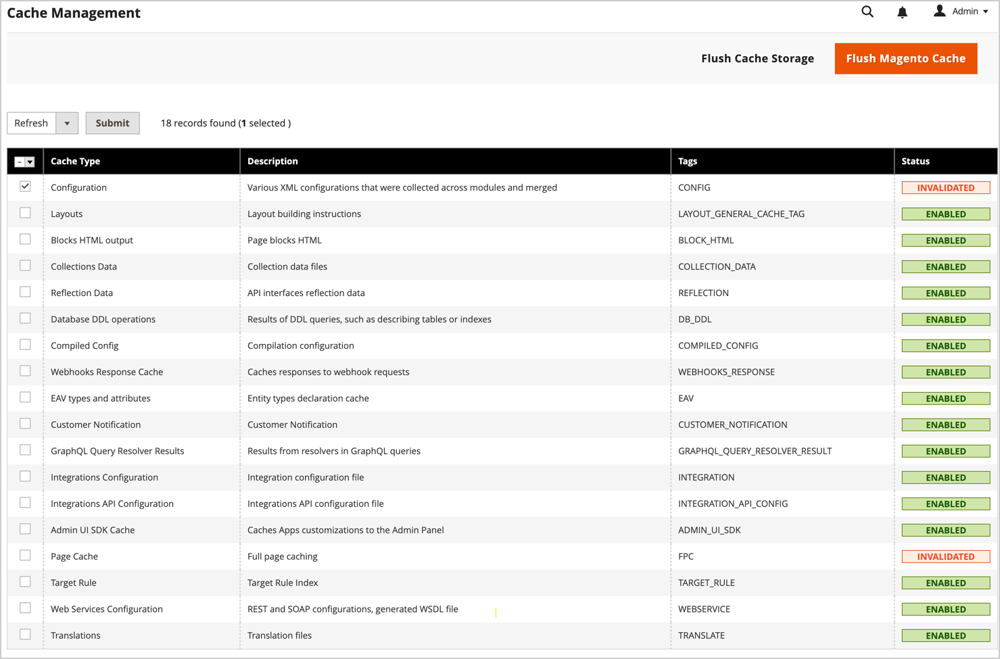

# キャッシュ管理

Adobe CommerceおよびMagento Open Sourceのキャッシュ管理システムを使用すると、サイトのパフォーマンスを簡単に向上させることができます。 キャッシュの更新が必要な場合は常に、更新を完了するための [!UICONTROL Cache Management] ページへのリンクを含む通知が表示されます。

{width="500"}

_[!UICONTROL Cache Management]_&#x200B;のページには、各プライマリ・キャッシュのステータスと関連するタグが表示されます。 右上隅の大きなボタンを使用して、キャッシュまたは包括的なキャッシュストレージをフラッシュできます。 ページの下部には、カタログ商品画像のキャッシュとJavaScript/CSS のキャッシュをフラッシュするためのボタンが用意されています。

>[!IMPORTANT]
>
>カタログエンティティが変更されると、他のページに影響を与え、複数のキャッシュが同時に無効になる可能性があります。 キャッシュ管理ページを確認すると、無効な項目が _&#x200B;**直接編集されていない**&#x200B;_ 場合に、更新が必要となることがあります。 例えば、この無効化は、任意のカテゴリに割り当てられているカタログ内の製品を編集した場合や、関連する製品ルールを変更した場合に発生します。

キャッシュをクリアした後は、常にブラウザーを更新して、最新のファイルが表示されるようにします。 Commerceのキャッシュをクリアしても、web ブラウザーのキャッシュはクリアされません。 更新されたコンテンツを表示するには、ブラウザーのキャッシュをクリアする必要がある場合があります。

Adobe Commerceのキャッシュに関するその他の技術情報については、_Commerce フロントエンド開発ガイド [&#128279;](https://developer.adobe.com/commerce/frontend-core/guide/caching/){:target="_blank"} の  キャッシュの概要_ を参照してください。

次のいずれかの操作を行って、_[!UICONTROL Cache Management]_&#x200B;ページにアクセスします。

- ワークスペースの上にあるメッセージ内の「**[!UICONTROL Cache Management]**」リンクをクリックします。
- _管理者_ サイドバーで、**[!UICONTROL System]**/_[!UICONTROL Tools]_/**[!UICONTROL Cache Management]**&#x200B;に移動します。

{width="700" zoomable="yes"}

## キャッシュのベストプラクティス

Commerceでのインデックス再作成とキャッシュの目的は異なります。 [ インデックス ](index-management.md) データベース情報を追跡して、検索パフォーマンスの向上、ストアフロントのデータ取得の高速化などを実現します。 キャッシュは、読み込んだデータ、画像、形式などを保存して、ストアフロントへの読み込みとアクセスのパフォーマンスを向上させます。

- 拡張機能やモジュールをインストールした後は、必ずキャッシュをフラッシュしてください。 1 つ以上の拡張機能をインストールしてから、キャッシュをフラッシュできます。
- Commerceをインストールした後、キャッシュをフラッシュします。 新規インストールの場合は、のインデックスも再作成する必要があります。
- Open SourceまたはCommerceを別のバージョンにアップグレードした後で、キャッシュをフラッシュします。
- キャッシュをフラッシュする場合は、キャッシュのタイプと、ピーク時以外の時間にフラッシュをスケジュールすることを考慮してください。 例えば、深夜や早朝など、サイトを使用する顧客が少ない時間を選択します。 ピーク時の要求時にキャッシュ タイプをクリアすると、管理者の負荷が増え、操作が完了するまでサイトが停止する場合があります。
- [ インデックス再作成 ](index-management.md) を行う際に、キャッシュをフラッシュする必要はありません。

## キャッシュ管理ロール リソース

キャッシュの表示、切り替え、フラッシュのオプションなど、特定のキャッシュメンテナンスアクションへのアクセスを役割ごとにユーザーに割り当てることができます。 Adobeでは、管理者レベルのユーザーに対してのみフラッシュアクションを有効にすることをお勧めします。 すべてのキャッシュ管理機能にアクセスできるようにすると、ストアフロントのパフォーマンスに影響を与える可能性があります。

{width="600" zoomable="yes"}

管理者ユーザーアカウントに対するアクセスを許可するためのリソースの割り当てについては、[ 役割リソース ](permissions-user-roles.md#role-resources) を参照してください。 次のリソースは、キャッシュ管理ツールへのアクセスを制御します。

- [!UICONTROL Clean Cache Actions]

   - [!UICONTROL Flush Cache Storage]
   - [!UICONTROL Flush Magento Cache]

- [!UICONTROL Cache Type Management]

   - [!UICONTROL Toggle Cache Type]
   - [!UICONTROL Refresh Cache Type]

- [!UICONTROL Additional Cache Management]

   - [!UICONTROL Catalog Images Cache]
   - [!UICONTROL Flush Js/Css]
   - [!UICONTROL Flush Static Files]

## 特定のキャッシュの更新

1. 更新するキャッシュごとに、行の先頭にあるチェックボックスを選択します。

1. **[!UICONTROL Actions]** を `Refresh` に設定し、「**[!UICONTROL Submit]**」をクリックします。

## 一括アクション更新の実行

1. キャッシュのグループを選択するには、**[!UICONTROL Mass Actions]** を次のいずれかに設定します。

   - `Select All`
   - `Select Visible`

1. 更新する各キャッシュのチェックボックスを選択します。

1. **[!UICONTROL Actions]** を `Refresh` に設定し、「**[!UICONTROL Submit]**」をクリックします。

## 製品画像キャッシュをフラッシュします。

1. 「_[!UICONTROL Additional Cache Management]_」で「**[!UICONTROL Flush Catalog Images Cache]**」をクリックし、事前生成済みの製品画像ファイルをクリアします。

   `Image cache was cleaned` メッセージがワークスペースの上部に表示されます。

1. ブラウザーのキャッシュをクリアします。

## JavaScript/CSS キャッシュをフラッシュします

1. 「_[!UICONTROL Additional Cache Management]_」で、「**[!UICONTROL Flush JavaScript/CSS Cache]**」をクリックして 1 つのファイルに結合された Javascript ファイルと CSS ファイルを消去します。

   `The JavaScript/CSS cache has been cleaned` メッセージがワークスペースの上部に表示されます。

1. ブラウザーのキャッシュをクリアします。

## コマンドラインを使用したフラッシュ

Commerce アプリケーションサーバーへのアクセス権を持つシステム管理者および開発者は、Commerce CLI を使用して、コマンドラインからキャッシュとキャッシュ設定を管理することもできます。 _設定ガイド [&#128279;](https://experienceleague.adobe.com/en/docs/commerce-operations/configuration-guide/cli/manage-cache#clean-and-flush-cache-types){:target="_blank"} の  キャッシュの管理_ を参照してください。

## コントロール

| 制御 | 説明 |
|---------------------------|------------------------------------------------------------------------------------------------------------------------------------------------------------------------------------------------------------------------------------------------------------------------------------------------------------------------------------------------------------|
| [!UICONTROL Mass Actions] | 複数のキャッシュのチェックボックスを選択します。 Options:  **[!UICONTROL Select All]**– すべてのキャッシュのチェックボックスを選択します。 **&#x200B; Unselect All &#x200B;**：すべてのキャッシュのチェックボックスをクリアします。 **[!UICONTROL Select Visible]** – すべての表示可能なキャッシュのチェックボックスを選択します。  **[!UICONTROL Unselect Visible]**– 表示されているすべてのキャッシュのチェックボックスをクリアします。 |
| [!UICONTROL Actions] | 選択したすべてのキャッシュに適用されるアクションを決定します。 Options:  **[!UICONTROL Enable]**– 選択したすべてのキャッシュを有効にします。 **[!UICONTROL Disable]** – 選択したすべてのキャッシュを無効にします。  **[!UICONTROL Refresh]**– 選択したすべてのキャッシュを更新します。 |
| [!UICONTROL Submit] | 選択したすべてのキャッシュにアクションを適用します。 |

{style="table-layout:auto"}

### ボタン

| ボタン | 説明 |
|-----------------------------------------|----------------------------------------------------------------------------------------------------------------------------------------------------------------------------------------------------------------------------------------|
| [!UICONTROL Flush Magento Cache] | 関連付けられたCommerce タグに従って、デフォルトのCommerce キャッシュ（`var/cache`）のすべての項目を削除します。 |
| [!UICONTROL Flush Cache Storage] | Commerceのタグに関係なく、キャッシュからすべての項目を削除します。 システムで別のキャッシュの場所を使用している場合、他のアプリケーションで使用されているキャッシュされたファイルは、そのプロセスで削除されます。 |
| [!UICONTROL Flush Catalog Images Cache] | `media/catalog/product/cache` に保存されている自動的にサイズ変更され、透かし付きのすべてのカタログ画像を削除します。 最近アップロードした画像がカタログに反映されない場合は、カタログをフラッシュし、ブラウザーを更新してみてください。 |
| [!UICONTROL Flush JavaScript/CSS Cache] | JavaScriptと CSS ファイルの結合コピーをキャッシュから削除します。 スタイルシートまたはJavaScriptに対する最近の変更がストアに反映されない場合は、JavaScript/CSS キャッシュをフラッシュし、ブラウザーを更新してみてください。 |
| [!UICONTROL Flush Static Files Cache] | 前処理されたビューファイルと静的ファイルを削除します。 |

{style="table-layout:auto"}

### キャッシュ

[!UICONTROL Cache Management] のページには、管理者から管理できるキャッシュタイプと、現在のステータスが一覧表示されます。 ここでは、Adobe Commerceでサポートされるデフォルトのキャッシュタイプについて説明します。 _キャッシュタグ_ 列と _キャッシュ ID_ 列は、Commerce アプリケーションコードで使用される値を表します。

- `cache_type_id` は、キャッシュタイプの一意の ID を定義します。

- `%CACHE_TYPE_TAG%` は、キャッシュタイプスコーピングで使用される一意のタグを定義します。

開発者およびシステムインテグレーターは、これらの値を使用して、Adobe Commerceのカスタマイズや統合を行う際のキャッシュの設定や管理を行います。例えば、GraphQL API を使用して統合を開発する場合などです。

[!BADGE PaaS のみ &#x200B;]{type=Informative url="https://experienceleague.adobe.com/en/docs/commerce/user-guides/product-solutions" tooltip="Adobe Commerce on Cloud プロジェクト（Adobeが管理する PaaS インフラストラクチャ）およびオンプレミスプロジェクトにのみ適用されます。"} この `cache_type_id` は、Commerce CLI を使用してアプリケーションサーバーのコマンドラインからキャッシュを管理する場合にも使用されます。 例えば、` bin/magento cache:status config` は設定キャッシュの現在のステータスを表示します。

>[!NOTE]
>
>開発者とシステムインテグレーターは、Commerce キャッシュ管理システムをカスタマイズおよび拡張して、カスタムモジュールやカスタムインテグレーションをサポートできます。 詳しくは、_Adobe Commerce設定ガイド [&#128279;](https://experienceleague.adobe.com/en/docs/commerce-operations/configuration-guide/cache/caching-overview) の  キャッシュの設定_ を参照してください。

<!-- prettier-ignore -->

#### キャッシュリストの詳細

| キャッシュ | 説明 | キャッシュタグ | キャッシュ ID |
|-------|------------|----------|----------|
| [!UICONTROL Configuration] | Commerceは、すべてのモジュールから XML 設定を収集し、結合して、結合結果をキャッシュに保存します。 **[!UICONTROL System]**- `config.xml`、`local.xml` **[!UICONTROL Module]** - `config.xml`   このキャッシュには、ファイルシステムおよびデータベースに保存されたストア固有の設定も含まれます。 構成ファイルを変更した後、このキャッシュの種類を消去またはフラッシュしてください。 | `CONFIG` | `config` |
| [!UICONTROL Layouts] | コンパイル済みのページレイアウト、つまり、すべてのコンポーネントのレイアウトコンポーネント。 レイアウト ファイルを変更した後で、このキャッシュの種類を消去またはフラッシュしてください。 | `LAYOUT_GENERAL_CACHE_TAG` | `layout` |
| [!UICONTROL Blocks HTML output] | ブロックごとのHTML ページフラグメント。 ビューレイヤを変更した後で、このキャッシュ タイプをクリーンアップまたはフラッシュします。 | `BLOCK_HTML` | `block_html` |
| [!UICONTROL Collections Data] | データベースクエリの結果を保存するコレクションデータファイル。 必要に応じて、Commerceはこのキャッシュを自動的にクリーンアップしますが、サードパーティのデベロッパーは任意のデータをキャッシュの任意のセグメントに配置できます。 カスタムモジュールでロジックが使用されているため、Commerceでクリーンアップできないキャッシュエントリが発生している場合は、このキャッシュタイプをクリーンアップまたはフラッシュしてください。 | `COLLECTION_DATA` | `collections` |
| [!UICONTROL Reflections] | 通常は実行時に生成される API インターフェイスのリフレクションデータをクリアします。 | `REFLECTION` | `reflection` |
| `Database DDL operations` | データベーススキーマ。 必要に応じて、Commerceはこのキャッシュを自動的にクリーンアップしますが、サードパーティのデベロッパーは任意のデータをキャッシュの任意のセグメントに配置できます。 データベーススキーマにカスタムの変更を加えた後、このキャッシュタイプをクリーンアップまたはフラッシュします。 （つまり、これらはCommerce自体が行わない更新です）。 データベーススキーマを自動的に更新する方法の 1 つは、magento setup:db-schema:upgrade コマンドを使用することです。 | `DB_DDL` | `db_ddl` |
| [!UICONTROL Compiled Config] | コードのコンパイルの結果。 | `COMPILED_CONFIG` | `compiled_config` |
| [!UICONTROL Webhooks Response Cache] | Webhook リクエストに対する応答をキャッシュします。 詳しくは、Commerce開発者向けドキュメントの [Webhook ガイド ](https://developer.adobe.com/commerce/extensibility/webhooks/release-notes/#enhancements-2) を参照してください。 | `WEBHOOKS_RESPONSE` | `webhooks_response` |
| [!UICONTROL EAV types and attributes] | エンティティ属性値（EAV）属性に関連するメタデータのエンティティ・タイプ宣言をキャッシュします。 属性には、ストアラベル、関連する PHP コードへのリンク、属性レンダリング、検索設定などが含まれます。 通常、このキャッシュタイプをクリーンアップまたはフラッシュする必要はありません。 | `EAV` | `eav` |
| [!UICONTROL Customer Notification] | ユーザーインターフェイスに表示される一時通知。 | `CUSTOMER_NOTIFICATION` | `customer_notification` |
| [!UICONTROL GraphQL Query Resolver Results] | 顧客、CMS ページ、CMS ブロック、製品メディアギャラリーエンティティのGraphQL クエリリゾルバーの結果をキャッシュします。 GraphQLのパフォーマンスを向上させるために、このキャッシュを有効のままにします。 | `GRAPHQL_QUERY_RESOLVER_RESULT` | `graphql_query_resolver_result` |
| [!UICONTROL Integrations Configuration] | 統合設定ファイル。 統合を変更または追加した後で、このキャッシュをクリーンアップまたはフラッシュしてください。 | `INTEGRATION` | `config_integration` |
| [!UICONTROL Integrations API Configuration] | ストア統合用にコンパイル済みの統合 API 設定。 | `INTEGRATION_API_CONFIG` | `config_integration_api` |
| [!UICONTROL Admin UI SDK Cache] | カスタマイズを管理者にキャッシュします。 [ 管理 UI SDK ガイド ](https://developer.adobe.com/commerce/extensibility/admin-ui-sdk/configuration/) の _管理者による設定とテスト_ を参照してください。 | `ADMIN_UI_SDK` | `admin_ui_sdk` |
| [!UICONTROL Page Cache] | 完全なページキャッシュ。 | `FPC` | `full_page` |
| [!UICONTROL Target Rule] | ターゲットルールインデックス | `TARGET_RULE` | `target_rule` |
| [!UICONTROL Web Services Configuration] | Web API 構造をキャッシュしています。 | `WEBSERVICE` | `config_webservice` |
| [!UICONTROL Translations] | 翻訳ファイル。 | `TRANSLATE` | `translate` |

{style="table-layout:auto"}

## フルページキャッシュ

Adobe CommerceとMagento Open Sourceでは、サーバー上のフルページキャッシュを使用して、カテゴリページ、製品ページおよびCMSページを迅速に表示します。 フルページキャッシュにより、応答時間が改善され、サーバーの負荷が軽減されます。 キャッシュを使用しない場合、各ページでコードブロックを実行し、データベースから情報を取得する必要が生じる可能性があります。 ただし、フルページキャッシュを有効にすると、完全に生成されたページをキャッシュから直接読み取ることができます。

>[!NOTE]
>
>[Varnish Cache](https://varnish-cache.org/){:target="_blank"} は、実稼動環境でのみ使用することをお勧めします。

キャッシュされたコンテンツを使用して、類似したタイプの訪問からのリクエストを処理できます。 その結果、不用意な訪問者に表示されるページは、顧客に表示されるページとは異なる場合があります。 キャッシュの目的上、各訪問は次の 3 つのタイプのいずれかになります。

- `Non-sessioned` - セッションなしの訪問中、買い物客はページを表示しますが、ストアとのやり取りは行いません。 システムは、表示された各ページのコンテンツをキャッシュし、セッションに参加していない他の買い物客に提供します。
- `Sessioned` - セッション型の訪問中、ストアとやり取りする買い物客には、セッション ID が割り当てられます。 インタラクションには、製品の比較や買い物かごへの製品の追加などのアクティビティが含まれます。 セッション中に生成されたキャッシュ済みページは、セッション中にその買い物客のみが使用します。
- `Customer` - ログインして登録済みアカウントを使用して買い物をした顧客に対して、顧客セッションが作成されます。 セッションの間、お客様には、割り当てられた顧客グループに基づいて、特別なオファー、プロモーション、価格が提示されます。

技術情報については、[&#128279;](https://experienceleague.adobe.com/docs/commerce-operations/configuration-guide/cache/redis/redis-pg-cache.html) 設定ガイド _の [Varnish の設定と使用 ](https://experienceleague.adobe.com/docs/commerce-operations/configuration-guide/cache/varnish/config-varnish.html){:target="_blank"} および_ Commerceページとデフォルトキャッシュに Redis を使用 {:target="_blank"} を参照してください。

**_フルページキャッシュを設定するには：_**

1. _管理者_ サイドバーで、**[!UICONTROL Stores]**/_[!UICONTROL Settings]_/**[!UICONTROL Configuration]**&#x200B;に移動します。

1. 左側のパネルで「**[!UICONTROL Advanced]**」を展開し、「**[!UICONTROL System]**」を選択します。

1. 「」を展開し、「**[!UICONTROL Full Page Cache]**」セクションを展開します。

   {width="600" zoomable="yes"}

1. **[!UICONTROL Caching Application]** を次のいずれかに設定します。

   - `Built-in Application`
   - `Varnish Caching`

1. ページキャッシュのタイムアウトを設定するには、**[!UICONTROL TTL for public content]** を入力します。 （デフォルト値は `86400`）

1. [`{BASE-URL}/page_cache/block/esi`](https://experienceleague.adobe.com/docs/commerce-operations/configuration-guide/cache/use-varnish-esi.html) HTTP エンドポイントで処理する [ レイアウトハンドル ](https://developer.adobe.com/commerce/frontend-core/guide/layouts/#layout-handles) の最大数を指定するには、**[!UICONTROL Handles param size]** を入力します。 サイズを制限すると、セキュリティとパフォーマンスが向上する可能性があります。 （デフォルト値は `100`）

1. Varnish を使用する場合は、**[!UICONTROL Varnish Configuration]** のセクションを次のように完成させます。

   - **[!UICONTROL Access list]** – 設定ファイルを生成するために Varnish 設定をパージできる IP アドレスを入力します。 複数のエントリはコンマで区切ります。 デフォルト値は `localhost` です。

   - **[!UICONTROL Backend host]** – 設定ファイルを生成するバックエンドホストの IP アドレスを入力します。 デフォルト値は `localhost` です。

   - **[!UICONTROL Backend port]** – 設定ファイルの生成に使用するバックエンドポートを識別します。 デフォルト値は `8080` です。

   - **[!UICONTROL Grace period]** – 設定ファイルを生成するための猶予期間として使用する秒数を指定します。 [ 設定ガイド ](https://experienceleague.adobe.com/docs/commerce-operations/configuration-guide/cache/config-varnish-advanced.html) の _高度なワニス設定_ を参照してください。

   - 設定を `varnish.vcl` ファイルとして書き出すには、使用する Varnish のバージョンのボタンをクリックします。

   {width="600" zoomable="yes"}

1. 完了したら、「**[!UICONTROL Save Config]**」をクリックします。
