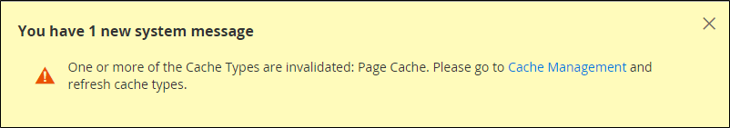
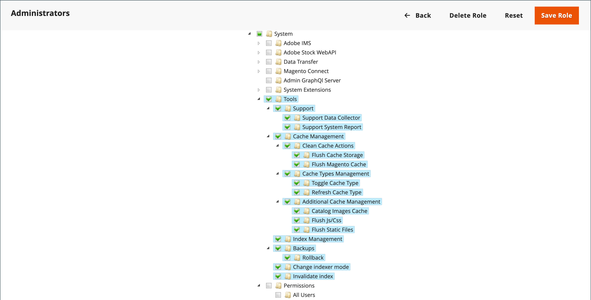

# キャッシュ管理

Adobe CommerceおよびMagento Open Sourceキャッシュ管理システムを使用すると、サイトのパフォーマンスを簡単に向上できます。 キャッシュで更新が必要な場合は常に、ワークスペースの上部に通知が表示され、プロセスの手順を示します。 「キャッシュ管理」へのリンクに従って、無効なキャッシュを更新します。

{width="500"}

>[!NOTE]
>
>カタログエンティティが変更されると、他のページに影響を与え、複数のキャッシュを同時に無効にすることができます。 キャッシュ管理ページを確認すると、更新が必要な無効な項目が、 _**直接編集されません**_. 例えば、この無効化は、カタログ内の任意の製品を編集して任意のカテゴリに割り当てる場合、または関連する製品ルールを変更する場合に発生します。

The _[!UICONTROL Cache Management]_ページには、各プライマリキャッシュとそれに関連するタグのステータスが表示されます。 右上隅の大きいボタンを使用して、キャッシュをフラッシュするか、すべてを含むキャッシュストレージをフラッシュできます。 ページの下部に、カタログ製品画像のキャッシュと JavaScript/CSS のキャッシュをフラッシュするための追加のボタンがあります。

キャッシュをクリアした後は、常にブラウザーを更新して、最新のファイルが表示されるようにします。 コマースキャッシュをクリアしても、Web ブラウザーのキャッシュはクリアされません。 更新されたコンテンツを表示するには、ブラウザーのキャッシュをクリアする必要がある場合があります。

その他の技術情報については、 [キャッシュの概要](https://developer.adobe.com/commerce/frontend-core/guide/caching/){:target=&quot;_blank&quot;} を _Commerce フロントエンド開発ガイド_.

次にアクセス： _[!UICONTROL Cache Management]_次のいずれかの操作を行って、ページを開きます。

- 次をクリック： **[!UICONTROL Cache Management]** ワークスペースの上にあるメッセージ内のリンク。
- 次の日： _管理者_ サイドバー、移動 **[!UICONTROL System]** > _[!UICONTROL Tools]_>**[!UICONTROL Cache Management]**.

{width="700" zoomable="yes"}

## キャッシュのベストプラクティス

Commerce では、インデックス再作成とキャッシュの目的が異なります。 [インデックス](index-management.md) 検索パフォーマンスの向上、ストアフロントでのデータ取得の高速化などのために、データベース情報を追跡します。 キャッシュは、読み込まれたデータ、画像、形式などを保存し、パフォーマンスの読み込みとストアフロントへのアクセスを向上させます。

- 拡張機能/モジュールをインストールした後は、必ずキャッシュをフラッシュしてください。 1 つ以上の拡張機能をインストールしてから、キャッシュをフラッシュできます。
- Commerce をインストールした後にキャッシュをフラッシュします。 新規インストールの場合は、インデックスを再作成する必要があります。
- あるバージョンのオープンソースまたはコマースから別のバージョンにアップグレードした後にキャッシュをフラッシュします。
- キャッシュをフラッシュする際は、キャッシュのタイプを考慮し、非ピーク時にフラッシュをスケジュールします。 例えば、深夜や早朝など、ほとんど顧客がサイトにアクセスしない時間を選択します。 ピーク時に一部のキャッシュタイプをクリアすると、管理者の負荷が高くなり、完了するまでサイトがダウンする場合があります。
- 条件 [インデックス再作成](index-management.md)フラッシュキャッシュも実行する必要はありません。

## キャッシュ管理ロールのリソース

特定のキャッシュメンテナンスアクションへのアクセスは、キャッシュの表示、切り替え、フラッシュを行うオプションなど、役割別にユーザーに割り当てることができます。 Adobeでは、管理者レベルのユーザーに対してのみフラッシュアクションを有効にすることをお勧めします。 すべてのキャッシュ管理機能へのアクセスを提供すると、ストアフロントのパフォーマンスに影響を与える可能性があります。

{width="600" zoomable="yes"}

管理者ユーザーアカウントにアクセス権を付与するためのリソースの割り当てについて詳しくは、 [役割のリソース](permissions-user-roles.md#role-resources). 次のリソースは、キャッシュ管理ツールへのアクセスを制御します。

- [!UICONTROL Clean Cache Actions]

   - [!UICONTROL Flush Cache Storage]
   - [!UICONTROL Flush Magento Cache]

- [!UICONTROL Cache Type Management]

   - [!UICONTROL Toggle Cache Type]
   - [!UICONTROL Refresh Cache Type]

- [!UICONTROL Additional Cache Management]

   - [!UICONTROL Catalog Images Cache]
   - [!UICONTROL Flush Js/Css]
   - [!UICONTROL Flush Static Files]

## 特定のキャッシュを更新

1. キャッシュを更新するたびに、行の先頭にあるチェックボックスをオンにします。

1. 設定 **[!UICONTROL Actions]** から `Refresh` をクリックします。 **[!UICONTROL Submit]**.

## 一括操作の更新を実行する

1. キャッシュのグループを選択するには、 **[!UICONTROL Mass Actions]** を次のいずれかに変更します。

   - `Select All`
   - `Select Visible`

1. アクションの対象となる各キャッシュのチェックボックスをオンにします。

1. 設定 **[!UICONTROL Actions]** から `Refresh` をクリックします。 **[!UICONTROL Submit]**.

## 製品画像キャッシュをフラッシュ

1. の下 _[!UICONTROL Additional Cache Management]_をクリックし、**[!UICONTROL Flush Catalog Images Cache]**をクリックして、事前に生成された製品イメージファイルを消去します。

   The `Image cache was cleaned` メッセージがワークスペースの上部に表示されます。

1. ブラウザーのキャッシュをクリアします。

## JavaScript/CSS キャッシュをフラッシュします

1. の下 _[!UICONTROL Additional Cache Management]_をクリックし、**[!UICONTROL Flush JavaScript/CSS Cache]**をクリックして、1 つのファイルに結合された JavaScript ファイルと CSS ファイルをクリアします。

   The `The JavaScript/CSS cache has been cleaned` メッセージがワークスペースの上部に表示されます。

1. ブラウザーのキャッシュをクリアします。

## コマンドラインを使用してフラッシュする

Commerce では、コマンドラインを使用して追加のフラッシュキャッシュオプションを提供します。 これらのオプションを完了するには、デベロッパーサポートが必要になる場合があります。 詳細とコマンドオプションについては、 [キャッシュの管理](https://experienceleague.adobe.com/docs/commerce-operations/configuration-guide/cli/manage-cache.html){:target=&quot;_blank&quot;} を _設定ガイド_.

## コントロール

| 制御 | 説明 |
|--- |--- |
| [!UICONTROL Mass Actions] | 複数のキャッシュのチェックボックスをオンにします。 オプション：  **[!UICONTROL Select All]**— すべてのキャッシュのチェックボックスをオンにします。 **&#x200B;すべて選択解除&#x200B;**— すべてのキャッシュのチェックボックスをオフにします。 **[!UICONTROL Select Visible]**  — すべての表示可能なキャッシュのチェックボックスを選択します。  **[!UICONTROL Unselect Visible]**— すべての表示可能なキャッシュのチェックボックスをオフにします。 |
| [!UICONTROL Actions] | 選択したすべてのキャッシュに適用するアクションを決定します。 オプション：  **[!UICONTROL Enable]**— 選択したすべてのキャッシュを有効にします。 **[!UICONTROL Disable]**  — 選択したすべてのキャッシュを無効にします。  **[!UICONTROL Refresh]**— 選択したすべてのキャッシュを更新します。 |
| [!UICONTROL Submit] | 選択したすべてのキャッシュにアクションを適用します。 |

{style="table-layout:auto"}

### ボタン

| ボタン | 説明 |
|--- |--- |
| [!UICONTROL Flush Magento Cache] | デフォルトのコマースキャッシュ (`var/cache`) に割り当てられ、関連するコマースタグに従います。 |
| [!UICONTROL Flush Cache Storage] | コマースタグに関係なく、キャッシュからすべての項目を削除します。 システムで代替キャッシュの場所を使用している場合、他のアプリケーションで使用されるキャッシュされたファイルは、プロセス内で削除されます。 |
| [!UICONTROL Flush Catalog Images Cache] | 自動的にサイズ変更され、に保存されている透かし付きのカタログ画像をすべて削除します。 `media/catalog/product/cache`. 最近アップロードした画像がカタログに反映されない場合は、カタログをフラッシュして、ブラウザーを更新してみてください。 |
| [!UICONTROL Flush JavaScript/CSS Cache] | JavaScript と CSS ファイルの結合されたコピーをキャッシュから削除します。 スタイルシートまたは JavaScript に対する最近の変更がストアに反映されない場合は、JavaScript/CSS キャッシュをフラッシュして、ブラウザーを更新してみてください。 |
| [!UICONTROL Flush Static Files Cache] | 前処理されたビューファイルと静的ファイルを削除します。 |

{style="table-layout:auto"}

### キャッシュ

| キャッシュ | 説明 | 関連付けられたタグ |
| ----- | ----------- | -------------- |
| [!UICONTROL Configuration] | モジュール間で収集され、結合された様々な XML 設定。 **[!UICONTROL System]**-  `config.xml`,`local.xml` **[!UICONTROL Module]** -  `config.xml` | `CONFIG` |
| [!UICONTROL Layouts] | レイアウトの作成手順。 | `LAYOUT_GENERAL_CACHE_TAG` |
| [!UICONTROL Blocks HTML output] | ページブロックHTML。 | `BLOCK_HTML` |
| [!UICONTROL Collections Data] | コレクションデータファイル。 | `COLLECTION_DATA` |
| [!UICONTROL Reflection Data] | 通常、実行時に生成される API インターフェイスリフレクションデータをクリアします。 | `REFLECTION` |
| [!UICONTROL Database DDL operations] | DDL クエリの結果（テーブルやインデックスの記述など）。 | `DB_DDL` |
| [!UICONTROL Compiled Config] | コードコンパイルの結果。 | `COMPILED_CONFIG` |
| [!UICONTROL EAV types and attributes] | エンティティタイプ宣言キャッシュ。 | `EAV` |
| [!UICONTROL Customer Notification] | ユーザーインターフェイスに表示される一時的な通知。 | `CUSTOMER_NOTIFICATION` |
| [!UICONTROL Integrations Configuration] | 統合設定ファイル。 | `INTEGRATION` |
| [!UICONTROL Integrations API Configuration] | 統合 API 設定ファイル。 | `INTEGRATION_API_CONFIG` |
| [!UICONTROL Page Cache] | フルページキャッシュ。 | `FPC` |
| [!UICONTROL Translations] | 翻訳ファイル。 | `TRANSLATE` |
| [!UICONTROL Web Services Configuration] | REST および SOAP 設定、生成された WSDL ファイル。 | `WEBSERVICE` |
| [!UICONTROL Target Rule] | ターゲットルールのインデックス | `TARGET_RULE` |

{style="table-layout:auto"}

## フルページキャッシュ

Adobe CommerceとMagento Open Sourceは、カテゴリ、製品、CMS のページをすばやく表示するために、サーバー上でフルページキャッシュを使用します。 フルページのキャッシュ機能により、応答時間が短縮され、サーバーの負荷が軽減されます。 キャッシュを使用しない場合、各ページでコードブロックを実行し、データベースから情報を取得する必要が生じる場合があります。 ただし、フルページキャッシュを有効にすると、完全に生成されたページをキャッシュから直接読み取ることができます。

>[!NOTE]
>
>をお勧めします。 [Vanish キャッシュ](https://varnish-cache.org/){:target=&quot;_blank&quot;} は実稼動環境でのみ使用します。

キャッシュされたコンテンツは、同様のタイプの訪問からの要求を処理するために使用できます。 その結果、通常の訪問者に表示されるページと、顧客に表示されるページとが異なる場合があります。 キャッシュの目的では、各訪問は次の 3 つのタイプのいずれかになります。

- `Non-sessioned`  — セッション化されない訪問中、買い物客はページを閲覧しますが、ストアとのやり取りはしません。 システムは、閲覧された各ページのコンテンツをキャッシュし、それらをセッション化されない他の買い物客に提供します。
- `Sessioned`  — セッションで訪問した時点で、ストアとやり取りする買い物客（製品の比較や買い物かごへの製品の追加などのアクティビティを通じて）に、セッション ID が割り当てられます。 セッション中に生成されたキャッシュされたページは、セッション中にその買い物客によってのみ使用されます。
- `Customer`  — お客様のアカウントにログインした際に、お客様のストアに登録し、お客様のアカウントでショッピングを行ったお客様向けのセッションが作成されます。 セッション中に、割り当てられた顧客グループに基づく特別オファー、プロモーション、価格を顧客に提示できます。

技術情報については、 [Vanish の設定と使用](https://experienceleague.adobe.com/docs/commerce-operations/configuration-guide/cache/varnish/config-varnish.html){:target=&quot;_blank&quot;} および [コマースページとデフォルトのキャッシュに Redis を使用](https://experienceleague.adobe.com/docs/commerce-operations/configuration-guide/cache/redis/redis-pg-cache.html){:target=&quot;_blank&quot;} を _設定ガイド_.

**_フルページキャッシュを設定するには：_**

1. 次の日： _管理者_ サイドバー、移動 **[!UICONTROL Stores]** > _[!UICONTROL Settings]_>**[!UICONTROL Configuration]**.

1. 左側のパネルで、を展開します。 **[!UICONTROL Advanced]** を選択します。 **[!UICONTROL System]**.

1. 展開  の **[!UICONTROL Full Page Cache]** 」セクションに入力します。

   {width="600" zoomable="yes"}

1. 設定 **[!UICONTROL Caching Application]** を次のいずれかに変更します。

   - `Built-in Application`
   - `Varnish Caching`

1. ページキャッシュのタイムアウトを設定するには、 **[!UICONTROL TTL for public content]**. ( デフォルト値は `86400`)

1. Vanish を使用する場合は、 **[!UICONTROL Varnish Configuration]** 節の内容は次のとおりです。

   - **[!UICONTROL Access list]** - Varnish 構成をパージして設定ファイルを生成できる IP アドレスを入力します。 複数のエントリはコンマで区切ります。 デフォルト値は `localhost`.

   - **[!UICONTROL Backend host]**  — 設定ファイルを生成するバックエンドホストの IP アドレスを入力します。 デフォルト値は `localhost`.

   - **[!UICONTROL Backend port]**  — 設定ファイルの生成に使用するバックエンドポートを識別します。 デフォルト値は次のとおりです。 `8080`.

   - **[!UICONTROL Grace period]**  — 設定ファイルを生成する猶予期間として使用する秒数を指定します。 詳しくは、 [高度なワニス構成](https://experienceleague.adobe.com/docs/commerce-operations/configuration-guide/cache/config-varnish-advanced.html) （内） _設定ガイド_.

   - 設定を Adobe Campaign として書き出すには、以下を実行します。 `varnish.vcl` ファイルを開き、使用する Vanrish のバージョンのボタンをクリックします。

   {width="600" zoomable="yes"}

1. 完了したら、「 **[!UICONTROL Save Config]**.
