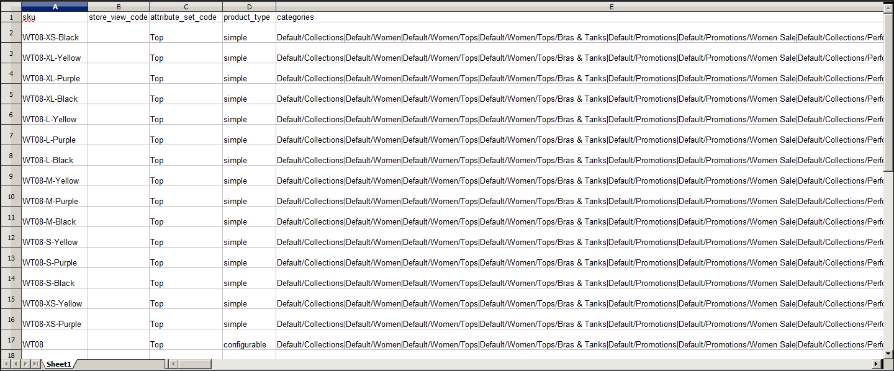
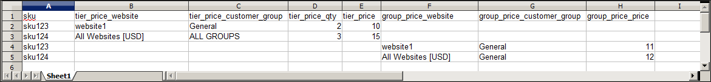

# 製品データ属性リファレンス

次の表に、一般的な製品エクスポートの属性を、それらが表示されるデフォルトの順序で示します。 各属性はCSV ファイルで列として表され、製品レコードは行で表されます。 アンダースコアで始まる列には、複雑なデータのプロパティやオプション値などのサービスデータが含まれます。 カタログから商品を[ エクスポート ](data-export.md)して、各属性がデータにどのように表示されるかを確認できます。

このデータの書き出しに使用されるインストールには、サンプルデータがインストールされ、2つのweb サイトと複数のストアビューがあります。 このリストには、通常エクスポートされるすべての列が含まれていますが、`sku`のみが必須の値です。 データを読み込むには、変更がある列のみを含めることができます。 `sku`は最初の列である必要がありますが、残りの属性の順序は関係ありません。

## シンプルな商品CSV ファイル構造

| 属性 | 説明 |
|--- |--- |
| `sku` | （必須）在庫保管単位は、在庫を追跡するために使用される一意の英数字の識別子です。 SKUの長さは最大64文字です。 例：`sku123` **_Note:_** SKUが64文字を超えると、読み込みが失敗します。 |
| `store_view_code` | 商品が利用可能な特定のストアビューを特定します。 空白の場合、商品はデフォルトのストアビューで利用できます。 例：`storeview1`、`english`、`spanish` |
| `attribute_set_code` | 製品タイプに応じて、特定の属性セットまたは製品テンプレートに製品を割り当てます。 例：`default`  製品を作成した後、読み込み機能を使用して属性セットを変更することはできません。 ただし、管理者から属性セットを変更し、製品を再エクスポートしてCSV ファイルを更新できます。 |
| `product_type` | 製品のタイプを示します。 値： `simple` – 通常は単体または固定数量で販売される有形品目。 `grouped` — セットとして販売される別の製品のグループ。 `configurable` – 顧客が購入する前に選択する必要がある複数のオプションを持つ製品。 バリエーションのセットごとに在庫を管理できます。各バリエーションは、個別のSKUを持つ個別の製品を表しているからです。 例えば、設定可能な製品の色とサイズの組み合わせは、カタログ内の特定のSKUに関連付けられます。 `virtual` – 配送を必要とせず、在庫に保管されていない無形製品。 例としては、サービス、メンバーシップ、サブスクリプションなどがあります。 `bundle` – 一緒に販売されるシンプルな製品のカスタマイズ可能な製品セット。 |
| `categories` | 製品に割り当てられている各カテゴリを示します。 スラッシュでカテゴリとサブカテゴリを区切ります。 複数のカテゴリ パスを示すには、各パスをパイプ記号\|で区切ります。 例：`Default Category/Gear\|Default Category/Gear/Bags` |
| `product_websites` | 製品が使用可能な各web サイトのweb サイトコード。 1つの製品を複数のweb サイトに割り当てることも、1つに制限することもできます。 複数のWeb サイトを指定する場合は、それぞれのWeb サイトをコンマで区切り、スペースなしで区切ります。 例：`base`または`base,website2` |
| `name` | 製品名は、すべての製品リストに表示され、顧客が製品を識別するために使用する名前です。 |
| `description` | 商品説明には、商品に関する詳細な情報が記載されており、単純なHTML タグが含まれている場合があります。 |
| `short_description` | 短い製品説明の使用は、テーマによって異なります。 商品リストに表示される場合があり、ショッピングサイトに送信されるRSS フィードのリストで使用されることがあります。 |
| `weight` | 個々の製品の重み。 実際の商品の重量は、出荷時に配送業者によって決定されます。 |
| product_online | その商品が店舗で販売可能かどうかを判断します。 値： `1` — （はい）製品は有効になっており、販売可能です。 `2` — （いいえ）製品は無効になっており、販売できません。 |
| `tax_class_name` | この製品に関連付けられている税区分の名前。 |
| `visibility` | 商品がカタログに表示され、検索に利用できるかどうかを指定します。 値： `Not Visible Individually` – 製品は製品リストに含まれていませんが、別の製品のバリエーションとして利用できる場合があります。 `Catalog` – 製品がすべてのカタログ リストに表示されます。 `Search` – この製品は検索操作に使用できます。 `Catalog, Search` – 商品はカタログリストに含まれており、検索にも利用できます。 |
| `price` | 商品が店舗で販売するために提供される価格。 |
| `special_price` | 指定された日付範囲内の製品の割引価格。 |
| `special_price_from_date` | 特別価格が有効な期間の開始日。 |
| `special_price_to_date` | 特別価格が有効な期間の最終日。 |
| `url_key` | 製品を識別するURLの部分。 デフォルト値は、製品名に基づいています。 例：`product-name` |
| save_rewrites_history | 値`1`を新しい`url_key`で指定すると、新しい301 URLの書き換えが生成され、古いURLが新しいURLにリダイレクトされます。 |
| `meta_title` | メタタイトルは、ブラウザーと検索結果リストのタイトルバーとタブに表示されます。 メタタイトルは、製品に固有で、価値の高いキーワードを組み込み、70文字未満にする必要があります。 |
| `meta_keywords` | Meta キーワードは検索エンジンにのみ表示され、一部の検索エンジンでは無視されます。 価値の高いキーワードはコンマで区切って選択します。 例：`keyword1`、`keyword2`、`keyword3` |
| `meta_description` | Metaの説明では、検索結果リストに商品の概要が表示されます。 メタ説明は150～160文字の長さが理想的ですが、フィールドには255文字まで入力できます。 |
| `base_image` | 製品ページ上のメイン画像の相対パス。 Commerceでは、ファイルはアルファベット順のフォルダー構造で内部的に保存されます。 書き出されたデータ内の各画像の正確な場所を確認できます。 例：`/sample_data/m/b/mb01-blue-0.jpg` 新しい画像をアップロードするか、既存の画像に書き込むには、ファイル名の前にスラッシュを入力します。 例：`/image.jpg` |
| `base_image_label` | ベース画像に関連付けられているラベル。 |
| `small_image` | カタログページで使用される小さな画像のファイル名です。先頭にスラッシュが付きます。 例：`/image.jpg` |
| `small_image_label` | 小さい画像に関連付けられているラベル。 例：`Small Image 1`、`Small Image 2` |
| `thumbnail_image` | 製品ページのギャラリーに表示されるサムネイル画像のファイル名の前に、スラッシュを付けます。 例：`/image.jpg` |
| `thumbnail_image_label` | 任意のサムネール画像に関連付けられたラベル。 例：`Thumbnail 1`、`Thumbnail 2` |
| `created_at` | 製品が作成された日付を示します。 日付は、製品の作成時に自動的に生成されますが、後で編集することもできます。 |
| `updated_at` | 製品が最後に更新された日付を示します。 |
| `new_from_date` | 新製品リストの「開始日」を指定し、その製品が新製品として表示されるかどうかを決定します。 |
| `new_to_date` | 新製品リストの「終了日」を指定し、その製品が新製品として表示されるかどうかを決定します。 |
| `display_product_options_in` | 製品に複数のオプションがある場合は、それらのオプションが製品ページのどこに表示されるかを指定します。 値：商品情報の列/情報列の後のブロック |
| `map_price` | 製品の最低広告価格。 （MAPが有効になっている場合にのみ表示されます）。 |
| `msrp_price` | 製造業者が提案する製品の小売価格。 （MAPが有効になっている場合にのみ表示されます）。 |
| `map_enabled` | 設定で最小広告価格が有効になっているかどうかを指定します。 値： `1` — （はい） MAPが有効です。 `0` （または空白） – （いいえ） MAPは有効ではありません。 |
| `gift_message_available` | 商品の購入にギフトメッセージを含めることができるかどうかを判断します。 値： `1` — （はい） ギフトメッセージを含めるオプションは、お客様に提示されます。 `0` （または空白） – （いいえ） ギフトメッセージを含めるオプションはお客様に表示されません。 |
| `custom_design` | 製品ページに適用できるテーマの一覧が表示されます。 |
| `custom_design_from` | 選択したテーマを製品ページに適用する開始日を指定します。 |
| `custom_design_to` | 選択したテーマを製品ページに適用する終了日を指定します。 |
| `custom_layout_update` | 製品ページにレイアウト更新として適用される追加のXML コード。 |
| `page_layout` | 製品ページのページレイアウトを決定します。 値： `No layout updates` — ページレイアウトは変更されません。 `1 column` – 製品ページに1列のレイアウトを適用します。 `2 columns with left bar` – 左サイドバーを含む2列レイアウトを製品ページに適用します。 `2 columns with right bar` – 右側のサイドバーを持つ2列レイアウトを製品ページに適用します。 `3 columns` – 商品ページに3列レイアウトを適用します。 `empty` – 商品ページに空白のレイアウトを適用します。 |
| `product_options_container` | 製品に複数のオプションがある場合は、それらのオプションが製品ページのどこに表示されるかを指定します。 値：商品情報の列/情報列の後のブロック |
| `msrp_display_actual_price_type` | 商品の実際の価格を顧客に表示する場所を指定します。 値： `In Cart` — ショッピングカート内の実際の商品価格を表示します。 `Before Order Confirmation` – 注文が確認される直前のチェックアウトプロセスの最後に、実際の商品価格を表示します。 `On Gesture` – 顧客が&#x200B;_価格をクリック_&#x200B;または&#x200B;_をクリックすると、実際の商品価格がポップアップに表示されます。_ リンク。 |
| `country_of_manufacture` | 製品が製造された国を示します。 |
| `additional_attributes` | 製品に対して作成された追加属性。 例： `has_options=0,required_options=0color=Black,has_options=0,required_options=0,size_general=XS` |
| `qty` | 現在在庫のある商品の数量。 |
| `out_of_stock_qty` | 商品の在庫切れを決定する在庫レベル。 |
| `use_config_min_qty` | 設定のデフォルト値を使用するかどうかを指定し、「設定設定を使用」チェックボックスに対応します。 値： `1` — （はい）この属性の値には、デフォルトの設定設定が使用されます。 `0` （または空白） – （いいえ）この属性の値に対してデフォルト設定を上書きできます。 |
| `is_qty_decimal` | qty属性に小数点以下桁の値があるかどうかを指定します。 値： `1` — （はい） qty属性の値は10進数値です。 `0` （または空白） – （いいえ） qty属性の値は整数（整数）です。 |
| `allow_backorders` | ストアで取り寄せ注文が許可されるかどうか、およびそれらの管理方法を決定します。 |
| `use_config_backorders` | バックオーダーのデフォルトの構成設定が使用されるかどうかを指定し、「構成設定を使用」チェックボックスの状態に対応します。 値： `1` — （はい） qty属性の値は10進数値です。 `0` （または空白） – （いいえ） qty属性の値は整数（整数）です。 |
| `min_cart_qty` | 1回の注文で購入できる商品の最小数量を指定します。 |
| `use_config_min_sale_qty` | 最小数量のデフォルトの構成設定を使用するかどうかを指定し、「構成設定を使用」チェックボックスの状態に対応します。 値： `1` — （はい）  `0` （または空白） – （いいえ） |
| `max_cart_qty` | 1回の注文で購入できる製品の最大数量を指定します。 |
| `use_config_max_sale_qty` | 最大数量のデフォルトの構成設定を使用するかどうかを指定し、「構成設定を使用」チェックボックスの状態に対応します。 値： `1` — （はい）  `0` （または空白） – （いいえ） |
| `is_in_stock` | 商品が在庫があるかどうかを示します。 |
| `notify_on_stock_below` | _在庫切れ_&#x200B;通知をトリガーする在庫レベルを指定します。 |
| `use_config_notify_stock_qty` | デフォルトの設定を使用して在庫レベルの通知をトリガーするかどうかを指定し、「設定を使用」チェックボックスのステータスに対応します。 値： `1` — （はい）  `0` （または空白） – （いいえ） |
| `manage_stock` | 商品の管理に在庫管理を使用するかどうかを決定します。 値： `1` — （はい）完全な在庫管理を有効にして、製品の在庫レベルを管理します。 `0` （または空白） – （いいえ） システムは現在在庫のある品目の数を追跡しません。 |
| `use_config_manage_stock` | 在庫を管理するためのデフォルトの構成設定を使用するかどうかを指定し、「構成設定を使用」チェックボックスの状態に対応します。 値： `1` — （はい）  `0` （または空白） – （いいえ） |
| `use_config_qty_increments` | 数量インクリメントのデフォルト設定を使用するかどうかを指定し、「設定設定を使用」チェックボックスの状態に対応します。 値： `1` — （はい）  `0` （または空白） – （いいえ） |
| `qty_increments` | 数量インクリメントを構成する製品数を設定します。 |
| `use_config_enable_qty_inc` | 数量の増分を有効にするデフォルトの設定設定が使用されているかどうかを確認し、「設定設定を使用」チェックボックスの状態に対応します。 値： `1` — （はい）  `0` （または空白） – （いいえ） |
| `enable_qty_increments` | 製品に対して数量の増分が有効かどうかを指定します。 |
| `is_decimal_divided` | 製品の一部を別々に出荷できるかどうかを判断します。 オプション：`Yes` / `No` |
| `website_id` | 複数のWeb サイトをインストールする場合は、製品が使用可能な特定のWeb サイトを特定します。 空白の場合、製品はすべてのWeb サイトで利用できます。 |
| `related_skus` | 関連製品として識別された各製品のSKUを一覧表示します。 例：`24-WG080,24-UG03,24-UG01,24-UG02` |
| `related_position` | related_skus列に関連製品としてリストされているSKUの位置（並べ替え順）を決定します。 例：`1,2,3,4` |
| `crosssell_skus` | クロスセルとして特定された各製品のSKUを一覧表示します。 |
| `crosssell_position` | `crosssell_skus`列にクロスセル製品としてリストされているSKUの位置（並べ替え順）を決定します。 |
| `upsell_skus` | アップセルとして識別された各製品のSKUを一覧表示します。 |
| `upsell_position` | `upsell_skus`列にアップセル製品としてリストされているSKUの位置（並べ替え順）を決定します。 |
| `additional_images` | 製品に関連付ける追加の画像のファイル名の前にスラッシュを付けます。 例：`/image.jpg` |
| `additional_image_labels` | 追加の画像に関連付けられたラベル。 例：`Label 1`、`Label 2` |
| `custom_options` | 各カスタムオプションに割り当てられたプロパティと値を指定します。 例： `name=Color, type=drop_down, required=1, price= price_type=fixed, sku=, option_title=Black\|name=Color, type=drop_down, required=1, price=, price_type=fixed, sku=, option_title=White` |

{style="table-layout:auto"}

## 製品バリエーションのサービスデータ

| 属性 | 説明 | 適用先 |
|--- |--- | --- |
| `_super_products_sku` | 設定可能な製品バリエーション用に生成されたSKU。 例：WB03-XS-Green | コンフィグ商品 |
| `_super_attribute_code` | 設定可能な製品バリエーションの属性コード。 例：color | コンフィグ商品 |
| `_super_attribute_option` | 設定可能な製品バリエーションの値。 例：緑 | コンフィグ商品 |
| `_super_attribute_price_corr` | 設定可能な製品バリエーションに関連付けられた価格調整。 | コンフィグ商品 |
| `_associated_sku` | グループ化された製品に関連付けられている製品のSKU。 | グループ化製品  バンドル製品 |
| `_associated_default_qty` | 含まれる関連製品の数量を指定します。 | 構成可能な製品  グループ化された製品  バンドル製品 |
| `_associated_position` | 関連する製品が他の関連製品と共にリストされている場合に、関連製品の位置を決定します。 | 構成可能な製品  グループ化された製品  バンドル製品 |

{style="table-layout:auto"}

## 複雑な商品データ属性

複雑なデータとは、複数の製品オプションに関連するデータのことです。 次の商品タイプは、別々の商品から取得したデータを使用して、商品バリエーションと複数のオプションを作成しています。

- [設定可能](../catalog/product-create-configurable.md)
- [グループ化](../catalog/product-create-grouped.md)
- [バンドル](../catalog/product-create-bundle.md)

設定可能な製品を書き出す場合、単純な製品を構成する標準属性に加えて、複雑なデータを管理するために必要な追加の属性が表示されます。

{width="600" zoomable="yes"}

### コンフィグ商品

| 属性 | 説明 |
|--- |--- |
| `configurable_variation_labels` | 製品バリエーションを特定するラベル： 例：`Choose Color:`または`Choose Size:` |
| `configurable_variations` | 製品バリエーションに関連付けられている値を記述します。 例：`sku=sku-red xs,color=red,size=xs,price=10.99,display=1,image=/pub/media/import/image1.png\|sku=sku-red-m,color=red,size=m,price=20.88,display=1,image=/pub/media/import/image2.png` |

{style="table-layout:auto"}

### 製品グループ化

| 属性 | 説明 |
|--- |--- |
| `associated_skus` | グループを構成する個々の製品のSKUを識別します。 |

{style="table-layout:auto"}

### バンドル製品

| 属性 | 説明 |
|--- |--- |
| `bundle_price_type` | バンドル商品の価格が固定か動的かを指定します。 |
| `bundle_sku_type` | 各項目に変数が割り当てられるか、動的SKUが割り当てられるか、またはバンドルに固定SKUが使用されるかを指定します。 オプション：固定/動的 |
| `bundle_weight_type` | バンドル項目の重みが可変か固定かを指定します。 |
| `bundle_values` | バンドルオプションに関連付けられたティーチング値について説明します。 例：`name=Bundle Option One,type=dropdown; required=1, sku=sku-option2,price=10, price_type=fixed` |

{style="table-layout:auto"}

## 高度な価格設定の属性

高度な価格読み込み/書き出しを使用すると、製品グループと階層価格の価格情報をすばやく更新できます。 高度な価格データを[import](data-import.md)および[export](data-export.md)するプロセスは、他のエンティティ タイプと同じです。 サンプル CSV ファイルには、高度な価格設定をサポートする各製品タイプの階層およびグループ価格が含まれています。 高度な価格設定を変更しても、残りの製品記録には影響しません。

{width="600" zoomable="yes"}

| 属性 | 説明 |
|--- |--- |
| `sku` | （必須）在庫保管単位は、在庫を追跡するために使用される一意の英数字の識別子です。 SKUの長さは最大64文字です。 例：`sku123` **_Note:_** SKUが64文字を超えると、読み込みが失敗します。 |
| `tier_price_website` | [web サイト コード ](../stores-purchase/stores.md#add-websites)は、階層の価格が利用可能な各web サイトを識別します。 例：`-  website1 -  All Websites [USD]` |
| `tier_price_customer` | 階層価格が利用可能な[顧客グループ ](../customers/customer-groups.md)を特定します。 例：`-  ALL GROUPS -  NOT LOGGED IN -  General -  Wholesale -  Retailer` |
| `tier_price_customer_group` | 階層価格が利用可能な顧客グループを特定します。 例：`-  ALL GROUPS -  NOT LOGGED IN -  General -  Wholesale -  Retailer` |
| `tier_price_qty` | 階層価格割引を受け取るために注文する必要がある製品の数量。 |
| `tier_price` | 製品の割引価格。 [ バンドル製品](../catalog/product-create-bundle.md)の場合、階層の価格はパーセントとして計算されます。 |
| `group_price_website` | グループ価格が利用可能な各web サイトの[web サイト コード ](../stores-purchase/stores.md#add-websites)。 複数のWeb サイトを指定する場合は、それぞれのWeb サイトをコンマで区切り、スペースなしで区切ります。 例：`-  website1 -  All Websites [USD]` |
| `group_price_customer_group` | グループ価格が利用可能な顧客グループを特定します。 例：`-  NOT LOGGED IN -  General -  Wholesale -  Retailer` |
| `group_price` | 製品の割引グループ価格。 [ バンドル製品](../catalog/product-create-bundle.md)の場合、グループ価格はパーセントとして計算されます。 |

{style="table-layout:auto"}
