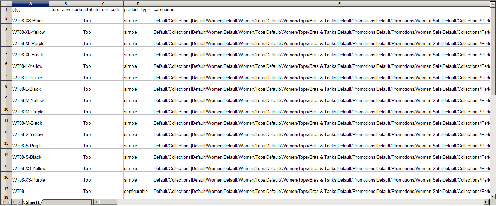

# 製品データ属性リファレンス

次の表に、一般的な製品の書き出しからの属性を、デフォルトで表示される順序で示します。 CSV ファイルでは、各属性が列として表され、製品レコードは行で表されます。 アンダースコアで始まる列には、複雑なデータのプロパティやオプション値などのサービスデータが含まれます。 カタログから製品を [ 書き出し ](data-export.md) して、データでの各属性の表現を確認できます。

このデータを書き出すために使用されるインストールには、サンプルデータがインストールされており、2 つの web サイトといくつかのストアビューがあります。 通常は書き出されるすべての列が含まれていますが、必要な値は `sku` のみです。 データを読み込むには、変更を加えた列のみを含めます。 `sku` は最初の列にする必要がありますが、残りの属性の順序は関係ありません。

## シンプルな製品 CSV ファイル構造

| 属性 | 説明 |
|--- |--- |
| `sku` | （必須）在庫管理単位は、在庫の追跡に使用される一意の英数字の識別子です。 SKU の長さは最大 64 文字です。 例：`sku123` **_メモ：_**SKU が 64 文字を超えると、読み込みが失敗します。 |
| `store_view_code` | 商品が使用可能な特定のストア表示を識別します。 空白の場合、製品はデフォルトのストア表示で使用できます。 例：`storeview1`、`english`、`spanish` |
| `attribute_set_code` | 製品タイプに従って、製品を特定の属性セットまたは製品テンプレートに割り当てます。 製品の作成後は、属性セットを変更できません。 例：`default` |
| `product_type` | 商品のタイプを示します。 値： `simple` – 通常、単数または固定数量で販売される有形資産。 `grouped`：セットとして販売される個別の製品のグループ。 `configurable` – 顧客が購入する前に選択する必要がある複数のオプションを持つ製品。 在庫はバリエーションのセットごとに管理できます。これは、異なる SKU を持つ個別の製品を表すからです。 例えば、設定可能な製品の色とサイズの組み合わせは、カタログの特定の SKU に関連付けられています。 `virtual` – 出荷を必要とせず、在庫に保持されていない非有形製品。 例としては、サービス、メンバーシップ、サブスクリプションがあります。 `bundle` – 一緒に販売されるシンプルな製品のカスタマイズ可能な製品セット。 |
| `categories` | 製品に割り当てられた各カテゴリを示します。 カテゴリとサブカテゴリはスラッシュで区切ります。 複数のカテゴリ パスを指定するには、各パスをパイプ \|記号で区切ります。 例：`Default Category/Gear\|Default Category/Gear/Bags` |
| `product_websites` | 製品が使用可能な各 Web サイトの Web サイトコード。 1 つの製品を複数の web サイトに割り当てることも、1 つに制限することもできます。 複数の web サイトを指定する場合は、コンマで区切り、スペースは使用しません。 例：`base` または `base,website2` |
| `name` | 製品名は、すべての製品リストに表示され、顧客が製品を識別するために使用する名前です。 |
| `description` | 商品の説明には、商品に関する詳細な情報が表示され、単純なHTML タグが含まれる場合があります。 |
| `short_description` | 短い製品説明を使用するかどうかは、テーマによって異なります。 商品リストに表示される場合があり、ショッピングサイトに送信される RSS フィードのリストで使用される場合もあります。 |
| `weight` | 個々の商品の重み。 実際の製品重量は、出荷時に運送業者によって決定されます。 |
| product_online | 商品がストアで販売できるかどうかを決定します。 値： `1` — （はい）製品が有効化され、販売が可能です。 `2` — （いいえ）製品は無効になっており、販売できません。 |
| `tax_class_name` | この商品に関連付けられている税区分の名前。 |
| `visibility` | 製品がカタログに表示され、検索に使用できるかどうかを決定します。 値： `Not Visible Individually` – 製品は製品リストには含まれていませんが、別の製品のバリエーションとして使用できる場合があります。 `Catalog`：製品がすべてのカタログ一覧に表示されます。 `Search` – 製品は検索操作に使用できます。 `Catalog, Search`：製品はカタログ一覧に含まれ、検索にも使用できます。 |
| `price` | 商品がストアで販売される価格。 |
| `special_price` | 指定した日付範囲での商品の割引価格。 |
| `special_price_from_date` | 特別価格が有効になる期間の開始日。 |
| `special_price_to_date` | 特別価格が有効になる期間の最終日。 |
| `url_key` | 製品を識別する URL の部分。 デフォルト値は製品名に基づいています。 例：`product-name` |
| save_rewrites_history | 新しい `url_key` で値 `1` を指定すると、新しい 301 URL 書き換えが生成され、古い URL が新しい URL にリダイレクトされます。 |
| `meta_title` | メタタイトルは、ブラウザーと検索結果のリストのタイトルバーとタブに表示されます。 メタタイトルは、製品に固有で、価値の高いキーワードを組み込み、70 文字未満にする必要があります。 |
| `meta_keywords` | メタキーワードは検索エンジンにのみ表示され、一部の検索エンジンでは無視されます。 値が大きいキーワードをコンマで区切って選択します。 例：`keyword1`、`keyword2`、`keyword3` |
| `meta_description` | メタ記述は、検索結果リストの製品の概要を提供します。 フィールドの受け入れ文字数は 255 文字ですが、メタ記述の長さは 150～160 文字が理想的です。 |
| `base_image` | 製品ページのメイン画像の相対パス。 Commerceでは、ファイルは内部的にアルファベット順のフォルダー構造に保存されます。 書き出されたデータの各画像の正確な場所を確認できます。 例：`/sample_data/m/b/mb01-blue-0.jpg`  新しい画像をアップロードしたり、既存の画像を上書きしたりするには、ファイル名を入力し、その後にスラッシュを付けます。 例：`/image.jpg` |
| `base_image_label` | ベース画像に関連付けられているラベル。 |
| `small_image` | カタログページで使用される小さな画像のファイル名。先頭にはスラッシュを付けます。 例：`/image.jpg` |
| `small_image_label` | 小さな画像に関連付けられたラベル。 例：`Small Image 1`、`Small Image 2` |
| `thumbnail_image` | 製品ページのギャラリーに表示されるサムネール画像のファイル名。先頭にはスラッシュが付きます。 例：`/image.jpg` |
| `thumbnail_image_label` | 任意のサムネール画像に関連付けられたラベル。 例：`Thumbnail 1`、`Thumbnail 2` |
| `created_at` | 商品が作成された日付を示します。 日付は、製品の作成時に自動的に生成されますが、後で編集できます。 |
| `updated_at` | 商品が最後に更新された日付を示します。 |
| `new_from_date` | 新製品リストの「開始日」を指定し、製品が新製品として取り上げられるかどうかを決定します。 |
| `new_to_date` | 新規商品リストの「終了日」を指定し、商品が新製品として取り上げられるかどうかを決定します。 |
| `display_product_options_in` | 製品に複数のオプションがある場合、は製品ページ上でオプションが表示される場所を決定します。 値：製品情報列/情報列の後のブロック |
| `map_price` | 商品の広告された最低価格。 （MAP が有効な場合にのみ表示されます）。 |
| `msrp_price` | 製造元による商品の希望小売価格。 （MAP が有効な場合にのみ表示されます）。 |
| `map_enabled` | 構成でアドバタイズされた最低価格が有効かどうかを決定します。 値： `1` — （はい） MAP は有効です。 `0` （または空白） – （No） MAP が有効になっていません。 |
| `gift_message_available` | 商品購入にギフトメッセージを含めることができるかどうかを決定します。 値： `1` — （はい）ギフトメッセージを含めるオプションが顧客に提示されます。 `0` （または空白） – （いいえ）ギフトメッセージを含めるオプションは、お客様には提示されません。 |
| `custom_design` | 製品ページに適用できる使用可能なテーマのリストが表示されます。 |
| `custom_design_from` | 選択したテーマが製品ページに適用される開始日を指定します。 |
| `custom_design_to` | 選択したテーマが製品ページに適用される終了日を指定します。 |
| `custom_layout_update` | 製品ページに対するレイアウトアップデートとして適用される追加の XML コード。 |
| `page_layout` | 製品ページのページレイアウトを決定します。 値： `No layout updates` - ページレイアウトは変更されません。 `1 column` – 製品ページに 1 列のレイアウトを適用します。 `2 columns with left bar` – 左サイドバーを含む 2 列のレイアウトを製品ページに適用します。 `2 columns with right bar` – 右サイドバーを含む 2 列のレイアウトを製品ページに適用します。 `3 columns` – 製品ページに 3 列のレイアウトを適用します。 `empty` – 商品ページに空白のレイアウトを適用します。 |
| `product_options_container` | 製品に複数のオプションがある場合、は製品ページ上でオプションが表示される場所を決定します。 値：製品情報列/情報列の後のブロック |
| `msrp_display_actual_price_type` | 製品の実際の価格が顧客に表示される場所を決定します。 値： `In Cart` - ショッピングカートの実際の製品価格を表示します。 `Before Order Confirmation`：チェックアウトプロセスの終了時、注文が確認される直前の実際の製品価格を表示します。 `On Gesture`：顧客が _価格のクリック_ または _これは何ですか？_ リンク。 |
| `country_of_manufacture` | 製品が製造された国を識別します。 |
| `additional_attributes` | 商品に対して作成された追加の属性。 例： `has_options=0,required_options=0color=Black,has_options=0,required_options=0,size_general=XS` |
| `qty` | 現在在庫がある商品の数量。 |
| `out_of_stock_qty` | 商品の在庫切れを決定する在庫レベル。 |
| `use_config_min_qty` | 設定のデフォルト値が使用されるかどうかを決定します。「Use Config Settings」チェックボックスに対応します。 値： `1` — （はい）この属性の値には、デフォルトの設定が使用されます。 `0` （または空白） – （いいえ）この属性の値のデフォルト設定は上書きできます。 |
| `is_qty_decimal` | 数量属性に小数値が含まれるかどうかを決定します。 値： `1` — （はい）数量属性の値は小数値です。 `0` （または空白） – （いいえ）数量属性の値は整数（整数）です。 |
| `allow_backorders` | ストアでバックオーダーを許可するかどうか、およびどのように管理するかを決定します。 |
| `use_config_backorders` | バックオーダーの既定の構成設定を使用するかどうかを決定します。これは、[ 構成設定の使用 ] チェック ボックスの状態に対応しています。 値： `1` — （はい）数量属性の値は小数値です。 `0` （または空白） – （いいえ）数量属性の値は整数（整数）です。 |
| `min_cart_qty` | 1 回の注文で購入できる品目の最小数量を指定します。 |
| `use_config_min_sale_qty` | 最小数量の既定の構成設定を使用するかどうかを決定します。これは、[ 構成設定の使用 ] チェック ボックスの状態に対応しています。 値： `1` — （はい）  `0` （または空白） – （いいえ） |
| `max_cart_qty` | 1 回の注文で購入できる商品の最大数量を指定します。 |
| `use_config_max_sale_qty` | 最大数量の既定の構成設定を使用するかどうかを決定します。これは、[ 構成設定の使用 ] チェック ボックスの状態に対応しています。 値： `1` — （はい）  `0` （または空白） – （いいえ） |
| `is_in_stock` | 商品が在庫があるかどうかを示します。 |
| `notify_on_stock_below` | _在庫切れ_ 通知をトリガーする在庫レベルを指定します。 |
| `use_config_notify_stock_qty` | デフォルトの設定がストックレベル通知のトリガーに使用されるかどうかを指定します。これは、「設定を使用」チェックボックスのステートに対応しています。 値： `1` — （はい）  `0` （または空白） – （いいえ） |
| `manage_stock` | 製品の管理に在庫管理を使用するかどうかを決定します。 値： `1` — （はい）完全な在庫管理を有効にして、商品の在庫レベルを管理します。 `0` （または空白） – （いいえ）現在在庫があるアイテムの数は追跡されません。 |
| `use_config_manage_stock` | 在庫を管理するためのデフォルトの設定を使用するかどうかを決定し、「設定の使用」チェックボックスの状態に対応します。 値： `1` — （はい）  `0` （または空白） – （いいえ） |
| `use_config_qty_increments` | 数量の増分に対する既定の構成設定を使用するかどうかを決定します。これは、[ 構成設定の使用 ] チェック ボックスの状態に対応しています。 値： `1` — （はい）  `0` （または空白） – （いいえ） |
| `qty_increments` | 増分量を構成する製品の数を設定します。 |
| `use_config_enable_qty_inc` | 数量の増分を有効にする既定の構成設定を使用するかどうかを決定します。これは、[ 構成設定の使用 ] チェック ボックスの状態に対応しています。 値： `1` — （はい）  `0` （または空白） – （いいえ） |
| `enable_qty_increments` | 製品に対して数量増分を有効にするかどうかを決定します。 |
| `is_decimal_divided` | 製品の一部を個別に出荷できるかどうかを決定します。 オプション：`Yes` / `No` |
| `website_id` | 複数の web サイトを使用したインストールの場合、は製品が使用可能な特定の web サイトを識別します。 空白の場合、製品はすべての web サイトで利用できます。 |
| `related_skus` | 関連製品として識別された各製品の SKU をリストします。 例：`24-WG080,24-UG03,24-UG01,24-UG02` |
| `related_position` | related_sku 列で関連製品としてリストされる SKU の位置（並べ替え順）を決定します。 例：`1,2,3,4` |
| `crosssell_skus` | クロスセルとして識別されている各製品の SKU をリストします。 |
| `crosssell_position` | `crosssell_skus` 列にクロスセル製品としてリストされる SKU の位置（並べ替え順）を決定します。 |
| `upsell_skus` | アップセルとして識別された各製品の SKU をリストします。 |
| `upsell_position` | `upsell_skus` 列にアップセル製品としてリストされる SKU の位置（並べ替え順）を決定します。 |
| `additional_images` | 製品に関連付けられる追加の画像のファイル名。先頭にはスラッシュが付きます。 例：`/image.jpg` |
| `additional_image_labels` | 追加の画像に関連付けられたラベル。 例：`Label 1`、`Label 2` |
| `custom_options` | 各カスタム オプションに割り当てるプロパティと値を指定します。 例： `name=Color, type=drop_down, required=1, price= price_type=fixed, sku=, option_title=Black|name=Color, type=drop_down, required=1, price=, price_type=fixed, sku=, option_title=White` |

{style="table-layout:auto"}

## 製品バリエーションのサービスデータ

| 属性 | 説明 | 適用先 |
|--- |--- | --- |
| `_super_products_sku` | 設定可能な製品バリエーション用に生成された SKU。 例：WB03-XS-Green | 設定可能な製品 |
| `_super_attribute_code` | 設定可能な製品バリエーションの属性コード。 例：color | 設定可能な製品 |
| `_super_attribute_option` | 設定可能な製品バリエーションの値。 例：緑 | 設定可能な製品 |
| `_super_attribute_price_corr` | 設定可能な商品バリエーションに関連付けられた価格調整。 | 設定可能な製品 |
| `_associated_sku` | グループ化された商品に関連付けられている商品の SKU。 | グループ化された製品   バンドル製品 |
| `_associated_default_qty` | 含まれる関連商品の数量を決定します。 | 設定可能な製品   グループ化された製品   バンドル製品 |
| `_associated_position` | 関連付けられている商品が他の関連する商品と共に一覧表示された場合、その商品の位置を決定します。 | 設定可能な製品   グループ化された製品   バンドル製品 |

{style="table-layout:auto"}

## 複雑な製品データ属性

複合データという用語は、複数の製品オプションに関連付けられているデータを指します。 次の製品タイプは、別々の製品から生成されたデータを使用して、製品のバリエーションと複数のオプションを作成します。

- [設定可能](../catalog/product-create-configurable.md)
- [グループ化](../catalog/product-create-grouped.md)
- [バンドル](../catalog/product-create-bundle.md)

設定可能な製品を書き出すと、単純な製品を構成する標準属性に加えて、複雑なデータの管理に必要な追加の属性が見つかります。

{width="600" zoomable="yes"}

### 設定可能な製品

| 属性 | 説明 |
|--- |--- |
| `configurable_variation_labels` | 製品のバリエーションを識別するラベル。 例：`Choose Color:` または `Choose Size:` |
| `configurable_variations` | 製品バリエーションに関連付けられている値を表します。 例：`sku=sku-red xs,color=red,size=xs,price=10.99,display=1,image=/pub/media/import/image1.png|sku=sku-red-m,color=red,size=m,price=20.88,display=1,image=/pub/media/import/image2.png` |

{style="table-layout:auto"}

### グループ化された製品

| 属性 | 説明 |
|--- |--- |
| `associated_skus` | グループを構成する個々の製品の SKU を識別します。 |

{style="table-layout:auto"}

### バンドル製品

| 属性 | 説明 |
|--- |--- |
| `bundle_price_type` | バンドル項目の価格が固定か動的かを決定します。 |
| `bundle_sku_type` | 各項目に変数の動的 SKU が割り当てられているか、バンドルに固定 SKU が使用されているかを判断します。 オプション：固定/動的 |
| `bundle_weight_type` | バンドル項目の重みが可変か固定かを判断します。 |
| `bundle_values` | バンドルオプションに関連付けられた教示値を表します。 例：`name=Bundle Option One,type=dropdown; required=1, sku=sku-option2,price=10, price_type=fixed` |

{style="table-layout:auto"}

## 詳細な価格設定属性

高度な価格インポート/エクスポートを使用すると、製品グループと階層価格の価格情報をすばやく更新できます。 高度な価格データを [ インポート ](data-import.md) および [ エクスポート ](data-export.md) するプロセスは、他のエンティティタイプと同じです。 サンプルの CSV ファイルには、高度な価格設定をサポートする各製品タイプの階層とグループの価格が含まれています。 詳細価格の変更は、製品レコードの残りの部分には影響しません。

{width="600" zoomable="yes"}

| 属性 | 説明 |
|--- |--- |
| `sku` | （必須）在庫管理単位は、在庫の追跡に使用される一意の英数字の識別子です。 SKU の長さは最大 64 文字です。 例：`sku123` **_メモ：_**SKU が 64 文字を超えると、読み込みが失敗します。 |
| `tier_price_website` | [Web サイトコード ](../stores-purchase/stores.md#add-websites) は、階層別の料金が利用可能な各 Web サイトを識別します。 例：`-  website1 -  All Websites [USD]` |
| `tier_price_customer` | 階層別の価格設定が使用可能な [ 顧客のグループ ](../customers/customer-groups.md) を識別します。 例：`-  ALL GROUPS -  NOT LOGGED IN -  General -  Wholesale -  Retailer` |
| `tier_price_customer_group` | 階層別の価格設定が使用可能な顧客グループを識別します。 例：`-  ALL GROUPS -  NOT LOGGED IN -  General -  Wholesale -  Retailer` |
| `tier_price_qty` | 階層価格割引を受けるために注文する必要がある商品の数量。 |
| `tier_price` | 商品の割引階層価格。 [ バンドル製品 ](../catalog/product-create-bundle.md) の場合、階層価格はパーセンテージで計算されます。 |
| `group_price_website` | グループ価格を利用できる各 Web サイトの [Web サイトコード ](../stores-purchase/stores.md#add-websites)。 複数の web サイトを指定する場合は、コンマで区切り、スペースは使用しません。 例：`-  website1 -  All Websites [USD]` |
| `group_price_customer_group` | グループ価格を利用できる顧客のグループを識別します。 例：`-  NOT LOGGED IN -  General -  Wholesale -  Retailer` |
| `group_price` | 商品の割引されたグループ価格。 [ バンドル製品 ](../catalog/product-create-bundle.md) の場合、グループ価格はパーセンテージで計算されます。 |

{style="table-layout:auto"}
