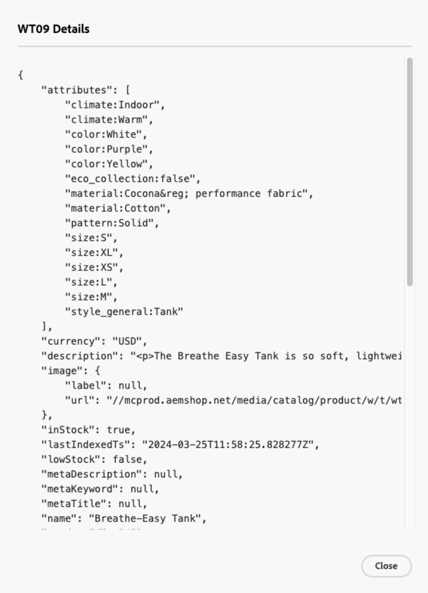

# データ管理ダッシュボード

Data Management Dashboard には、Commerce データベースからCommerce SaaS サービスに転送される商品データの同期ステータスの概要が表示されます。 ユーザーは、製品の同期ステータスを便利に監視でき、統合ダッシュボードからデータの再同期を開始できます。 この機能は、ストアフロントの製品データの可用性に関する貴重なインサイトを提供し、買い物客に迅速に表示できるようにします。

## オーディエンス

Data Management Dashboard は、アクティブなライセンスを持つ [[!DNL Product Recommendations v6.0.0]](https://experienceleague.adobe.com/en/docs/commerce/product-recommendations/guide-overview)、[[!DNL Live Search v4.1.0]](https://experienceleague.adobe.com/en/docs/commerce/live-search/guide-overview)、[[!DNL Catalog Service v1.17]](https://experienceleague.adobe.com/en/docs/commerce/catalog-service/guide-overview) を使用するすべてのCommerce マーチャントが追加費用なしで利用できます。

データ管理ダッシュボードは、*システム*/データ転送/*データ管理ダッシュボード* にあります。

ダッシュボードには、次のフィールドが含まれています。

| フィールド | 説明 |
|--- |--- |
| 対象範囲 | 同期されたデータの特定の web サイト。 |
| [!DNL Product Recommendations] | 同期ステータス、同期された製品の数、同期された製品の [ 表示可能 ](https://experienceleague.adobe.com/en/docs/commerce-admin/config/catalog/inventory#stock-options) テーブルを表示します [!DNL Product Recommendations] |
| [!DNL Live Search] | 同期ステータス、同期された製品の数、同期された製品の [ 表示可能 ](https://experienceleague.adobe.com/en/docs/commerce-admin/config/catalog/inventory#stock-options) テーブルを表示します [!DNL Live Search] |
| [!DNL Catalog Service] | 同期ステータス、同期された製品の数、同期された製品のテーブルを表示して [!DNL Catalog Service] ます。 |
| 設定 | ダイアログが開きます。このダイアログで [ カタログ データを手動で再同期 ](#resync-catalog-data) できます。 |
| 同期ステータス | 過去 3 時間以内にCommerce データベースからいずれかの SaaS サービスに転送された商品の数を表示します。 カタログを更新する頻度が低い場合、この値は頻繁にゼロになります。 同期が進行中の場合は、「**[!UICONTROL Refresh]**」をクリックすると、更新されたカウントを取得できます。 |
| 製品数 | サービスで利用できるカタログ製品の合計数を反映します。 [!DNL Product Recommendations] ダッシュボードと [!DNL Live Search] ダッシュボードには、_表示可能_ 製品の合計数が表示されます。 [!DNL Catalog Service] では、表示可能な項目で製品がフィルタリングされないので、[!DNL Catalog Service] と [!DNL Live Search] の両方がインストールされている場合、または [!DNL Product Recommendations] がインストールされている場合、2 つのダッシュボードの製品数に 2 つの異なる値が表示される可能性があります。 |
| 同期された製品 | コア Commerce インデックスに含まれる製品に関する詳細を提供します。 デフォルトでは、このテーブルは「最終更新日」で並べ替えられます。 特定の製品を検索するには、「**[!UICONTROL Search by SKU]**」フィールドを使用します。 表示する列を制御するには、テーブルの右側の **[!UICONTROL Customize Table]** をクリックします。 |

## データ管理ダッシュボードの使用

Commerce データベース内の商品を更新すると、商品データはシステム設定に従って SaaS サービスに転送されます。 同期処理が開始されると、**製品数** は SaaS サービスに送信される製品の数を示します。

>[!IMPORTANT]
>
>同期の完了に要する時間は、カタログのサイズと更新されたデータの量に応じて異なります。

処理された製品の数が更新された製品の数と一致する場合は、同期が完了したことを示しています。

>[!NOTE]
>
>また、Adobeは、開発者やシステムインテグレーターがCommerce SaaS サービスの同期処理の管理とトラッキング、エラーのトラブルシューティングに使用できるコマンドラインインターフェイスとシステムログも提供します。 詳細については、「[SaaS データ書き出しガイド ](https://experienceleague.adobe.com/en/docs/commerce/saas-data-export/overview)」を参照してください。

### 同期された製品のリスト

同期された製品の詳細を表示するには、テーブルの製品をクリックします。

### カタログデータを再同期

Commerce SaaS サービスを常に最新の商品情報で更新するには、カタログデータを同期する [ スケジュールを設定する ](https://experienceleague.adobe.com/en/docs/commerce-operations/configuration-guide/cli/manage-indexers#reindex) 必要があります。

カタログデータをCommerce データベースから SaaS サービスに [ 手動で同期 ](#manually-resync-catalog) することもできますが、ハードウェアリソースの負荷が増える可能性があるので、この方法はお勧めしません。 ただし、次のような場合は、カタログを手動で再同期する必要があります。

- 新製品の追加、製品の詳細の更新、カテゴリの変更など、製品カタログに大きな変更が加えられた場合

- ストアフロントでの製品データの表示に不一致やパフォーマンスの問題が発生した場合

- Commerce データベースと SaaS サービスの統合が更新または変更された場合

- 製品データ管理または同期プロセスに影響を与えるカスタマイズまたは設定をデプロイする場合

これらのガイドラインに従い、必要に応じてカタログデータを事前に再同期することで、Adobe Commerce エコシステム全体でデータの一貫性、正確性、信頼性を維持できます。

#### カタログを手動で再同期する

カタログデータを再同期する必要がある場合は、ページの右側の **[!UICONTROL Settings]** をクリックすると、再同期を開始できるダイアログが表示されます。 カタログデータを再同期すると、サービスはCommerce データベースから SaaS サービスにデータを再取得する必要があります。

